# 在 Photoshop 中创建一个燃烧的文本效果

> 原文：<https://www.sitepoint.com/create-a-flaming-text-effect-in-photoshop/>

在 Photoshop 中最难再现的效果之一是火。火焰是随机的，表现出人意料。在 Photoshop 中用火焰创造东西最困难的一个方面是将火焰效果与物体或文本混合。很难令人信服地改变文字或物体，使其看起来属于火焰。

我要创造的效果将是文字嵌入火焰中。此处下载火图[。我们将使用火焰来创建一个火热的文字效果，看起来它真的属于火焰。](http://www.sxc.hu/photo/1391671)

首先，创建一个新文档。我正在创建的这个是 800 像素宽，600 像素高。用黑色填充背景层。这将增加对比度，并有助于火焰显示得更好。如果你想要黑色以外的其他颜色作为背景色，一旦我们完成了整体效果的创建，你可以随意改变它。

[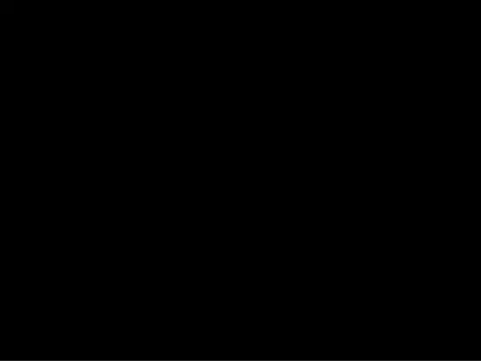](https://www.sitepoint.com/wp-content/uploads/2012/09/Screen-Shot-2012-09-11-at-9.07.21-PM.png)

接下来，选择粗体字体。无衬线似乎显示得最好。我最终选择吉尔桑斯作为我的字体。键入您的消息并在文档中撰写。

[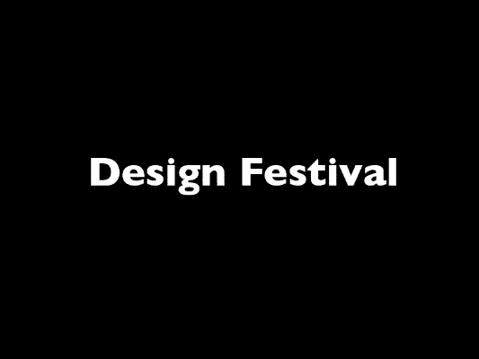](https://www.sitepoint.com/wp-content/uploads/2012/09/Screen-Shot-2012-09-11-at-9.09.59-PM.png)

在新文档中打开火焰图像。目前大小并不重要，因为一旦我们将它移动到我们的文本文档中，我们就会调整它的大小。打开“通道”面板，选择对比度最高的通道。在此图像中，绿色通道的对比度最高。红色通道看起来被烧坏了，所以我们选择了绿色通道。

[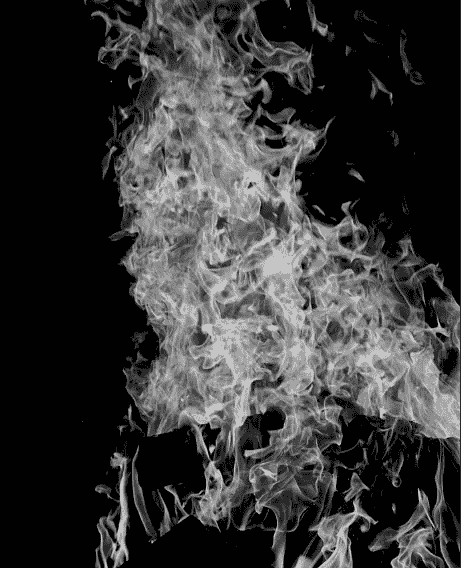](https://www.sitepoint.com/wp-content/uploads/2012/09/Screen-Shot-2012-09-11-at-9.14.38-PM.png)

命令/Ctrl + <click on="" the="" channel="" preview="" icon="">将其作为选择载入。按 Command/Ctrl + "C "复制选择。然后，切换到我们之前创建的文本文档，点击 Command/Ctrl + "V "将火焰粘贴到它们自己的层上。按 Command/Ctrl + "T "来变换火焰，按住 Shift，单击并拖动火焰来调整它们的大小。顺时针收缩和旋转火焰，使它们与文字文档的画布稍微重叠。</click>

[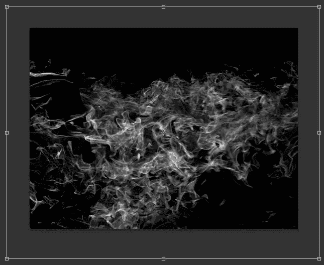](https://www.sitepoint.com/wp-content/uploads/2012/09/Screen-Shot-2012-09-11-at-9.17.48-PM1.png)

在我们做任何事情之前，我们需要将文本层转换为智能对象。这很重要，这样我们就可以保持文本的可编辑性，以防我们以后需要返回并进行修改。右键单击文本层，选择“转换为智能对象。”现在，我们可以对文本应用效果和滤镜，但我们将能够返回并调整滤镜和效果，而不是将它们作为永久的、不可编辑的效果来应用。双击文本并将颜色改为黑色。

[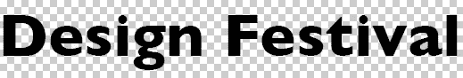](https://www.sitepoint.com/wp-content/uploads/2012/09/Screen-Shot-2012-09-11-at-9.21.55-PM1.png)

移动文字层后面的火焰层。现在，我们的文字是黑色的，我们的火焰是白色的。我们需要加点颜色。

[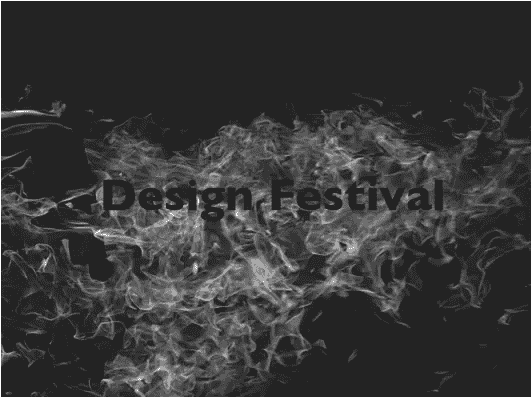](https://www.sitepoint.com/wp-content/uploads/2012/09/Screen-Shot-2012-09-11-at-9.29.02-PM.png)

双击火焰层，调出图层样式。选择“内发光”并选择亮黄色作为你的发光颜色。选择“强光”作为混合模式，设置大小为 2px。你不希望它太大，因为你需要一些光，几乎是白色的区域。

[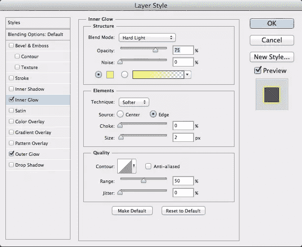](https://www.sitepoint.com/wp-content/uploads/2012/09/Screen-Shot-2012-09-11-at-9.34.52-PM.png)

然后，选择“外发光”并选择一种橙色。再次，选择“强光”作为混合模式，并保留大小为 5px。火现在应该看起来相当真实。我们以这种方式处理火焰效果的原因是为了保持对火焰颜色的精确控制，以获得我们想要的确切效果。

[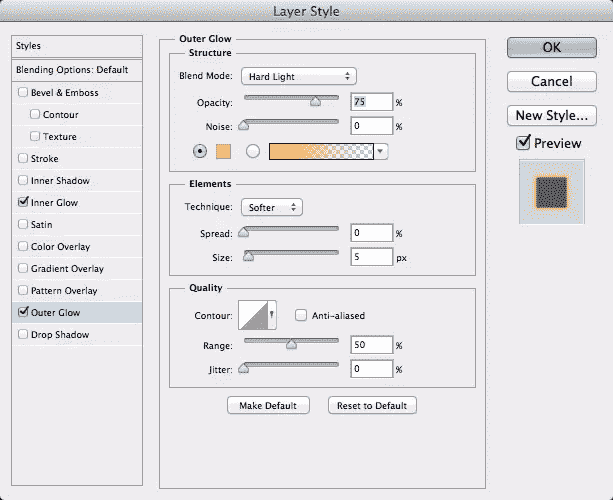](https://www.sitepoint.com/wp-content/uploads/2012/09/Screen-Shot-2012-09-11-at-9.35.03-PM.png)

接下来，选择我们制作成智能对象的文本层，然后选择“滤镜”>“扭曲”>“波纹”将数量设置为 50%，将大小设置为大。文字应该和火焰的波纹大致吻合。

[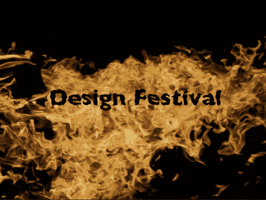](https://www.sitepoint.com/wp-content/uploads/2012/09/Screen-Shot-2012-09-11-at-10.37.03-PM.png)

你会立刻注意到这个效果看起来并不令人信服，因为火不是平的。如果火本身有一个空洞，它就不会像上面的例子那样清晰。文字与整体形状相匹配，但我们需要混合效果。为此，命令/Ctrl + <click the="" fire="" layer="">将其作为一个选择加载。转到文本层，并单击图层蒙版图标加载选择作为图层蒙版。然后，反转遮罩以添加变化，并查看结果。我选择了面具的每一个部分，除了文字部分，并用白色填充；我不喜欢遮盖不需要遮盖的区域。</click>

[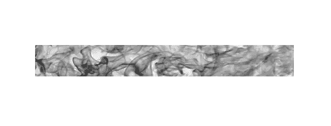](https://www.sitepoint.com/wp-content/uploads/2012/09/Screen-Shot-2012-09-11-at-10.49.32-PM.png)

结果如下所示。问题是效果太轻了。这很难阅读，但由于面具的透明性，我们有两个选择。第一个选项是点击图层蒙版，调出图层命令。在这里，你可以加深蒙版。另一个选择是简单地复制层，直到你满意的结果。我复制了三次图层，产生了下面的结果。

[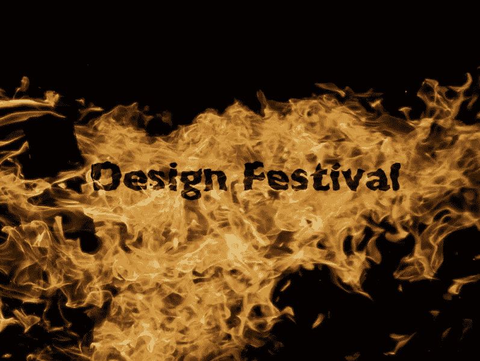](https://www.sitepoint.com/wp-content/uploads/2012/09/Screen-Shot-2012-09-11-at-10.55.49-PM.png)

### 方法 2:熔岩火焰效果

这个效果相当简单，但是它会产生一些有趣的结果。创建新文档。我创建了一个 600 像素宽、450 像素高的新文档。用黑色填充背景。选择一种加粗的字体来达到这种效果，因为如果你不这样做的话，文本会变得很扭曲。这种效果用粗的无衬线字体更容易实现。将文本设为粗体橙色。我的设置为#ff8a00。

[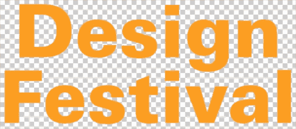](https://www.sitepoint.com/wp-content/uploads/2012/09/Screen-shot-2012-09-24-at-3.57.20-PM.png)

接下来，双击文字层，以显示图层样式选项。选择“内心发光”将光晕设置为亮黄色(#fcff00)，并将混合模式设置为“强光”将大小设置为 8px 左右。

[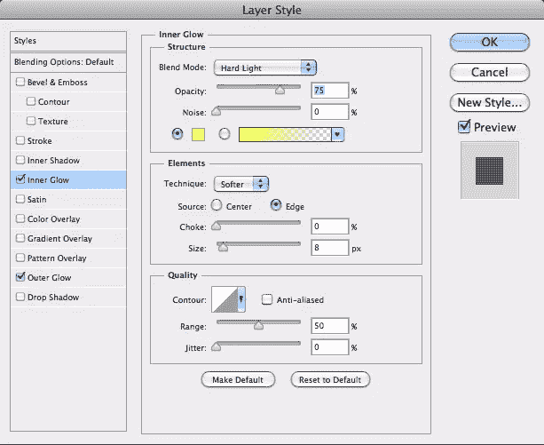](https://www.sitepoint.com/wp-content/uploads/2012/09/Screen-shot-2012-09-24-at-3.58.50-PM.png)

然后，添加一个外发光，但这一次使用一个强烈的红色(#ee0909)。将混合模式设置为“强光”设置扩散为 5 %，大小为 8px。在“质量”下将轮廓设置为“浅凹”。

[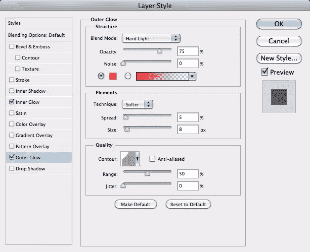](https://www.sitepoint.com/wp-content/uploads/2012/09/Screen-shot-2012-09-24-at-3.59.09-PM.png)

单击“OK”，您应该会看到如下所示的结果。右键单击文本层，选择“转换为智能对象。”复制这一层，隐藏最上面的一层。

[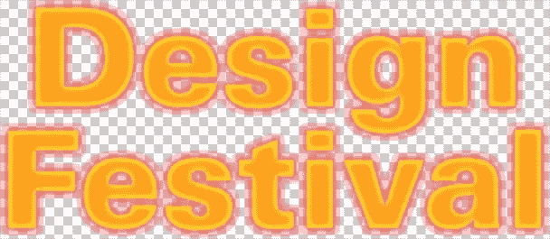](https://www.sitepoint.com/wp-content/uploads/2012/09/Screen-shot-2012-09-24-at-4.00.58-PM.png)

接下来，进入“滤镜”>“扭曲”>“波纹”将金额设置在 120-125%左右。将波纹的大小设置为中等。

[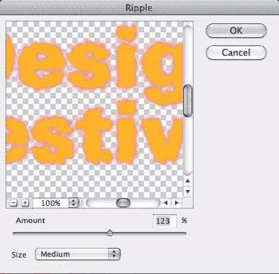](https://www.sitepoint.com/wp-content/uploads/2012/09/Screen-shot-2012-09-24-at-4.15.00-PM.png)

接下来，我们需要再次重复这个动作。这一次将金额设置为一个巨大的数字。我把例子设定为 581%。将波纹大小设置为中等。

取消隐藏第二个文本层，并再次运行波纹过滤器。像第一层文字一样，设置波纹量为 120-125%左右，大小为中等。

[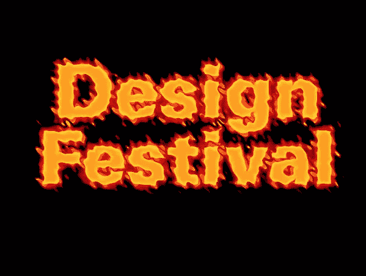](https://www.sitepoint.com/wp-content/uploads/2012/09/Screen-shot-2012-09-24-at-4.23.05-PM.png)

创建一个新的空白层以上的文字层，并用白色填充。进入“过滤器”>“渲染”>“云”然后进入“过滤器”>“渲染”>“差异云”通过使用两种不同的云渲染，你会得到一个比只使用基本的云过滤器更深的云。按住 Option/Alt 键在层之间点按，以将该层裁剪到文本形状。将该层的混合模式设置为“叠加”这增加了液体状熔岩效果的维度。注意光线和阴影的区域。

[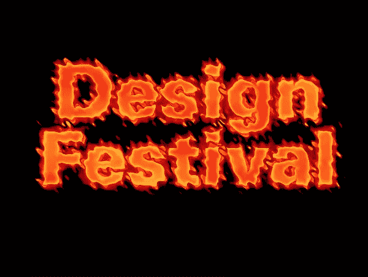](https://www.sitepoint.com/wp-content/uploads/2012/09/Screen-shot-2012-09-24-at-4.25.56-PM.png)

创建一个新的空白层以上的所有其他人。用白色填满它。然后，进入“过滤器”>“渲染”>“纤维”将“方差”设置为 30-35，将“强度”设置为 4。通过按住 Alt/Option 键在层之间点按，也可以将该层裁剪到文本。下一步，到“过滤器”>“扭曲”>“波纹”，设置纤维层的数量为 120-125%。这将在我们的熔岩文字中产生漩涡效果。将混合模式设置为“颜色减淡”

[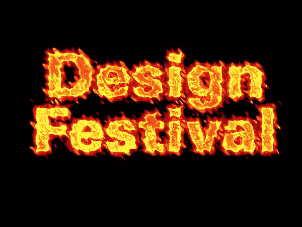](https://www.sitepoint.com/wp-content/uploads/2012/09/Screen-shot-2012-09-24-at-4.33.12-PM.png)

### 结论

Photoshop 中模拟火的选项是无穷无尽的。有许多不同的混合模式和滤镜组合，您可以使用它们来模拟自然界中的效果。从零开始创造火焰可能是一个挑战，但如果你找到了自己的方法，你就可以创造出独特的外观，真正吸引观众的注意力。我们在熔岩文字的最后使用的“颜色减淡”混合模式在创建一个照亮的熔岩效果方面产生了很大的不同。

你知道在 Photoshop 中模拟火的技巧吗？如果是这样，请在下面的评论中发表。

## 分享这篇文章