# 在 Photoshop 中从头开始创建一个华丽的美式足球

> 原文：<https://www.sitepoint.com/create-a-gorgeous-american-football-from-scratch-in-photoshop/>

现在是美国的橄榄球赛季，许多美国人在秋季的空闲时间着迷地坐在沙发上，看着一个形状奇怪的球在球场上来回投掷和摔跤。很少有事情像这项运动一样奇怪，但最奇怪的方面可能是足球本身。如果你能设计出一个令人信服的美式足球——包括逼真的形状、阴影和纹理——你可以称自己是一个真正多才多艺的设计师。

你愿意吗？

在本教程中，我将带你从头开始创建一个华丽的美式足球的过程。我们会用 Photoshop 做除了草地以外的所有东西。在此过程中，您将学习使用各种形状工具、钢笔工具、滤镜和不同的混合选项来实现最终结果。所以，让我们开始吧！

**资源:**

梅林·多巴良的《草地》

**最终结果:**

### 第一步

在 Photoshop 中创建一个宽度为 800 像素、高度为 550 像素的新文档。

### [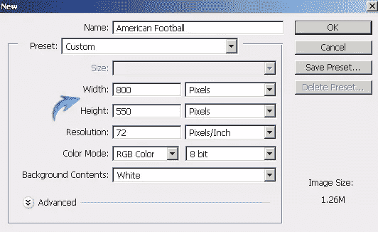](https://www.sitepoint.com/wp-content/uploads/2012/10/112.jpg)

### 第二步

首先，我们将画出基本的足球形状。设置#641002 为前景色，选择钢笔工具(工具模式:形状)绘制如下图所示的形状。

### [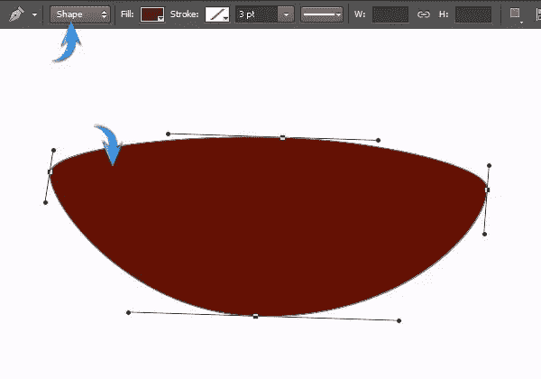](https://www.sitepoint.com/wp-content/uploads/2012/10/25.jpg)

### 第三步

双击这个图层打开图层样式窗口，应用以下设置。

[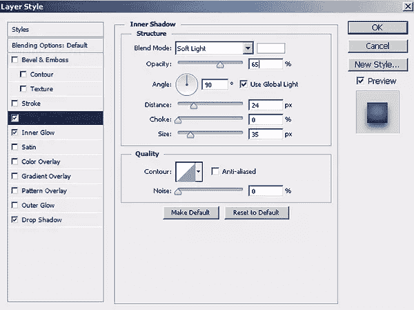](https://www.sitepoint.com/wp-content/uploads/2012/10/33.jpg)

[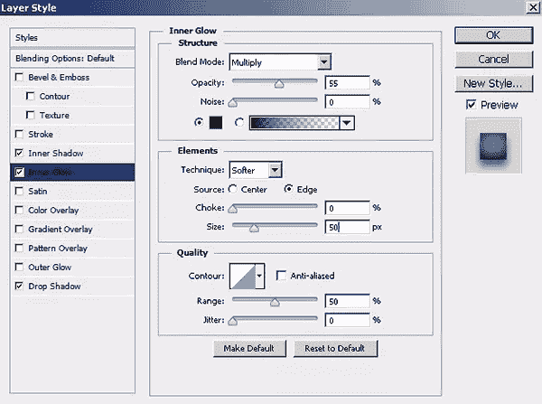](https://www.sitepoint.com/wp-content/uploads/2012/10/3b.jpg)

[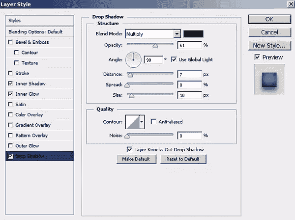](https://www.sitepoint.com/wp-content/uploads/2012/10/3c.jpg)

[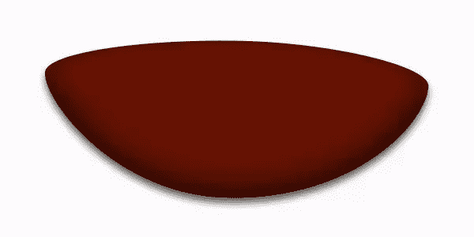](https://www.sitepoint.com/wp-content/uploads/2012/10/3d.jpg)

### 第四步

现在，使用钢笔工具绘制足球的上半部分(工具模式:形状)。这一次，使用颜色#6e1802。

[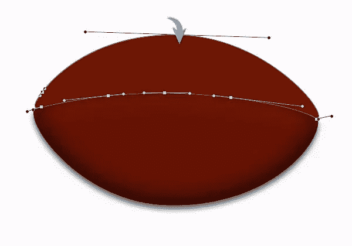](https://www.sitepoint.com/wp-content/uploads/2012/10/42.jpg)

双击这个新的图层，应用下面的内阴影设置。

[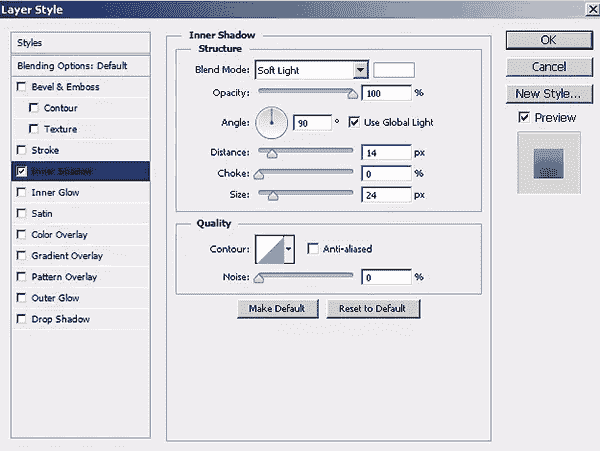](https://www.sitepoint.com/wp-content/uploads/2012/10/4b1.jpg)

### [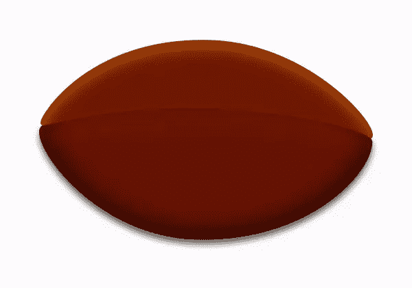](https://www.sitepoint.com/wp-content/uploads/2012/10/4c1.jpg)

### 第五步

为了突出顶部的高亮效果，创建一个新的图层，按 Ctrl + <thumbnail of="" the="" football="" upper="" half="" layer="">在它的周围做一个选择。现在，选择软圆刷工具，并适用于这一新层附近的顶部边缘的选择，如下所示。</thumbnail>

[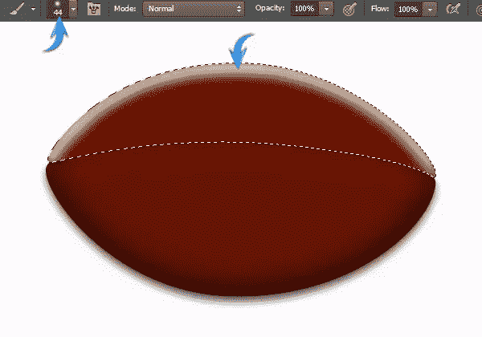](https://www.sitepoint.com/wp-content/uploads/2012/10/52.jpg)

现在，改变高亮层的混合模式为“叠加”，降低其不透明度为 35%，得到如下所示的效果。

### [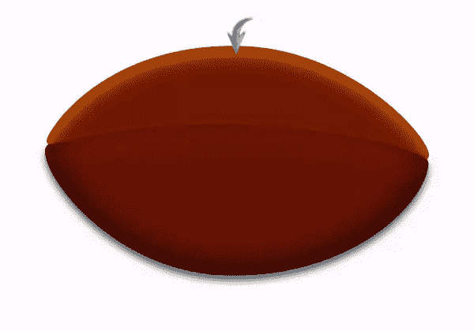](https://www.sitepoint.com/wp-content/uploads/2012/10/5b1.jpg)

### 第六步

接下来，我们将在足球的两面添加白色条纹。选择矩形工具绘制一个水平矩形，然后进入“编辑”>“变换”>“扭曲”在顶部属性栏中选择 30%弯曲的“拱形”。

### [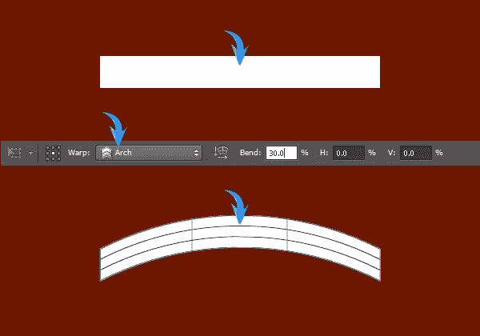](https://www.sitepoint.com/wp-content/uploads/2012/10/62.jpg)

现在旋转这些条纹 90⁰使用自由变换工具(ctrl+“t”)。

### 第七步

在这个拱形层上应用下面的内部发光设置。

[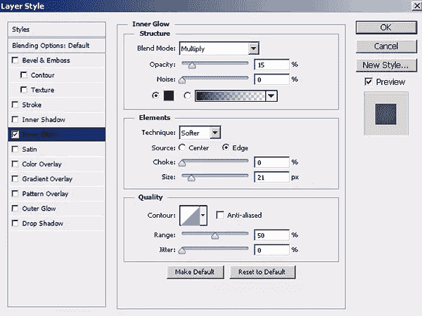](https://www.sitepoint.com/wp-content/uploads/2012/10/72.jpg)

复制这一层，然后通过“编辑”>“变换”>“水平翻转”来水平翻转它

[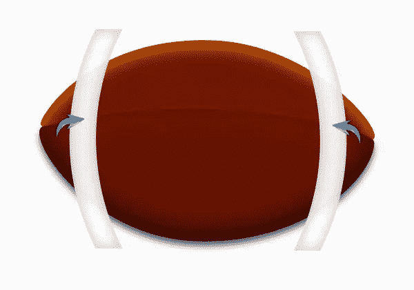](https://www.sitepoint.com/wp-content/uploads/2012/10/7b1.jpg)

现在，复制这两层。点击其中一个图层，然后按 ctrl + <click on="" lower="" half="" of="" football="" layer="">在它周围做一个选择。之后，点击图层面板底部的“添加图层蒙版”图标。添加图层蒙版到其余的拷贝中，覆盖足球的所有一半，如下所示。</click>

### [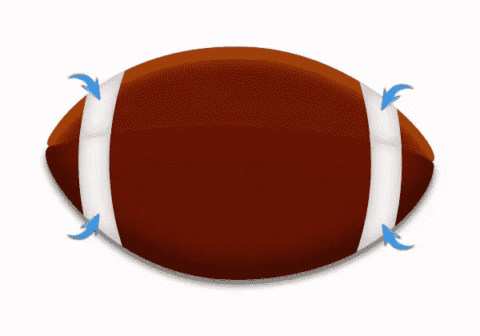](https://www.sitepoint.com/wp-content/uploads/2012/10/7c1.jpg)

### 第八步

接下来，我们将在这两半之间画一个隔板。为此，首先，选择 4px 硬圆刷工具，并按“D”设置默认颜色。现在，选择钢笔工具(工具模式:路径)在一个新的图层上绘制如下所示的曲线。

[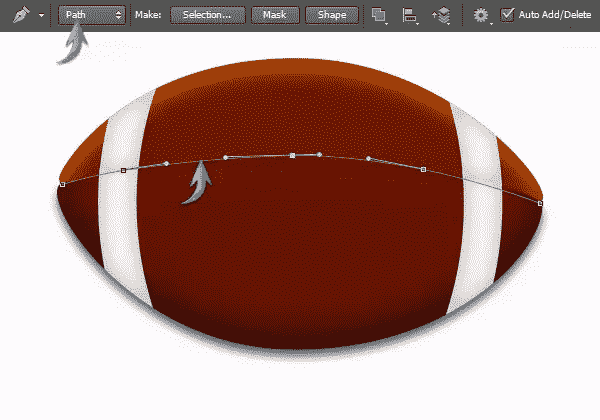](https://www.sitepoint.com/wp-content/uploads/2012/10/82.jpg)

完成后，点击鼠标右键，选择“描边路径”>“笔刷”选项，得到一条黑色的曲线。按“删除”来删除路径。

### 第九步

将分隔层的填充减少到 45%。现在，在这个新图层上应用下面的斜面、浮雕和阴影设置。

[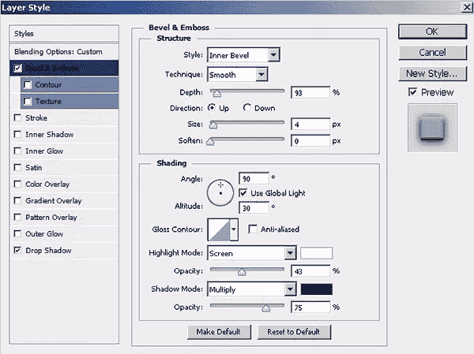](https://www.sitepoint.com/wp-content/uploads/2012/10/92.jpg)

[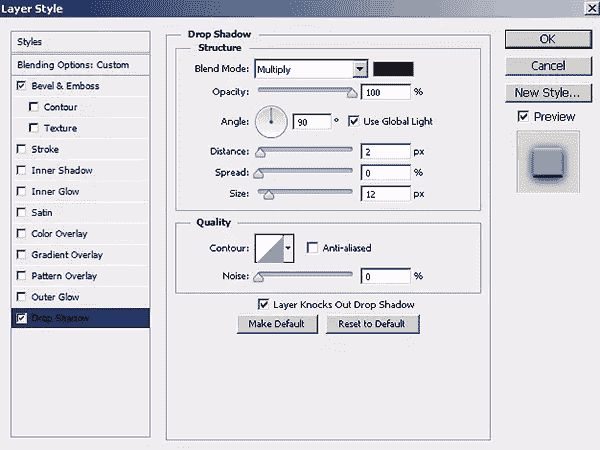](https://www.sitepoint.com/wp-content/uploads/2012/10/9b.jpg)

[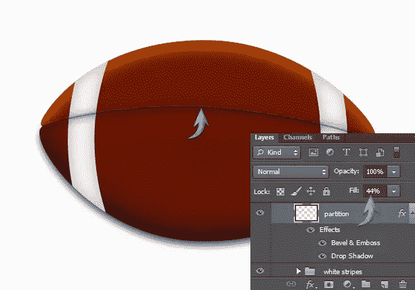](https://www.sitepoint.com/wp-content/uploads/2012/10/9c.jpg)

### 第十步

让我们现在创建足球的纹理。在剩下的图层上面新建一个图层，用油漆桶工具填充纯白。按“D”键设置默认颜色，然后进入“滤镜”>“滤镜库”>“纹理”>“彩色玻璃”在此使用以下值。

[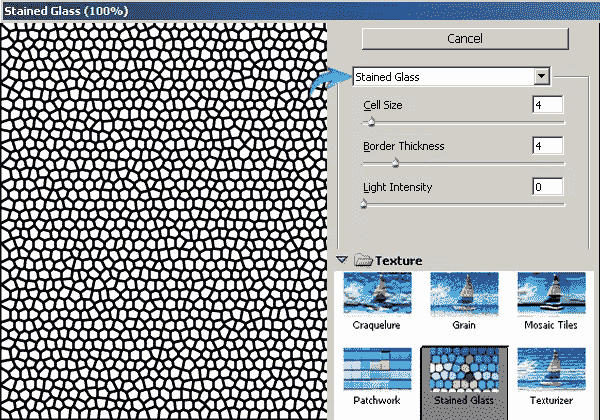](https://www.sitepoint.com/wp-content/uploads/2012/10/102.jpg)

现在进入“滤镜”>“滤镜库”>“笔触”>“墨水轮廓”在此应用以下设置。

### [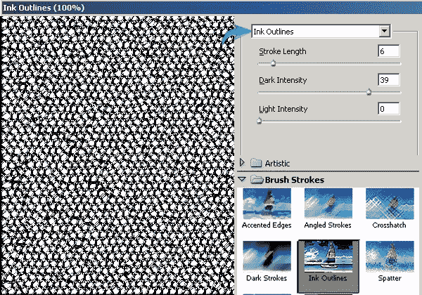](https://www.sitepoint.com/wp-content/uploads/2012/10/10b1.jpg)

### 步骤 11

现在按 Ctrl + "I "来反转纹理。合并纹理的两层。

### [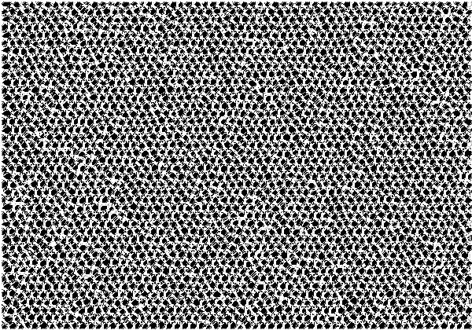](https://www.sitepoint.com/wp-content/uploads/2012/10/113.jpg)

### 步骤 12

现在，根据足球的下半部分调整纹理的大小，并使用自由变换工具将其排列在上面。复制这一层，把它放在足球的上半部分。现在，通过添加图层蒙版，将两个纹理层限制在各自的足球半边，就像我们在第 7 步中做的那样。将这些图层的混合模式改为“柔光”，不透明度降低到 25%。

### [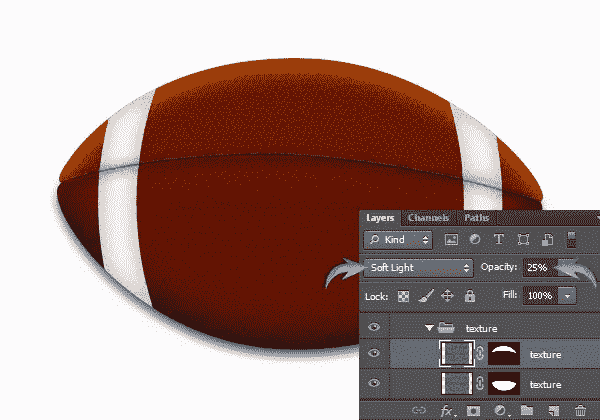](https://www.sitepoint.com/wp-content/uploads/2012/10/122.jpg)

### 第十三步

接下来，选择钢笔工具(工具模式:路径)并绘制如下所示的路径。

[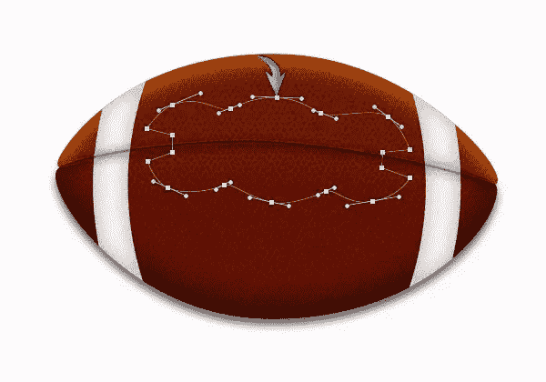](https://www.sitepoint.com/wp-content/uploads/2012/10/133.jpg)

选择硬圆形笔刷工具，在笔刷面板中应用与 **[日记矢量教程](https://www.sitepoint.com/create-an-amazing-diary-vector-in-photoshop/ "Diary vector tutorial")** 第 5 步相同的设置。之后，再次选择钢笔工具，右键单击“路径”>“笔画路径”>“画笔”

### 

### 步骤 14

设置缝线层填充为 0%，并应用以下图层样式设置。

[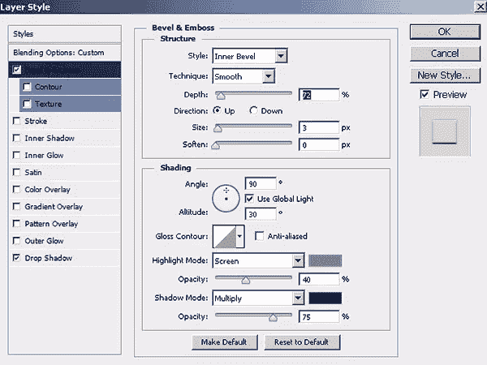](https://www.sitepoint.com/wp-content/uploads/2012/10/142.jpg)

[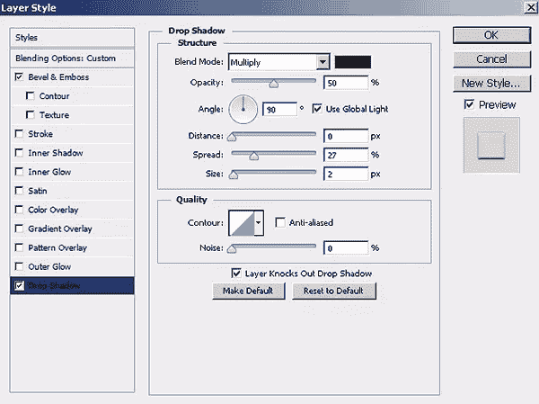](https://www.sitepoint.com/wp-content/uploads/2012/10/14b.jpg)

### [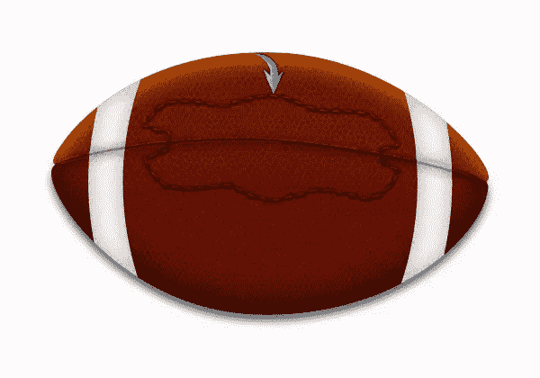](https://www.sitepoint.com/wp-content/uploads/2012/10/14c.jpg)

### 第十五步

选择半径为 15px 的圆角矩形工具，绘制两个垂直矩形，如下图所示。使用颜色#b09450 为较大的矩形，并应用以下内部发光设置。

[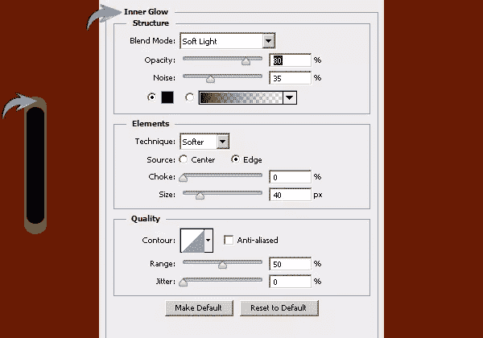](https://www.sitepoint.com/wp-content/uploads/2012/10/152.jpg)

将两个矩形收集到一个组中，并将这个新组重复七次。如下图所示排列这些副本。

### [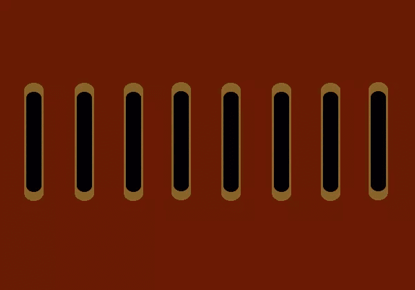](https://www.sitepoint.com/wp-content/uploads/2012/10/15b.jpg)

### 第十六步

创建一个矩形如下所示，并应用以下图层样式设置。

[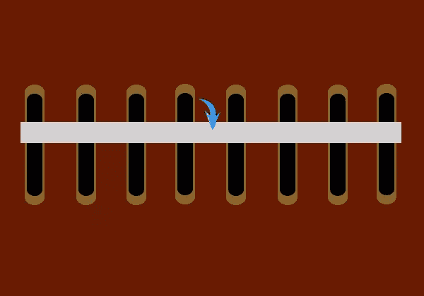](https://www.sitepoint.com/wp-content/uploads/2012/10/162.jpg)

右键单击这一层，并选择“转换为智能对象。”现在进入“滤镜”>“噪波”>“添加噪波”这里使用 2px 值。

[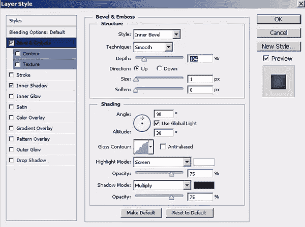](https://www.sitepoint.com/wp-content/uploads/2012/10/16b1.jpg)

[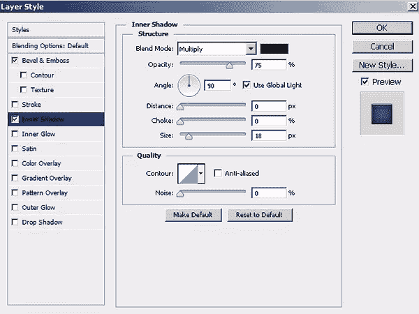](https://www.sitepoint.com/wp-content/uploads/2012/10/16c.jpg)

复制它，并将副本放在原始图层的正下方。

### [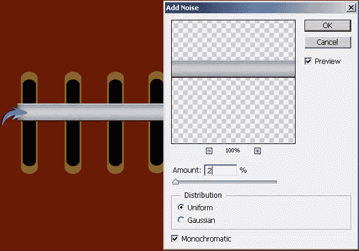](https://www.sitepoint.com/wp-content/uploads/2012/10/16d.jpg)

### 步骤 17

选择钢笔工具(工具模式:形状)绘制如下所示的形状。应用相同的设置为内部发光和噪声在这个形状上一个 wes 适用于矩形在步骤 16。另外，添加一些阴影。

[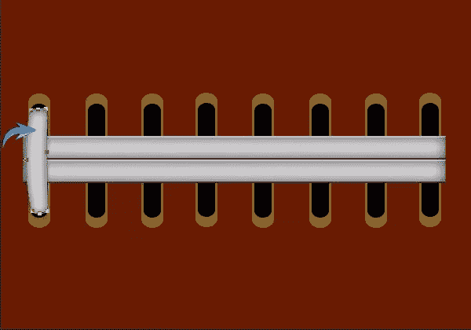](https://www.sitepoint.com/wp-content/uploads/2012/10/172.jpg)

继续复制和排列这些形状，以创造预期的缝合。

### [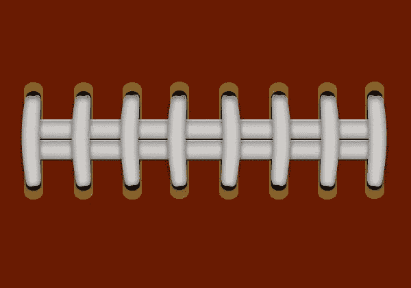](https://www.sitepoint.com/wp-content/uploads/2012/10/17b.jpg)

### 步骤 18

将步骤 17 中形成的形状的一个副本放在两个矩形下面，水平翻转并如下图所示排列。

### [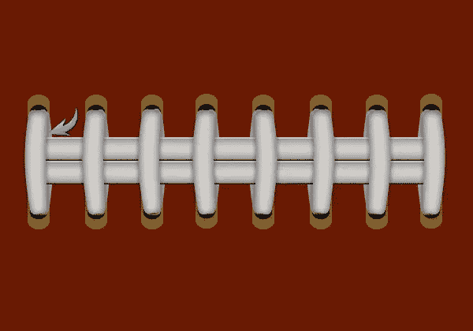](https://www.sitepoint.com/wp-content/uploads/2012/10/182.jpg)

### 步骤 19

在这些图层下面新建一个图层，选择软圆形笔刷工具，应用它来形成纯黑色的阴影。

[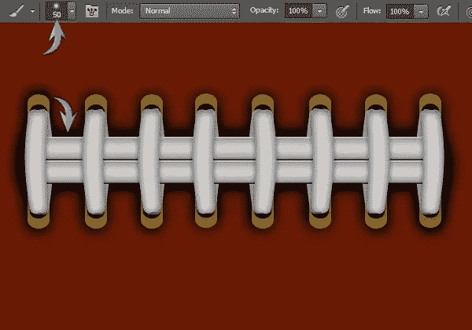](https://www.sitepoint.com/wp-content/uploads/2012/10/192.jpg)

收集所有这些层在一组，调整大小，并放置如下所示。

### 

### 步骤 20

接下来，形成足球的阴影，在背景上新建一层，使用椭圆工具制作如下图所示的形状。完成后，将阴影层的不透明度降低到 65%。

### 

### 步骤 21

我们的足球准备好了；现在我们将为它创建一个背景。将草的图像粘贴到背景层的正上方，并在上面创建一个色调/饱和度调整层。在此应用以下色调/饱和度调整设置。

### [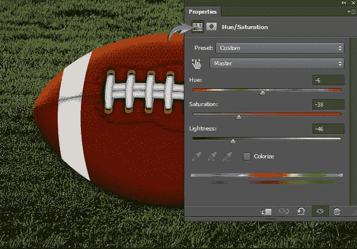](https://www.sitepoint.com/wp-content/uploads/2012/10/211.jpg)

### 步骤 22

你可以使用笔刷工具在新图层上绘制一个白色条纹。改变这一层的混合模式为“颜色”复制这一层，并改变其混合模式为“叠加”，以获得如下所示的效果。

### 

### 步骤 23

现在，我们将在足球前面创建一个辉光。选择一个适当大小的软圆刷工具，并将其应用于一个新的层在纯白色的其余层的顶部。

[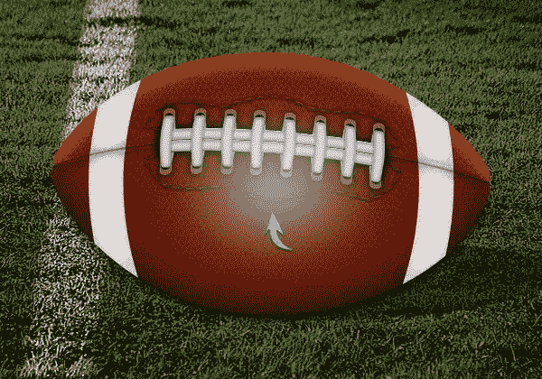](https://www.sitepoint.com/wp-content/uploads/2012/10/231.jpg)

将该层的混合模式改为“叠加”，复制该层，将其混合模式改为“鲜艳的光”，得到下面的效果。

### 

### 步骤 24

最后，在所有图层的顶部创建一个“色阶”调整图层，并使用以下设置。

[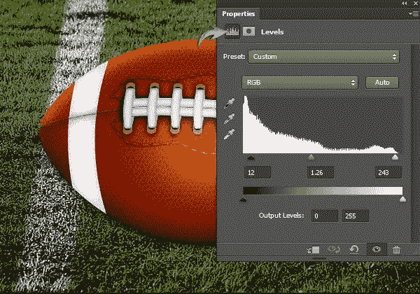](https://www.sitepoint.com/wp-content/uploads/2012/10/241.jpg)

就这样，伙计们。希望你喜欢这个教程，并学到一些新东西。请分享你的想法！

## 分享这篇文章