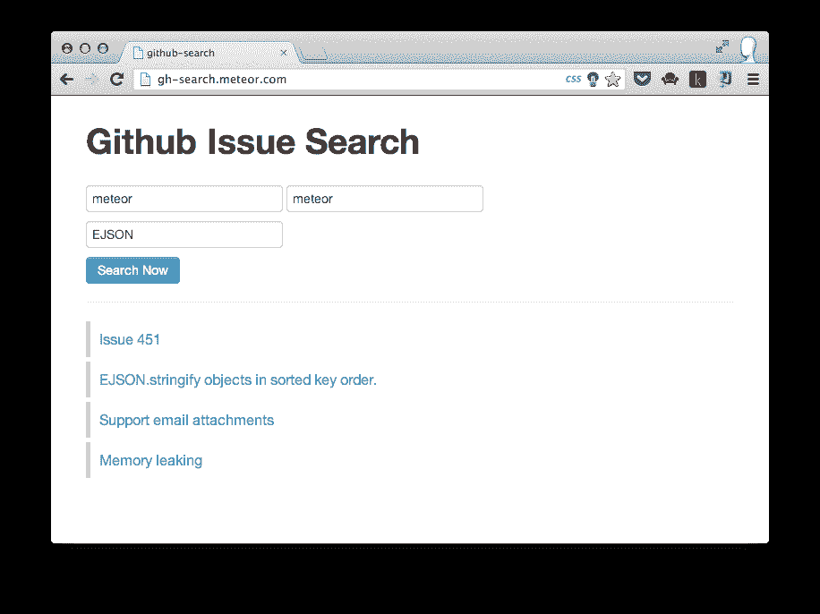

# 使用 NPM 模块创建一个流星应用

> 原文：<https://www.sitepoint.com/create-a-meteor-app-using-npm-module/>

随着[0 . 6 . 0 版本](http://meteor.com/blog/2013/04/05/meteor-060-brand-new-distribution-system-app-packages-npm-integration)，流星推出 NPM 支持。但是完全的 NPM 支持只适用于 meteor 包。只有流星使用的核心 NPM 模块可以从流星应用程序加载。这意味着如果你需要使用像 redis、github 或 winston 这样的 NPM 模块，你就没那么幸运了。但这[并非不可能](https://coderwall.com/p/srvdta)。

不过最近，我想出了一个更聪明的方法来使用 NPM 和流星。它被打包成一个智能包，非常易于使用。

在本教程中，我将指导您使用 [github](https://npmjs.org/package/github) NPM 模块创建一个 Github 问题搜索应用程序。我将一步一步地介绍如何构建它。但是我假设你对[流星](https://meteor.com/)和[陨石](https://github.com/oortcloud/meteorite)有很好的了解。

你可以在[http://gh-search.meteor.com](http://gh-search.meteor.com/)上看到实时应用，代码是[托管在 github](https://github.com/arunoda/github-issue-search) 上。

## 创建应用程序

让我们创建我们的应用程序。

```
mrt create gh-issue-search
cd gh-issue-search
mrt add bootstrap 
```

我们不需要由 Meteor 自动创建的文件，所以请确保删除以下文件。

```
gh-issue-search.css
gh-issue-search.html
gh-issue-search.js 
```

## 让我们添加 NPM 支持

对于本教程，我们将使用`github` NPM 模块，它将被添加如下所示。

从大气中安装`npm`智能包。

```
mrt add npm 
```

在项目根目录下创建`packages.json`文件，并添加以下内容。

```
{
  "github": "0.1.10"
} 
```

`packages.json`是我们定义要加载的 NPM 模块的文件。请确保在声明版本时设置绝对版本号。类似`0.1.x`的东西在流星里是行不通的。

## 编码 Meteor 客户端

创建一个名为`client`的文件夹，并添加以下 HTML 和 CSS 文件。我们不太担心这些文件，因为我们的重点是与 NPM 模块。

#### 文件:client/home.html

```
<head>
  <title>github-search</title>
</head>

<body>
  {{> home}}
</body>

<template name="home">
  <div class='container'>
    <h1>Github Issue Search</h1><br>
    <input type="text" id='user' placeholder="Enter User Name" value="meteor">
    <input type="text" id='repo' placeholder="Enter Repo Name" value="meteor">
    <br>
    <input type='text' id='keyword' placeholder="Enter Search Keyword"><br>
    <button id='search' class='btn btn-info'>Search Now</button>
    <hr/>
    {{> results}}
  </div>
</template>

<template name='results'>
  {{#with error}}
    <div class='alert'>
      {{reason}}
    </div>
  {{/with}}

  {{#each results}}
    <div class='result'>
      <a href='{{html_url}}' target='_blank'>{{title}}</a>
    </div>
  {{/each}}
</template> 
```

#### 文件:client/main.css

```
h1 {
  margin-top: 30px;
}

.result {
  padding: 10px 0px 10px 10px;
  margin: 5px 0px 5px 0px;
  border-left: 5px solid rgb(200, 200, 200);
  font-size: 16px;
}
```

#### 文件:client/helpers.js

```
Template.results.helpers({
  "results": function() {
    return Session.get('results') || [];
  },

  "error": function() {
    return Session.get('error');
  }
}); 
```

搜索结果和错误将通过会话变量呈现在模板中。我们所要做的就是设置会话变量，UI 就会相应地改变。

## 实施搜索

这就是我们将如何实现搜索。

*   我们正在实施我们的搜索作为一个流星方法。
*   Npm github 模块将用于进行实际的搜索。
*   来自客户端的搜索请求细节(用户、存储库、搜索关键字)将通过`Meteor.call`发送到 Meteor 方法
*   Meteor 方法结果(或错误)将被捕获到`Meteor.call`中，并被设置为正确的会话变量。

### 监听按钮点击事件

我们将监听按钮点击事件，文本字段值将被发送到名为`search`的方法。

#### file: /client/events.js

```
Template.home.events({
  "click #search": function() {
    Session.set('error', null);
    Session.set('results', null);

    var user = $('#user').val();
    var repo = $('#repo').val();
    var keyword = $('#keyword').val();

    $('#search').html('Searching...');
    Meteor.call('search', user, repo, keyword, function(err, results) {
      console.log(results);
      $('#search').html('Search Now');
      if(err) {
        Session.set('error', err);
      } else {
        Session.set('results', results.issues);
      }
    });
  }
}); 
```

### 使用国家预防机制模块

现在是时候在服务器中实现我们的方法了。让我们在项目根目录下创建一个名为`server`的文件夹，并添加我们的方法，如下所示。

#### 文件:server/methods.js

```
### CodeBlock: 1
Meteor.methods({
  "search": function(user, repo, keyword) {
    ### CodeBlock: 2
  }
}); 
```

> 标记为`CodeBlock: x`的位置将被替换为以下代码。

首先让我们加载我们的 NPM 模块。通常加载 NPM 模块是`Npm.require()`的工作。但是为了加载在`packages.json`中定义的模块，你需要使用`Meteor.require()`来代替。

让我们在`CodeBlock: 1`中加载 Github 模块

```
var Github = Meteor.require('github');
var github = new Github({version: "3.0.0"}); 
```

#### 让我们使用 github npm 模块进行搜索

但是等一下。NPM 模块异步工作**，但是流星方法同步工作**。他们在一起玩得不好。****

 ****然而，`npm`智能包引入了另一个叫做`Meteor.sync`的有用方法来解决这个问题。让我们看看它是如何工作的。

该代码将被添加到`CodeBlock: 2`中。

```
//this is the search request object (which is accept by our github npm module)
var searchRequest = {
  user: user,
  repo: repo,
  keyword: keyword,
  state: 'open'
};

//execution pause here until done() callback is called.
var repos = Meteor.sync(function(done) {
  github.search.issues(searchRequest, function(err, searchResults) {
    done(err, searchResults);
  });
});

if(repos.error) {
  throw new Meteor.Error(401, repos.error.message);
} else {
  return repos.result;
} 
```

`Meteor.sync()`将暂停 meteor 方法的执行，直到`done()`回调被触发。所以现在我们可以在`Meteor.sync`中安全地执行任何异步任务。

一旦我们有了结果(或错误),我们可以通过调用`done`回调来恢复执行。

`done()`接受第一个参数作为错误对象，第二个参数作为结果。这些值随后被发送给 Meteor 方法，作为`Meteor.sync()`的返回值

返回值被封装到一个对象中，如下所示。

```
{
  error: {error: "object"},
  result: "resultValue"
} 
```

代码的另一部分不言自明。

这是我们最终的代码。

```
var Github = Meteor.require('github');
var github = new Github({version: "3.0.0"});

Meteor.methods({
  "search": function(user, repo, keyword) {
    var searchRequest = {
      user: user,
      repo: repo,
      keyword: keyword,
      state: 'open'
    };

    //execution pause here until done() callback is called.
    var repos = Meteor.sync(function(done) {
      github.search.issues(searchRequest, function(err, searchResults) {
        done(err, searchResults);
      });
    });

    if(repos.error) {
      throw new Meteor.Error(401, repos.error.message);
    } else {
      return repos.result;
    }
  }
});
```

## 表演时间

让我们用`mrt`和`http://localhost:3000`运行我们的应用程序。在 http://gh-search.meteor.com 的[上可以找到托管版本。](http://gh-search.meteor.com/)

如果您遇到任何错误，请尝试将其与 [github repo](https://github.com/arunoda/github-issue-search) 进行比较。

## NPM 模块不限于方法

我们可以在服务器的任何地方使用 npm 模块。当然，你可以在出版物内部使用它们，权限随`Meteor.sync`一起。

如果你不需要同步行为，只需使用没有`Meteor.sync`的 NPM 模块。没有人会阻止你做那件事。

我个人认为这是流星的一个非常好的机会。从技术上讲，有 30，000+ NPM 模块等待与流星一起使用。

这是很大的潜力。

## 分享这篇文章****