# 在 Photoshop 中创建一个自然灵感的肖像

> 原文：<https://www.sitepoint.com/create-a-nature-inspired-portrait-in-photoshop/>

任何具有中等 Photoshop 技能的人都可以对肖像图像进行基本的改进。像色彩校正、“红眼”消除和灯光调整这样的任务通常非常简单，Photoshop 只需几个命令和单击鼠标就能为您完成。但是，给肖像添加一些更重要的增强就有点难了。让我们超越一些基本的*严重的*肖像增强。

今天，我将向你展示如何在 Photoshop 中创建一个受自然启发的肖像。在这个过程中，我们将使用阴影和高光技术，以及加深和减淡工具来制作自然主题的肖像，高度风格化，并用自然装饰品来点缀。

**资源:**

[Mya 拍摄的模特图像](http://www.flickr.com/photos/canonpicsmya/5807480292/sizes/l/in/photostream/)

[李乐雅的树叶和蝴蝶画笔](http://lileya.deviantart.com/art/Leaves-and-butterflies-172403722?q=boost%3Apopular%20leaves%20and%20butterflies%20brushes&qo=5)

巴赫曼·法扎德的《粉红莲花》

[马丁·黑根的《多萝西娅之花》](http://www.flickr.com/photos/martin_heigan/451018398/sizes/o/in/photostream/)

[JonasKr 的明星画笔](http://jonaskr.deviantart.com/art/Star-Brushes-Volume-1-90618682?q=boost%3Apopular%20star%20brushes&qo=24)

[蝴蝶乘风破浪](http://unfaithed.deviantart.com/art/Butterfly-36147690?q=boost%3Apopular%20butterfly&qo=5)

在我们开始之前，让我们看看我们的最终结果。

[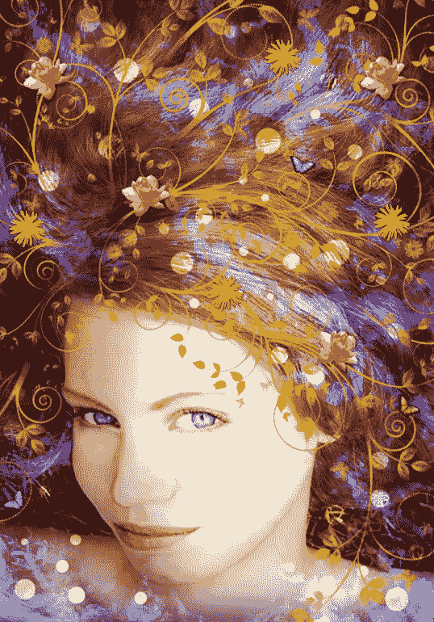](https://www.sitepoint.com/wp-content/uploads/2012/07/final.jpg)

### 第一步

在 Photoshop 中打开模型的图像。如你所见，在模特右肩上方的草地上有一些文字；所以我们需要掩盖它。使用矩形选框工具选择图片左侧的草，复制粘贴到一个新的图层上。将其放在文本的正上方；您可以使用软圆形橡皮擦工具擦除其边框。完成后，按 Ctrl + "E "键将模型和草层合并在一起。

[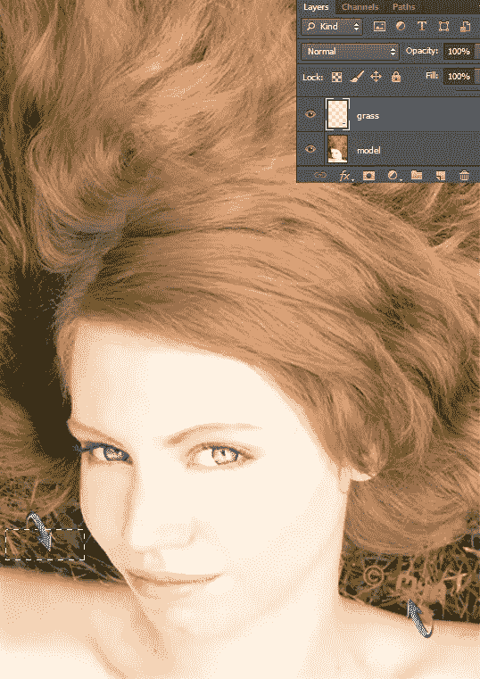](https://www.sitepoint.com/wp-content/uploads/2012/07/1.jpg)

### 第二步

现在，要添加灯光到图像中，通过“图层”>“复制图层”复制图像，然后进入“滤镜”>“渲染”>“灯光效果”为灯光效果应用以下设置。改变这个复制层的混合模式为“柔光”，并减少其不透明度为 50%。

[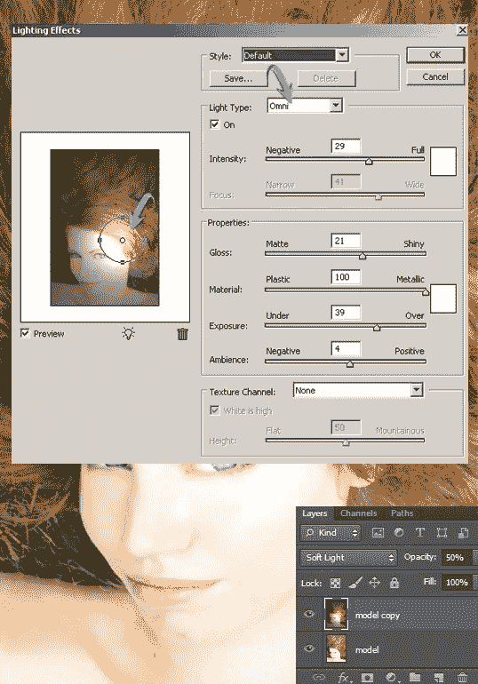](https://www.sitepoint.com/wp-content/uploads/2012/07/2.jpg)

[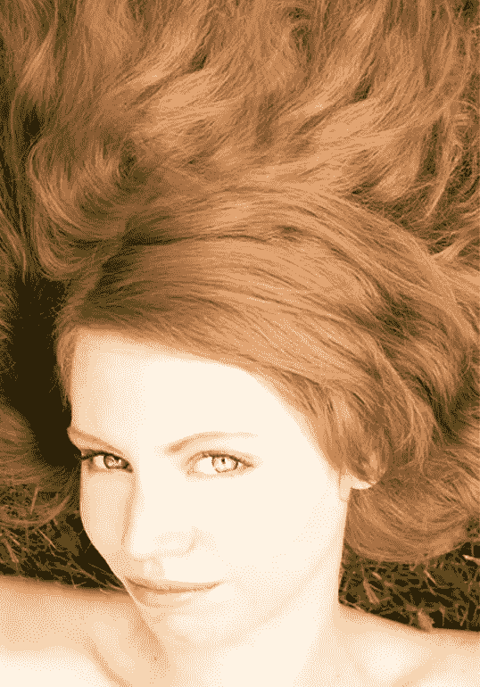](https://www.sitepoint.com/wp-content/uploads/2012/07/2b.jpg)

### 第三步

创建一个新层，设置#000000 作为你的前景色。现在选择软圆刷工具，减少其不透明度为 30%，并适用于这个新层的边界。

[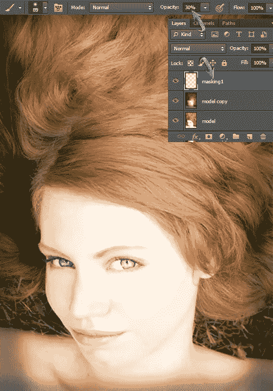](https://www.sitepoint.com/wp-content/uploads/2012/07/3.jpg)

现在，减少额外的 20%的笔刷工具的不透明度，并将其应用到模特的身体上，保留脸的右边和头发在上面。

[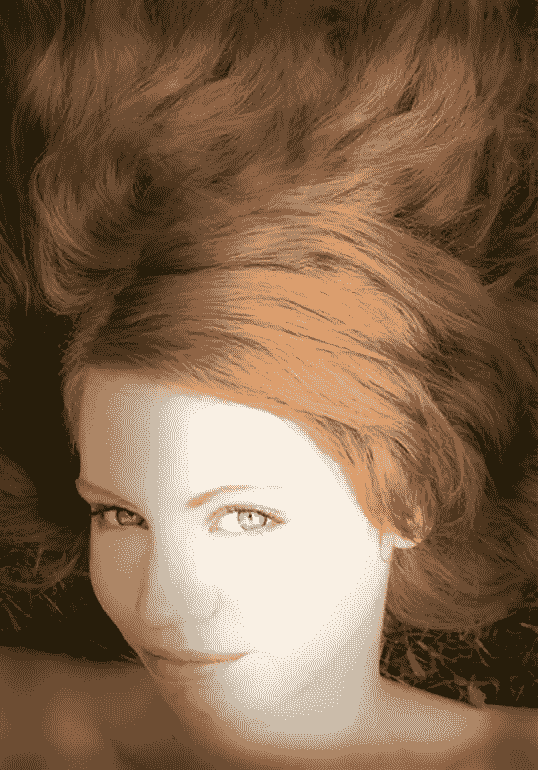](https://www.sitepoint.com/wp-content/uploads/2012/07/3b.jpg)

### 第四步

创建一个新层，进入“编辑”>“填充”填充 50%灰色，并将该层的混合模式改为“叠加”；这将使下面的图像可见。现在选择“阴影”范围和 25%曝光度的加深工具，在眼睛较暗的区域涂抹。一旦你完成了，选择减淡工具，选择“高光”范围和 25%的曝光度，如下图所示，用它来照亮眼睛上方的区域。

[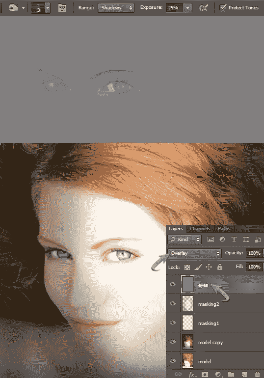](https://www.sitepoint.com/wp-content/uploads/2012/07/4.jpg)

### 第五步

使用加深和减淡工具对模型的其余部分和头发进行阴影和高光处理。下图显示了我如何在图片上使用这些工具。

[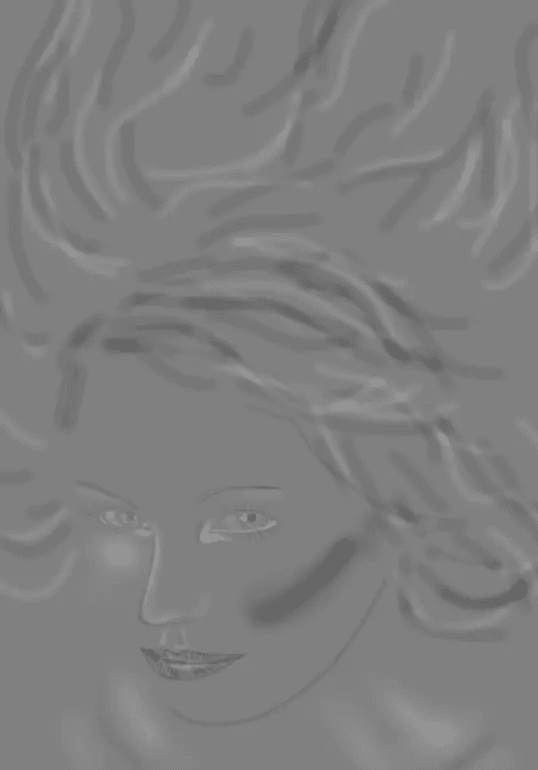](https://www.sitepoint.com/wp-content/uploads/2012/07/5.jpg)

[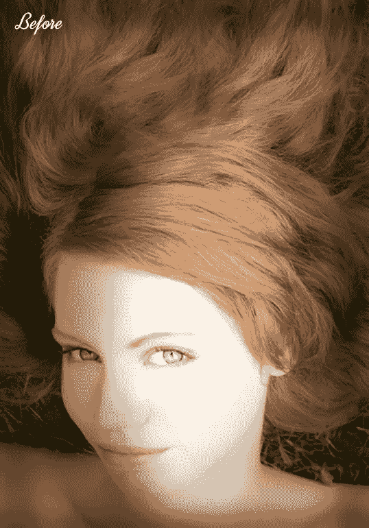](https://www.sitepoint.com/wp-content/uploads/2012/07/5b.jpg)

[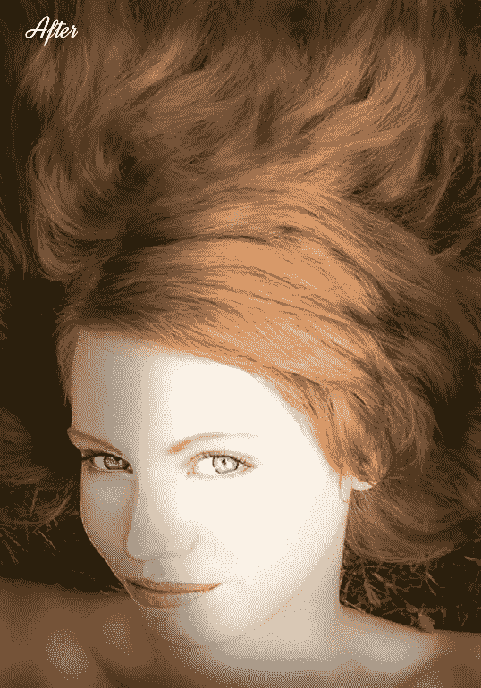](https://www.sitepoint.com/wp-content/uploads/2012/07/5c.jpg)

### 第六步

点击图标“创建新的填充或调整层”，这是在层面板的底部。然后，选择“色彩平衡”调整层。使用此处给定的值:

[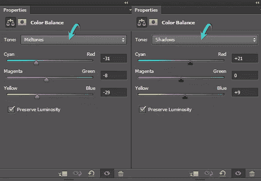](https://www.sitepoint.com/wp-content/uploads/2012/07/6.jpg)

[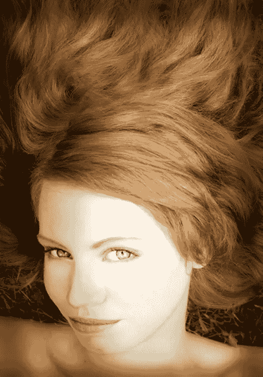](https://www.sitepoint.com/wp-content/uploads/2012/07/6b.jpg)

### 第七步

现在我们将在画布上添加一些花卉元素。在 Photoshop 中打开“树叶和蝴蝶”笔刷。设置#e3bd00 作为你的前景色，并在单独的新图层上应用不同的笔刷，这样你可以很容易地编辑它们。您可以使用自由变换工具(Ctrl+“T”)来排列它们。使用 30%不透明度的圆形橡皮擦工具柔化树枝的起始端。

[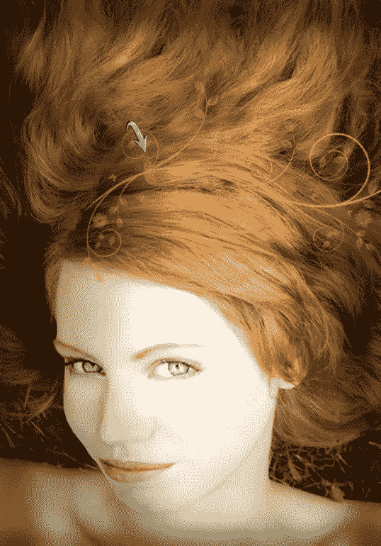](https://www.sitepoint.com/wp-content/uploads/2012/07/7.jpg)

擦除重叠的树刷。你可以用你自己的创造性的方式使用这些画笔。

[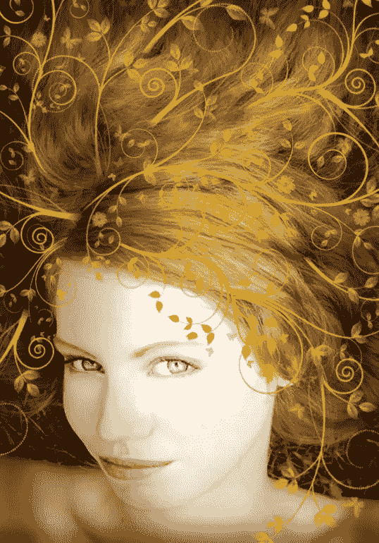](https://www.sitepoint.com/wp-content/uploads/2012/07/7b.jpg)

### 第八步

现在我们将这些分支上的一些区域变暗，以产生阴影效果。合并所有应用了树叶笔刷的图层，点击图标“添加图层蒙版”，它位于图层面板的底部。然后选择不透明度为 30%的圆形软笔刷，使用颜色#000000 在树枝的不同区域涂抹。

[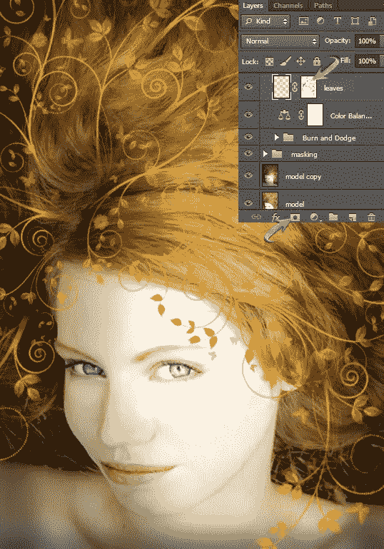](https://www.sitepoint.com/wp-content/uploads/2012/07/8.jpg)

### 第九步

在 Photoshop 中打开粉红莲花图像。您可以使用任何您喜欢的选择工具来选择它。我将在这里使用快速选择工具。将其复制并粘贴到您的 Photoshop 文档中。

[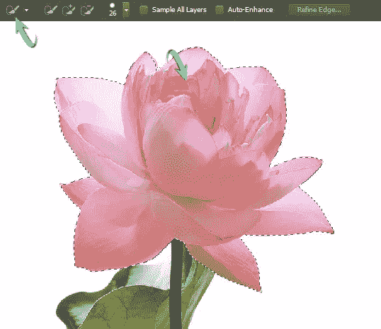](https://www.sitepoint.com/wp-content/uploads/2012/07/9.jpg)

### 第十步

使用自由变换工具(Ctrl+“T”)减小粉红莲花的大小。现在，要调整它的颜色，按 Ctrl + <click on="" the="" lotus="" layer="">选中它，然后创建一个色相/饱和度调整图层。使用此处提供的值:</click>

[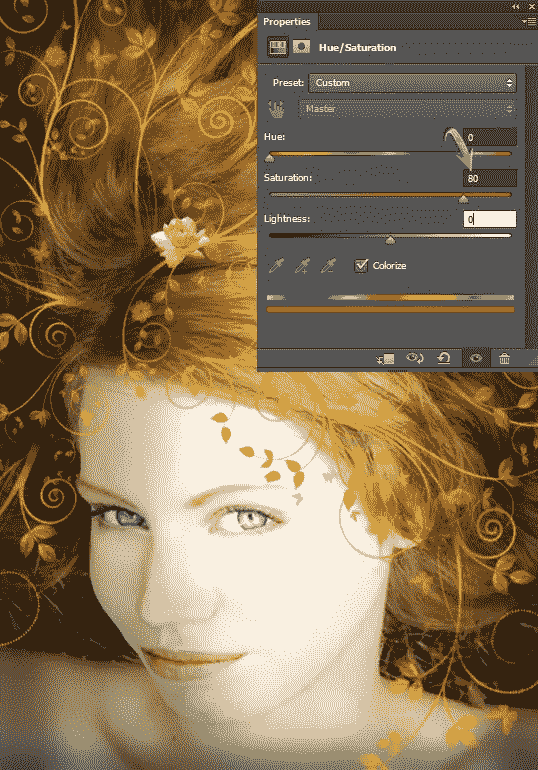](https://www.sitepoint.com/wp-content/uploads/2012/07/10.jpg)

### 步骤 11

双击莲花图层打开图层样式窗口。使用以下设置应用投影。之后，复制花几次，把它们排列在不同的角度。

[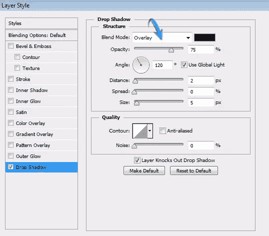](https://www.sitepoint.com/wp-content/uploads/2012/07/11.jpg)

### 步骤 12

从我们的资源中打开“lithops”图像，选择它，复制并粘贴到您的 Photoshop 文档中。应用相同的投影设置，如步骤 11 所示。如下排列这些花。

[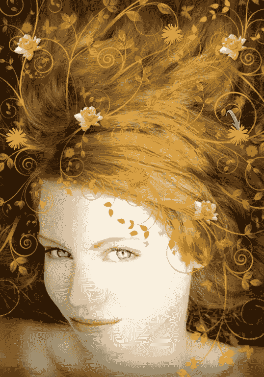](https://www.sitepoint.com/wp-content/uploads/2012/07/12.jpg)

### 第十三步

选择硬圆形画笔，然后按 F5 打开画笔面板。使用以下设置。

[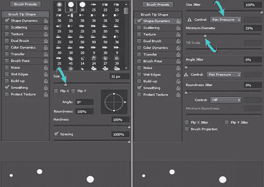](https://www.sitepoint.com/wp-content/uploads/2012/07/13.jpg)

现在，在一个新的图层上使用笔刷来获得一个散景效果。

[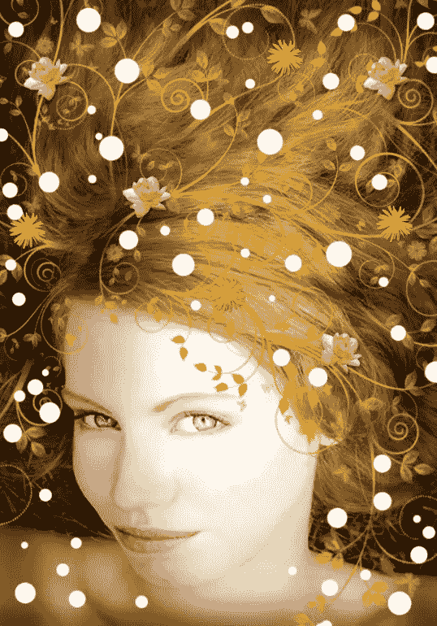](https://www.sitepoint.com/wp-content/uploads/2012/07/13b.jpg)

### 步骤 14

将散景图层的混合模式改为“叠加”

[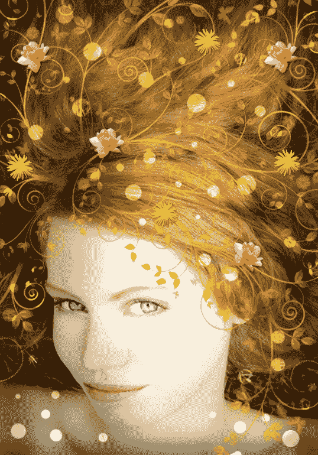](https://www.sitepoint.com/wp-content/uploads/2012/07/14.jpg)

### 第十五步

接下来，为了增强某些区域的对比度，新建一个图层，选择透明度为 20%的圆形软笔刷，如下图所示，使用黑色。

[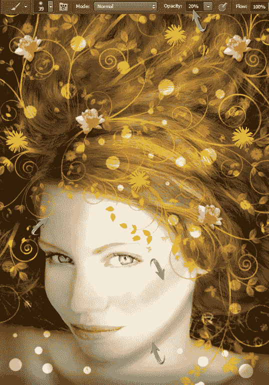](https://www.sitepoint.com/wp-content/uploads/2012/07/15.jpg)

改变这一层的混合模式为“叠加”

[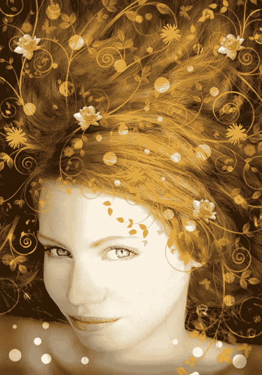](https://www.sitepoint.com/wp-content/uploads/2012/07/15b.jpg)

### 第十六步

在 Photoshop 中打开星形笔刷。设置#ce2497 作为你的前景色，选择“星云”笔刷，随机地在一个新的图层上使用，保持模特的脸不动。

[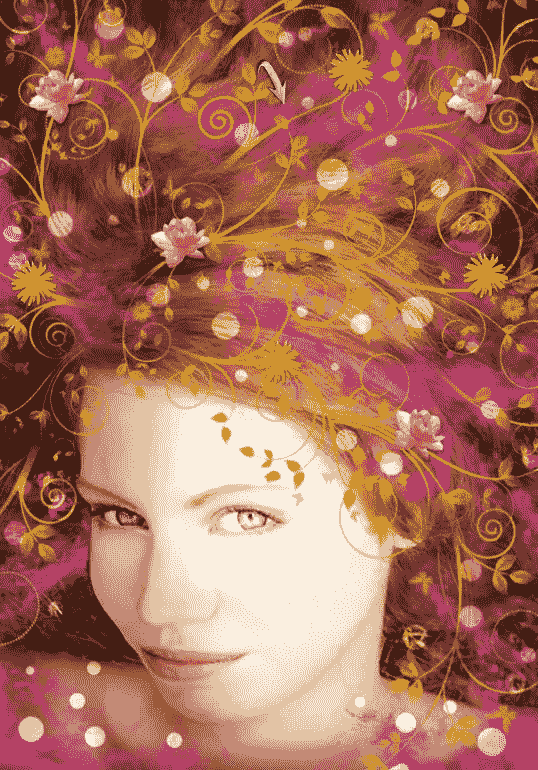](https://www.sitepoint.com/wp-content/uploads/2012/07/16.jpg)

改变其混合模式为“颜色减淡”如果你想要强烈的效果，你可以复制这一层。

[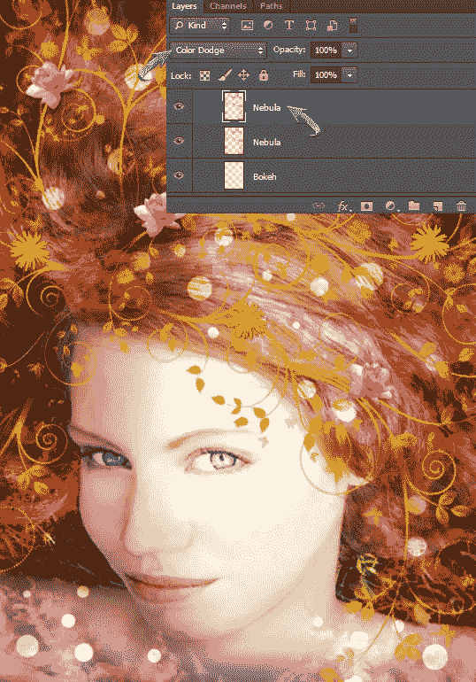](https://www.sitepoint.com/wp-content/uploads/2012/07/16b.jpg)

### 步骤 17

按 Ctrl + <click on="" nebula="" layer="">选中，创建色相/饱和度调整图层。使用给定的值给它蓝色的阴影，如下所示。</click>

[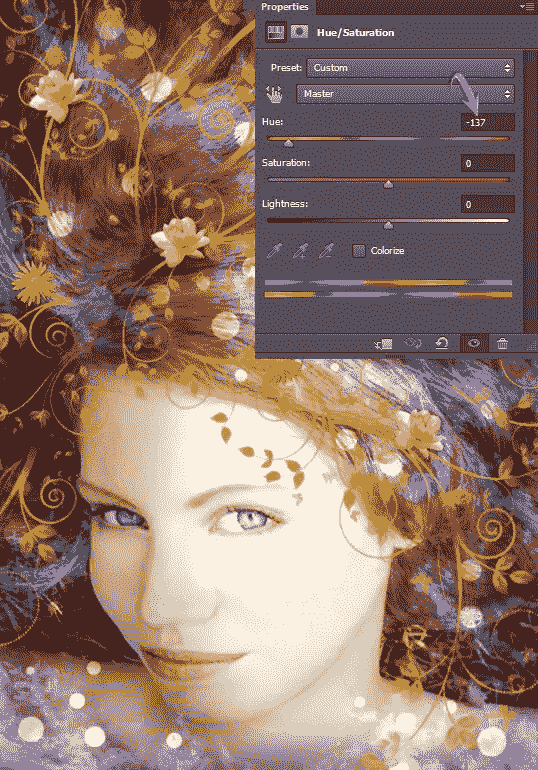](https://www.sitepoint.com/wp-content/uploads/2012/07/17.jpg)

### 步骤 18

打开蝴蝶图像，选择蝴蝶，将其复制并粘贴到 Photoshop 文档中。重复 1-2 次，然后按照你喜欢的方式把它们摆放在树枝上。您可以使用色调/饱和度调整层来更改它们的颜色。

[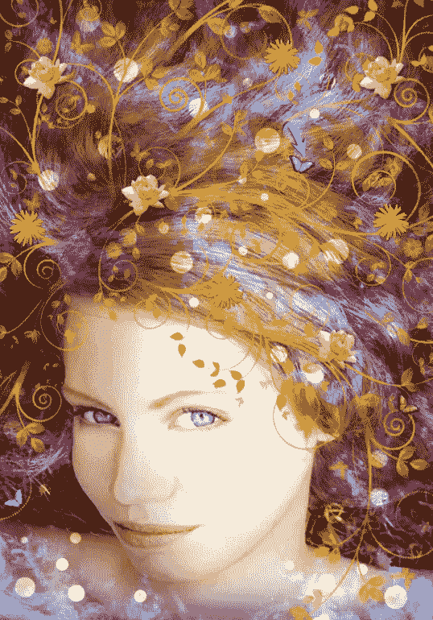](https://www.sitepoint.com/wp-content/uploads/2012/07/18.jpg)

### 步骤 19

创建一个“曲线”调整层，并使用以下设置。

[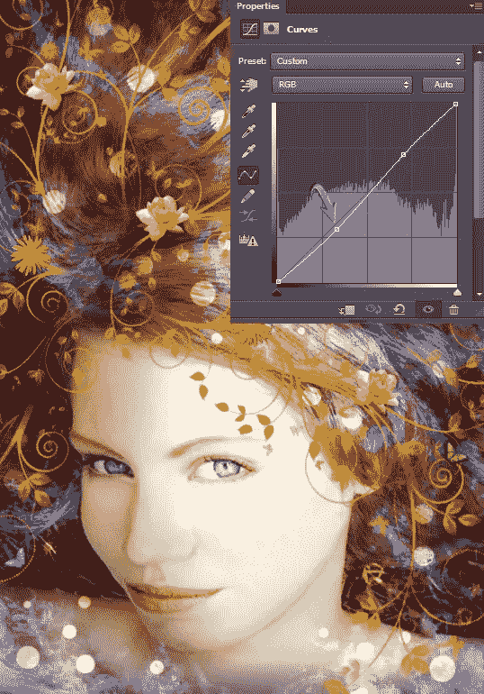](https://www.sitepoint.com/wp-content/uploads/2012/07/19.jpg)

### 步骤 20

收集一个组中的所有图层，并将其合并。然后进入“滤镜”>“锐化”>“模糊蒙版”。"使用下列值来锐化图像。

[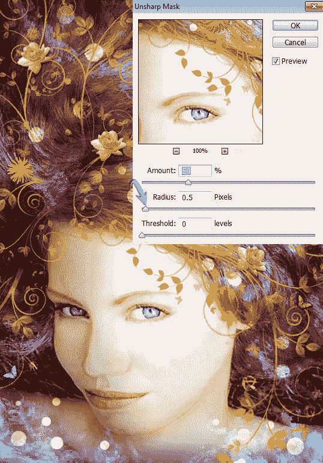](https://www.sitepoint.com/wp-content/uploads/2012/07/20.jpg)

就这些了，希望你能学到有用的东西。让我知道你的想法！

## 分享这篇文章