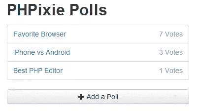
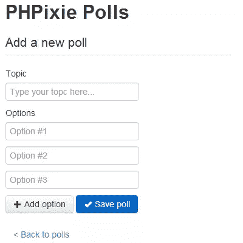
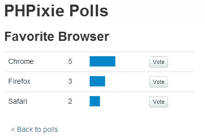

# 用 PHPixie 创建一个投票

> 原文：<https://www.sitepoint.com/create-a-poll-with-phpixie/>

当选择一个 PHP 框架时，你需要确保它强调对你来说最重要的特性。如果你正在寻找快速、简单、易学的东西，那么 PHPixie 可能是一个完美的选择。

为了说明使用 PHPixie 开发的基础，我们将创建一个小的轮询应用程序。在本教程结束时，您将拥有一个可运行的投票应用程序，并理解使用 PHPixie 编写项目代码是多么容易。

在继续之前，请确保从[项目的网站](http://phpixie.com/ "PHPixie Framework | Fast PHP Framework")下载 PHPixie，并将下载的档案文件解压到 web 服务器的根目录下。在你的浏览器中访问 *http://localhost/* (或者其他合适的地址)，你应该会看到“祝你编码愉快！”欢迎信息。

## 创建数据库

首先，我们需要在数据库中创建两个表:`polls`将存储我们希望获得意见的主题，而`options`将包含每个投票的可能答案以及每个投票的票数。

打开 MySQL 客户端，运行以下查询:

```
CREATE TABLE polls (
    id INTEGER UNSIGNED NOT NULL AUTO_INCREMENT,
    topic VARCHAR(255) NOT NULL,
    PRIMARY KEY (id)
);

CREATE TABLE options (
    id INTEGER NOT NULL AUTO_INCREMENT,
    name VARCHAR(255) DEFAULT NULL,
    poll_id INTEGER UNSIGNED NOT NULL,
    votes INTEGER NOT NULL DEFAULT 0,
    PRIMARY KEY (id),
    FOREIGN KEY (poll_id) REFERENCES polls(id)
);
```

为了配置数据库连接，我们编辑了`application/config`目录中的`database.php`文件:

```
<?php
return array(
    'default' => array(
        'user' => 'dbuser',
        'password' => 'dbpassword',
        'driver' => 'pdo',

        // 'Connection' is required if we use the PDO driver
        'connection' => 'mysql:host=localhost;dbname=polls',

        // 'db' and 'host' are required if we use Mysql driver
        'db' => 'polls',
        'host' => 'localhost'
    )
);
```

PHPixie 可以配置为使用多个数据库连接，但是因为我们只使用一个数据库，所以我们将它指定为默认数据库。这就是所有需要的配置，所以我们现在可以开始写代码了。

## 模型

描述模型-视图-控制器体系结构的常用方法如下:

*   模型代表我们使用的数据对象(在我们的例子中是投票和选项)
*   控制器处理用户请求，是我们应用程序的核心
*   视图是控制器用来显示响应的模板

通常，模型处理从数据库中检索数据和保存数据之类的操作。PHPixie 使用 ORM 层来处理这些操作，所以我们根本不需要编写任何数据库查询。我们只需要这样定义我们的模型:

```
<?php
class Poll_Model extends ORM {
    // Each poll can have many options
    public $has_many = array('options');

    // This way we can define some additional
    // dynamic properties for a model.
    // Later on we will be able to access it via $poll->total_votes
    public function get($property) {
        if ($property == 'total_votes') {
            $total = 0;
            foreach ($this->options->find_all() as $option) {
                $total += $option->votes;
            }
            return $total;
        }
    }
}
```

上面的代码应该放在`application/classes/model/poll.php`里。

可以使用 3 个数组来定义关系:`belongs_to`、`has_one`和`has_many`。第一个(`belongs_to`)定义了当一个表使用外键引用另一个表时的一对一关系，在我们的例子中使用`poll_id`字段`options` *属于*到`polls`。PHPixie 使用模型名称自动猜测外键。在属于关系 falls `has_many`的另一边，在我们的例子中每个 poll 都有许多选项。`has_one`是`has_many`的特例，将引用对象的数量限制为一个。要定义一个关系，我们只需要将我们想要的模型的名称添加到适当的数组中。更彻底的关系配置是可能的，能够指定哪个字段用于关系，为它设置不同的名称，或者通过链接表创建多对多关系，但是在我们的情况下，使用这种简单的方法就足够了。

`find_all()`方法在数据库中查找记录。当我们引用`options`属性时，ORM 会自动构建一个数据库查询来选择当前投票的所有选项。调用`find_all()`随后执行该查询，并返回这些选项作为 ORM 模型。

覆盖`get()`方法允许我们动态地向模型添加属性。如果我们试图访问的属性在模型类中找不到，ORM 将调用类的方法'`get()`,将属性名作为参数传递。`get()`返回的任何结果都将被视为该属性的值，并存储在模型中，这样当我们再次访问该属性时，我们将获得缓存的值。由于内部模型操作通常会调用某种数据库操作，所以最好缓存数据，这就是我们覆盖`get()`的原因。

请注意，虽然`get()`通常用于缓存来自`find_all()`的数据，但它并不仅仅用于此。例如，我们可以使用`get()`来定义一个属性，我们可以多次访问这个属性，但是只能检索一次。

这个内部缓存只对当前对象有效。当然，如果你根本不想要这种行为，总是可以添加你自己的`total_votes()`方法到模型中，每次它被调用时都会重新计算投票。

选项模型的代码放在`application/classes/model/option.php`中:

```
<?php
class Option_Model extends ORM {
    public $belongs_to = array('poll');

    public function get($property) {
        if ($property == 'percent') {
            if ($this->poll->total_votes == 0) {
                return 0;
            }
            return floor($this->votes / $this->poll->total_votes * 100);
        }
    }
}
```

这个模型遵循与前一个模型相似的逻辑。我们用 polls 和一个`percent`属性定义了一个`belongs_to`关系，唯一的区别是对于一对一的关系，不需要调用`find_all()`方法，所以我们可以访问这个选项所属的 poll，就像它是一个属性一样。

PHPixie 在创建模型时很大程度上依赖于命名约定来节省我们的时间，尽管它并不强迫我们按照这些约定来命名一切(改变这种行为很容易)。这里我们遵循在数据库中命名表时使用复数形式，在命名模型时使用单数形式的惯例。

## 基本控制器

默认情况下，特定操作的 URL 是`/<controller>/<action>/</action></controller>`，例如*http://localhost/polls/add*。也可以在操作之后传递一个额外的 ID 参数，我们将使用它来访问各个投票。

我们的控制器必须知道如何显示三种类型的页面:

*   列出所有投票的主页
*   一个单一的投票页面，我们可以看到当前的结果和投票
*   添加新投票的表单

每个页面必须有一个控制器内为它定义的动作，我们也需要为每个页面的 HTML 模板。因此，仅显示模板的简单控制器如下所示:

```
<?php
class Polls_Controller extends Controller
{
    public function action_index() {
        // This is how we load up a template
        $view = View::get('index');
        $this->response->body = $view->render();
    }

    public function action_poll() {
        $view = View::get('poll');
        $this->response->body = $view->render();
    }

    public function action_add() {
        $view = View::get('add');
        $this->response->body = $view->render();
    }
}
```

这种设置的一个大问题是，模板中会有大量重复的代码，因为每个页面都需要页眉和页脚。解决方案是创建一个通用模板，然后在其中包含子模板。我们可以使用在控制器内部定义的`before()`和`after()`方法来实现这一点，它们将分别在一个动作被调用之前和之后执行。现在我们的控制器会是这样的(以下保存为`application/classes/controller/polls.php`):

```
<?php
class Polls_Controller extends Controller
{
    protected $view;

    public function before() {
        // We load up the main view and
        $this->view = View::get('main');

        // Now we find a full path to a view that has
        // the same names as the action to be excuted
        $template = Misc::find_file('views', $this->request->param('action'));

        // We pass the view we located to our main template.
        // All properties assigned to a view will be available
        // as variables inside the template
        $this->view->template = $template;
    }

    public function after() {
        // After an action completes we render the view
        $this->response->body = $this->view->render();
   }

   public function action_index(){
        $view = View::get('index');
        $this->response->body = $view->render();
    }

    public function action_poll() {
        $view = View::get('poll');
        $this->response->body = $view->render();
    }

    public function action_add() {
        $view = View::get('add');
        $this->response->body = $view->render();
    }
}
```

我们可以将任何我们喜欢的变量传递给视图，只需将它们指定为属性。现在，在我们向控制器添加任何代码之前，让我们看一下视图本身。

## 使用视图的 HTML 布局

视图基本上是插入了 PHP 代码的 HTML 文件，用来显示从控制器内部分配给占位符变量的值。我们的主视图非常小，因为它所要做的只是呈现一些常见的 HTML 并包含一个正确的子模板。以下是`application/views/main.php`:

```
<!DOCTYPE html>
<html>
 <head>
  <title>PHPixie polls</title>
  <link href="https://netdna.bootstrapcdn.com/twitter-bootstrap/2.2.2/css/bootstrap-combined.min.css" rel="stylesheet">
  <link href="/style.css" rel="stylesheet">
  <script src="https://ajax.googleapis.com/ajax/libs/jquery/1.9.0/jquery.min.js"></script>
 </head>
 <body>
  <div class="container">
   <div class="span4"></div>
   <div class="span4">
    <h2>PHPixie Polls</h2>
    <!-- Here is where we include a subtemplate -->
<?php include($template);?>
   </div>
   <div class="span4"></div>
  </div>
 </body>
</html>
```

我们将使用 Bootstrap 作为页面样式的基础，这样我们就不必太专注于设计了。我们需要对 CSS 做的唯一修改在`web/style.css`文件中。

```
.nav .muted {
    float: right;
}

td form {
    margin-bottom: 0px;
}

.filled {
    background: #08C;
    height: 20px;
}

.bar {
    width: 100px;
}
```

现在我们可以创建单独的页面。

## 创建单独的页面

投票页面应该只显示可用投票的列表。只需要对`controller/polls.php`稍加修改。

```
<?php
//...
public function action_index() {
    // We pass all stored polls to the view
    $this->view->polls = ORM::factory('poll')->find_all();
}
```

该页面的视图将是一个简单的列表，链接到投票创建页面。以下是`views/index.php`的代码:

```
<ul class="nav nav-tabs nav-stacked">
<?php
foreach($polls as $poll) {
?>
 <li>
  <!-- This is how a link to a single poll will look like -->
  <a href="/polls/poll/<?=$poll->id;?>"><?=$poll->topic;?>
   <div class="muted"><?=$poll->total_votes; ?> Votes</div>
  </a>
 </li>
<?php
}
?>
</ul>
<a class="btn btn-block" href="/polls/add"><i class="icon-plus"></i> Add a Poll</a>
```

如果我们要在这一点上向数据库添加一些数据，当访问*http://localhost/polls/index*时，我们会看到以下内容(URL 中可以省略 *index* ，因为这是默认操作):



创建投票需要更多的工作。我们必须检查表单是否被提交，如果是，我们保存一个投票，并将用户重定向回列表，否则我们显示表单。将以下更新添加到`controller/polls.php`:

```
<?php
//...
public function action_add() {
    // We only need to perform this if the form was submitted
    if ($this->request->method == 'POST') {

        // Creating a new poll
        $poll = ORM::factory('poll');

        // This is how you access POST form data
        $poll->topic = $this->request->post('topic');

        // Save the poll to the database
        $poll->save();

        // Similarly we create and save options specified for this poll
        foreach($this->request->post('options') as $name) {
            if (empty($name)) {
                continue;
            }
            $option = ORM::factory('option');
            $option->name = $name;
            $option->save();

            // We add each option to the 'options' relation we defined for the poll
            $poll->add('options', $option);
        }

        // This will prevent after() from executing
        // we need to do this because there is no point of returning any data
        // if we redirect the user
        $this->execute=false;
        $this->response->redirect('/polls/');
        return;
    }

    // If the form was not submitted the after() method will
    // take care of showing the creation form
}
```

投票创建模板没有什么特别的。使用以下内容创建`views/add.php`:

```
<script>
$(function() {
    $('#addOption').click(function(evt) {
        evt.preventDefault();

        var newOption = $('.option:eq(0)').clone();
        newOption.find('input').val('').attr('placeholder', 'Option #'+($('.option').length + 1));
        $('#options').append(newOption);
    })
})
</script>
<form method="POST">
 <fieldset>
  <legend>Add a new poll</legend>
  <label>Topic</label>
  <input type="text" placeholder="Type your topic here..." name="topic">
  <label>Options</label>
  <div id="options">
   <div class="option">
    <input type="text" name="options[]" placeholder="Option #1">
   </div>
   <div class="option">
    <input type="text" name="options[]" placeholder="Option #2">
   </div>
   <div class="option">
    <input type="text" name="options[]" placeholder="Option #3">
   </div>
  </div>
  <button class="btn" id="addOption"><i class="icon-plus"></i> Add option</button>
  <button class="btn btn-primary"><i class="icon-ok icon-white"></i> Save poll</button>
 </fieldset>
</form>
<a class="btn btn-link" href="/polls">&lt; Back to polls</a>
```

注意，我们为选项文本输入指定了名称，如`options[]`，这样它将作为选项数组传递给 PHP。我们还添加了一个方便的添加选项按钮来添加额外的行。结果应该如下所示:



我希望此时您已经可以预测您将在这里看到的一些代码。这个控制器必须获取 URL 中的 ID 所指定的投票，它还应该处理用户对某个选项的投票。再次对`controller/polls.php`进行如下更新:

```
<?php
//...
public function action_poll() {

    // Handle voting
    if ($this->request->method == 'POST') {

        // If an option is was supplied via POST we increment
        // its votes field by 1
        $option_id = $this->request->post('option');
        $option = ORM::factory('option')->where('id', $option_id)->find();
        $option->votes += 1;
        $option->save();

        // Now we redirect the user back to current polls' page
        // This is done so that refreshing a browser window will not
        // produce multiple votes
        $this->response->redirect('/polls/poll/' . $option->poll->id);
        $this->execute = false;
        return;
    }

    // You can get the url id parameter using param()
    $id = $this->request->param('id');
    $this->view->poll = ORM::factory('poll')->where('id', $id)->find();
}
```

`find()`方法的行为就像`find_all()`一样，但是它只返回第一个结果。在视图中，我们希望绘制一些条来描述投票的相对数量，这也是我们之前将 percent 属性添加到 options 模型中的原因。以下代码是针对`views/poll.php`的:

```
<h3><?=$poll->topic;?></h3>
<table class="table">
<?php
foreach ($poll->options->find_all() as $option) {
?>
 <tr>
  <td><?=$option->name;?></td>
  <td><?=$option->votes;?></td>
  <td class="bar">
   <div class="filled" style="width:<?=$option->percent;?>%;"></div>
  </td>
  <td>
   <form method="POST">
    <input type="hidden" name="option" value="<?=$option->id;?>">
    <button class="btn btn-mini">Vote</button>
   </form>
  </td>
 </tr>
<?php
}
?>
</table>
<a class="btn btn-link" href="/polls">&lt; Back to polls</a>
```

这是它看起来的样子:



## 差不多完成了

在我们宣布我们的应用程序完成之前，我们仍然需要通过访问 *http://localhost/* 来确保它是可用的。为此，我们必须将`application/config/core.php`配置文件中的默认控制器从“home”改为“polls ”,如下所示:

```
<?php
return array(
    'routes' => array(
        array('default', '(/<controller>(/<action>(/<id>)))', array(
            'controller' => 'polls',
            'action' => 'index'
            )
        )
    ),
    'modules' => array('database', 'orm')
);
```

现在我们有了一个全功能的 poll 应用程序，并且了解了 PHPixie 如何处理事情，以及使用它进行开发有多容易。如果您想下载本文的代码进行研究，可以在 GitHub 上找到它。

尽管如此，还有很多东西需要学习。像自定义路线和复杂的 ORM 关系这样的东西可以帮助您更好地定制您的项目。请访问 PHPixie 网站了解更多信息。

<small>图片 via[Fotolia](http://us.fotolia.com/?utm_source=sitepoint&utm_medium=website_link&utm=campaign=sitepoint "Royalty Free Stock Photos at Fotolia.com")</small>

## 分享这篇文章