# 在 Photoshop 中创建复古效果

> 原文：<https://www.sitepoint.com/create-a-retro-effect-in-photoshop/>

“复古”指的是以前某个时期的图像或设计，如 50 年代、60 年代、70 年代或 80 年代。就像任何其他设计风格一样，这些风格有它们的位置。例如，你可能被要求为一位有着 80 年代摇滚音乐的艺术家制作专辑封面，或者你可能被要求为一家复古餐厅设计一份晚餐菜单。能够实现这些风格很重要，这样你才能创造出令人信服的复古外观。

## 70 年代的复古摄影

我们都看过那些色彩有点褪色的老照片。这种外观在老照片中很常见，以至于让大多数人想起了 70 年代的摄影。这个摄影时代的主要特征是照片中突出的蓝色和黄色调。

## 第一步:找到你的形象

我选择了一张水边小鸟的照片。草是充满活力的绿色，水是逼真的蓝色。

[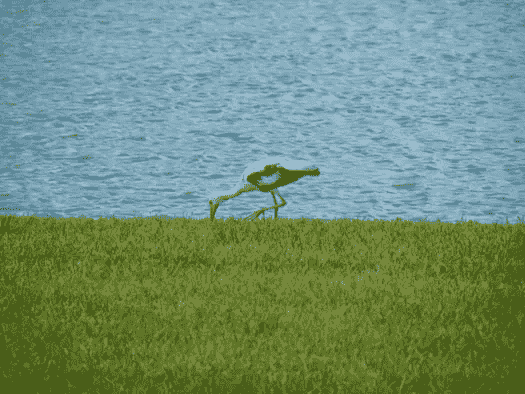](https://www.sitepoint.com/wp-content/uploads/2012/04/Screen-shot-2012-04-01-at-2.35.54-PM.png)

## 第二步:复制图像

复制背景图像。我们这样做是因为我们想让原始工作不被触动，以防我们犯了一个大错误，需要重新开始。我们这样做也是因为我们要对复制的图层应用不同的效果。

## 步骤 3:将图像应用到自身

选择复制层，选择“图像”>“应用图像”将弹出一个窗口，我们将把源图像(我们正在处理的那个)应用到它本身。默认情况下，混合设置为“乘”，但我们要改变这一点，以“屏幕”

[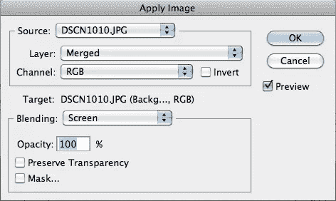](https://www.sitepoint.com/wp-content/uploads/2012/04/Screen-shot-2012-04-01-at-2.37.28-PM.png)

## 第四步:模糊复制层

我们需要对复制的图像层进行轻微的模糊处理，给它一种老式照片中常见的“模糊”效果。进入“滤镜”>“模糊”>“高斯模糊”对于这张图片，我设置模糊度为 3.0。

[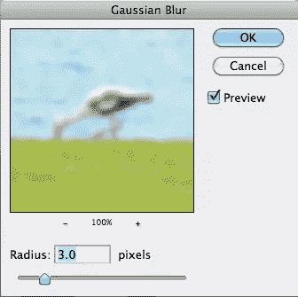](https://www.sitepoint.com/wp-content/uploads/2012/04/Screen-shot-2012-04-01-at-2.38.33-PM.png)

[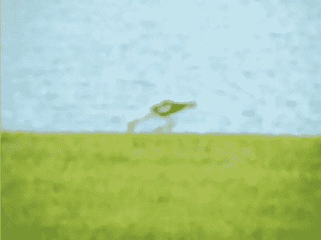](https://www.sitepoint.com/wp-content/uploads/2012/04/Screen-shot-2012-04-01-at-2.38.49-PM.png)

## 第五步:减轻影响

你只是想让这个效果稍微柔化图像，但是你还是想让原来的图层透出来。转到图层面板，选择模糊图层，将其混合模式改为“柔光”

[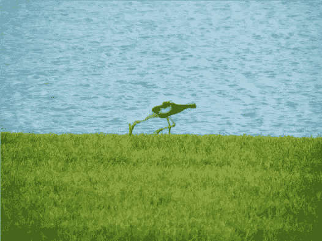](https://www.sitepoint.com/wp-content/uploads/2012/04/Screen-shot-2012-04-01-at-2.41.57-PM.png)

## 步骤 6:添加一个蓝色的照片过滤器

我们需要添加蓝色到图像中，以帮助创建我们所追求的复古外观。转到“图层”面板，单击“调整图层”图标，然后选择“照片滤镜”。选择蓝色作为颜色，并将密度设置为 35。

[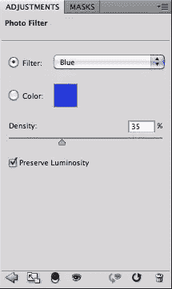](https://www.sitepoint.com/wp-content/uploads/2012/04/Screen-shot-2012-04-01-at-2.43.09-PM.png)

## 第 7 步:添加黄色照片过滤器

我们需要添加黄色的图像，以帮助它的复古外观，我们要去。在图层面板中，单击调整图层图标并选择照片滤镜。将弹出一个窗口。从列表中选择黄色，并将密度设置为 70。这将创建一个轻微的黄色调的图像。

[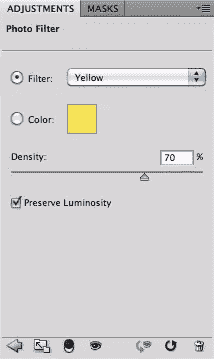](https://www.sitepoint.com/wp-content/uploads/2012/04/Screen-shot-2012-04-01-at-2.45.58-PM.png)

## 第八步:添加一些纹理

纹理是大多数复古风格的关键元素之一。腐烂或不完美的外观真的让你的作品看起来很有说服力，就好像图像已经存在了几十年。你可以在网上找到成千上万的免费垃圾纹理。导入一个丰富的垃圾纹理到你的 Photoshop 文件中，改变混合模式为“叠加”或“叠加”你的选择取决于你的纹理文件的密度。如果太暗，那么你的整个图像看起来会很模糊。我把我们的例子设定为“覆盖”我也把不透明度降到了 75%。

[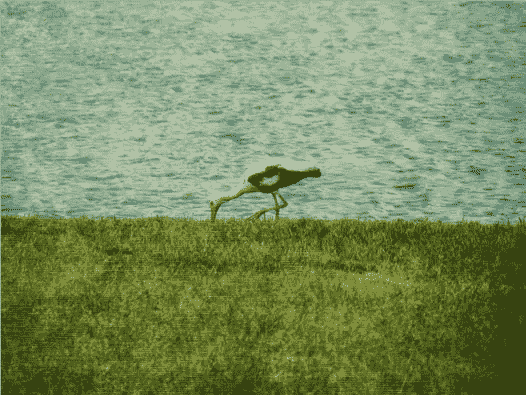](https://www.sitepoint.com/wp-content/uploads/2012/04/Screen-shot-2012-04-01-at-2.48.13-PM.png)

## 第九步:淡化中心

要给你的作品添加一点晕影，新建一个图层，选择笔刷工具。将硬度设置为 0，大小与图像的中间部分一样大。选择白色作为前景色，单击一次在图像中心创建一个模糊的白色区域。设置这一层的混合模式为“变亮”

[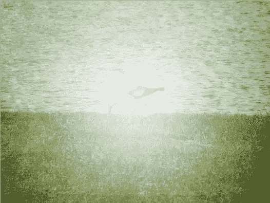](https://www.sitepoint.com/wp-content/uploads/2012/04/Screen-shot-2012-04-01-at-2.50.01-PM.png)

[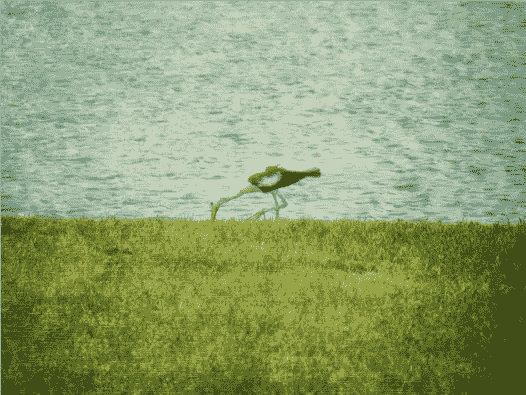](https://www.sitepoint.com/wp-content/uploads/2012/04/Screen-shot-2012-04-01-at-2.50.23-PM.png)

## 选项 2:无腐烂的葡萄酒

有时你只是想获得一个没有腐烂和破坏的复古外观。还有一种方法可以让你的照片看起来复古，但又不会显得太老。

## 第一步:复制你的图像

点击命令/Ctrl + "J "复制你的层。

## 第二步:调整颜色

在你的照片图层上新建一个图层。选择你的选框工具，并选择你的图像的左边部分。转到你的样本面板，点击亮红色使其活跃。通过按 Command/CTRL + Delete 将选区填充为红色。选择图像的另一半，再次进入色板面板。选择亮绿色作为你的前景色。按 Command/Ctrl + Delete，用绿色填充您的选择。

## 第三步:根据你的意愿改变图像的颜色

选择复制的照片图层，进入“图像”>“调整”>“替换颜色”会出现一个对话框。单击源，并选择 Photoshop 文档的名称。在这个菜单下，会有另一个菜单，你可以选择层。选择我们之前创建的红/绿层，点击“确定”

[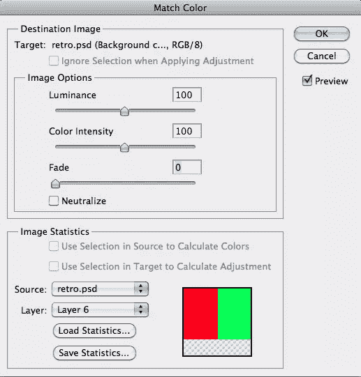](https://www.sitepoint.com/wp-content/uploads/2012/04/Screen-shot-2012-04-02-at-2.16.58-PM.png)

## 第四步:根据口味调整

这一步是主观的。你真的需要决定你想要的效果。我将淡入度和颜色强度都设置为 70。在这里，我已经得到了我的形象的 60 年代的外观和感觉。

[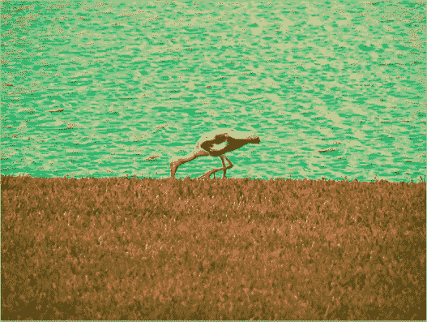](https://www.sitepoint.com/wp-content/uploads/2012/04/Screen-shot-2012-04-02-at-2.17.58-PM.png)

## 第五步:添加一个加热过滤器

这真的取决于你想要的样子。例如，我点击了新的调整层图标，并选择了照片过滤器。我选择了一个温暖的过滤器，并设置密度为 50。

[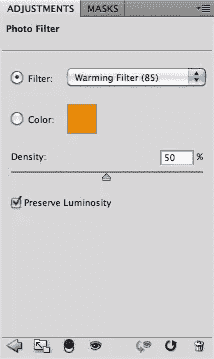](https://www.sitepoint.com/wp-content/uploads/2012/04/Screen-shot-2012-04-02-at-2.21.02-PM.png)

[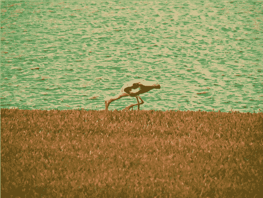](https://www.sitepoint.com/wp-content/uploads/2012/04/Screen-shot-2012-04-02-at-2.21.22-PM.png)

## 第六步:添加一个小插图

选择黑色作为你的前景色。进入“图层”>“新建填充图层”>“渐变”选择一个径向渐变，并确保渐变是前景透明。您可能需要选择反转选项来获得晕影。将刻度设置在 140-150 之间。设置不透明度为 30-40%,你将有一个复古的晕影外观。

这两种方法都可以给数码照片增加年龄和个性，这在复古设计项目中很有用。

## 断层摄影术

Lomography 具有独特的外观，似乎很受复古或复古风格摄影爱好者的欢迎。用 Photoshop 很容易得到这种效果。

## 第一步:选择你的图像，复制背景层

你可以从[这里](http://www.pixmac.com/picture/old+car/000059345145)下载样图。我选择了一辆老爷车，看起来效果不错。用你的图像，点击 command/ctrl+J 复制你的背景层。

[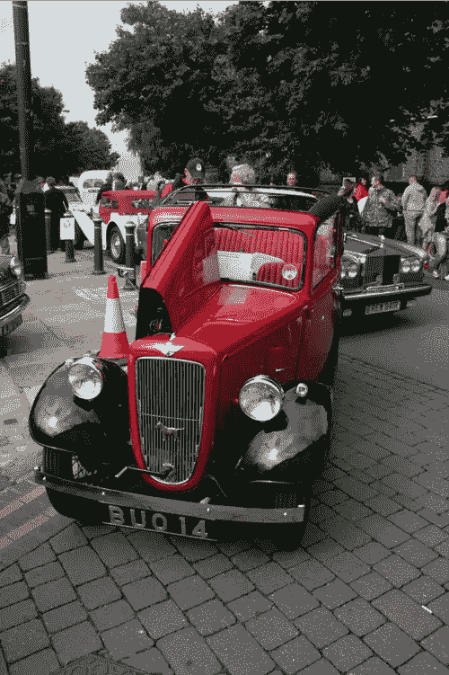](https://www.sitepoint.com/wp-content/uploads/2012/04/Picture-20.png)

## 第二步:降低曝光率

单击新的调整层图标，并选择曝光。你必须根据你的照片调整这个设置，但是我把曝光设置为-0.66。这将使你的图像变暗，起初看起来不太好，但我们正在整合更多的黑色和阴影，这对效果很好。

[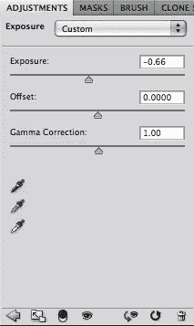](https://www.sitepoint.com/wp-content/uploads/2012/04/Picture-19.png)

## 第三步:添加一个小插图

Lomo 图像的边缘通常有一个晕影。转到滤镜>镜头校正，移动渐晕滑块到-80°或-90°之间。

[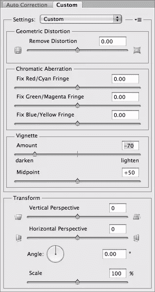](https://www.sitepoint.com/wp-content/uploads/2012/04/Picture-21.png)

## 步骤 4:添加一个通用曲线调整

单击新的调整层图标，并选择曲线。我们需要通过这种调整来丰富颜色，所以我们将使用如下所示的 S 曲线来突出和加深阴影:

## [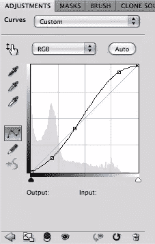](https://www.sitepoint.com/wp-content/uploads/2012/04/Picture-22.png)

## 步骤 5:添加一个更精确的曲线调整层

单击新的调整层图标，并再次选择曲线。这次我们要控制每个频道。选择红色和绿色通道，并制作一个类似于上一步的 s 曲线。不同的是，在蓝色通道上，你将向相反的方向弯曲。您将降低高光，增加阴影，如下例所示:

**红色**:

[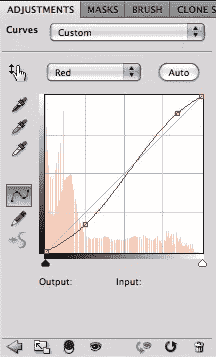](https://www.sitepoint.com/wp-content/uploads/2012/04/Picture-23.png)

**果岭**:

[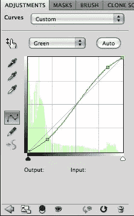](https://www.sitepoint.com/wp-content/uploads/2012/04/Picture-24.png)

蓝调:

[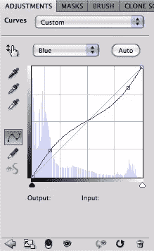](https://www.sitepoint.com/wp-content/uploads/2012/04/Picture-25.png)

[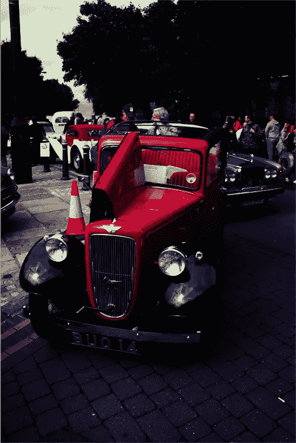](https://www.sitepoint.com/wp-content/uploads/2012/04/Picture-26.png)

## 第六步:调整你的水平

单击新的调整层图标，并选择级别。向左滑动中间的灰色滑块，调出一些太暗的区域。

## 步骤 7:用渐变贴图降低影响

单击新的调整层图标，并选择梯度地图。选择黑白渐变，让您的图像看起来更柔和。100%太柔和了，所以现在我们应该把不透明度降低到 50%或更低。

[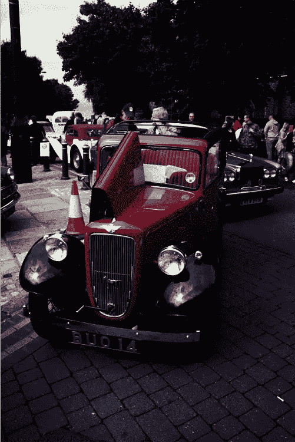](https://www.sitepoint.com/wp-content/uploads/2012/04/Picture-29.png)

## 第八步:增加一些饱和度

我们想要饱和的颜色，但是 Lomo 的一部分看起来有点偏色，比如夸张的蓝色或橙红色。创建一个新的饱和度调整层，增加饱和度，直到焦点颜色，如老爷车中的红色，真正流行起来。然后，对于色调，根据口味进行调整。我将这张图片的色调向右调整了 27。

## 第九步:添加少量的纹理

创建一个新层，按住 shift 并单击删除。会出现一个对话框询问你想用什么填充。选择 50%灰色，然后单击确定。然后转到滤镜>噪波>添加噪波。选择高斯和单色，并将数量设置为 20 左右，然后单击确定。这里的关键是微妙的，所以降低图层的不透明度到 20%左右。

[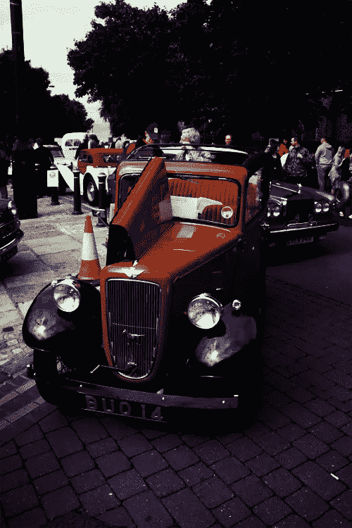](https://www.sitepoint.com/wp-content/uploads/2012/04/Picture-31.png)

## 分享这篇文章