# 用 Photoshop 创建可重复使用的 CSS 菜单

> 原文：<https://www.sitepoint.com/create-a-reusable-css-menu-with-photoshop/>

在网页设计和开发中，你会发现有许多不同的技术来满足给定的目标。有些很好，有些很棒，但只要你选择的方法效果好，看起来不错，就要放心使用。为了完成一个专业的、定制的网页设计，理解如何从头到尾构建导航菜单是很重要的。

除了网站的结构之外，网站的导航无疑是最重要的元素。每个网站访问者将使用它来找到他们正在寻找的东西。如果你的菜单不起作用或者不突出，访问者可能不知道去哪里或者做什么来找到他们需要的信息。

你网站的菜单系统应该反映你网站的风格:你可以选择更小、更微妙的尺寸和字体，或者你可以放大到大的空间和匹配的字体。在本教程中，我们将创建一个更微妙，更复杂的外观。

## 步骤 1:创建画布

若要开始，请打开 Photoshop 并使用 web 设置创建一个文档。使其成为站点内容区域的宽度。今天，大多数网站要么是 960 像素宽，要么是 1024 像素宽。高度并不重要——我们稍后将为我们的 CSS 菜单切片——但出于本教程的目的，我选择了 768 像素的高度。这样，菜单会更加突出。

## 步骤 2:设置菜单

在 Photoshop 中，在背景图层上新建一个图层。选择选框工具，在顶部的菜单栏中，您会发现选框工具的选项。我们要确保没有羽化，所以一定要设置为 0px，然后你会看到一个下拉菜单，上面写着“正常”点击那个菜单，在它下面你会看到其他选项，比如“固定比例”和“固定大小”选择固定大小，你会发现你可以输入你想要的选框工具的精确宽度和高度。

[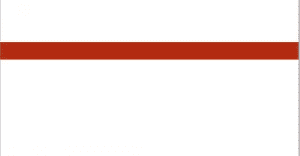](https://www.sitepoint.com/wp-content/uploads/2012/02/Picture-31.png)

将菜单高度设置为 40px，宽度设置为 1024px，这是我们文档的全宽。一些额外的空间实际上并不重要；我们只是用它们作为视觉参考。这有助于直观地看到整个菜单。

## 第三步:选择颜色

使用选框工具，在屏幕上要放置菜单的位置单击光标。您将在屏幕上看到一个活动的选择，所以现在您需要双击工具面板中的前景色，然后选择您想要的任何颜色。一旦你选择了你想要使用的颜色，Photoshop 会给你该颜色的十六进制值(六位数)，你可以在你的 CSS 中使用。使用 Photoshop 并且能够直观地选择你的颜色将会使你的菜单(以及任何你模仿的东西)看起来更好，更有凝聚力。写下您最终在模型中使用的不同颜色的十六进制值是一个好主意，以便您可以在以后使用它们。

[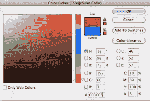](https://www.sitepoint.com/wp-content/uploads/2012/02/Screen-shot-2012-02-12-at-4.07.27-PM.png)

我选的颜色:#C03C03，是浓郁的红色。在你创建的图层上，选择后，按 alt 或 option 键 delete 键，用前景色填充你的选择。这是一种单调的颜色，但是我们要改变它。

## 步骤 4:为你的菜单创建高亮

创建一个新层，用选框工具，创建一个较短的宽度(大约 100 像素)，保持高度设置为 40 像素。直接点击菜单顶部，一个选项将被激活。选择白色作为前景色，并选择渐变工具。在渐变选项中，选择前景透明选项，并绘制渐变，按住 shift 键，以确保它是直的。从菜单顶部开始，直接向下拖动。这将为您的正常导航菜单创建一个突出显示。现在，隐藏我们刚刚创建的高光渐变层。

[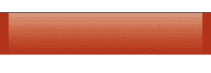](https://www.sitepoint.com/wp-content/uploads/2012/02/Picture-4.png)

## 步骤 5:创建黑暗悬停状态

创建一个新层，改变你的前景色为黑色。进行与白色渐变相同的选择。选择渐变工具，再次选择前景色到透明的选项，点击菜单底部并向上拖动，创建一个黑色渐变。有了这两层，你可以调整不透明度的味道。

[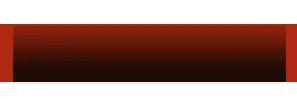](https://www.sitepoint.com/wp-content/uploads/2012/02/Picture-5.png)

## 第六步:分割你的图像

现在我们已经有了高光和阴影，我们可以开始切片和编码设计了。如果您在选框工具上单击并按住鼠标，您会注意到有单行和单列选框工具。出于我们的目的，选择单列选框工具，它为文档的整个高度选择 1 个像素的垂直区域。

[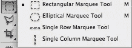](https://www.sitepoint.com/wp-content/uploads/2012/02/Picture-6.png)

[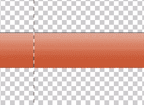](https://www.sitepoint.com/wp-content/uploads/2012/02/Screen-shot-2012-02-12-at-10.52.21-PM.png)

## 步骤 7:保存你的高光图像

按住 option 或 alt 键并单击白色渐变图层的眼睛图标，隐藏除白色渐变图层之外的所有其他图层。现在，单击菜单上的任意位置，为透明渐变创建一个 1px 的垂直选区。点击命令或 ctrl 键+ "C "来复制您的选择。

[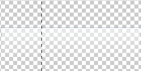](https://www.sitepoint.com/wp-content/uploads/2012/02/Screen-shot-2012-02-12-at-10.54.33-PM.png)

为了使事情变得简单，创建一个新文档，Photoshop 会自动创建一个你选择的尺寸，宽 1px 高 40px。点按“好”，连按背景层以解锁它，并按下 command 或 control+“A”以选择所有内容。然后，点击删除键删除白色背景颜色。

[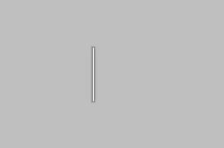](https://www.sitepoint.com/wp-content/uploads/2012/02/Screen-shot-2012-02-12-at-10.57.38-PM.png)

[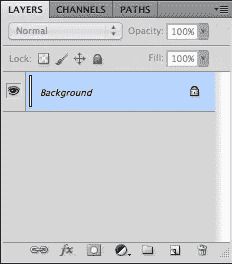](https://www.sitepoint.com/wp-content/uploads/2012/02/Screen-shot-2012-02-12-at-10.57.45-PM.png)

然后，按 command 或 control + "V "将白色渐变粘贴到新文档中。选取“文件”>“存储为 Web 和设备所用”,然后在设置中选取“png-24”。这是正确的选择，因为它考虑到了透明度。我将该文件命名为“highlight.png ”,并将其保存在另一个名为“images”的文件夹中的项目文件夹中关闭文档而不保存，因为您不再需要此文档。

[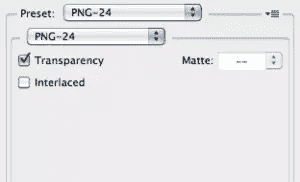](https://www.sitepoint.com/wp-content/uploads/2012/02/Screen-shot-2012-02-12-at-11.12.26-PM.png)

## 步骤 8:保存你的影子文件

回到你的原始文件，隐藏高亮层，使黑色渐变层可见。重复上面的步骤，创建一个黑色透明渐变的新文档。我把它保存为“shadow.png”。我们现在已经完成了 Photoshop。

[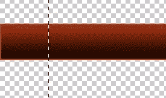](https://www.sitepoint.com/wp-content/uploads/2012/02/Screen-shot-2012-02-12-at-11.14.04-PM.png)

[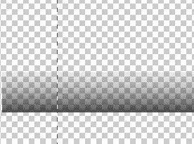](https://www.sitepoint.com/wp-content/uploads/2012/02/Screen-shot-2012-02-12-at-11.14.23-PM.png)

[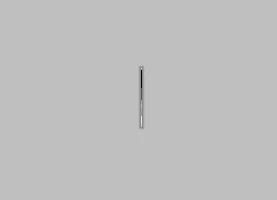](https://www.sitepoint.com/wp-content/uploads/2012/02/Screen-shot-2012-02-12-at-11.15.51-PM.png)

## 步骤 9:创建 HTML

对于我们的 HTML，我为我们的下拉菜单创建了一个无序列表。你可以有尽可能多的下拉项目，但我尽量保持不超过 7 个。如果我需要更多的选择，我会将一些项目进一步分类。整个菜单系统有一个 CSS 类“menu”请记住，如果你的菜单在一个容器内，它需要和容器一样宽。

```
<!DOCTYPE html PUBLIC "-//W3C//DTD XHTML 1.0 Strict//EN"
"https://www.w3.org/TR/xhtml1/DTD/xhtml1-strict.dtd">
<html  xml:lang="en" lang="en">
<head>
<meta http-equiv="content-type" content="text/html; charset=utf-8" />
<title></title>
<link rel="stylesheet" href="menu_style.css" type="text/css" />
</head>
<body>
<br>
<br>
<div class="menu">
<ul>
<li><a href="#" >Home</a></li>
<li><a href="#" id="current">About</a>
<ul>
<li><a href="#">Process</a></li>
<li><a href="#">Experience</a></li>
<li><a href="#">Philosophy</a></li>
</ul>
</li>
<li><a href="/faq.php">Work</a>
<ul>
<li><a href="#">Web Design</a></li>
<li><a href="#">Print</a></li>
<li><a href="#">Illustration</a></li>
<li><a href="#">Wordpress</a></li>
</ul>
</li>
<li><a href="/contact/contact.php">Contact</a></li>
</ul>
</div>

</body>
</html>
```

## 第十步:让它变得时尚

对于 CSS，我们将创建我们的菜单，没有填充，没有边框，没有空白。这可能会因你的项目而改变，取决于你如何设置你的网站，但这就是我们为我们的目的设置 CSS 的方式。本教程的主要重点是建立一个基本框架，您可以根据需要进行修改。选择你的字体和字体大小，我设置为 14。

```
.menu{
padding:0px;
font-family: Verdana, Helvetica, sans-serif;
font-size:14px;
font-weight:bold;
border:none;
border:0px;
margin:0px;
}
```

## 步骤 11:基本代码

接下来，我们将对无序列表进行样式化。请记住，如果您没有在这里指定宽度，那么菜单将运行容器的整个宽度。如果你的菜单不在一个容器中，那么它将在浏览器的整个宽度上运行。之前，我们将高光和阴影透明 PNG 文件的高度设置为 40px。我们需要在这里做同样的事情，以便一切都匹配。将边距和填充设置为 0px。

对于背景，这是你创建无缝渐变的方法:为你的菜单选择一种背景颜色。我选了#C03，是红色的。调用一个背景 URL，选择你的“highlight.png”文件并设置它在 x 轴上重复。这将把你的 40px 高的背景图像在 div 中水平重复。我们得到了一个漂亮的粉红色，但如果这对于你的口味来说太强烈，你可以编辑你的。png 文件并降低其不透明度。你会注意到它改变了菜单背景，但是按钮本身没有改变。我们将很快修复该问题。

```
.menu ul{
background:#C03 url("images/highlight.png") repeat-x;
height:40px;
list-style:none;
margin:0;
padding:0;
}
```

再次选择菜单类，但这次选择您的列表项。将填充设置为 0px，并将列表项(按钮)设置为向左浮动。如果您的站点要求它们在右边，那么将 float 属性设置为右边。

```
.menu li{
float:left;
padding:0px;
}
```

## 步骤 12:设计你的活动链接

我们要设计的下一个属性是活动选项。它接受任何带有“menu”类和活动链接的列表项，并以某种方式对其进行样式化。在这里，设置你的背景属性就像你的菜单一样，这样你的按钮看起来都一样。需要注意的一点是，你需要将行高设置为 40px，以便和菜单一样高。将文本居中对齐，这将有助于主菜单看起来间距均匀。将文本装饰设置为“无”,这样默认情况下链接没有下划线。我将文本颜色设置为#000 黑色，这样它就可以和浅色菜单形成对比。

```
.menu li a{
background:#C03 url("images/highlight.png") repeat-x;
color:#000;
text-shadow: 0px 0px 4px #E5E5E5;
display:block;
font-weight:normal;
line-height:40px;
margin:0px;
padding:0px 25px;
text-align:center;
text-decoration:none;
}
```

## 步骤 13:突出悬停状态

接下来，我们需要对列表项和无序列表菜单项的活动悬停状态进行样式化。如果你认为你的菜单是一组按钮，这个样式将决定每个按钮的悬停状态。在这里，我选择#900 作为悬停状态的颜色，我们还将使用我们的“shadow.png”文件给它一些深度。就像“highlight.png”文件一样，我们将在 x 轴上重复该文件，水平复制它。将文本设置为白色，与我们刚刚选择的深色形成对比，并将文本装饰设置为无。

```
.menu li a:hover, .menu ul li:hover a{
background: #900 url("images/shadow.png") repeat-x;
color:#FFFFFF;
text-decoration:none;
}
```

## 步骤 14:设计你的子菜单

下一组选项允许您设置下拉菜单项的样式。我们将选择列表项下的无序列表项(把它们看作是我们的一级子菜单),并对它们的正常显示进行样式化。将背景颜色设置为#C03，这与我们之前选择的颜色相同。将边框、边距和填充设置为 0px，定位设置为 absolute，并确保在此定义宽度。一般来说，225px 对于大多数单词来说应该足够了，但是您可能需要根据自己的目的进行调整。

```
.menu li ul{
background:#C03;
display:none;
height:auto;
padding:0px;
margin:0px;
border:0px;
position:absolute;
width:225px;
z-index:200;
}
```

## 步骤 15:匹配悬停风格

对于菜单列表项下无序列表的悬停状态，您需要将显示设置为 block。这是这个选择器唯一需要的属性，但是没有它，您的下拉项目将不会显示。您将只能看到菜单的第一层。

```
.menu li:hover ul{
display:block;
}
```

接下来，我们将对列表项(实际可见的下拉菜单)下的列表项进行样式化。将背景 URL 设置为“highlight.png”文件，并沿 x 轴重复。再次将边距和填充设置为 0px，宽度设置为 225px，或者您在设计中喜欢的宽度。将浮动设置为无，显示设置为阻止。一般来说，确保我们将要设计的任何元素的显示都设置为 block。

```
.menu li li {
background:url("images/highlight.png") repeat-x;
display:block;
float:none;
margin:0px;
padding:0px;
width:225px;
}
```

## 步骤 17:让你的子菜单出现

接下来，我们将选择菜单列表项的活动列表项悬停状态。我们必须将背景设置为 none，否则当鼠标经过每个菜单项时，您将看不到悬停状态。

```
.menu li:hover li a{
background:none;
}
```

选择主列表项下的活动无序列表。将高度设置为 40px，边距设置为 0px，填充设置为 15px，因为我们要将文本设置为向左对齐，我们不希望文本接触到菜单的左边缘。给任何文本元素从其容器边缘留出一点空间总是好的，这样它们可以容易地阅读。

```
.menu li ul a{
display:block;
height:40px;
font-size:12px;
font-style:normal;
margin:0px;
padding:0px 10px 0px 15px;
text-align:left;
}
```

## 步骤 18:子菜单悬停状态

现在，我们想设计你的子菜单的悬停状态。设置边框为 0px，文字为白色以获得良好的对比度，选择较暗的#900 作为背景色。请务必使用您的“shadow.png”图像，并沿 x 轴重复它。

```
.menu li ul a:hover, .menu li ul li:hover a{
background:#900 url("images/shadow.png") repeat-x;
border:0px;
color:#ffffff;
text-decoration:none;
}
```

下面是你应该得到的结果:
[](https://www.sitepoint.com/wp-content/uploads/2012/02/Picture-9.png)

所以，现在你已经完成了菜单的设计，你可能想知道为什么这个过程如此重要。这种可延展的菜单系统的伟大之处在于，您可以对其进行定制，以便在未来的所有项目中使用，而不必从头开始。您可以进行微小的颜色更改，而不必重新编写整个代码，并且您可以通过编辑几行代码进行更广泛的更改:在使用 CSS 的地方添加一个小边框，编辑。png 文件来修改渐变，添加文本效果，比如我添加的文本阴影等等。对于任何 CSS 菜单来说，这都是一个简单、灵活的框架，它可以节省时间和精力，否则这些时间和精力会被浪费在从头开始设计不必要的、多余的菜单上。

## 分享这篇文章