# 在 Illustrator 中创建清晰、时尚的相机图标

> 原文：<https://www.sitepoint.com/create-a-sharp-stylish-camera-icon-in-illustrator/>

移动设备已经变得非常流行，所以网页设计师——就像软件开发人员一样——正专注于向移动应用的过渡。移动应用的普及带来了激烈的竞争，任何有助于你的应用脱颖而出的机会都值得追求。一个时尚、醒目的应用程序图标是帮助你的应用程序在应用商店和设备上大放异彩的一个显而易见的方法。有吸引力的应用程序图标可以巧妙地增加购买量、下载量和活跃的用户群。

在本教程中，我将向你展示如何在 Illustrator 中创建一个吸引人的相机图标。我们将使用各种形状工具、渐变工具和效果菜单中的不同选项来实现最终的效果。我希望你会学到一些有用的技巧。所以，让我们开始吧！

**最终结果:([下载完成的 Illustrator 文件](https://www.sitepoint.com/wp-content/uploads/2013/04/Camera-Icon.zip)。)** 

[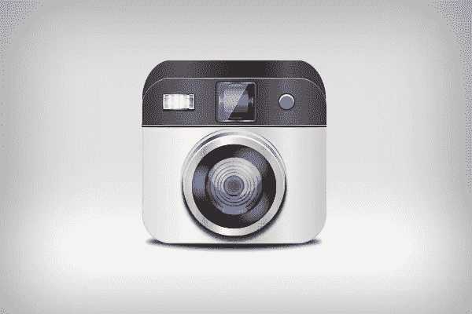](https://www.sitepoint.com/wp-content/uploads/2013/04/final-result2.jpg)

### 第一步

在 Illustrator 中创建新文档，宽度为 500 像素，高度为 400 像素。

### 第二步

选择圆角矩形工具并点击画布。在选项窗口中输入 30px 值作为拐角半径，以绘制如下所示的矩形。现在你可以使用任何填充颜色。将笔划设定为“无”。

[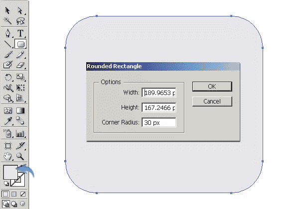](https://www.sitepoint.com/wp-content/uploads/2013/04/22.jpg)

### 第三步

使用矩形工具将前面的矩形分成两部分，绘制一个细矩形。之后，选择两个矩形，点击相应层右侧的环形目标，进入“窗口”>“路径查找器”(Shift + Ctrl + F9)，选择“负前”形状模式。保持组被选中，然后进入“对象”>“扩展”来完全分割它们。

[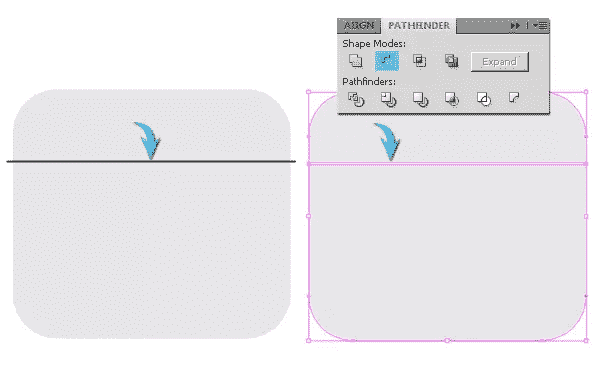](https://www.sitepoint.com/wp-content/uploads/2013/04/31.jpg)

### 第四步

现在，选择下面的部分，使用渐变工具(G)应用下面的渐变。

[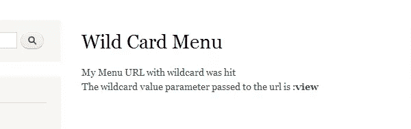](https://www.sitepoint.com/wp-content/uploads/2013/04/4.jpg)

复制这一层，稍微增加它的大小，使一个中风，并适用以下梯度给它。

[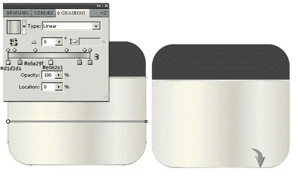](https://www.sitepoint.com/wp-content/uploads/2013/04/4b.jpg)

### 第五步

现在选择顶部，应用下面的渐变效果。

要在它周围画一个闪亮的线条，复制它，增加它的尺寸一点，应用和下面部分一样的渐变。现在，画一个薄的黑色矩形下面的其余层，以覆盖相机部分之间的差距。

[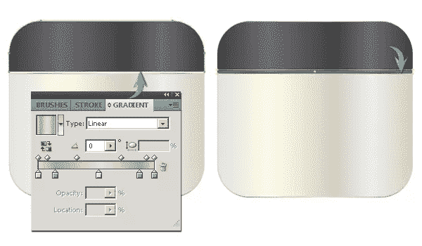](https://www.sitepoint.com/wp-content/uploads/2013/04/5b.jpg)

### 第六步

为了给你的图标一个 3D 的外观，复制最上面的图层，把它放在其余图层的下面，用选区工具(V)增加它的大小。应用下面的梯度到它。

[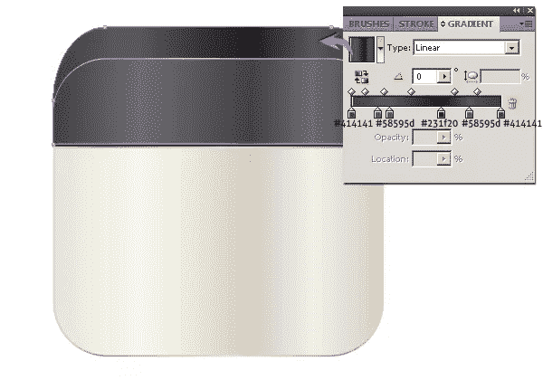](https://www.sitepoint.com/wp-content/uploads/2013/04/61.jpg)

### 第七步

接下来，我们将制作相机镜头。使用椭圆工具画一个椭圆，并应用“银色”渐变。你可以通过进入“窗口”>“样本库”>“渐变”>“金属”并从选项中选择“银色”来找到这个渐变。

[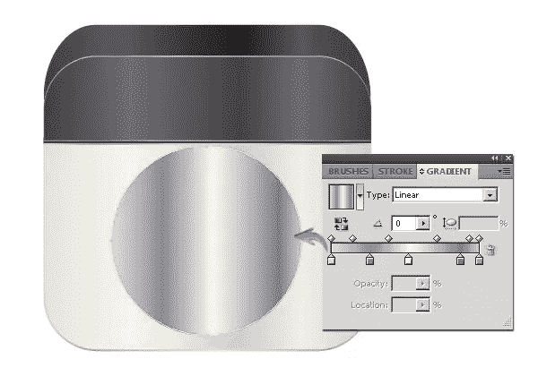](https://www.sitepoint.com/wp-content/uploads/2013/04/7.jpg) 
再画一个比上一个小一点的椭圆。使用#efe8df 作为你的填充颜色，设置笔触为无。

[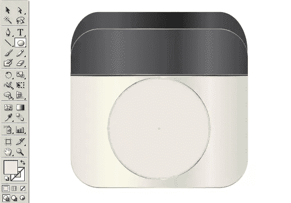](https://www.sitepoint.com/wp-content/uploads/2013/04/7b.jpg)

### 第八步

要制作镜头阴影，画一个深灰色的椭圆，如下图所示，按照路径“效果”>“模糊”>“高斯模糊”，应用 2.8 像素的高斯模糊效果复制这个椭圆，向下拖动 2-3 步，在透明度面板中将其不透明度降低到 75%(Shift+Ctrl+F10)。

[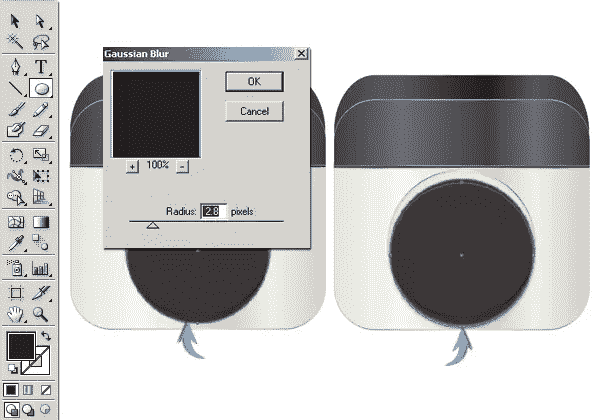](https://www.sitepoint.com/wp-content/uploads/2013/04/8.jpg)

### 第九步

现在，我们将画三个互相重叠的椭圆。画第一个椭圆，应用“钢”渐变，你可以在默认的金属渐变中找到。复制它，改变其填充颜色为白色，并将其向下拖动 3-4 步。复制这个椭圆，在上面应用一个“中性 14”渐变，你可以在默认的中性渐变中找到，然后把它向下拖 1-2 步。

[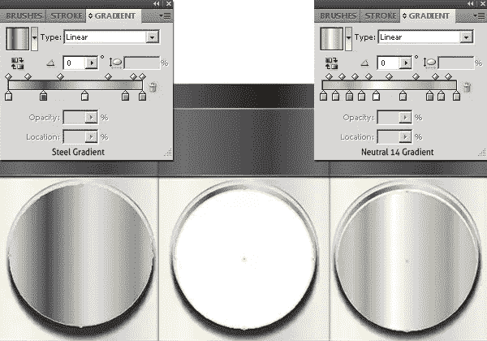](https://www.sitepoint.com/wp-content/uploads/2013/04/9.jpg)

### 第十步

在其余的上面画一个小一点的椭圆，选择它，应用下面的设置来获得一个内发光(“效果”>“风格化”>“内发光”)。

[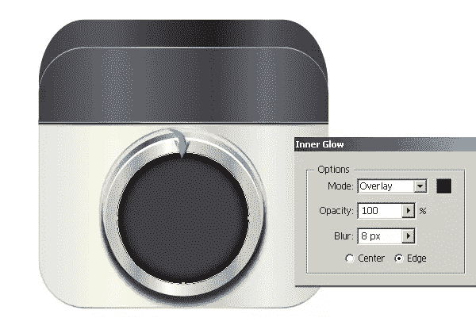](https://www.sitepoint.com/wp-content/uploads/2013/04/10.jpg)

### 步骤 11

下一步，在上一个圆圈内画一个圆，设置其填充颜色为无，并选择一个 1 磅的黑色描边。

[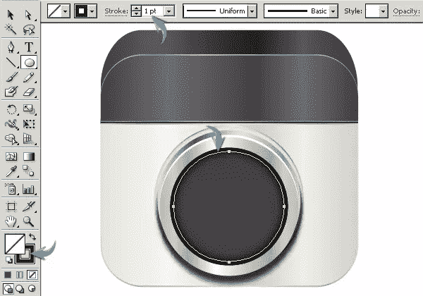](https://www.sitepoint.com/wp-content/uploads/2013/04/11.jpg)

选择笔画层，进入“效果”>“扭曲和变换”>“变换”在这里应用以下设置来制作几个环。

### 步骤 12

要制作一个光晕，画一个如下图所示的白色椭圆，应用 20px 高斯模糊效果。之后，将其不透明度降低到 40%。复制辉光点，并将其放置在离原件一定距离的位置。

### 第十三步

现在，在其余的图层上画一个圆，应用“分割互补 1”渐变，并添加一个灰色 1 磅的笔画。你可以在默认的颜色调和中找到这种渐变。之后，选择这个椭圆，应用步骤 10 中相同的内发光效果。

[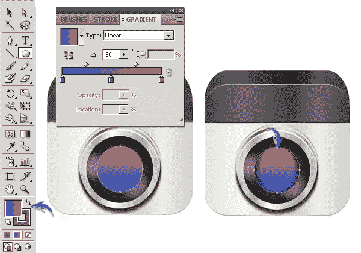](https://www.sitepoint.com/wp-content/uploads/2013/04/13.jpg)

复制这个椭圆，并在外观面板中隐藏内部发光效果(Shift + F6)。现在，选择它，双击渐变工具打开渐变窗口，改变角度从 90 度到 0 度。之后，改变这一层的混合模式为“颜色减淡”，降低其不透明度为 50%。

[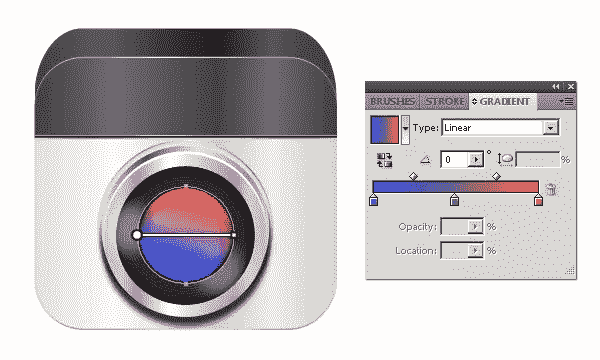](https://www.sitepoint.com/wp-content/uploads/2013/04/13b.jpg)

### 步骤 14

现在，在着色区域画一个椭圆，设置它的填充颜色为无，并添加一个 0.5 磅的黑色笔画。选择它，并应用以下变换设置，以获得更多的戒指。之后，将其不透明度降低到 60%。

[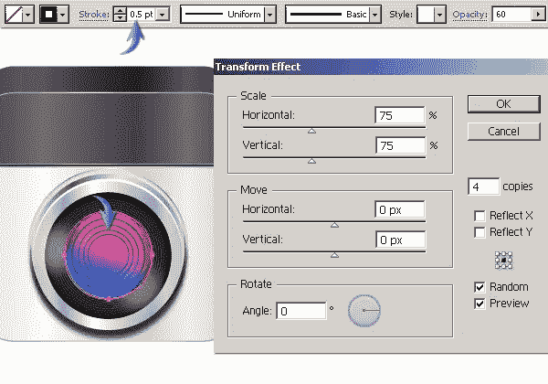](https://www.sitepoint.com/wp-content/uploads/2013/04/14.jpg)

### 第十五步

制作几个不同灰度的椭圆来填充镜头的中心部分。我复制了发光层，并把它放在顶部。

[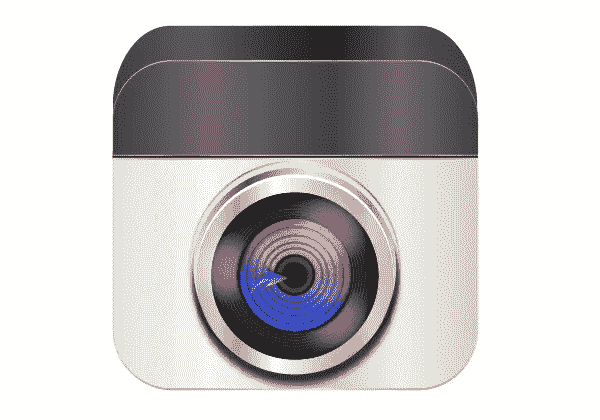](https://www.sitepoint.com/wp-content/uploads/2013/04/15.jpg)

### 第十六步

接下来，我们将在镜头上创建一些高光。使用铅笔或钢笔工具绘制一些形状(如下所示)。同样，在这些高光之间用黑色做一个不规则的形状。选择他们，并收集到一个新的层。现在，应用 2-3px 高斯模糊效果。要将高光限制在镜头内，画一个圆，并将其填充和描边设置为无。选择高光和这个新的椭圆层，进入“对象”>“剪贴蒙版”>“制作”之后，将其混合模式改为“强光”，不透明度降低到 40%。

[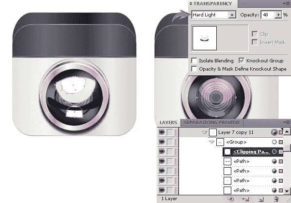](https://www.sitepoint.com/wp-content/uploads/2013/04/16.jpg)

### 步骤 17

要制作相机按钮，画三个不同大小的椭圆(如下所示),将它们放在一起制作按钮。要创建一个亮点，复制两次浅蓝色椭圆，并将它们的颜色改为白色。向下拖动一个白色椭圆 1-2 步。现在，选择白色的椭圆，点击路径面板中的“负前”来创建一个半月形。减少这个新月形状的不透明度为 40%。

[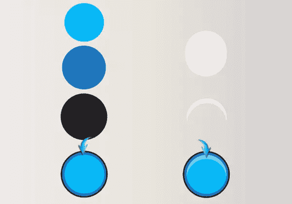](https://www.sitepoint.com/wp-content/uploads/2013/04/17.jpg)

使用我们为镜头使用的相同技术为按钮制作阴影。

[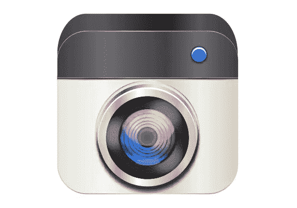](https://www.sitepoint.com/wp-content/uploads/2013/04/17b.jpg)

### 步骤 18

要制作取景器，画几个矩形并把它们放在一起，如下图所示。用 1 磅的黑色笔触在背景矩形上应用“中性 15”渐变。

[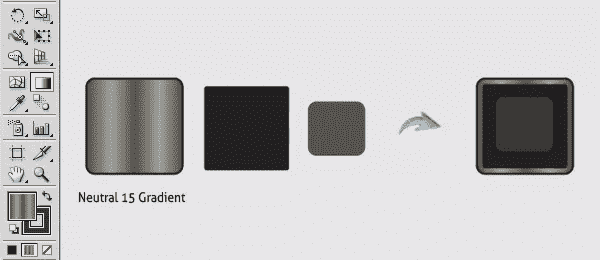](https://www.sitepoint.com/wp-content/uploads/2013/04/18.jpg)

### 步骤 19

现在，画一个圆如下所示，并适用于“银”梯度。将其混合模式改为“颜色减淡”，不透明度降低到 40%。使用钢笔工具制作高光，不透明度降低到 40%。

[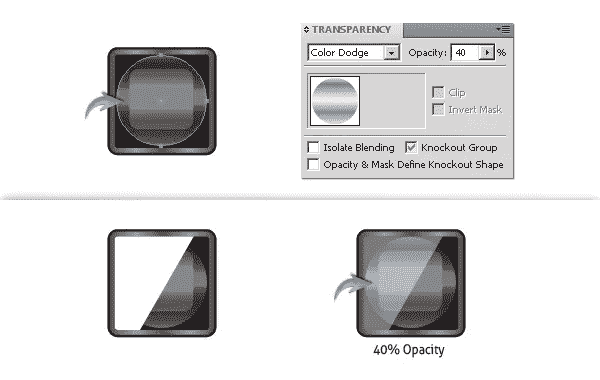](https://www.sitepoint.com/wp-content/uploads/2013/04/19.jpg)

[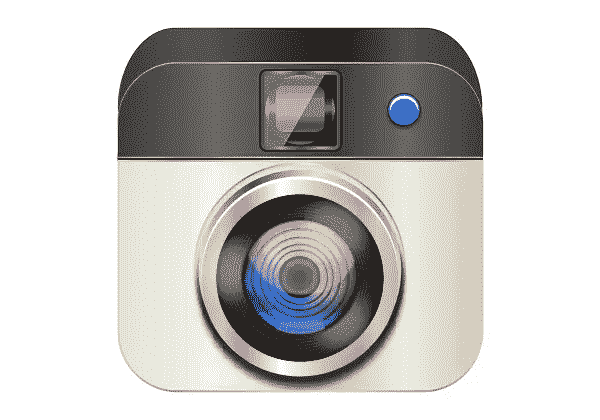](https://www.sitepoint.com/wp-content/uploads/2013/04/19b.jpg)

### 步骤 20

要制作闪光灯泡，画一个矩形并应用“铬”渐变。改变其混合模式为“强光”，设置不透明度为 60%。复制它，并改变其梯度为“绿玉髓”，你可以找到“窗口”>“样本库”>“梯度”>“宝石和珠宝。”改变其混合模式为“屏幕”，设置不透明度为 75%。现在，在矩形内用天蓝色填充一个拉长的椭圆，并应用 8px 高斯模糊效果。改变其混合模式为“屏幕”最后，使用我们为按钮使用的相同技术制作它的阴影。

[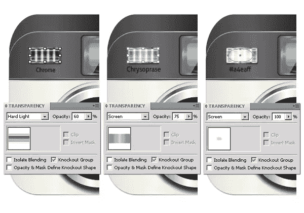](https://www.sitepoint.com/wp-content/uploads/2013/04/20.jpg)

### 步骤 21

现在，我们将制作图标的阴影。在其余图层下面画一个黑色填充的椭圆。选择它，并应用 8px 高斯模糊效果。

[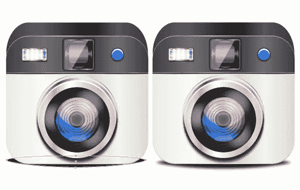](https://www.sitepoint.com/wp-content/uploads/2013/04/211.jpg)

就这样，伙计们。我希望你喜欢这个教程，并学到一些有用的东西。让我知道你的想法。

## 分享这篇文章