# 用 Path 创建一个简单、私密、有管理的社交网络

> 原文：<https://www.sitepoint.com/create-a-simple-private-curated-social-network-with-path/>

脸书。推特。LinkedIn。Google+。这些只是现在已经成为我们日常网络生活一部分的一些社交网络服务。但即使有了这些服务，你的好友和爱人的更新也很容易在混乱中丢失。如果你在多个网络中有数百个联系人，这一点尤其正确。信噪比往往太低，让你无法在网上与真正关心的人保持联系。

[Path](https://path.com/ "Path")——一款[“智能”期刊](https://service.path.com/customer/portal/articles/257551-why-is-path-a-%22smart%22-journal-)应用——旨在改变这种情况。Path 允许您分享您的生活(音乐、照片、视频、位置等)。)与您的亲密朋友和爱人在一个简单的社交网络中与您的移动设备联系。我知道你在想什么……这听起来不像脸书或推特或其他社交网络应用吗？理论上是这样的，但是 Path 有一些有趣的怪癖，这绝对让它与众不同。这里有一个简短的视频，说明了这款应用程序的一些功能和用途。

* * *

<iframe width="640" height="360">
 
 <h3>首轮放映</h3> 
当你第一次使用该应用程序时，你会看到一个示例主屏幕，以时间线格式显示几个更新。您可以滚动浏览该屏幕，并与任何照片或视频进行互动。当你滚动时，注意每篇文章出现的日期和时间戳箭头。Path 在整个应用程序中包含了许多类似这样的风格，以保持您对时间线的关注。点击<strong>继续</strong>按钮，您可以选择创建新路径或登录服务。
 
 
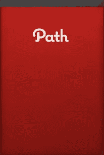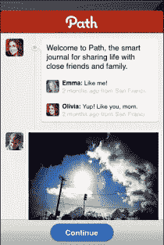
 
 
创建新路径很容易。输入你的名字，选择你的封面照片和个人资料照片。您可以从设备中载入这两个项目的照片，或者使用设备的相机拍摄自己的照片。对于你的封面照片，你也可以从摄影师约翰·凯瑞的 40 多张预装照片中选择；只需按下圆形箭头按钮即可随意浏览照片。当你添加了你的封面和个人资料照片后，你需要填写一个简短的表格，包括你的电子邮件地址、密码、电话号码、生日和性别。如果你想节省一些时间，你可以从你的地址簿中载入大部分信息。
 
注册后，您将被带到主屏幕，这是您自己的第一步。
 
 
  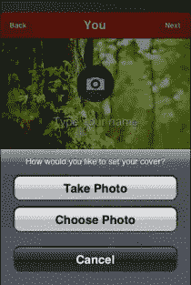 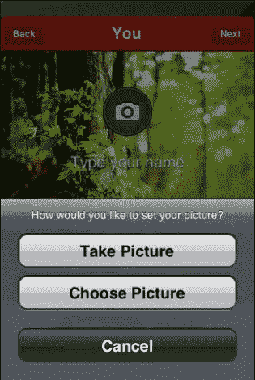 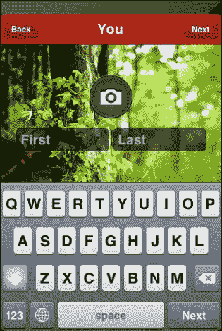
 
 <h3>主屏幕</h3> 
现在是时候在你的道路上添加一些朋友了。点击<strong>添加好友</strong>按钮，你将被带到<strong>添加好友</strong>屏幕。您可以从设备的地址簿、脸书或通过电子邮件或短信邀请朋友加入您的旅程。该应用程序还会为您加载一些推荐的朋友(大概是基于您的地址簿或您的姓名)。
 
这就是 Path 与其他社交网络服务的不同之处。你的路径仅限于<strong> 150 个好友</strong>。根据 Path 的说法，这种限制使 Path 成为一个安全、私密、不受评判的空间，在这里你可以做你自己。150 个朋友的限制是基于<a href="https://www.youtube.com/watch?v=ppLFce5uZ3I" target="_blank" rel="noopener">邓巴的号码</a>，这个概念来自牛津大学教授罗宾·邓巴。
 
 
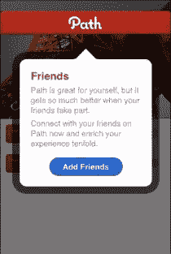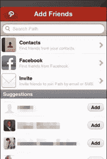
 
 
应用左下角的加号按钮叫做<strong>选择器</strong>。点击选择器会弹出四分之一圈的六个图标，代表你可以在你的路径上发表的文章类型。
 <h3>发布到您的路径</h3> 
您可以从选取器中执行六个操作:拍摄照片或视频、与朋友一起创建帖子、创建带有位置签到的帖子、创建带有歌曲的帖子、创建常规文本帖子，以及让您的朋友知道您何时睡着或醒着。
 <h4>照片/视频帖子</h4> 
 
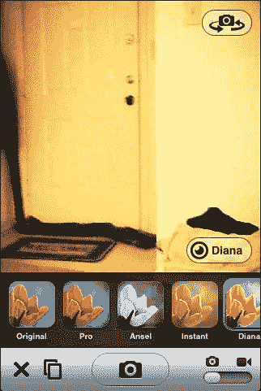
 
 
照片和视频可以通过应用程序捕捉，并直接发布到您的路径上。还有许多类似 Instagram 的滤镜，称为<em>镜头</em>，你可以将它们应用到你的照片和视频中(原始、专业、安塞尔、即时、戴安娜、Lomo、乡村和湖泊)。还有四个额外的优质镜头可以通过应用程序购买(Loko，Old Time，Grid，8 位)，价格为 0.99 美元。
 <h4>人物邮报</h4> 
 
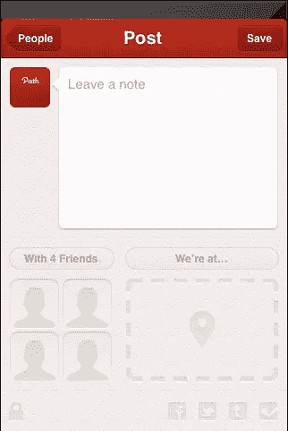
 
 
因为路径是围绕你的朋友建立的，所以任何多媒体帖子都可以用你朋友列表中的成员来标记。你也可以给这些帖子添加一个位置，然后把帖子发到脸书、Twitter、Tumblr 或 Foursquare 上。按下锁图标会将帖子限制在您的路径上，您的任何朋友都无法看到它或对它发表评论。
 <h4>地方邮报</h4> 
 
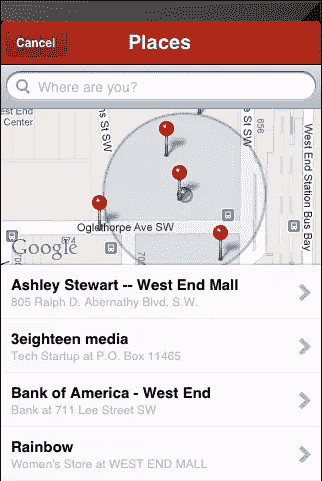
 
 
Path 使用 Foursquare 的 API 来预测哪些地方离你比较近。你也可以给你的好友列表添加标签，写评论，然后把帖子发到脸书、Twitter、Tumblr 或 Foursquare 上。您也可以通过按下锁图标将帖子设为私有。当帖子出现在你的路径上时，点击企业名称会显示该企业的谷歌地图位置及其电话号码和地址。
 <h4>音乐邮报</h4> 
 
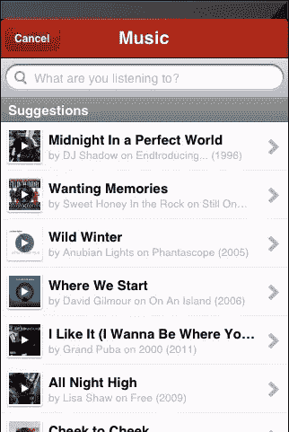
 
 
想分享一首困在你脑子里的歌？Path 允许你根据艺术家或歌曲名称进行搜索，并在帖子中添加 30 秒的片段。像“地点和人物”帖子一样，你可以标记你的朋友，添加一个地点，将帖子发布到脸书、Twitter、Tumblr 或 Foursquare，并使帖子成为你的私人路径。在你的路径上点击一个音乐帖子，会弹出一个带有专辑封面的模式框和一个从 iTunes 购买整首歌的链接。
 <h4>思想帖</h4> 
 

 
 
思想帖是 Path 中最简单的发布选项。只需从选择器中点击思想泡泡图标，然后开始输入。思想帖子与前面提到的帖子类型具有相同的共享、标记和隐私选项。
 <h4>睡觉/醒着</h4> 
 
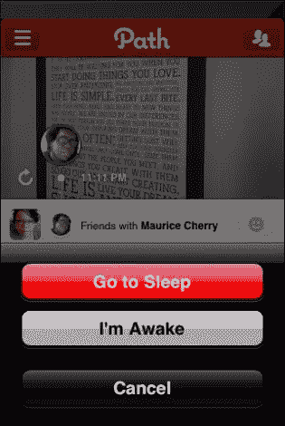 
 
 
睡眠/唤醒功能可让您在醒着和睡着时提醒您路上的朋友。当您准备睡觉时，轻按选取器并轻按新月图标。屏幕将从黄昏变暗，一轮月亮将会升起。当你醒着的时候，点击<strong>唤醒</strong>按钮，然后……嗯，你醒了。除此之外，该功能没有太多其他功能。
 <h3>设置</h3> 
 
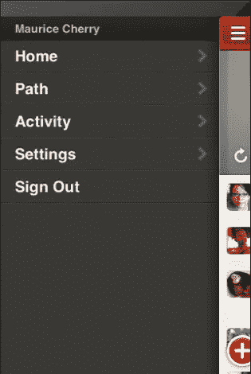 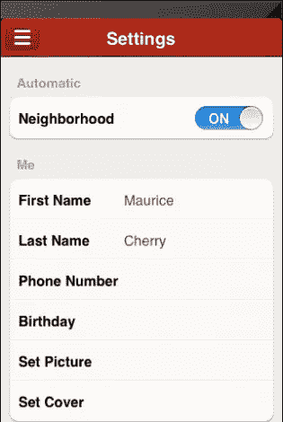
 
 
在主屏幕上，您可以通过点击左上方的三线图标来进行设置。您可以访问您的个人路径，查看您朋友在路径上的活动，从路径注销，以及访问您的设置。您可以将应用程序设置为在您更改位置时发布到您的路径，并且可以更新您的个人资料信息、更改您的路径封面和图片以及更改您的通知。
 <h3>缺点</h3> 
我发现这个应用程序只有两个缺点，而且都很小。第一个缺点是音乐发布功能——该应用程序没有让我选择存储在我设备上的歌曲。它只是随机抽取歌曲，我不确定这些歌曲来自哪里(大概是 iTunes)。然而，我寻找的大多数歌曲都可以很容易地从应用程序上的音乐帖子页面中找到。
 
我能找到的第二个应用程序的缺点是睡眠/唤醒功能。也许 Path 会为这类信息找到一些外部用途，比如与 Fitbit 或 Jawbone 集成。目前，睡眠/唤醒功能唯一能做的就是告诉你的朋友你不规律的睡眠时间表。或者可能只是我！
 <h3>结论</h3> 
Path 是一种设计良好且有用的方式，可以与一群亲密的朋友和爱人保持联系。因为整个社交网络都与你的移动设备相连，这是一个令人耳目一新的变化，不同于脸书和类似服务的正常无序的嘈杂领域。能够与你的朋友分享和交谈，而不被试图向你推销产品的人和品牌所淹没，这很棒。我很想知道 Path 将来会有什么新功能。
 
 

 
Path 在 iOS App Store 上是免费的，需要 iOS v4.3 或更高版本才能运行。从下面的 App Store 链接或使用右边的 App Store 按钮下载应用程序。
 
<a title="Path - Path, Inc." href="https://itunes.apple.com/us/app/path/id403639508?mt=8&amp;ign-mpt=uo%3D4" target="_blank" rel="noopener">下载路径</a>
 
<aside class="flex space-x-4"><h2 class="text-lg my-2 mr-2">分享这篇文章</h2><button aria-label="Share Sitepoint on facebook" data-network="facebook" class="social-share-button mr-2 cursor-pointer transform transition duration-200 hover:scale-125 text-primary-700"><svg aria-hidden="true" focusable="false" data-prefix="fab" data-icon="facebook-square" class="svg-inline--fa fa-facebook-square fa-w-14 fa-lg share-icon" role="img" viewbox="0 0 448 512"><path fill="currentColor" d="M400 32H48A48 48 0 0 0 0 80v352a48 48 0 0 0 48 48h137.25V327.69h-63V256h63v-54.64c0-62.15 37-96.48 93.67-96.48 27.14 0 55.52 4.84 55.52 4.84v61h-31.27c-30.81 0-40.42 19.12-40.42 38.73V256h68.78l-11 71.69h-57.78V480H400a48 48 0 0 0 48-48V80a48 48 0 0 0-48-48z"/></svg></button><button aria-label="Share Sitepoint on reddit" data-network="reddit" class="social-share-button mr-2 cursor-pointer transform transition duration-200 hover:scale-125 text-primary-700"><svg aria-hidden="true" focusable="false" data-prefix="fab" data-icon="reddit" class="svg-inline--fa fa-reddit fa-w-16 fa-lg share-icon" role="img" viewbox="0 0 512 512"><path fill="currentColor" d="M201.5 305.5c-13.8 0-24.9-11.1-24.9-24.6 0-13.8 11.1-24.9 24.9-24.9 13.6 0 24.6 11.1 24.6 24.9 0 13.6-11.1 24.6-24.6 24.6zM504 256c0 137-111 248-248 248S8 393 8 256 119 8 256 8s248 111 248 248zm-132.3-41.2c-9.4 0-17.7 3.9-23.8 10-22.4-15.5-52.6-25.5-86.1-26.6l17.4-78.3 55.4 12.5c0 13.6 11.1 24.6 24.6 24.6 13.8 0 24.9-11.3 24.9-24.9s-11.1-24.9-24.9-24.9c-9.7 0-18 5.8-22.1 13.8l-61.2-13.6c-3-.8-6.1 1.4-6.9 4.4l-19.1 86.4c-33.2 1.4-63.1 11.3-85.5 26.8-6.1-6.4-14.7-10.2-24.1-10.2-34.9 0-46.3 46.9-14.4 62.8-1.1 5-1.7 10.2-1.7 15.5 0 52.6 59.2 95.2 132 95.2 73.1 0 132.3-42.6 132.3-95.2 0-5.3-.6-10.8-1.9-15.8 31.3-16 19.8-62.5-14.9-62.5zM302.8 331c-18.2 18.2-76.1 17.9-93.6 0-2.2-2.2-6.1-2.2-8.3 0-2.5 2.5-2.5 6.4 0 8.6 22.8 22.8 87.3 22.8 110.2 0 2.5-2.2 2.5-6.1 0-8.6-2.2-2.2-6.1-2.2-8.3 0zm7.7-75c-13.6 0-24.6 11.1-24.6 24.9 0 13.6 11.1 24.6 24.6 24.6 13.8 0 24.9-11.1 24.9-24.6 0-13.8-11-24.9-24.9-24.9z"/></svg></button><button aria-label="Share Sitepoint on twitter" data-network="twitter" class="social-share-button mr-2 cursor-pointer transform transition duration-200 hover:scale-125 text-primary-700"><svg aria-hidden="true" focusable="false" data-prefix="fab" data-icon="twitter-square" class="svg-inline--fa fa-twitter-square fa-w-14 fa-lg share-icon" role="img" viewbox="0 0 448 512"><path fill="currentColor" d="M400 32H48C21.5 32 0 53.5 0 80v352c0 26.5 21.5 48 48 48h352c26.5 0 48-21.5 48-48V80c0-26.5-21.5-48-48-48zm-48.9 158.8c.2 2.8.2 5.7.2 8.5 0 86.7-66 186.6-186.6 186.6-37.2 0-71.7-10.8-100.7-29.4 5.3.6 10.4.8 15.8.8 30.7 0 58.9-10.4 81.4-28-28.8-.6-53-19.5-61.3-45.5 10.1 1.5 19.2 1.5 29.6-1.2-30-6.1-52.5-32.5-52.5-64.4v-.8c8.7 4.9 18.9 7.9 29.6 8.3a65.447 65.447 0 0 1-29.2-54.6c0-12.2 3.2-23.4 8.9-33.1 32.3 39.8 80.8 65.8 135.2 68.6-9.3-44.5 24-80.6 64-80.6 18.9 0 35.9 7.9 47.9 20.7 14.8-2.8 29-8.3 41.6-15.8-4.9 15.2-15.2 28-28.8 36.1 13.2-1.4 26-5.1 37.8-10.2-8.9 13.1-20.1 24.7-32.9 34z"/></svg></button><button aria-label="Share Sitepoint on linkedin" data-network="linkedin" class="social-share-button mr-2 cursor-pointer transform transition duration-200 hover:scale-125 text-primary-700"><svg aria-hidden="true" focusable="false" data-prefix="fab" data-icon="linkedin" class="svg-inline--fa fa-linkedin fa-w-14 fa-lg share-icon" role="img" viewbox="0 0 448 512"><path fill="currentColor" d="M416 32H31.9C14.3 32 0 46.5 0 64.3v383.4C0 465.5 14.3 480 31.9 480H416c17.6 0 32-14.5 32-32.3V64.3c0-17.8-14.4-32.3-32-32.3zM135.4 416H69V202.2h66.5V416zm-33.2-243c-21.3 0-38.5-17.3-38.5-38.5S80.9 96 102.2 96c21.2 0 38.5 17.3 38.5 38.5 0 21.3-17.2 38.5-38.5 38.5zm282.1 243h-66.4V312c0-24.8-.5-56.7-34.5-56.7-34.6 0-39.9 27-39.9 54.9V416h-66.4V202.2h63.7v29.2h.9c8.9-16.8 30.6-34.5 62.9-34.5 67.2 0 79.7 44.3 79.7 101.9V416z"/></svg></button><button aria-label="Share Sitepoint on email" data-network="email" class="social-share-button mr-2 cursor-pointer transform transition duration-200 hover:scale-125 text-primary-700"><svg aria-hidden="true" focusable="false" data-prefix="fas" data-icon="envelope" class="svg-inline--fa fa-envelope fa-w-16 fa-lg share-icon" role="img" viewbox="0 0 512 512"><path fill="currentColor" d="M502.3 190.8c3.9-3.1 9.7-.2 9.7 4.7V400c0 26.5-21.5 48-48 48H48c-26.5 0-48-21.5-48-48V195.6c0-5 5.7-7.8 9.7-4.7 22.4 17.4 52.1 39.5 154.1 113.6 21.1 15.4 56.7 47.8 92.2 47.6 35.7.3 72-32.8 92.3-47.6 102-74.1 131.6-96.3 154-113.7zM256 320c23.2.4 56.6-29.2 73.4-41.4 132.7-96.3 142.8-104.7 173.4-128.7 5.8-4.5 9.2-11.5 9.2-18.9v-19c0-26.5-21.5-48-48-48H48C21.5 64 0 85.5 0 112v19c0 7.4 3.4 14.3 9.2 18.9 30.6 23.9 40.7 32.4 173.4 128.7 16.8 12.2 50.2 41.8 73.4 41.4z"/></svg></button></aside> </body> </html></iframe>