# 在 Photoshop 中创建时尚的媒体界面

> 原文：<https://www.sitepoint.com/create-a-sleek-media-interface-in-photoshop/>

现代网站确实名副其实地使用了多媒体这个术语。如果你没有充分利用网络作为声音、视频和互动的媒介，那么你就错过了一个巨大的机会。自定义媒体播放器是超越提供简单文本和构建引人注目的在线内容的一个很好的方式。

在本教程中，我将带领你在 Photoshop 中设计一个光滑的媒体界面。我们将使用钢笔工具，各种形状工具和图层样式技术来创建这个界面。我希望你会学到一些有用的技巧，所以，让我们开始吧！

**资源:**

[QA ysa 的抽象渲染包](http://akhtar2.deviantart.com/art/3-Abstract-Render-Pack-21239248 " Abstract Render Pack by QaysA")

**最终结果:([点击此处下载完成的 PSD 文件](https://www.sitepoint.com/wp-content/uploads/2012/09/Media-Player.zip)。)** 

在我们开始之前，让我们看看我们的最终结果。

这是媒体界面的黑暗版本。

### 第一步

在 Photoshop 中创建一个宽度为 670 像素、高度为 670 像素的新文档。

[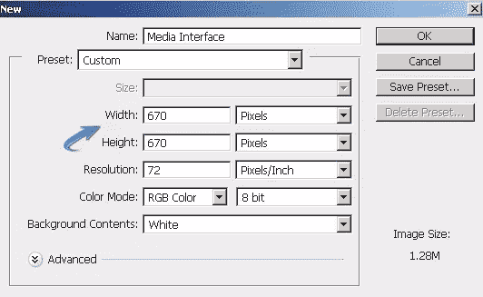](https://www.sitepoint.com/wp-content/uploads/2012/09/1.jpg)

### 第二步

首先，我们将创建媒体播放器的基础。为此，设置#c0c0c0 为前景色，选择圆角矩形工具，半径为 10px，绘制一个矩形，如下图所示。

[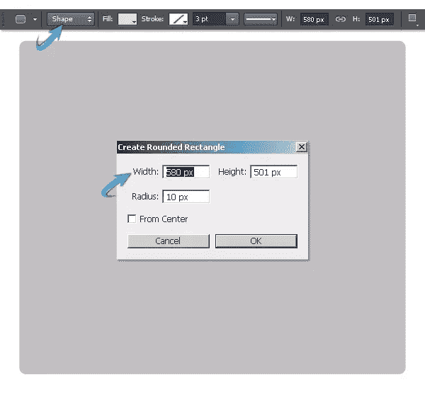](https://www.sitepoint.com/wp-content/uploads/2012/09/2.jpg)

### 第三步

双击矩形层打开图层样式窗口，应用以下设置。

[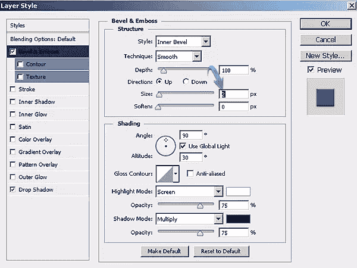](https://www.sitepoint.com/wp-content/uploads/2012/09/3.jpg)

[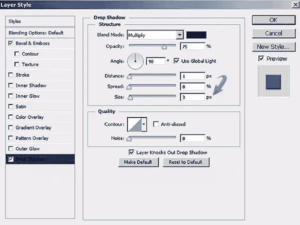](https://www.sitepoint.com/wp-content/uploads/2012/09/3b.jpg)

[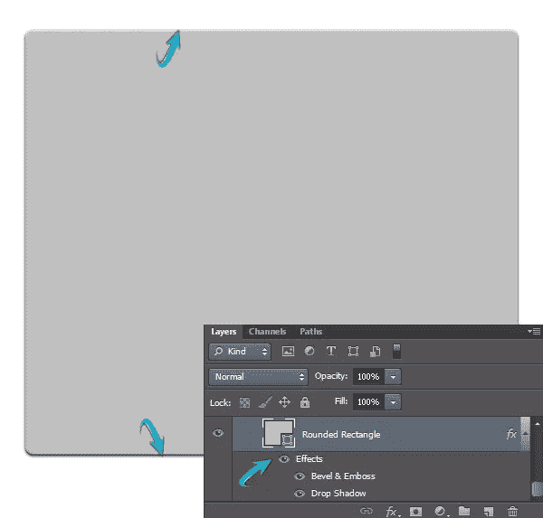](https://www.sitepoint.com/wp-content/uploads/2012/09/3c.jpg)

### 第四步

现在，通过“图层”>“复制图层”来复制矩形从这个复制的矩形中移除“效果”,只需将“效果”拖动到图层面板底部的“删除图层”图标上。之后，选择矩形工具(工具模式:形状)，在“路径操作”菜单中选择“减去前面的形状”，在这个复制的图层上画一个矩形，在底部留下大约 1/6 的圆角矩形。

[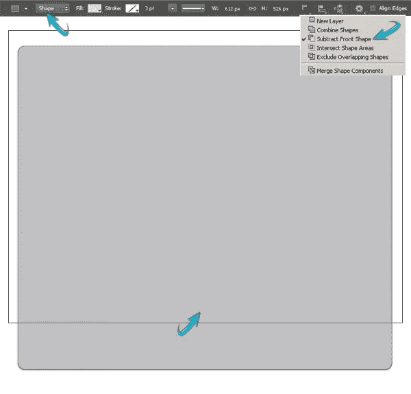](https://www.sitepoint.com/wp-content/uploads/2012/09/4.jpg)

### 第五步

将以下设置作为渐变叠加应用到这个新的减影形状上。

[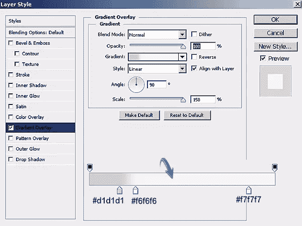](https://www.sitepoint.com/wp-content/uploads/2012/09/5.jpg)

[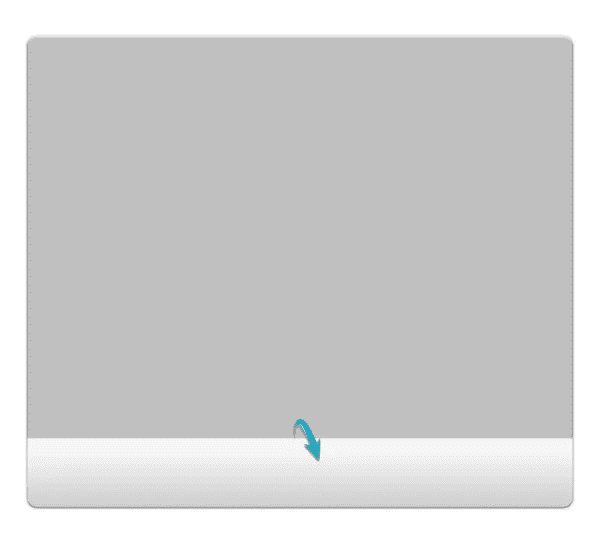](https://www.sitepoint.com/wp-content/uploads/2012/09/5b1.jpg)

### 第六步

选择半径为 10px 的圆角矩形工具，在减去的形状里面画一个矩形，如下图所示。你现在可以使用任何颜色，因为我们将在稍后应用渐变。

[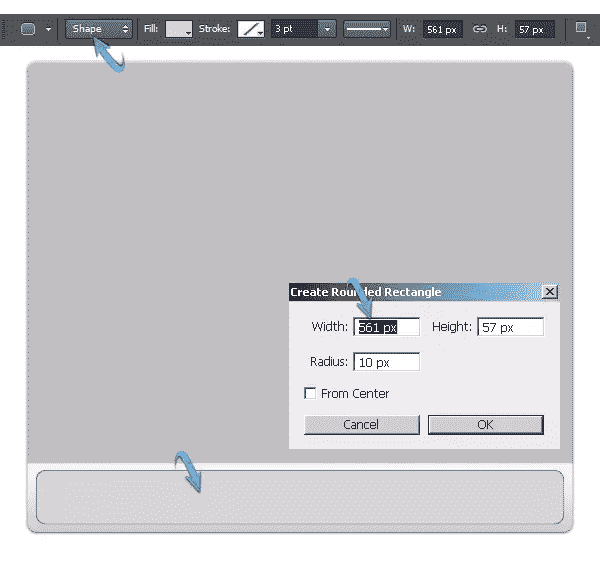](https://www.sitepoint.com/wp-content/uploads/2012/09/6.jpg)

### 第七步

在这个新的矩形上应用下面的图层样式设置。

[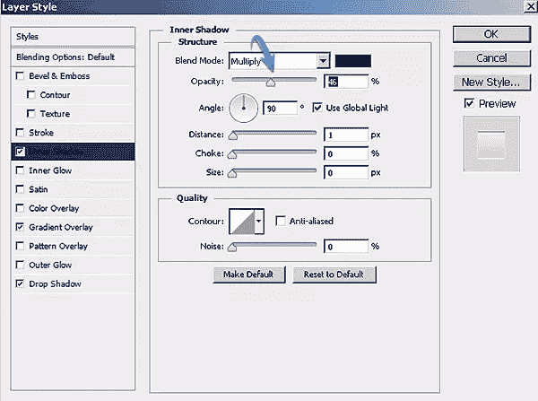](https://www.sitepoint.com/wp-content/uploads/2012/09/7.jpg)

[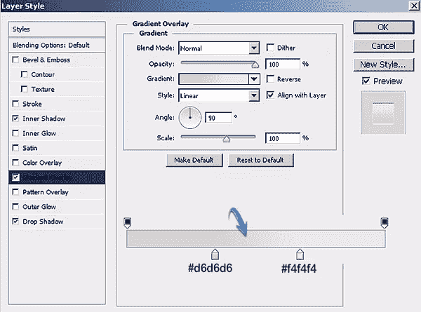](https://www.sitepoint.com/wp-content/uploads/2012/09/7b.jpg)

[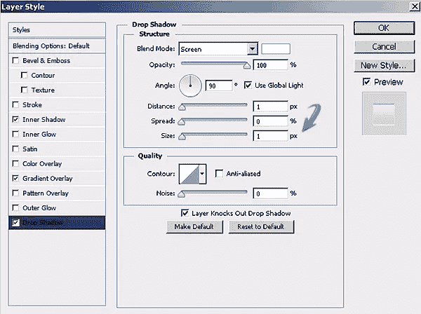](https://www.sitepoint.com/wp-content/uploads/2012/09/7c.jpg)

[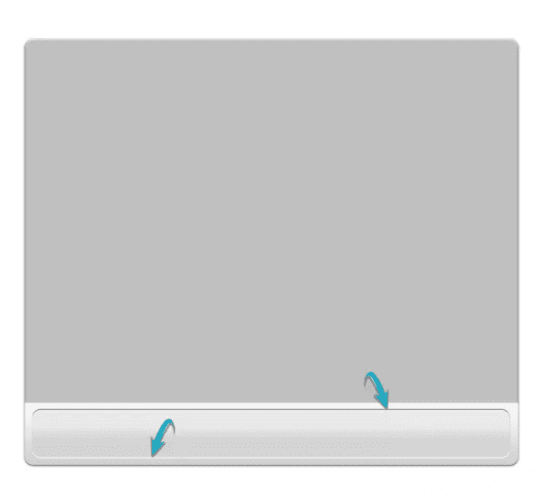](https://www.sitepoint.com/wp-content/uploads/2012/09/7d.jpg)

### 第八步

现在形成屏幕，使用圆角矩形工具绘制如下所示的矩形，半径为 10px。为此，请使用纯黑色。

[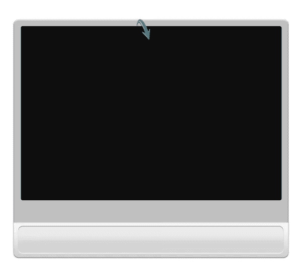](https://www.sitepoint.com/wp-content/uploads/2012/09/8.jpg)

给它画 1px。

[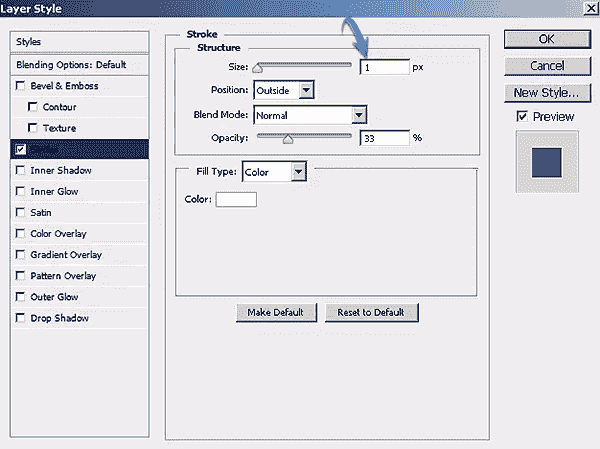](https://www.sitepoint.com/wp-content/uploads/2012/09/8b.jpg)

### 第九步

媒体播放器的基础已经准备好了，所以我们将继续创建其他元素。接下来让我们创建按钮。选择椭圆工具绘制五个椭圆，一个较大，其他四个大小相同。按下 Shift 键，同时使用椭圆工具得到完美的圆，并安排如下所示。

[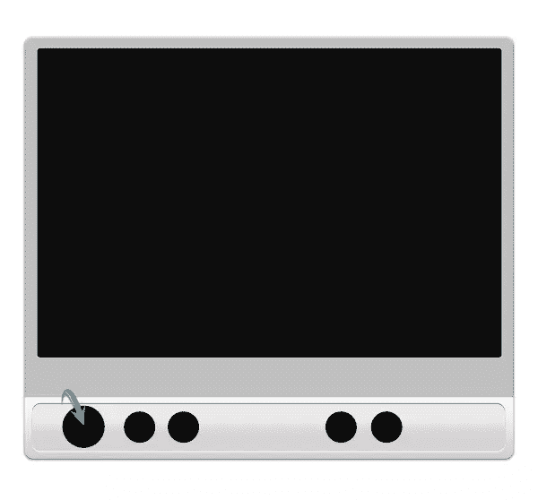](https://www.sitepoint.com/wp-content/uploads/2012/09/9.jpg)

### 第十步

双击其中一个椭圆图层，应用下面的图层样式设置。

[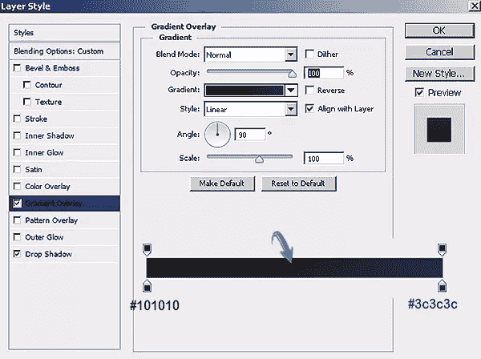](https://www.sitepoint.com/wp-content/uploads/2012/09/10.jpg)

[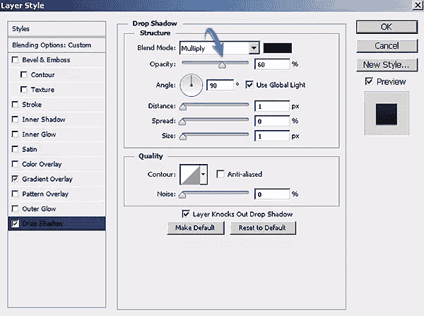](https://www.sitepoint.com/wp-content/uploads/2012/09/10b.jpg)

[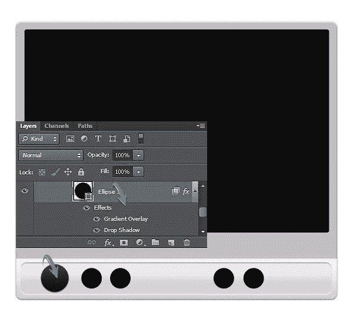](https://www.sitepoint.com/wp-content/uploads/2012/09/10c.jpg)

### 步骤 11

现在，右击这个椭圆层，选择“复制图层样式”选项然后，右键单击其余的椭圆层一个接一个，并选择“粘贴图层样式”应用相同的效果。

[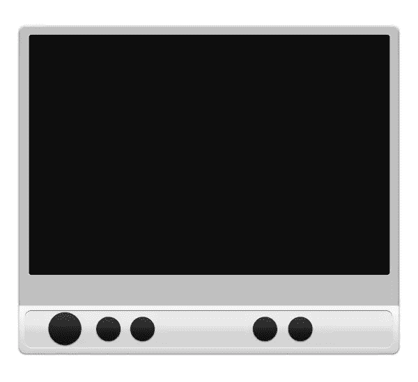](https://www.sitepoint.com/wp-content/uploads/2012/09/11.jpg)

### 步骤 12

接下来，我们将在这些按钮上绘制各种形状。为此，设置#38c0f3 作为你的前景颜色，并选择钢笔工具(工具模式:形状)来绘制三角形“播放”形状。

[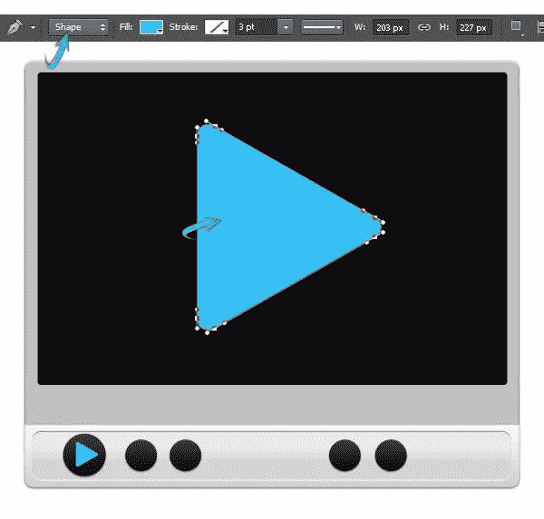](https://www.sitepoint.com/wp-content/uploads/2012/09/12.jpg)

[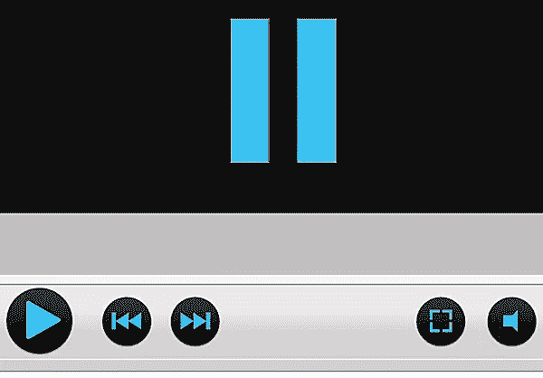](https://www.sitepoint.com/wp-content/uploads/2012/09/12b.jpg)

### 第十三步

现在，应用下面的图层样式设置在三角形“播放”形状层。

[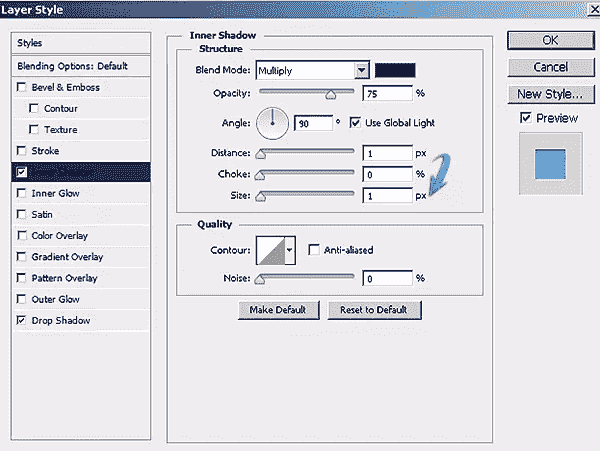](https://www.sitepoint.com/wp-content/uploads/2012/09/131.jpg)

[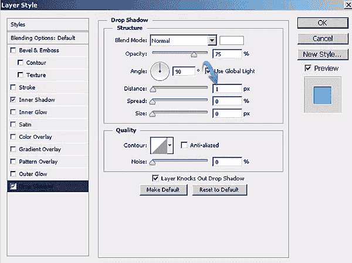](https://www.sitepoint.com/wp-content/uploads/2012/09/13b.jpg)

完成后，复制游戏形状层的图层样式并粘贴到其余的形状层上，得到如下所示的效果。

[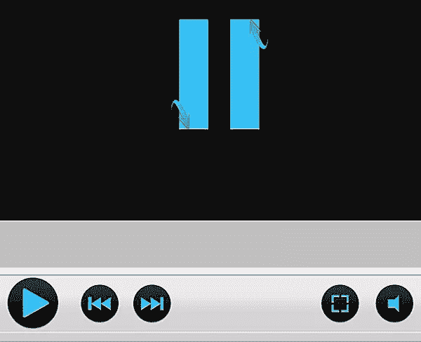](https://www.sitepoint.com/wp-content/uploads/2012/09/13c.jpg)

### 步骤 14

我们现在将创建时间线栏。使用圆角矩形工具绘制一个 10px 半径的纯黑色水平矩形。将这一层的不透明度降低到 82%。

[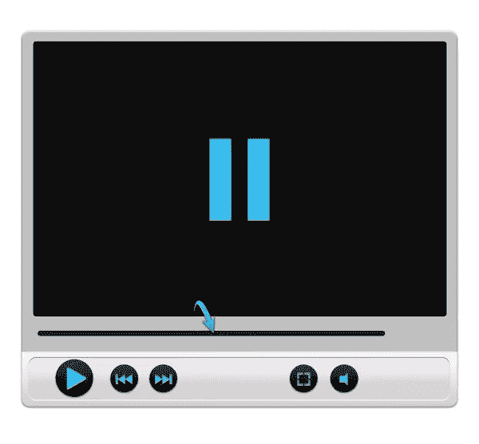](https://www.sitepoint.com/wp-content/uploads/2012/09/14.jpg)

现在，在这个薄矩形上应用下面的内阴影和投影设置。

[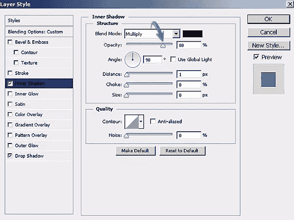](https://www.sitepoint.com/wp-content/uploads/2012/09/14b.jpg)

[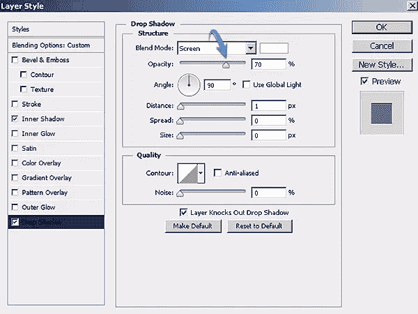](https://www.sitepoint.com/wp-content/uploads/2012/09/14c.jpg)

[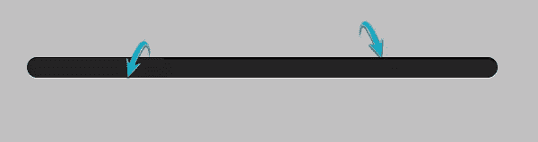](https://www.sitepoint.com/wp-content/uploads/2012/09/14d.jpg)

### 第十五步

在上一个矩形内绘制另一个矩形，并应用颜色#29c2f4。

[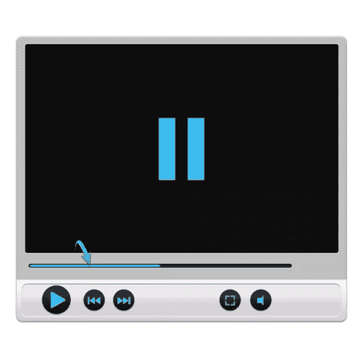](https://www.sitepoint.com/wp-content/uploads/2012/09/15.jpg)

使用以下设置给这个细的彩色条纹添加一个内阴影。

[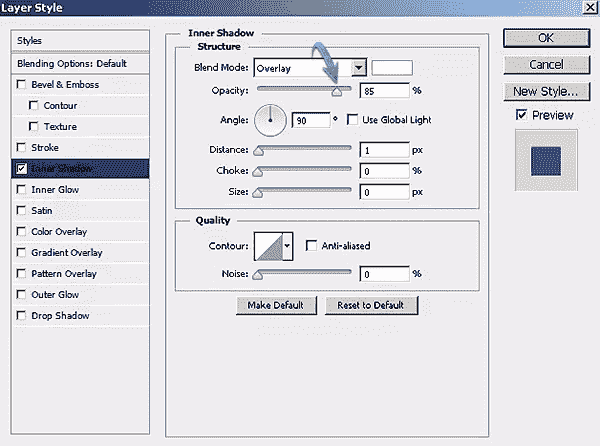](https://www.sitepoint.com/wp-content/uploads/2012/09/15b.jpg)

[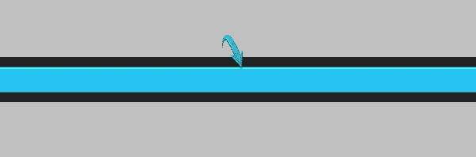](https://www.sitepoint.com/wp-content/uploads/2012/09/15c.jpg)

### 第十六步

复制蓝色矩形，将其颜色更改为#575151，并将其拖动到蓝色矩形的右侧。这个矩形表示缓冲。

### 步骤 17

接下来，我们将在时间轴上创建指针。为此，设置#FFFFFF 为前景色，选择半径为 2px 的圆角矩形工具绘制一个小矩形，如下所示。

[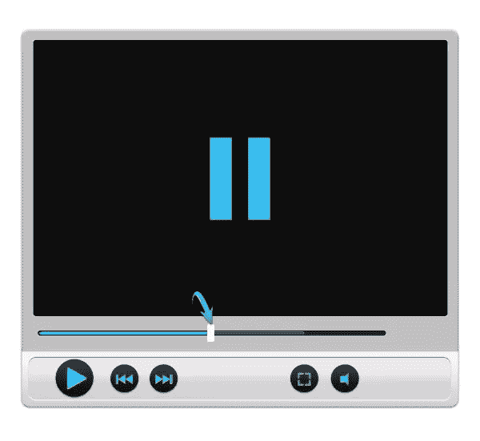](https://www.sitepoint.com/wp-content/uploads/2012/09/17.jpg)

现在进入“编辑”>“变换”>“扭曲”在属性栏中选择“膨胀”20%的弯曲，得到如下所示的形状。

[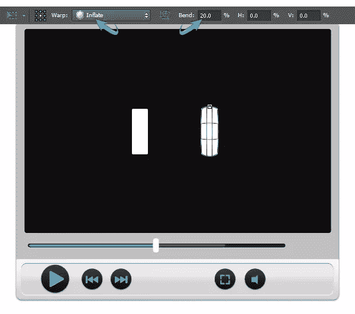](https://www.sitepoint.com/wp-content/uploads/2012/09/17b.jpg)

### 步骤 18

应用下列设置作为指针层的投影。

[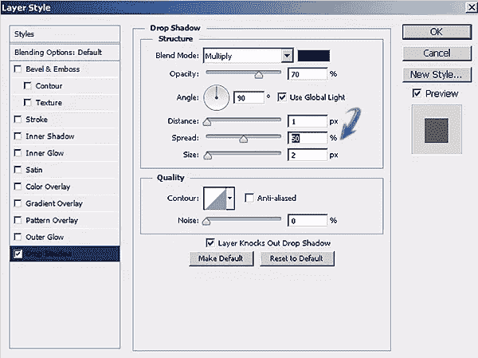](https://www.sitepoint.com/wp-content/uploads/2012/09/18.jpg)

现在，复制指针层。确保复制层在原始层之上。将其效果拖动到删除层图标，双击应用以下渐变叠加设置。

[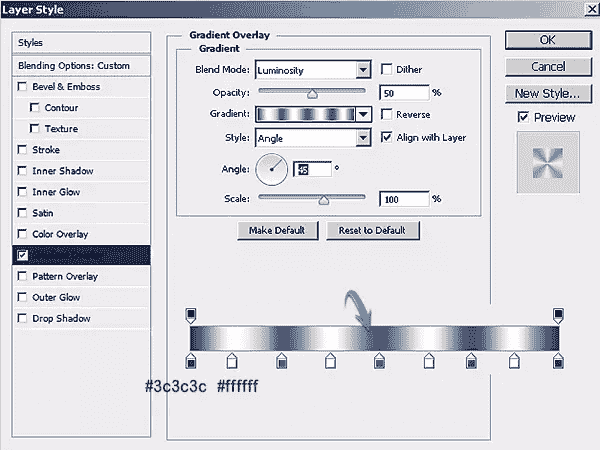](https://www.sitepoint.com/wp-content/uploads/2012/09/18c1.jpg)

[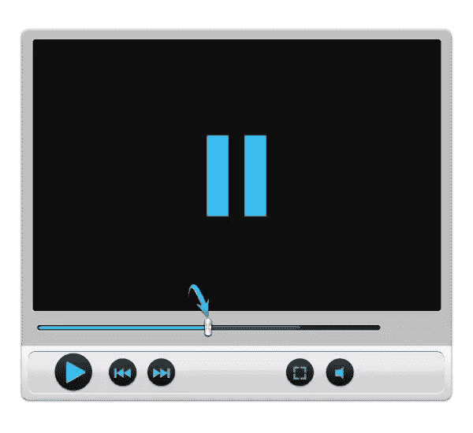](https://www.sitepoint.com/wp-content/uploads/2012/09/18d1.jpg)

### 步骤 19

将形成时间线栏的所有层收集到一个组中，复制该组，并使用自由变换工具(Ctrl + "T ")减小其大小，以形成音量调节杆。从这个复制的组中删除缓冲层，如下图所示放置。

[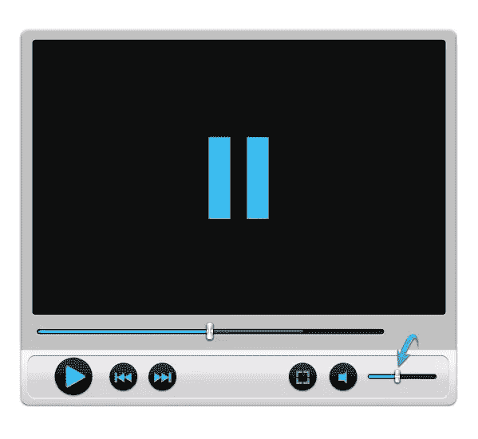](https://www.sitepoint.com/wp-content/uploads/2012/09/19.jpg)

### 步骤 20

现在，我们将在时间轴前面添加一个计时器。为此，我们将使用#3a3a3a 颜色的“Arial”字体(粗体)。

[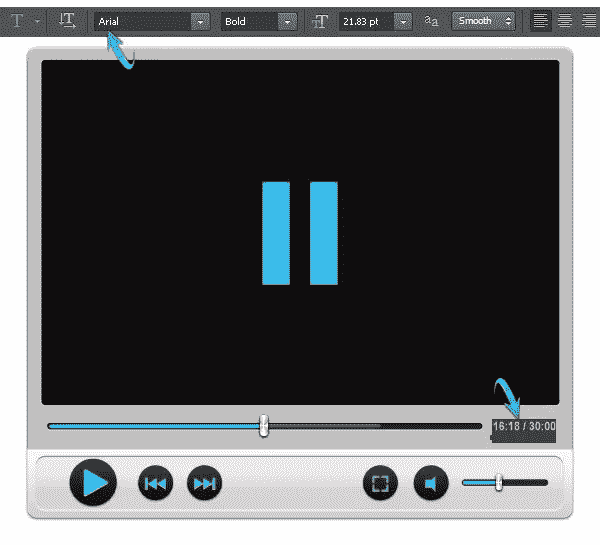](https://www.sitepoint.com/wp-content/uploads/2012/09/20.jpg)

### 步骤 21

我们的媒体播放器界面几乎准备好了。你可以让它保持现在的样子，或者如果你愿意，可以增强阴影效果。要制作一个更暗的媒体播放器，复制媒体播放器的基本矩形，把这个副本放在背景的正上方，把它变成黑色，并标记为阴影。然后，右击这个新图层，选择“栅格化图层”现在，进入“滤镜”>“模糊”>“高斯模糊”使用 5px 的高斯模糊值来获得如下所示的效果。

[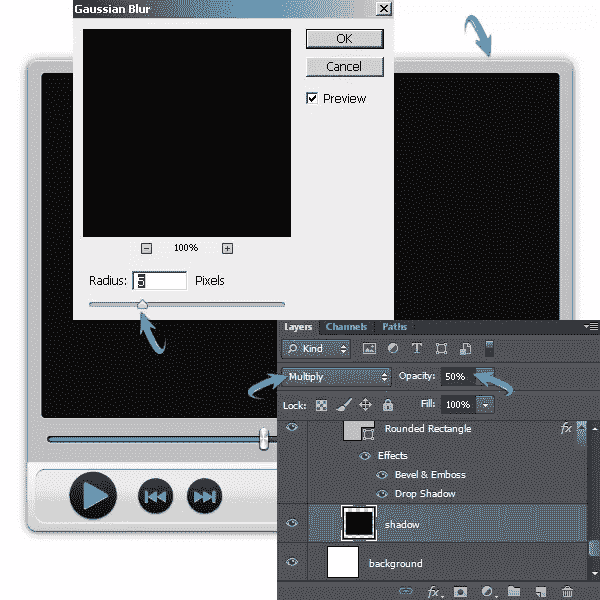](https://www.sitepoint.com/wp-content/uploads/2012/09/21.jpg)

现在向下拖动阴影。

[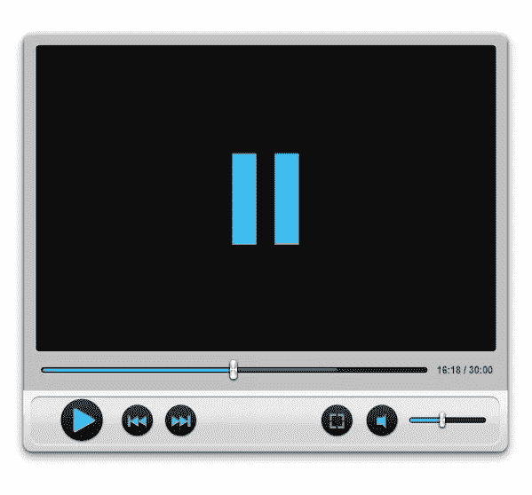](https://www.sitepoint.com/wp-content/uploads/2012/09/21b1.jpg)

### 步骤 22

对于背景，我使用了渲染和粒状纹理，这是使用过滤器。

[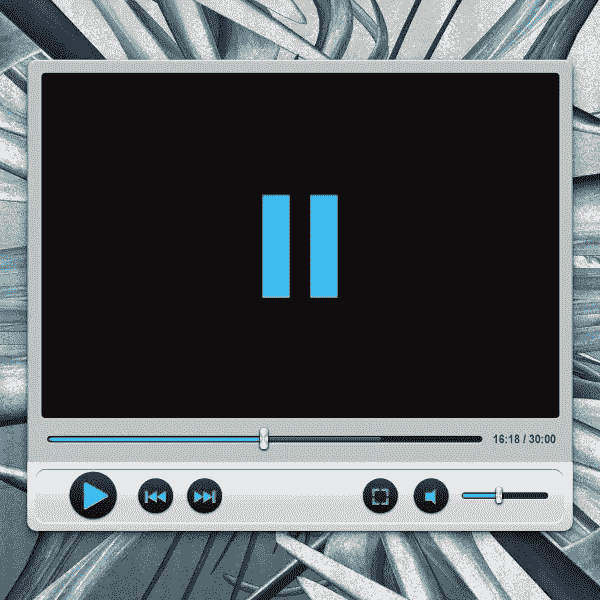](https://www.sitepoint.com/wp-content/uploads/2012/09/Final-result.jpg)

就是这样。我希望你喜欢这个教程，并学到一些有用的东西。分享你的想法！

## 分享这篇文章