# 在 Photoshop 中创建一个圆滑、时尚的价格表

> 原文：<https://www.sitepoint.com/create-a-sleek-stylish-pricing-table-in-photoshop/>

很少有产品和服务是你在网上买不到的。从个人购物者、海鲜市场到大型知名品牌，一切都在网上出现。无论你的企业是大是小，有效的营销实践是网上销售的关键，作为设计师，我们在这个过程中有很大的作用。展示你的产品或服务，吸引顾客，说服他们购买是我们大部分网页设计工作的基础。向比较购物者传达您的报价的最有效方式之一是使用价格表。所以，今天我将向你展示如何在我们自己的 Photoshop 中设计一个漂亮独特的价格表。在这个过程中，你将学习使用钢笔工具，形状工具，以及其他各种图层样式选项和技巧来实现最终的结果。

所以，让我们开始吧！

**资源**

[PW 模式](http://subtlepatterns.com/pw-pattern/)

垒结型式

现在，在我们开始之前，让我们看看我们的最终结果。 **( [下载完成的，分层的，PSD 文件](https://www.dropbox.com/s/xq6in4i2ya2orwo/Price%20Table.zip)。)**

### 第一步

打开 Photoshop，新建一个宽 600 像素、高 700 像素的文件。

[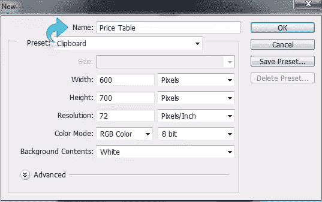](https://www.sitepoint.com/wp-content/uploads/2013/06/Step-1.jpg)

### 第二步

现在我们将从背景开始，所以创建一个新的层。然后，选择油漆桶工具，用颜色#9fc7d9 填充背景。

[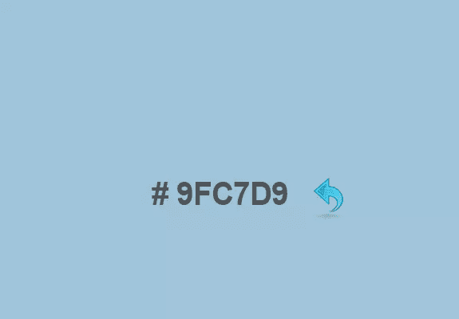](https://www.sitepoint.com/wp-content/uploads/2013/06/Step-2.jpg)

### 第三步

选择背景层，点击“图层”>“图层样式”>“图案叠加”(或者双击所选图层)，从上述设置中添加一个 PW 图案。改变混合模式为“变亮”，设置图案不透明度为 67%。

[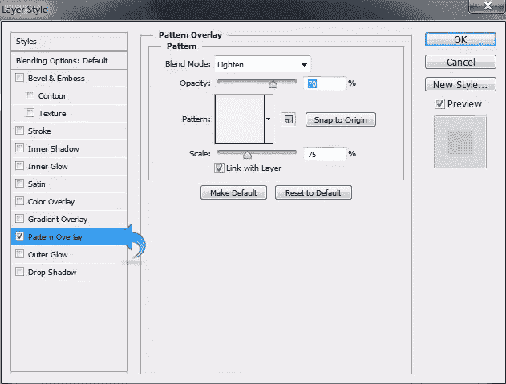](https://www.sitepoint.com/wp-content/uploads/2013/06/Step-3.jpg)

### 第四步

再次点击“图层”>“图层样式”>“内阴影”(或者双击选中的图层)，用“叠加”混合模式添加一些内阴影。现在，将不透明度降低到 41%。

[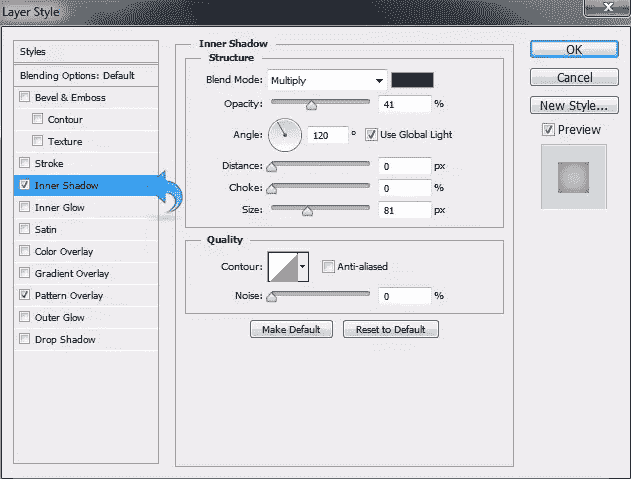](https://www.sitepoint.com/wp-content/uploads/2013/06/Step-4.jpg)

### 第五步

我们的背景做好了，就从我们的定价表开始吧。首先，创建一个新层，然后点击钢笔工具创建一个价格标签形状如下所示。

### 第六步

现在，用颜色#252525 填充这个形状。你也可以右击路径，选择“制作选区”，然后用油漆桶工具填充。

[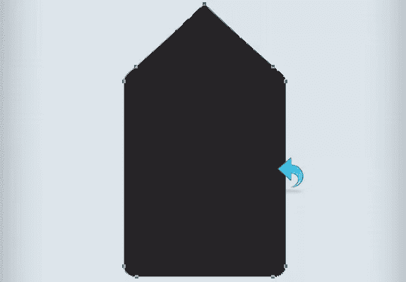](https://www.sitepoint.com/wp-content/uploads/2013/06/Step-6.jpg)

### 第七步

现在，点击“图层”>“图层样式”>“描边”(或者双击选中的图层)，给我们的形状添加一些描边。添加一个 100%不透明度的 3px 描边，选择“内侧”作为位置。

### 第八步

再次点击“图层”>“图层样式”>“投影”(或者双击选中的图层)，将混合模式改为“正片”，不透明度降低到 40%。将阴影距离调整为 23px，大小调整为 13px。

[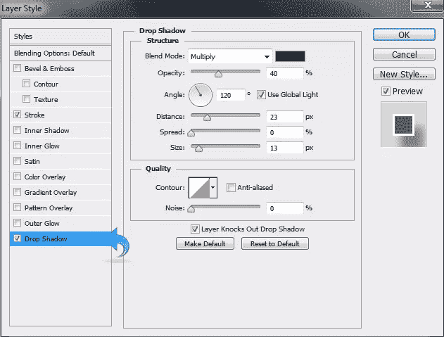](https://www.sitepoint.com/wp-content/uploads/2013/06/Step-8.jpg)

### 第九步

创建一个新层(点击“层”>“新建”>“层”)，然后点击钢笔工具创建另一个形状。右键单击路径并选择“进行选择”现在，选择油漆桶工具，用颜色#363636 填充形状。

[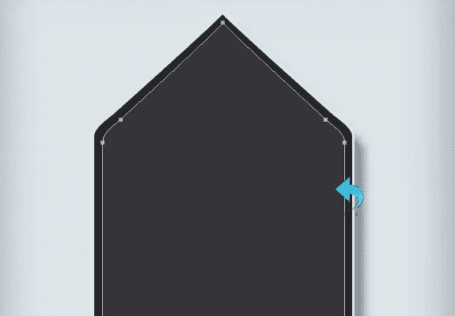](https://www.sitepoint.com/wp-content/uploads/2013/06/Step-9.jpg)

### 第 10 步

现在，点击“图层”>“图层样式”>“描边”(或者双击选中的图层)，给我们的形状添加一些描边。使用颜色#676363 添加一个 100%不透明度的 2px 描边。

[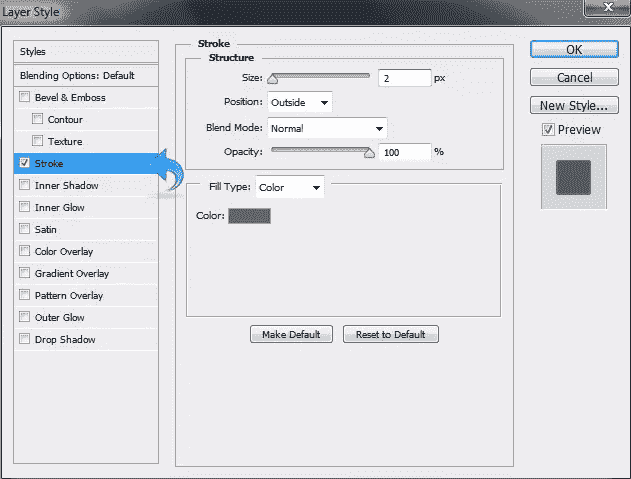](https://www.sitepoint.com/wp-content/uploads/2013/06/Step-10.jpg)

### 步骤 11

再次点击“图层样式”添加“内阴影”使用下图所示的设置。

[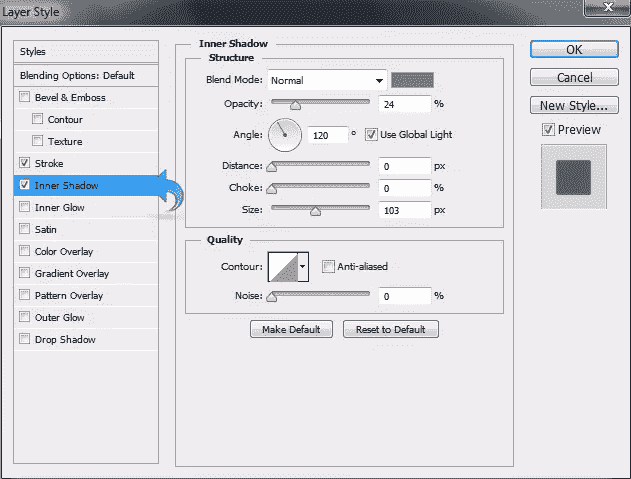](https://www.sitepoint.com/wp-content/uploads/2013/06/Step-11.jpg)

### 步骤 12

再次点击图层样式，添加一些“内部发光”改变混合模式为“线性加深”,其余的设置和下图一样。

[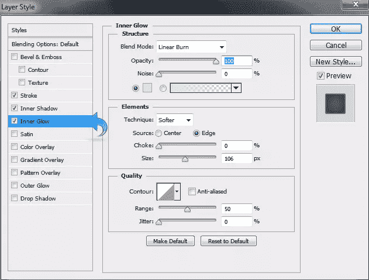](https://www.sitepoint.com/wp-content/uploads/2013/06/Step-12.jpg)

### 第十三步

再次点击“图层样式”添加一个“渐变叠加”将混合模式改为“柔光”，不透明度降低到 45%。保持其余设置不变，如下图所示。

### 步骤 14

选择形状图层，点击“图层”>“图层样式”>“图案叠加”(或者双击所选图层)，从上述设置中添加另一个 PW 图案。将不透明度调整为 65%，比例调整为 41%。

[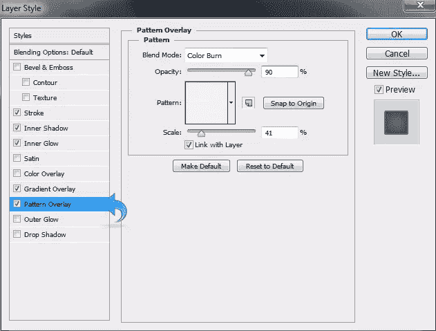](https://www.sitepoint.com/wp-content/uploads/2013/06/Step-14.jpg)

### 第十五步

现在，让我们从细节开始，选择文字工具，使用颜色#3fcf74 添加一个标题。然后，点击“图层样式”,给我们的文本添加一些阴影。保持阴影设置如下图所示。

[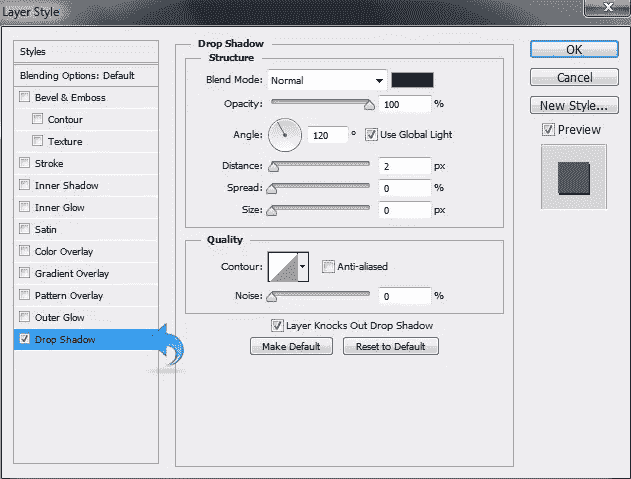](https://www.sitepoint.com/wp-content/uploads/2013/06/Step-15.jpg)

### 第十六步

重复相同的过程，并添加一些文字使用颜色#fd8044。然后，用和上面一样的设置添加一些阴影。

[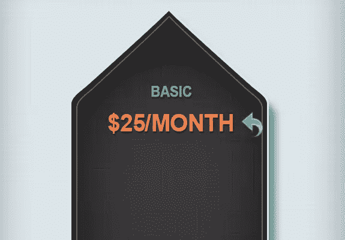](https://www.sitepoint.com/wp-content/uploads/2013/06/Step-16.jpg)

### 步骤 17

现在，选择矩形工具，使用颜色#3fcf74 创建一个小矩形。然后，点击“图层样式”,给矩形添加阴影。保持如下图所示的设置。

[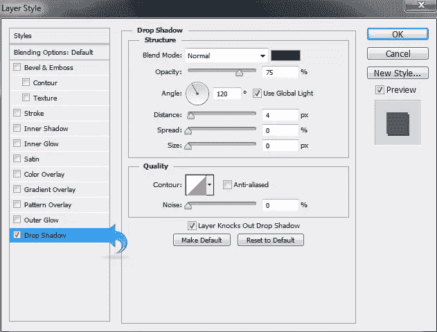](https://www.sitepoint.com/wp-content/uploads/2013/06/Step-17.jpg)

### 步骤 18

选择文字工具，使用颜色#f4f3f3 添加文字，然后点击“图层样式”添加一些阴影。使用下面的设置。

[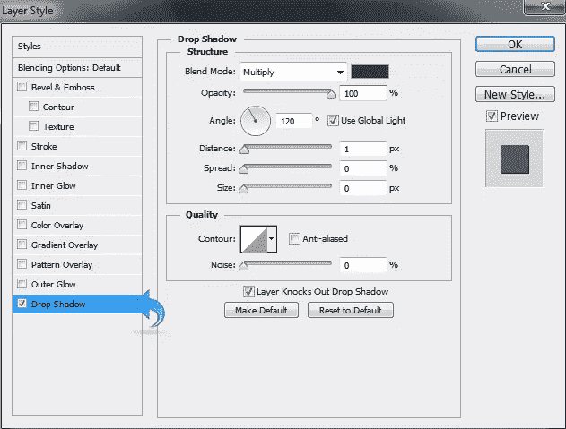](https://www.sitepoint.com/wp-content/uploads/2013/06/Step-18.jpg)

### 步骤 19

重复相同的过程，创建更多的矩形，并添加文字使用相同的设置如上所示。

### 步骤 20

现在，让我们创建订单按钮。选择矩形工具，使用#f26522 颜色创建一个小矩形。然后，点击“图层样式”添加一些笔画，图案和阴影。使用下面显示的设置。

[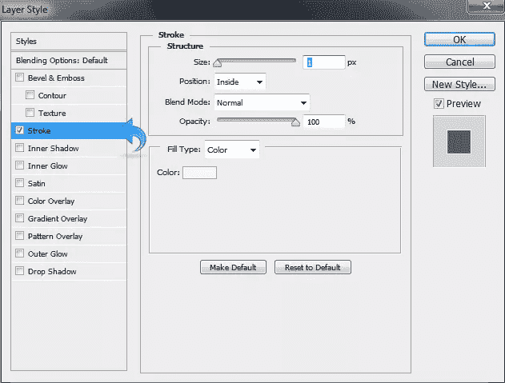](https://www.sitepoint.com/wp-content/uploads/2013/06/Step-20a.jpg)

[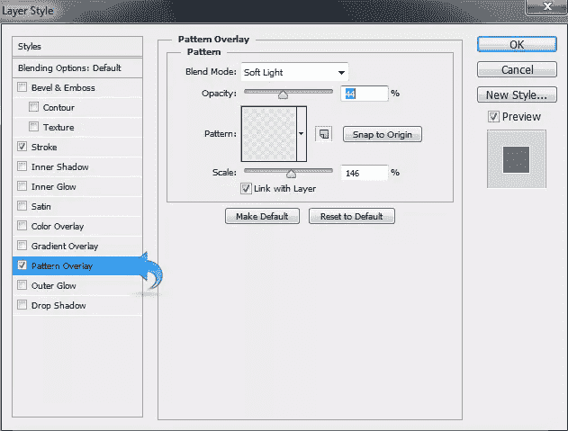](https://www.sitepoint.com/wp-content/uploads/2013/06/Step-20b.jpg)

[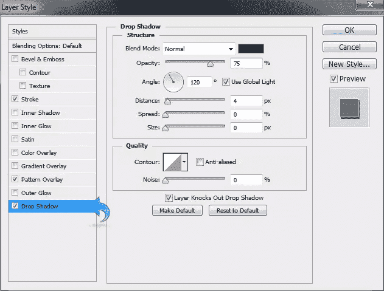](https://www.sitepoint.com/wp-content/uploads/2013/06/Step-20c.jpg)

### 步骤 21

选择文字工具将文本添加到我们的订单按钮。使用颜色#f8f8f8 添加文字，然后点击“图层样式”,使用与上面文字相同的技术添加一些阴影。

### 步骤 22

现在，让我们从绳子开始，首先我们将创建一个洞。所以选择椭圆工具，用颜色#959595 创建一个小圆。然后，再创建一个圆，用颜色#e2eef4 填充，放在第一个圆的中间。

### 步骤 23

选择第一个圆，点击“图层样式”添加“斜面和浮雕”和“阴影”使用下面显示的设置。

[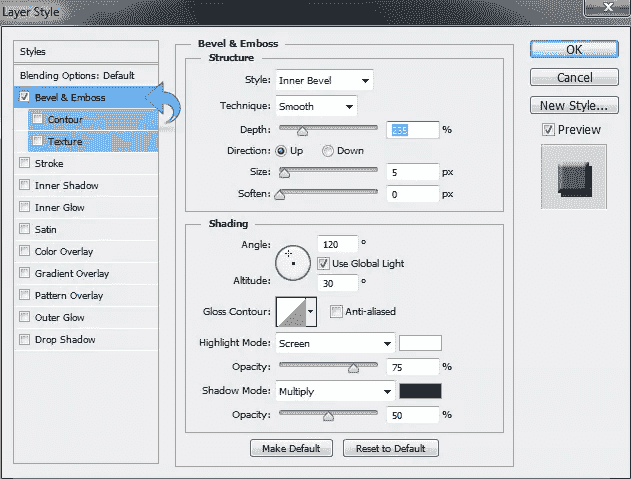](https://www.sitepoint.com/wp-content/uploads/2013/06/Step-23a.jpg)

[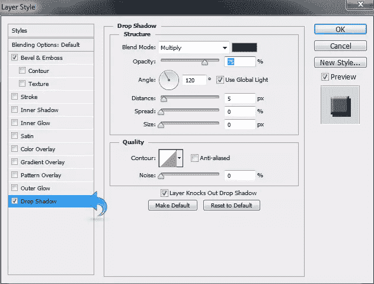](https://www.sitepoint.com/wp-content/uploads/2013/06/Step-23b.jpg)

### 步骤 24

对于绳子，选择一个硬圆刷，并用纯白创建一条直线。然后，点击“图层样式”添加“斜面和浮雕”和“图案”

[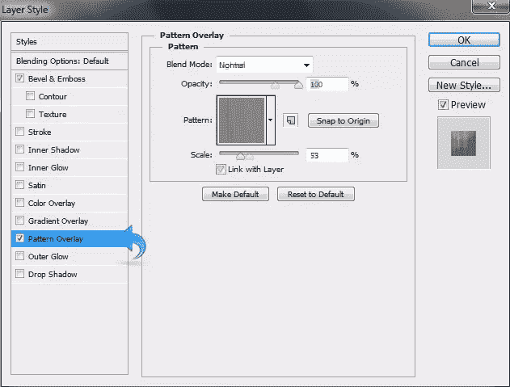](https://www.sitepoint.com/wp-content/uploads/2013/06/Step-24b.jpg)

### 步骤 25

现在，给绳子添加阴影，使用#2d2d2d 颜色的软圆形笔刷，然后点击“滤镜”>“模糊”>“高斯模糊”将半径调整为 8.8 像素。

我们完了！我们光滑时尚的价格表已经准备好了。我希望你喜欢这个教程。保重！

## 分享这篇文章