# 在 Adobe Photoshop 中创建时尚徽章

> 原文：<https://www.sitepoint.com/create-a-stylish-badge-in-adobe-photoshop/>

徽章是在任何博客或网站上展示信息的好方法。由于它们引人注目的品质，它们能瞬间抓住参观者的注意力。如今，网络上有许多关于通用徽章的资源；不过，自己做总是好的。通过这种方式，您可以对其进行定制，以完全满足您当前项目的需求。所以，今天我将向你展示如何通过一步一步的简单方法在 Adobe Photoshop 中制作一个时尚的徽章。

**资源:**

[纸板纸纹理](http://enchantedgal-stock.deviantart.com/art/Cardboard-Brown-Paper-Texture-49218463?q=boost%3Apopular%20card%20texture&qo=3 "Paper texture")

让我们先看看我们的最终结果:

### 第一步

在 Adobe Photoshop 中创建一个宽度为 600 像素、高度为 650 像素的新文档。

### 第二步

使用油漆桶工具用#ededef 颜色填充背景。

### 第三步

现在，设置#01c1f2 作为你的前景色，选择多边形工具，使用下面的设置画一个基本的徽章形状。

### 第四步

打开“纸板纹理”文件，复制并粘贴到形状层的正上方。现在，为了将纹理限制在形状上，点击纹理层，按住键盘上的“Control”键，然后点击形状层的缩略图。然后，点击图层面板底部的“添加图层蒙版”图标。改变纹理层的混合模式为“叠加”

### 第五步

现在，通过“图层”>“复制图层”来复制形状图层将形状层的副本放在原始形状的下方，向下拖移一点，然后更改其颜色。这会给你的徽章增加一种“厚重感”。

### 第六步

接下来，使用椭圆工具用#ea2c46 颜色画一个圆。然后，复制这个图层，用#c81b33 给它上色，放在原来的圆形图层下面，向下拖动一点。

按照我们在第 4 步中所做的一样，在前一个圆上应用纸板纹理。

[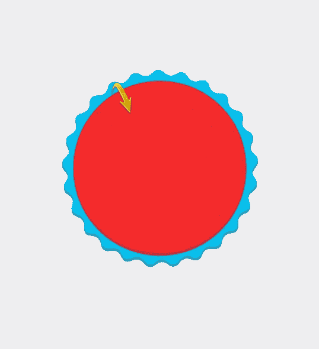](https://www.sitepoint.com/wp-content/uploads/2012/04/6b.jpg)

### 第七步

使用椭圆工具绘制另一个更小的圆，如下所示。

### 第八步

现在，我要做一个缝合的圆圈。选择画笔工具，打开画笔面板，并选择下面提供的设置。

现在选择椭圆工具，点击顶部选项栏的“路径”图标，在新图层上画一个圆。然后，右键单击并选择“描边路径”选项在笔画路径窗口中选择“笔刷”。之后，点击删除，摆脱循环框架。

[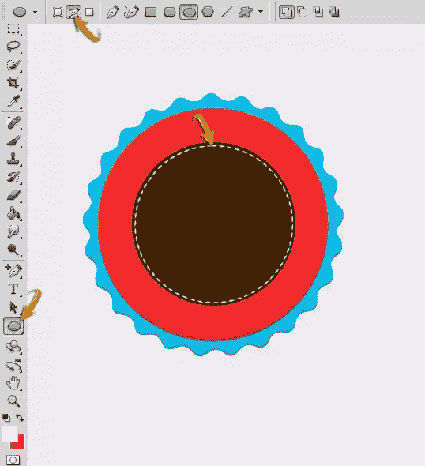](https://www.sitepoint.com/wp-content/uploads/2012/04/8b.jpg)

### 第九步

接下来，我们将在徽章后面创建一个丝带。创建一个新层；把它放在背景上方。现在选择圆角矩形工具绘制如下所示的形状。然后右键单击并选择“栅格化层”选项。

[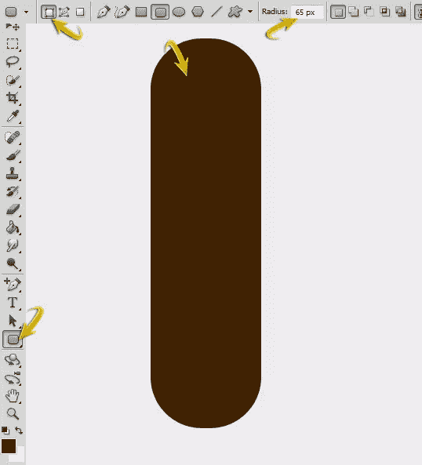](https://www.sitepoint.com/wp-content/uploads/2012/04/9.jpg)

现在，选择矩形工具绘制一个正方形，并使用自由变换工具(Ctrl + "T ")旋转它。栅格化这一层。现在按 Ctrl + <thumbnail of="" your="" square="" layer="">在正方形周围进行选择。现在，点击圆角矩形层，进入“编辑”>“清除”这样，你会得到一个漂亮的丝带，如下图所示。</thumbnail>

[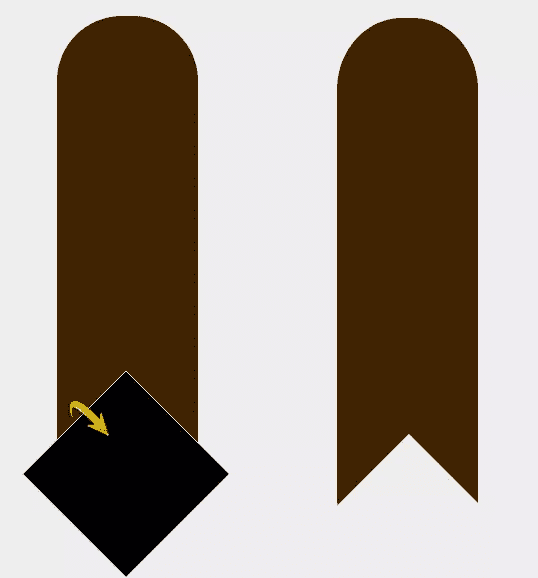](https://www.sitepoint.com/wp-content/uploads/2012/04/9b.jpg)

### 第十步

使用自由变换工具将功能区旋转一点。现在，选择椭圆选框工具在丝带顶部附近打一个洞。你可以通过在功能区层选择一个圆圈，然后按“编辑”>“清除”来完成这个操作

### 步骤 11

现在，用椭圆选框工具在新图层上画一个比第一个洞大的圆，在这个新洞周围画一个银圈。现在用任何颜色填充它。在一个新图层上再画一个和原来的洞差不多大小的圆。现在按 Ctrl + <thumbnail of="" your="" hole-sized="" circle="" layer="">在它周围进行选择。然后，点击较大的圆形图层，选择“编辑”>“清除”现在，双击这个环形层，应用下面的渐变叠加设置。</thumbnail>

[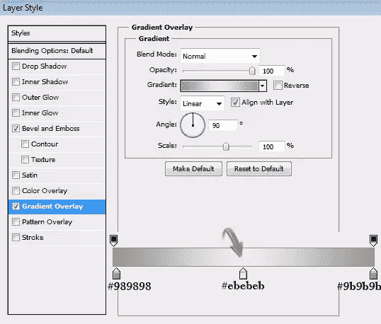](https://www.sitepoint.com/wp-content/uploads/2012/04/11b.jpg)

[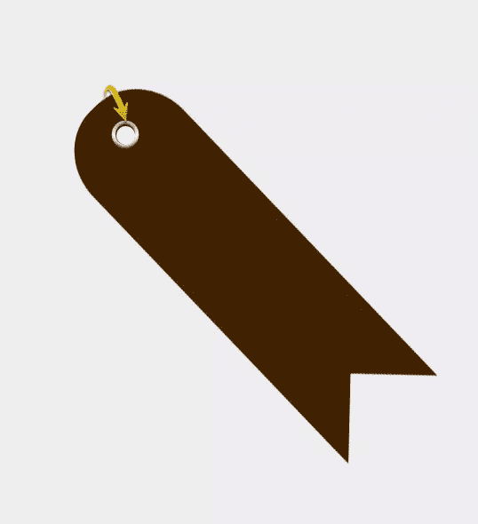](https://www.sitepoint.com/wp-content/uploads/2012/04/11c.jpg)

### 步骤 12

要形成挂圈，选择 3px 大小的硬圆刷。然后，选择椭圆工具，选择“路径”选项，并绘制一个椭圆。之后，点击右键，选择“笔画路径”>“笔刷”现在，擦除应该在丝带后面的部分，如下所示。

### 第十三步

现在，双击带状层打开图层样式窗口。对投影使用以下设置。

[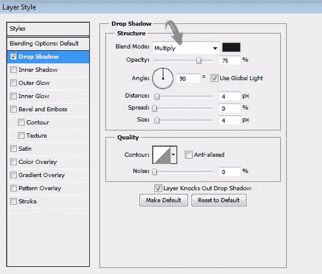](https://www.sitepoint.com/wp-content/uploads/2012/04/13.jpg)

之后，右击带状层，选择“复制图层样式”选项然后，右键单击 shape1 copy、shape2 copy 和 loop 图层，选择“粘贴图层样式”选项，对所有这些图层应用相同的投影效果。

[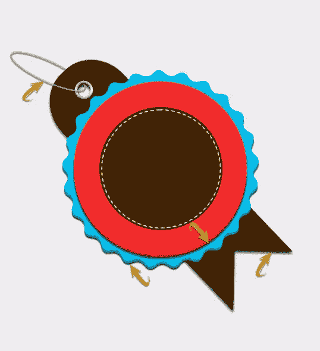](https://www.sitepoint.com/wp-content/uploads/2012/04/13b.jpg)

### 步骤 14

复制丝带层，按 Ctrl + "U "打开"色调/饱和度"窗口。使用以下设置来设置色调和饱和度。

[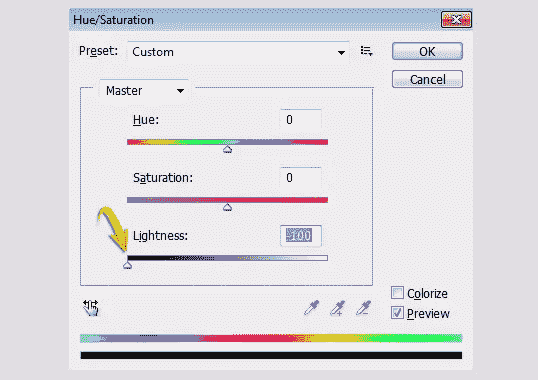](https://www.sitepoint.com/wp-content/uploads/2012/04/14.jpg)

将这个新制作的丝带层放在原来的丝带层下面，旋转一点，不透明度降低到 20%，得到一个漂亮的阴影效果。擦除这个新图层的上部，如下图所示。

### 第十五步

现在，我们将在这个徽章上添加一些文本。创建一个新的层，选择文字工具，并键入您的文本。文本使用#eeeeee 颜色。

### 第十六步

应用以下设置在文本层上创建投影。

[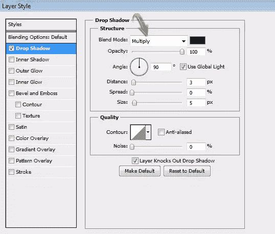](https://www.sitepoint.com/wp-content/uploads/2012/04/16.jpg)

### 步骤 17

现在我们将在一个圆形路径中添加一些文本。选择椭圆工具。确保点击顶部选项栏的“路径”图标，在新图层上画一个圆。现在选择文字工具，将光标放在你新画的圆上；你会注意到当光标接触到那个圆时，它会发生变化。输入你的文本，现在:它应该遵循圆形路径，如下所示。

您将注意到圆形文本两侧的两个形状。在左侧，有一个“X”符号，它表示文本开始的位置。在文本的右侧，有一个“O”符号，表示将结束。所以，通过调整这两点，你可以相应地定位你的文字。根据需要，使用路径选择工具移动这两个点。

### 步骤 18

现在，要在圆的下半部分添加文本，再画一个圆并输入文本。现在选择路径选择工具，并把它的文本。它应该显示一个指向圆圈内部的箭头；只需将文本拖到圆圈内。之后，调整文本的起点和终点，使其居中，就像第 17 步一样。

### 步骤 19

将步骤 16 中使用的相同投影设置应用到这些新的圆形文本层。

### 步骤 20

创建一个新层；使用下面的设置选择多边形工具来画一个星形。

[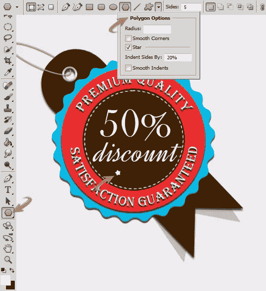](https://www.sitepoint.com/wp-content/uploads/2012/04/20.jpg)

复制这个星星层几次，排列星星如下图所示。

### 步骤 21

选择线工具画一个小水平线，复制它，并放置线如下所示。

### 步骤 22

点击其中一个星形图层，应用下面的阴影设置。

[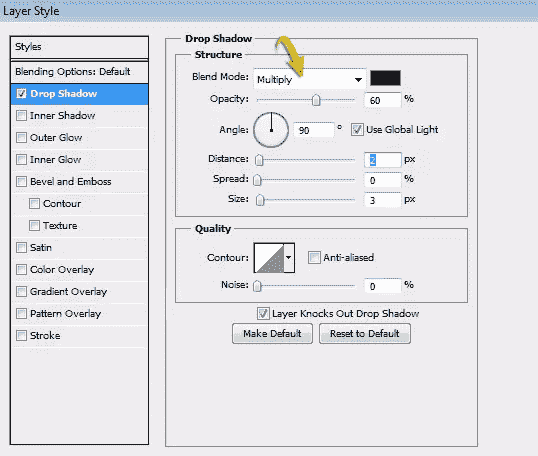](https://www.sitepoint.com/wp-content/uploads/2012/04/22.jpg)

复制并粘贴这个图层样式设置到所有剩余的星形图层和水平线图层。

### 步骤 23

复制悬挂循环层，把新的副本变成黑色，将其放置在一个角度，并减少这一层的不透明度为 20%，以形成一个很好的阴影，就像步骤 14。

### 步骤 24

复制 shape2 副本图层，将新副本放在徽章图层下面。改变颜色为#000000，降低其不透明度为 15%。向下向外拖动它，形成徽章的阴影，如下所示。

就是这样！我希望你喜欢这个教程，并学到一些有用的东西。我将等待你的反馈。玩得开心！

## 分享这篇文章