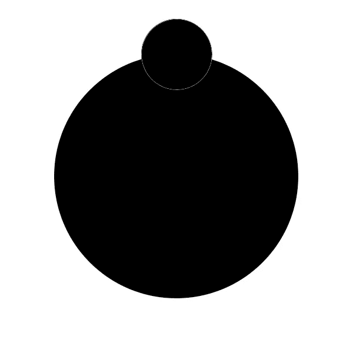
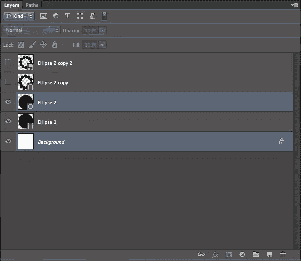
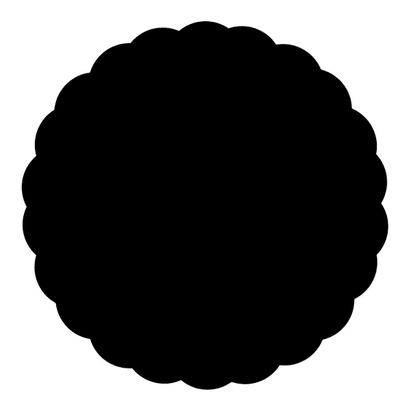
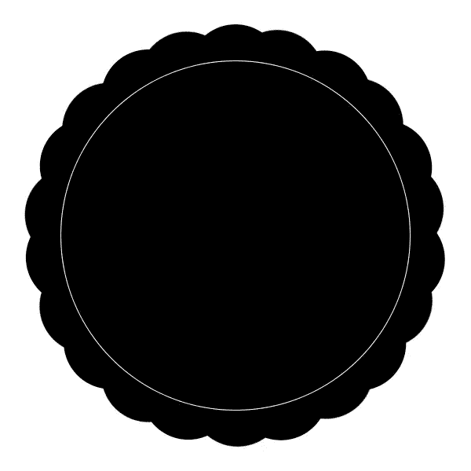
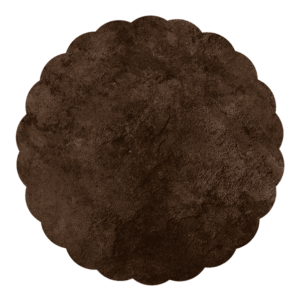

# 在 Photoshop 中创建一个复古徽章

> 原文：<https://www.sitepoint.com/create-a-vintage-badge-in-photoshop/>

每个人都享受认可和成就，但徽章能做的不仅仅是表示祝贺。徽章还可以传达信任和诚信，例如当产品或服务附带担保时，或者当公司或个人获得认证时。徽章在设计中起着至关重要的作用，因为它们可以作为信任、可信度和成就的象征。有不同风格的徽章:有些是象征价值的金色，有些更好玩，比如你玩游戏获得的徽章。它们有各种形状和大小，今天我们将在 Photoshop 中创建一个复古徽章。

**(下载完成的，分层的 Photoshop 文件。)**

首先，创建一个 600 像素 x 600px 像素的文档。这将给我们足够的工作空间。选择椭圆工具，创建一个大圆。在屏幕顶部选项栏内的对齐工具中，单击垂直和水平居中对齐图标。这会将您的圆放置在画布的中心。

接下来，在另一个图层上新建一个圆。使用“对齐”面板将您的圆置于画布的中心。确保其直径大致为 120px。

使用命令/Ctrl 键，并点击背景层和小圆圈层。这将确保您将小圆置于大圆的中心，并且两者都在画布的中心。

接下来，我们将围绕主圆的周长创建圆。将起始圆放在顶部，并以另一个圆为中心，单击该圆的中心注册点。你可以点击并拖动它到任何你想要的地方。知道了这一点，当您选择在变换模式下旋转活动对象时，它也是旋转点。我们的文档是 600px x 600px，所以我们需要将注册点放在精确的中心，该中心的 X 和 Y 坐标为 300。当您单击并拖动注册点时，工具提示将显示其 X 和 Y 坐标。

按 Command/Ctrl+Alt/Option+“T”来变换小圆的副本，并将中心旋转拖动到大圆的中心点。旋转小圆，直到两个圆的边几乎不接触。然后，要重复这个过程，只需按 Command/Ctrl + Alt/Opt + Shift + "T "。这将复制您的最后一个变换动作，创建一个圆的副本，并将其旋转与上一个相同的空间量。重复这个动作，直到你在大圆周围有了小圆。为了清楚起见，请看下面。

选择所有的小圆，点击 Command/Ctrol + "E "来合并小圆。接下来，点击 Command/Ctrl + "J "复制圆圈层。按 Command/Ctrl + "T "来变换复制的圆图层，按住 Shift，旋转圆 45 度。你应该有一个如下图所示的形状。

现在我们已经有了主要的徽章形状，我们可以开始添加徽章的细节了。抓取椭圆工具并按住 Shift 键，从徽章的中心画出一个圆。在 Photoshop 界面顶部的选项栏中，您会看到填充和描边选项。选择“无填充”并创建一个 1px 大小的白色描边。

接下来，我们将在白色圆圈的外边缘添加小点。创建一个新层，并绘制一个小圆，白色填充略高于我们刚刚创建的圆圈。确保它在画布中居中。我们将重复之前使用的旋转过程，复制这些小圆圈，并绕着白色大圆圈旋转。

**重要提示**:由于某种原因，在 Photoshop 中创建小对象时，如果不先按住 Option/Alt，就无法选择和移动中心点。否则，你将只是结束移动圆本身，这不是我们想要的。此外，为了更精确地移动中心点，您可以在界面顶部的选项栏中输入坐标。按 Command/Ctrl + Alt/Option+ "T "来变换小圆的副本。然后，按住 Alt/Option 键单击并将中心点拖动到画布的中心，按住 Shift 键旋转圆形副本，然后按 enter 键。然后，按 Command/Ctrl+Alt/Option+Shift+“T”重复这个动作，直到它绕着整个圆周回来，如下图所示。

接下来，我们需要选择一种字体来搭配我们的复古造型。对于本教程，我选择罗斯曼，这是一个高大的复古字体。我把“Design Festival”全大写，把“Photoshop Tutorial”全小写，因为两个版本看起来不一样，但配合得很好。我放大了字距，这样“Photoshop 教程”就和标题文字一样宽了。

接下来，我们将在边上添加一些星星。选择自定义形状工具，并选择一个星形。如果你没有，检查其他形状库，或在线搜索。我们可以手工排列星星的形状，但是如果我们想让它们一致，我们可以使用之前处理点的方法。创建一个小星星，将其水平居中，排列在中间白色细圈的正下方。按 Command/Ctrl + Alt/Opton + "T "来变换副本，将注册点与画布本身的中心对齐。按住 Shift 键将星形旋转到您想要的位置。然后，按 Command/Ctrl+Alt/Option+Shift+" T "来复制变换，直到有星星环绕整个圆。

接下来，添加图层蒙版，并用纯黑笔刷；用黑色来遮盖你不想要的星星。您的结果应该看起来像下面的结果。

接下来，选择椭圆工具，创建一个椭圆，其大小与圆形的星星大致相同，但没有描边或填充。选择文本工具，并将鼠标悬停在圆形路径上。光标变为波浪线，这将允许您在路径上输入文字。键入您的消息，并调整文本大小以适合底部区域。文字将与星星排成一行。

再画一个圈，对徽章顶部的文字重复同样的过程。对于路径上的文字，可以切换到直接选择工具，将鼠标悬停在文本的末尾或开头，光标会发生变化。如果单击并拖动，可以改变文本沿路径的位置。

选择自定义形状工具，然后单击弹出菜单。选择装饰品，单击并拖出鸢尾花自定义形状，并将其拖到画布上。将其水平居中，放在顶部拱形文本的下方。选择装饰物 5，将其拖到画布上，按 Command+“T”来变换文本，将其旋转 180 度。将它放在底部拱形文本的中央。结果应该如下例所示。

让我们给我们的徽章加点颜色。在徽章的原始形状层上创建一个新层。用柔和的颜色填充图层。我选择了柔和的蓝色(#375f81)。要仅选择徽章形状，请按 Command/Ctrl + Shift + <click on="" each="" of="" the="" shape="" layers="" that="" make="" up="" your="" badge="">。这包括主圆和两个较小的圆层。这将加载他们的形状作为选择。点击图层填充蓝色，点击图层蒙版图标。这将掩盖除徽章形状以外的一切。 </click>

接下来，我们将添加一些纹理到我们的徽章。向下滚动到徽章的基本形状层，并在你的柔和颜色层上放置一个垃圾纹理。将混合模式更改为“颜色减淡”您可以从颜色层复制图层蒙版，并将其粘贴到纹理层的图层蒙版中，以便它仅采用徽章的形状。

你的徽章现在应该看起来像下面的最终结果。

### 结论

通过将一些复古元素和形状与一些 Photoshop 技术混合，您可以在 Photoshop 中创建一个复古徽章。通过 Photoshop 中内置的几个自定义形状，您可以创建看起来真实的复古设计。

你的复古徽章怎么样了？请在下面的评论区留下你的想法。此外，您可以从下面的链接下载源文件。

立即下载源文件(断开的链接)。

## 分享这篇文章