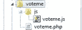
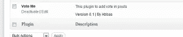
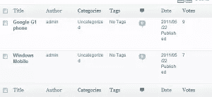
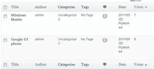
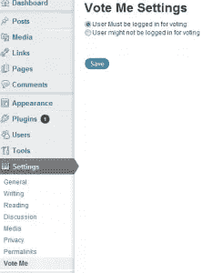
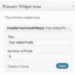

# 为 WordPress 创建一个投票插件

> 原文：<https://www.sitepoint.com/create-a-voting-plugin-for-wordpress/>

**简介**

WordPress 作为一个平台，已经从仅仅是一个博客平台，发展成为一个面向各种网站的平台。其中一个主要原因是 WordPress 可以很容易地被定制和扩展。这使得程序员可以创建比普通博客更多的功能性网站。在下面的教程中，我们将创建一个插件，使 wordpress 成为一个文章投票网站，并创建一个小部件来显示投票最多的帖子。

## 创建插件

要创建插件，在你的 wp-content/plugins/voteme 文件夹中创建一个文件 voteme.php。要创建一个插件，我们必须添加插件头，如下所示

```
<?php
/*
Plugin Name: Vote Me
Plugin URI:
Description: This plugin to add vote in posts
Author: Abbas
Version: 0.1
Author URI:
*/
```

我们还将为插件基础 url 定义一些命名的常量，插件路径如下:

```
define('VOTEMESURL', WP_PLUGIN_URL."/".dirname( plugin_basename( __FILE__ ) ) );
define('VOTEMEPATH', WP_PLUGIN_DIR."/".dirname( plugin_basename( __FILE__ ) ) );
```

此外，在您的 voteme 文件夹中创建一个 js 文件夹，并在其中添加一个文件 voteme.js 文件。

插件的文件夹结构如下。



我们现在将使用“wp_enqueue_scripts”将脚本入队，并将 JS 文件入队，并将其本地化以存储我们将用于 Ajax 调用的 WP Ajax url。

```
function voteme_enqueuescripts()
{
	wp_enqueue_script('voteme', VOTEMESURL.'/js/voteme.js', array('jquery'));
	wp_localize_script( 'voteme', 'votemeajax', array( 'ajaxurl' => admin_url( 'admin-ajax.php' ) ) );
}
add_action('wp_enqueue_scripts', voteme_enqueuescripts);</pre>
```

在这之后，我们应该能够在插件列表中看到我们的插件，我们应该激活它。



## 向帖子添加投票链接

现在我们将添加一个链接到所有显示当前投票的帖子，并添加一个链接到 ajax 投票。下面是代码

```
function voteme_getvotelink()
{
$votemelink = "";

$post_ID = get_the_ID();
$votemecount = get_post_meta($post_ID, '_votemecount', true) != '' ? get_post_meta($post_ID, '_votemecount', true) : '0';

$link = $votemecount.' <a onclick="votemeaddvote('.$post_ID.');">'.'Vote'.'</a>';

$votemelink = '<div id="voteme-'.$post_ID.'">';
$votemelink .= '<span>'.$link.'</span>';
$votemelink .= '</div>';

return $votemelink;
}

function voteme_printvotelink($content)
{
return $content.voteme_getvotelink();
}
add_filter('the_content', voteme_printvotelink);
```

这里，我们创建了一个函数`voteme_getvote`链接，它首先获取当前的文章 id，然后使用`get_post_meta`读取文章元`_votemecount`。我们使用帖子元`_votemecount`来存储特定帖子的投票。然后我们通过在点击链接时添加 JavaScript 函数`votemeaddvote`来创建一个链接。函数`votemeaddvote`我们很快就会看到。

接下来，我们使用 WordPress 过滤器`the_content`来挂钩我们的函数，在每个帖子后添加这个链接。现在你可以看到每篇文章下面的投票数量和投票链接。


## 使用 Ajax 添加投票

因为我们已经添加了投票链接到每个帖子，所以现在我们可以添加投票了。下面是 AJAX 投票发布的 JavaScript 函数

```
function votemeaddvote(postId)
{
	jQuery.ajax({
	type: 'POST',
	url: votemeajax.ajaxurl,
	data: {
	action: 'voteme_addvote',
	postid: postId
},

success:function(data, textStatus, XMLHttpRequest){

	var linkid = '#voteme-' + postId;
	jQuery(linkid).html('');
	jQuery(linkid).append(data);
	},
	error: function(MLHttpRequest, textStatus, errorThrown){
		alert(errorThrown);
		}
	});
}
```

这会向 WordPress 发送一个 AJAX 请求，并将动作作为`voteme_addvote`和文章 ID 发送。如果 AJAX 调用成功，它只是在 div 中添加该帖子的数据。如果有错误，它将只显示错误。

为了处理 AJAX 请求，我们必须创建一个函数，如下所示

```
function voteme_addvote()
{
		$results = '';
		global $wpdb;
		$post_ID = $_POST['postid'];
		$votemecount = get_post_meta($post_ID, '_votemecount', true) != '' ? get_post_meta($post_ID, '_votemecount', true) : '0';
		$votemecountNew = $votemecount + 1;
		update_post_meta($post_ID, '_votemecount', $votemecountNew);

		$results.='<div class="votescore" >'.$votemecountNew.'</div>';

		// Return the String
		die($results);
	}

		// creating Ajax call for WordPress
		add_action( 'wp_ajax_nopriv_voteme_addvote', 'voteme_addvote' );
		add_action( 'wp_ajax_voteme_addvote', 'voteme_addvote' );
```

在函数 voteme_addvote 中，我们从发布的数据中获取帖子 ID，然后获取该帖子的当前投票数。然后，我们将投票数增加 1，并再次更新帖子元。然后，我们用新的投票细节创建一个 div，并使用 die($results)将其发送回去；

注册这个函数来处理 AJAX 动作请求:使用下面的 wordpress 钩子

```
// creating Ajax call for WordPress
		add_action( 'wp_ajax_nopriv_voteme_addvote', 'voteme_addvote' );
		add_action( 'wp_ajax_voteme_addvote', 'voteme_addvote' );</pre>
```

现在我们可以点击投票链接，用 AJAX 在帖子上添加投票。


## 自定义 WordPress admin 来显示帖子投票

对于管理员来说，能够在文章编辑页面上看到投票是非常方便的。然后，从那里他将能够看到帖子的详细信息，以及该页面上的投票详细信息。

要添加投票详细信息，我们需要在过滤器“manage_edit-post_columns”上添加一个挂钩，以便在帖子编辑页面上将投票作为一列添加，如下所示。

```
add_filter( 'manage_edit-post_columns', 'voteme_extra_post_columns' );
function voteme_extra_post_columns( $columns ) {
$columns[ 'votemecount' ] = __( 'Votes' );
return $columns;
}
```

现在我们需要为该列提供要显示的值。为此，我们需要连接到过滤器`manage_posts_custom_column`。当我们挂钩到这个过滤器时，我们的函数`voteme_post_column_row`被调用，并带有 post 列名。这里我们只处理掉列`votemecount`并给出它的值。我们从自定义列`_votemecount`中读取值并回显。完整的代码如下。

```
function voteme_post_column_row( $column ) {
	if ( $column != 'votemecount' )
	return;

	global $post;
	$post_id = $post->ID;
	$votemecount = get_post_meta($post_id, '_votemecount', true) != '' ? get_post_meta($post_id, '_votemecount', true) : '0';
	echo $votemecount;

}

add_action( 'manage_posts_custom_column', 'voteme_post_column_row', 10, 2 );
```

在文章编辑页面上，您应该可以看到投票详情栏。



## 在 WordPress admin 中对投票基础的文章进行排序

如果我们让投票栏可排序，对管理员来说会很方便。他可以看到投票最多的帖子和投票最少的帖子。要做到这一点，首先我们必须使投票栏可点击排序。为此，我们挂接过滤器`manage_edit-post_sortable_columns`并向其添加投票列，如下所示。

```
add_filter( 'manage_edit-post_sortable_columns', 'voteme_post_sortable_columns' );

function voteme_post_sortable_columns( $columns )
{
	$columns[ 'votemecount' ] = votemecount;
	return $columns;
}
```

然后，当我们有了针对`votemecount`的 order by 请求时，我们在`load-edit.php`钩子上添加一个钩子，我们合并了排序参数

```
'meta_key' => '_votemecount',
'orderby' => 'meta_value_num'
```

以便根据自定义列进行排序，并将该列视为数字而不是字符串。它的代码如下。

```
add_action( 'load-edit.php', 'voteme_post_edit' );

function voteme_post_edit()
{
	add_filter( 'request', 'voteme_sort_posts' );
}
	function voteme_sort_posts( $vars )
{
	if ( isset( $vars['post_type'] ) &amp;&amp; 'post' == $vars['post_type'] )
	{
		if ( isset( $vars['orderby'] ) &amp;&amp; 'votemecount' == $vars['orderby'] )
		{
			$vars = array_merge(
			$vars,
			array(
			'meta_key' => '_votemecount',
			'orderby' => 'meta_value_num'
			)
			);
		}
	}
return $vars;
}
```

现在，在管理页面中，投票栏将是可点击的，点击它将根据投票的基础对帖子进行排序。



## 只允许注册用户投票

我们可能希望不是任何人都可以在帖子上投票。我们可能希望检查只有在我们网站上注册的用户才能投票。我们将通过为我们的插件创建一个设置页面来控制它，如下所示

```
// Settings

add_action('admin_menu', 'voteme_create_menu');

function voteme_create_menu() {
add_submenu_page('options-general.php','Vote Me','Vote Me','manage_options', __FILE__.'voteme_settings_page','voteme_settings_page');
}
function voteme_settings_page() {
?>

<div class="wrap">

<?php
global $blog_id;

if( isset( $_POST['votemeoptionssubmit'] ) )
{
update_option( 'votemelogincompulsory' , $_POST[ 'votemelogincompulsory' ] );
}

?>
<div id="settingsform">
<form id='votemesettingform' method="post" action="">

<h1><?php echo 'Vote Me Settings'; ?></h1>

<Input type = 'Radio' Name ='votemelogincompulsory' value= 'yes' <?php if( get_option('votemelogincompulsory') == 'yes' ) echo 'checked';?> >User Must be logged in for voting
<br/>
<Input type = 'Radio' Name ='votemelogincompulsory' value= 'no' <?php if( get_option('votemelogincompulsory') != 'yes' ) echo 'checked';?> >User might not be logged in for voting
<br/><br/>
<p class="submit">
<input type="submit" id="votemeoptionssubmit" name="votemeoptionssubmit" class="button-primary" value="<?php echo 'Save'; ?>" />
</p>

</form>

</div>

</div>
<?php }
```

在这里，我们挂钩到`admin_menu`并创建我们的设置页面，以显示是否只允许注册用户投票的单选按钮。然后，基于管理员选择的选项，我们更新选项`votemelogincompulsory`。设置页面将如下所示。



然后，更新`voteme_getvotelink`函数以读取选项`votemelogincompulsory`，并根据用户选择的选项以及用户是否登录来显示 votelink 或登录链接。其代码如下

```
function voteme_getvotelink()
{
	$votemelink = "";
	if( get_option('votemelogincompulsory') != 'yes' || is_user_logged_in() )
	{
		$post_ID = get_the_ID();
		$votemecount = get_post_meta($post_ID, '_votemecount', true) != '' ? get_post_meta($post_ID, '_votemecount', true) : '0';

		$link = $votemecount.' <a onclick="votemeaddvote('.$post_ID.');">'.'Vote'.'</a>';

		$votemelink = '<div id="voteme-'.$post_ID.'">';
		$votemelink .= '<span>'.$link.'</span>';
		$votemelink .= '</div>';
	}
else
{
	$register_link = site_url('wp-login.php', 'login') ;
	$votemelink = '<div class="votelink" >'." <a href=".$register_link.">"."Vote"."</a>".'</div>';
}

return $votemelink;
}
```

## 创建一个小部件来显示投票最多的帖子。

现在我们将创建一个小部件来显示投票最多的帖子。首先，我们创建一个名为`voteme_get_highest_voted_posts`的函数，它获取帖子的数量，然后按照投票最高的帖子的顺序显示这些帖子。它还显示了每个帖子的投票数。

```
function voteme_get_highest_voted_posts($numberofpost)
{
	$output = '';
	$the_query = new WP_Query( 'meta_key=_votemecount&amp;orderby=meta_value_num&amp;order=DESC&amp;posts_per_page='.$numberofpost );
	// The Loop
	while ( $the_query->have_posts() ) : $the_query->the_post();
	$output .= '<li>';
	$output .= '<a href="'.get_permalink(). '" rel="bookmark">'.get_the_title().'('.get_post_meta(get_the_ID(), '_votemecount', true).')'.'</a> ';
	$output .= '</li>';
	endwhile;
	wp_reset_postdata();
	return $output;
}
```

然后我们创建一个小部件，它从用户那里获取帖子的数量和标题，并使用 abpve 函数显示投票最多的帖子。

```
class VoteMeTopVotedWidget extends WP_Widget {

	function VoteMeTopVotedWidget() {
	// widget actual processes
	$widget_ops = array('classname' => 'VoteMeTopVotedWidget', 'description' => 'Widget for top voted Posts.' );
	$this->WP_Widget('VoteMeTopVotedWidget','VoteMeTopVotedWidget', $widget_ops);
}

function form($instance) {
	// outputs the options form on admin
	$defaults = array( 'title' => 'Top Voted Posts', 'numberofposts' => '5' );
	$instance = wp_parse_args( (array) $instance, $defaults );

	?>
	<p>
	<label for="<?php echo $this->get_field_id( 'title' ); ?>"><?php echo 'Title:'; ?></label>
	<input id="<?php echo $this->get_field_id( 'title' ); ?>" name="<?php echo $this->get_field_name( 'title' ); ?>" value="<?php echo $instance['title']; ?>" class="widefat" />
	</p>
	<p>
	<label for="<?php echo $this->get_field_id( 'numberofposts' ); ?>"><?php echo 'Number of Posts'; ?></label>
	<input id="<?php echo $this->get_field_id( 'numberofposts' ); ?>" name="<?php echo $this->get_field_name( 'numberofposts' ); ?>" value="<?php echo $instance['numberofposts']; ?>" class="widefat" />
	</p>

	<?php

}

function update($new_instance, $old_instance) {
	// processes widget options to be saved

	$instance = $old_instance;
	$instance['title'] = strip_tags( $new_instance['title'] );
	$instance['numberofposts'] = $new_instance['numberofposts'];
	return $instance;
}

function widget($args, $instance) {
	// outputs the content of the widget
	extract( $args );
	$title = apply_filters('widget_title', $instance['title'] );
	echo $before_widget;
	if ( $title )
	echo $before_title . $title . $after_title;

	echo '<ul>';
	echo voteme_get_highest_voted_posts($instance['numberofposts']);
	echo '</ul>';
	echo $after_widget;
}

}

function voteme_widget_init() {

	// Check for the required API functions
	if ( !function_exists('register_widget') )
	return;

	register_widget('VoteMeTopVotedWidget');
}

add_action('widgets_init', 'voteme_widget_init');</pre>
```

小部件将如下所示



在正面，小部件将如下所示


## 结论。

有了自定义字段，WordPress 让我们很容易扩展它以用于不同的目的。正如我们在本教程中看到的，WordPress 对 AJAX 有很好的支持。所以，祝 WordPress 开发愉快！

## 分享这篇文章