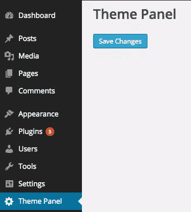
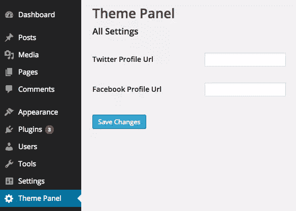
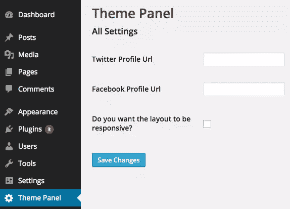
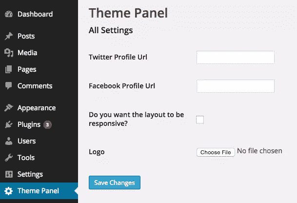

# 用设置 API 创建一个 WP 主题设置页面

> 原文：<https://www.sitepoint.com/create-a-wordpress-theme-settings-page-with-the-settings-api/>

大多数 WordPress 主题都有一个主题设置页面来定制它的特性、行为和风格。为主题提供一个主题设置页面可以让你的用户很容易定制你的主题，而不是直接编辑 PHP 或 CSS 文件。这使得更新你的主题更容易，因为用户不会丢失他们所做的更改。

在本教程中，我们将学习“WordPress”推荐的创建主题设置页面的方法，也就是使用 WordPress 设置 API。WordPress 设置 API 是在 WordPress 2.7 中添加的，从那时起，它已经成为最流行的 WordPress APIs 之一。如果你打算给你的 WordPress 插件添加一个设置页面，这个教程也会很有用。让我们开始吧。

## 我们应该在主题设置页面中包含什么？

主题设置页面中的选项取决于主题支持的功能和自定义。也就是说，每一个主题设置页面中都有一些共同的东西。一些常见的选项有:社会网址，静态或响应布局和标题标志等等。在本教程中，我将向你展示如何在我们的主题设置页面中包含这四个选项。

## 创建主题设置页面菜单项

首先，我们必须在管理面板上创建一个菜单项，将访问我们的主题设置页面。

我们可以使用 WordPress 菜单 API 创建一个菜单项。下面是创建菜单项的代码。

```
function theme_settings_page(){}

function add_theme_menu_item()
{
	add_menu_page("Theme Panel", "Theme Panel", "manage_options", "theme-panel", "theme_settings_page", null, 99);
}

add_action("admin_menu", "add_theme_menu_item");
```

这里，`theme-panel`是代表我们菜单项的唯一 ID。`theme_settings_page`是显示菜单 API 创建的页面内容的回调。接下来我们将编写这个函数的代码。

这是它的样子。


## 设置 API 概述

设置 API 用于填充菜单项 API 创建的页面。设置页面分为多个部分和字段。

出于本教程的考虑，我们将只创建一个部分，并将所有字段放在该部分中。

下面是`theme_settings_page`函数创建一个部分并添加提交按钮的代码。

```
function theme_settings_page()
{
    ?>
	    <div class="wrap">
	    <h1>Theme Panel</h1>
	    <form method="post" action="options.php">
	        <?php
	            settings_fields("section");
	            do_settings_sections("theme-options");      
	            submit_button(); 
	        ?>          
	    </form>
		</div>
	<?php
}
```

这里我们使用 ID 为`section`的`settings_field`注册一个部分。`theme-options`是属于一个部分的所有字段的组 ID。最后，`submit_button()`函数响应主题设置页面的提交按钮。

这应该是这样的。



## 添加社交档案 URL

现在，让我们在设置页面中添加字段来存储我们的脸书和 Twitter 个人资料 URL。几乎每个 WordPress 主题都有社交资料选项，因此这是一个方便实用的例子。

下面是使用设置 API 添加输入文本字段的代码。

```
function display_twitter_element()
{
	?>
    	<input type="text" name="twitter_url" id="twitter_url" value="<?php echo get_option('twitter_url'); ?>" />
    <?php
}

function display_facebook_element()
{
	?>
    	<input type="text" name="facebook_url" id="facebook_url" value="<?php echo get_option('facebook_url'); ?>" />
    <?php
}

function display_theme_panel_fields()
{
	add_settings_section("section", "All Settings", null, "theme-options");

	add_settings_field("twitter_url", "Twitter Profile Url", "display_twitter_element", "theme-options", "section");
    add_settings_field("facebook_url", "Facebook Profile Url", "display_facebook_element", "theme-options", "section");

    register_setting("section", "twitter_url");
    register_setting("section", "facebook_url");
}

add_action("admin_init", "display_theme_panel_fields");
```

初始化管理面板后，我们将注册部分和字段显示回调。这里我们使用了三个重要的函数:

1.  `add_settings_section`用于显示章节标题和描述。
2.  `add_settings_field`用于显示该字段的 HTML 代码。
3.  调用`register_setting`来自动保存字段的值。

这是我们的设置页面现在应该看起来的样子。



我们现在已经看到了如何使用设置页面添加输入文本字段。让我们看看如何通过提供在静态或响应性布局之间进行选择的选项来添加复选框。

## 添加选项以在布局之间进行选择

让我们看看如何展开`display_theme_panel_fields`函数来显示一个复选框，以便在布局之间进行选择。

下面是实现这一点的代码。

```
function display_twitter_element()
{
	?>
    	<input type="text" name="twitter_url" id="twitter_url" value="<?php echo get_option('twitter_url'); ?>" />
    <?php
}

function display_facebook_element()
{
	?>
    	<input type="text" name="facebook_url" id="facebook_url" value="<?php echo get_option('facebook_url'); ?>" />
    <?php
}

function display_layout_element()
{
	?>
		<input type="checkbox" name="theme_layout" value="1" <?php checked(1, get_option('theme_layout'), true); ?> /> 
	<?php
}

function display_theme_panel_fields()
{
	add_settings_section("section", "All Settings", null, "theme-options");

	add_settings_field("twitter_url", "Twitter Profile Url", "display_twitter_element", "theme-options", "section");
    add_settings_field("facebook_url", "Facebook Profile Url", "display_facebook_element", "theme-options", "section");
    add_settings_field("theme_layout", "Do you want the layout to be responsive?", "display_layout_element", "theme-options", "section");

    register_setting("section", "twitter_url");
    register_setting("section", "facebook_url");
    register_setting("section", "theme_layout");
}

add_action("admin_init", "display_theme_panel_fields");
```

我们使用`add_settings_field`添加了一个新的设置字段，并像往常一样使用`register_settings`注册它。需要注意的一点是，如果我们想知道用户是否选中了复选框，我们使用的是`checked()`函数。

`checked()`函数将一个值与另一个值进行比较，如果它们相等，那么它回显一个`checked`属性，否则什么也不回显。

这是我们的设置页面现在的样子。



## 上传徽标

`register_setting`函数接受第三个参数，这是一个回调函数，这个回调函数在将设置保存到数据库之前被触发。我们可以利用这个回调来处理上传。

下面是在我们的设置页面上传徽标的代码。

```
function logo_display()
{
	?>
        <input type="file" name="logo" /> 
        <?php echo get_option('logo'); ?>
   <?php
}

function handle_logo_upload()
{
	if(!empty($_FILES["demo-file"]["tmp_name"]))
	{
		$urls = wp_handle_upload($_FILES["logo"], array('test_form' => FALSE));
	    $temp = $urls["url"];
	    return $temp;   
	}

	return $option;
}

function display_theme_panel_fields()
{
	add_settings_section("section", "All Settings", null, "theme-options");

    add_settings_field("logo", "Logo", "logo_display", "theme-options", "section");  

    register_setting("section", "logo", "handle_logo_upload");
}

add_action("admin_init", "display_theme_panel_fields");
```

这里，我们使用`wp_handle_upload`来存储图像文件，检索它的 URL，并将其存储为一个选项。

这是我们的设置页面现在的样子，它的形状很好！



## 正在检索设置

主题需要在前端检索设置值。设置 API 使用选项 API 在内部存储这些值。因此，您可以使用`get_option()`函数检索这些值。

很简单，下面是代码。

```
<?php

$layout = get_option('theme_layout');
$facebook_url = get_option('facebook_url');
$twitter_url = get_option('twitter_url');
```

## 结论

在本文中，我们看到了如何使用设置 API 轻松创建主题设置页面。我们创建了一个文本、文件和复选框输入字段来接受各种数据格式的输入。继续尝试扩展页面并自己添加更多的表单控件。

## 分享这篇文章