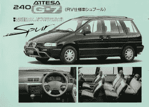
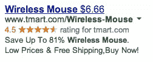

# 如何制作人们想点击的广告

> 原文：<https://www.sitepoint.com/create-ads-people-want-click/>

如果你在网络行业不到 10 年，你不会意识到你已经站在巨人的肩膀上了。

对于数字媒体来说，像黄页一样贬低平面广告是很平常的事情。但是如果不是这些年来无数的媒体研究，我们根本不知道如何制作一个有效的广告。

每年，黄页行业委托一个计量广告研究。第三方媒体研究公司将[电话追踪电话号码](http://www.haineslocalsearch.com/call-tracking/)放在近 20 万个展示广告上。这衡量广告绩效指标，如平均通话次数、每条线索的成本和投资回报。

这项研究揭示了一个有趣的现象。通常，同样大小的两个广告放在同一个标题下，会得到完全不同的点击率。当一个广告每月收到 87 个电话，而另一个广告收到 22 个电话时，研究人员想知道为什么。

他们发现，当缺乏消费者做出购买决定所需的信息时，广告的效果会很差。黄页行业利用这些数据开发了一个清单，列出了每个广告都应该包含的六个因素。

这些工作是因为黄页用户在决策过程中走得更远。但与黄页不同，互联网允许人们在购买过程中进行调查。因此，要制作人们想点击的广告，你的广告首先必须**相关**。

## 创建相关广告

1999 年，设计最好的小型货车广告也无法吸引我去买一辆。但在 2000 年，我的家庭增加了一个成员，小型货车开始满足我的需求。突然间，小型货车广告无处不在。

即使是设计最好的小型货车广告也很难吸引你——直到你的家庭足够大，你需要一个。照片:[约翰·劳埃德](http://www.flickr.com/photos/hugo90/)

根据约会安排大师斯科特·辛纳勒的说法，“你 60%的潜在客户创造成功将来自于简单地击中正确的目标。”这适用于所有的广告和营销。

家得宝[得到了这个教训](http://www.businessinsider.com/scaling-up-excellence-robert-sutton-huggy-rao-2014-1#ixzz2sP4WYctH)惨痛的教训:

> 该公司于 2006 年带着它的流行口号来到(中国):“你可以做到。我们可以提供帮助。”但文化研究表明，中国大多数人自己都不想做。他们希望有人为他们做这件事。

6 年后，家得宝关闭了在中国的所有门店。正如家得宝首席执行官弗兰克·布莱克后来告诉《财富》杂志的那样，“在中国，自己动手并不是一件值得骄傲的事情。”哎呀。

确保向正确的客户传达正确的信息。人们不看广告；他们阅读他们感兴趣的东西。在你考虑购买广告(或去中国)之前，确定你的目标受众。

## 可用性

可用性包括可读性、设计元素和有效的广告文案(例如引人注目的标题和行动号召)。下面就各说各的。

### PPC 广告的标题

如果我正在寻找一个人身伤害律师，因为我在一次车祸中受伤了，那么**在汽车中受伤？**比**史密斯和律师琼斯**更能吸引我的注意力。

在广告中，标题是你的广告文案中最重要的元素。对于点击付费广告，标题是三个可用行中的一个。所以要让它有价值。

让 PPC 标题更有效的一个方法是[动态关键词插入](https://support.google.com/adwords/answer/2454041?hl=en)。这将使您的标题和广告文案与搜索查询相匹配。(请注意，我的搜索查询*在线名片*同时出现在两者中。)

### 展示广告的标题

在展示广告中，你的标题不是广告文案中最重要的元素。这是您的广告文案中唯一的*元素。*

搜索广告的目标是寻找卖家的买家。但是看到你展示广告的消费者是在消费内容，而不是搜索你的产品或服务。

这意味着你必须将消费者的注意力从他们正在阅读的内容上转移开。所以你的展示广告必须结合强有力的标题陈述和吸引人的图形。

### 展示广告中的设计元素

在户外广告中，你有三秒钟的时间来吸引消费者的注意力。所以从广告牌设计的基本规则中选取一页:

*   简短副本
*   一个提议
*   清晰图形
*   可读字体
*   表现出来，不要说出来
*   印象越多越好

但是户外广告不是一个直接的回应媒介。因此，一定要在你的展示广告中加入[行动号召](https://www.sitepoint.com/5-tips-for-creating-an-effective-call-to-action-button/)。

就像以每小时 60 英里的速度旅行的通勤者一样，网络冲浪者不会在看到你的广告时就寻找你的产品或服务。这就是展示广告点击率低(. 05%)的原因。它更适合品牌推广和曝光，而不是产生直接的线索或销售。

也就是说，研究表明展示广告可以提高搜索广告的效果:

> 当横幅广告进入市场时，我们经常看到 SEM(搜索引擎营销)激增。很明显，横幅广告对知名度有明显的影响，即使它们不会立即产生点击。

在古罗马和庞贝城的废墟中发现了宣传酒馆、角斗游戏和出租房产的标志。虽然当时他们无法衡量印象和点击率，但有效广告设计的原则几乎同样古老。在正确的时间向正确的客户传递正确的信息。它在黄页和古罗马都有效。它也可以为你工作。

## 分享这篇文章