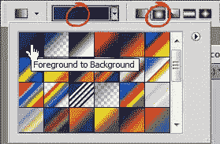
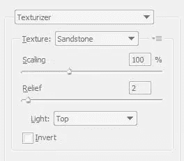
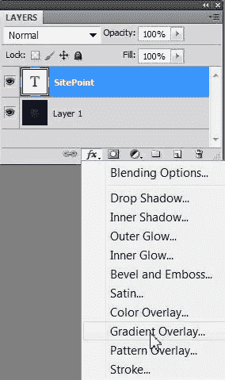
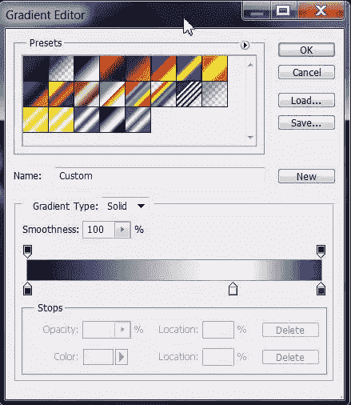
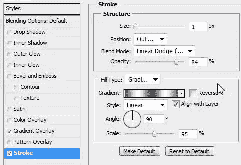
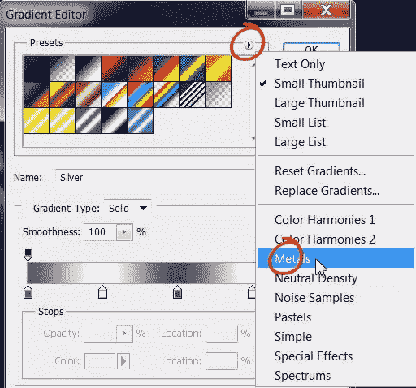
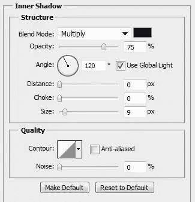
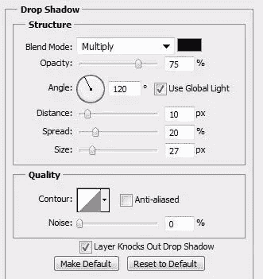

# 使用图层样式在 Photoshop 中创建一个简单复杂的金属字体

> 原文：<https://www.sitepoint.com/create-an-easy-sophisticated-metal-type-in-photoshop-with-layer-styles/>

Photoshop 中的图层样式允许我们创建一系列令人难以置信的效果，如玻璃、冰或塑料。最重要的是，在你使用样式得到你喜欢的效果后，你可以保存它并在不同层的其他对象上重复使用。

1.创建一个 600 x 600 像素的新文档。

2.将前景色设置为#003366(深蓝色)，将背景色设置为#000033(深蓝色/深蓝色)。选择渐变工具(G)，在屏幕顶部的工具选项栏上，选择“前景到背景”，然后选择“径向渐变”。

3.从文档的中心向边缘拖动，这样就有了一个渐变，看起来有点像这样:

为了给背景更多的纹理，选择**滤镜>纹理>纹理器**。选择砂岩作为纹理，100%用于缩放，2%用于浮雕。单击“确定”应用纹理。

这是背景设置。现在我们可以专注于类型。

4.添加一些文本。我用的是 Times New Roman 普通字体，150 磅，设为白色。

5.选中文字图层，点击图层面板底部的图层样式图标，从下拉菜单中选择渐变叠加。

当渐变叠加对话框打开时，点击中间的渐变打开渐变编辑器。如下设置一个有三个停靠点的坡度。第一站是深蓝色(#000033)，第二站是白色，右手边的第三站是中蓝色(#003366)。先不要单击确定。

6.现在点击左边的单词 Stroke。设置描边大小为 1 px，位置为外侧，不透明度为 84%。设置填充类型为渐变，然后点击中间的渐变。

当渐变编辑器打开时，点击右上角的小三角形，从下拉菜单中选择金属。然后从预设中选择银色。单击“确定”关闭渐变编辑器。

7.仍然在图层样式对话框中，选择内阴影并使用以下设置。先不要单击确定。

8.如果没有阴影，我们会在哪里完成呢？单击左侧的“投影”字样，并进行以下设置:

最终的效果应该是这样的。

要保存您创建的样式以备将来使用，只需单击图层样式对话框中的新建样式按钮并为其命名。

通过点击图层面板上的名称，可以很容易地返回并更改您应用的任何样式，文本仍然是完全可编辑的。

## 分享这篇文章