# 在 InDesign 中创建优雅的复古海报

> 原文：<https://www.sitepoint.com/create-an-elegant-retro-poster-in-indesign/>

有人说“老是金”，当谈到复古或复古风格时，没有什么比这更正确的了。怀旧的设计会抓住你的注意力，无论是名片、传单、广告、横幅还是海报。现代艺术有它自己的吸引力，但是当你正在寻找一些有额外的优势或独特吸引力的东西时，复古主题正是你要去的。

所以，今天我们要打造一张优雅的复古海报。我们知道海报是宣传产品或活动的好方法。没有必要说他们的有效性，因为他们在任何营销活动中排名第一。因此，今天我们将在 InDesign 中使用一些有效且有趣的技术、工具和技巧来设计我们的海报。让我们开始陈述吧。

**完成的设计([下载完成的分层设计文件](https://www.dropbox.com/s/ojkeo45jnarq62a/Poster.zip)。)**

### 第一步

打开 InDesign，点击“新建”>“文档”，使用如下设置。我们将使用 8.5 英寸宽，11 英寸高，0.25 英寸出血的垂直美国字母。确保您也取消了“对开页”选项。

[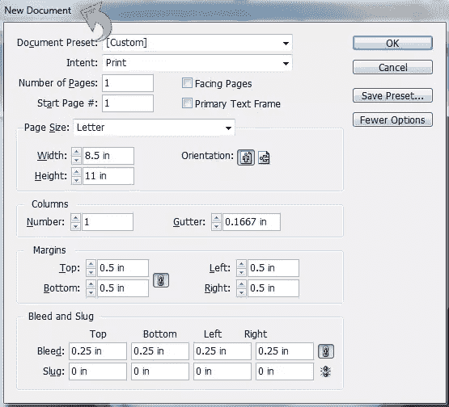](https://www.sitepoint.com/wp-content/uploads/2013/05/Step-12.jpg)

### 第二步

首先，改变屏幕模式，这样你就可以清楚地看到没有所有这些空白和参考线的设计。所以，点击“查看”>“屏幕模式”>“预览”

现在我们可以开始设计了。对于背景，选择矩形工具，创建一个大矩形，填充深蓝色样本(C=100 M=100 Y=87 K=0)。

### 第三步

我们将为背景创建一个非常亮的图案。因此，创建一个新层(通过点击图层面板中的新层图标)。现在，选择线条工具，用灰色样本画一条垂直线。用浅灰色样本(C=0 M=0 Y=0 K=20)给线条添加一个 4pt 的“粗粗”描边。然后，将线条不透明度降低到只有 10%。

[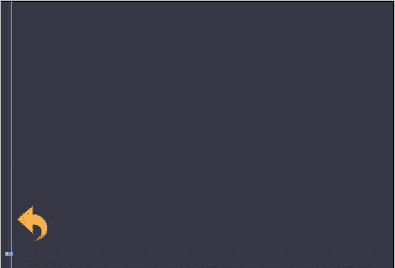](https://www.sitepoint.com/wp-content/uploads/2013/05/Step-31.jpg)

### 第四步

现在，右键点击上面的线条图层，复制几次，为我们的背景创建一个简单的图案。

[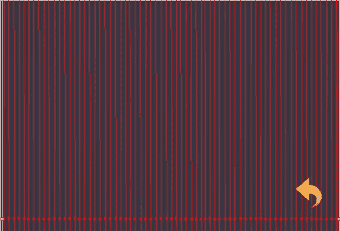](https://www.sitepoint.com/wp-content/uploads/2013/05/Step-41.jpg)

### 第五步

现在，我们将从页眉开始，因此为背景选择矩形工具并在顶部创建一个矩形并用深蓝色样本填充它(C=100 M=100 Y=92 K=0)。

[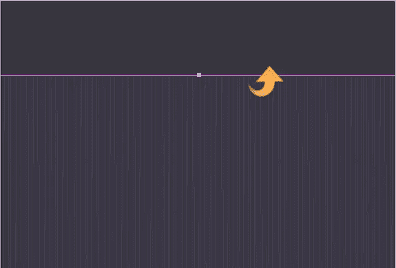](https://www.sitepoint.com/wp-content/uploads/2013/05/Step-5.jpg)

### 第六步

选择上面的矩形图层，将不透明度降低到 80%。然后，用浅灰色样本(C=0 M=0 Y=0 K=2)添加一个 10pt 的“波浪形”描边。

[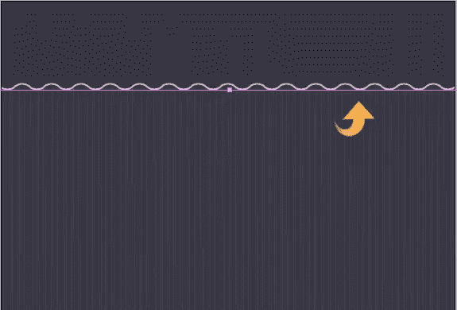](https://www.sitepoint.com/wp-content/uploads/2013/05/Step-61.jpg)

### 第七步

现在，我们将添加一些阴影和外发光到上面的矩形，所以选择层并点击“效果”面板添加一些阴影。将混合模式改为“正片”，不透明度降低到 48%，其余设置保持不变，如下图所示。

[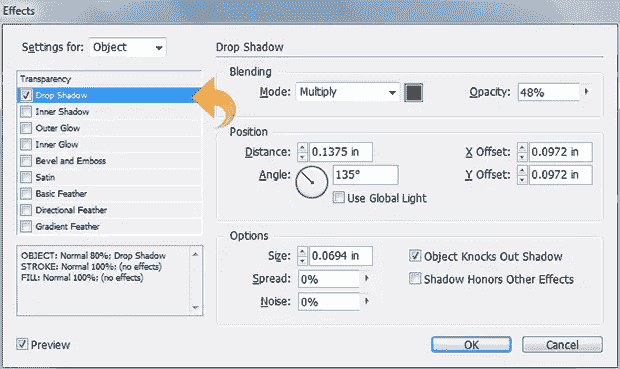](https://www.sitepoint.com/wp-content/uploads/2013/05/Step-7a.jpg)

现在，选择外部发光，改变混合模式为“屏幕”，减少不透明度为 16%，并保持其余的设置如下所示。

[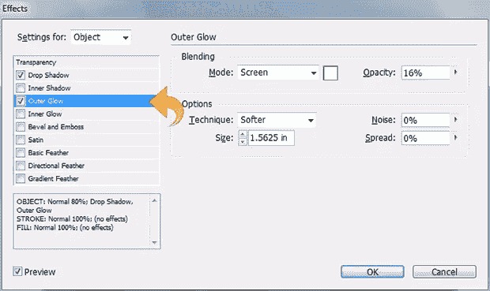](https://www.sitepoint.com/wp-content/uploads/2013/05/Step-7b1.jpg)

### 第八步

再次选择矩形工具，在顶部创建一个小长条，用色样填充(C=18 M=87 Y=0 K=2)。然后，用色样(C=0 M=83 Y=56 K=11)添加一个 7pt 的“虚线”描边。

现在，选择条形层，点击“效果”面板添加一些阴影。使用浅色样本(C=0 M=0 Y=0 K=2)并将混合模式调整为“正常”，不透明度调整为 100%。保持其余设置不变，如下所示。

[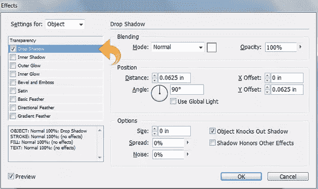](https://www.sitepoint.com/wp-content/uploads/2013/05/Step-88.jpg)

### 第九步

选择文字工具并添加标题文本。然后，点击“效果”面板，给标题添加一些阴影。

[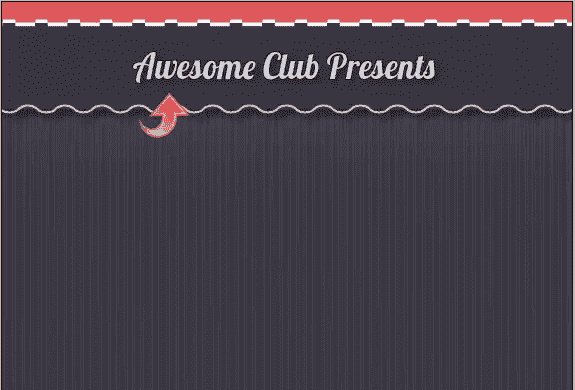](https://www.sitepoint.com/wp-content/uploads/2013/05/Step-91.jpg)

### 第十步

现在，让我们继续我们的海报的主要领域，所以选择椭圆工具，创建一个圆，并填充浅色样本(C=0 M=0 Y=0 K=2)。然后，使用色样(C=0 M=83 Y=56 K=11)添加一个 36 磅的“波浪”描边。

[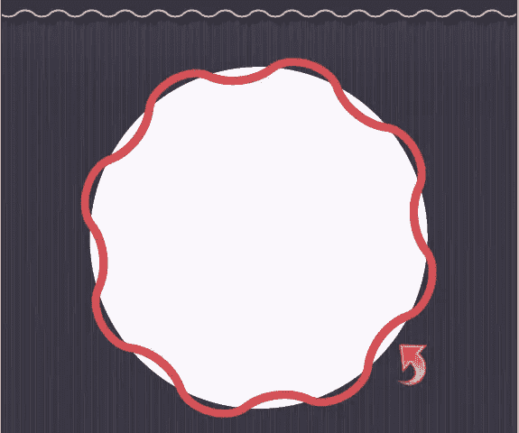](https://www.sitepoint.com/wp-content/uploads/2013/05/Step-10.jpg)

### 步骤 11

选择上面的圆形图层，点击“效果”面板添加一些阴影。将混合模式调整为“正片”，不透明度设置为 60%。保持其余设置不变，如下所示。

[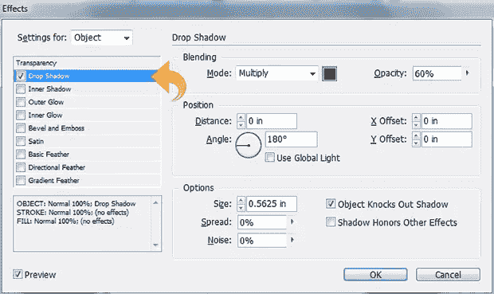](https://www.sitepoint.com/wp-content/uploads/2013/05/Step-112.jpg)

### 步骤 12

再次选择椭圆工具，创建一个圆，填充浅色色样(C=0 M=0 Y=0 K=20)。然后使用色样(C=100 M=100 Y=87 K=0)添加一个 29 磅的“虚线”描边。

[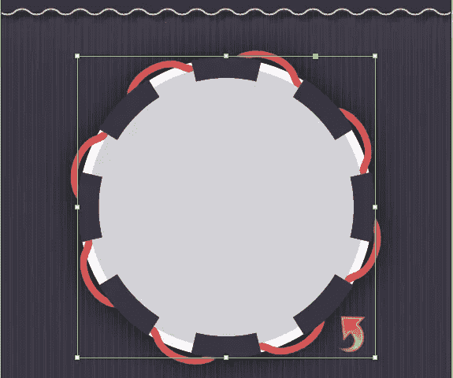](https://www.sitepoint.com/wp-content/uploads/2013/05/Step-121.jpg)

### 第十三步

再次选择椭圆工具，创建一个圆，填充浅色样本(C=0 M=0 Y=0 K=20)。然后使用色样(C=0 M=0 Y=0 K=42)添加一个 20 磅的“虚线”描边。

[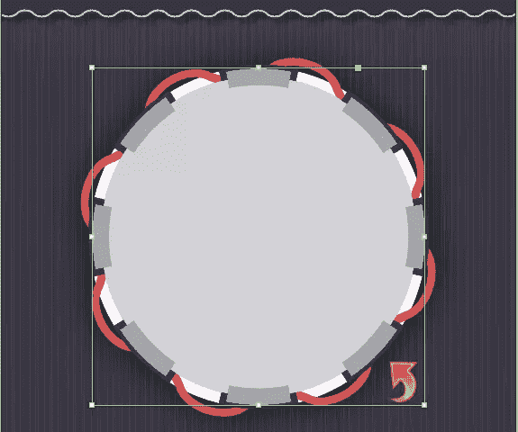](https://www.sitepoint.com/wp-content/uploads/2013/05/Step-131.jpg)

### 步骤 14

再次选择椭圆工具，创建一个小圆，填充浅色色样(C=0 M=0 Y=0 K=20)。然后用色板(C=100 M=100 Y=87 K=0)添加一个 13pt 的“直散列”描边。

现在，选择上面的圆形图层，点击“效果”面板添加一些阴影。使用黑色色样，调整混合模式为“正常”，不透明度为 100%。保持其余设置不变，如下所示。

[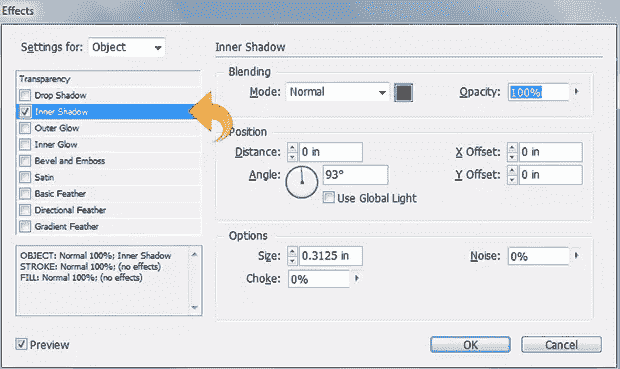](https://www.sitepoint.com/wp-content/uploads/2013/05/Step-142.jpg)

### 第十五步

现在，选择文字工具并添加主要文本。然后，点击“效果”面板，添加一些阴影。保持设置与下图相同。

[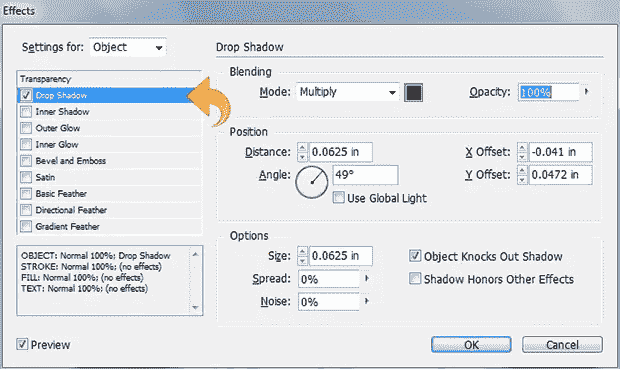](https://www.sitepoint.com/wp-content/uploads/2013/05/Step-152.jpg)

### 第十六步

选择线条工具，用浅色样本创建一条小线条。然后，用深蓝色色块添加一个 10 磅的“虚线”描边。现在，选择线条，点击“效果”面板，添加一些阴影。现在，重复同样的过程，在顶部创建另一条线。

### 步骤 17

选择文字工具并添加日期，然后点击效果面板并添加一些阴影。保持如下图所示的设置。

[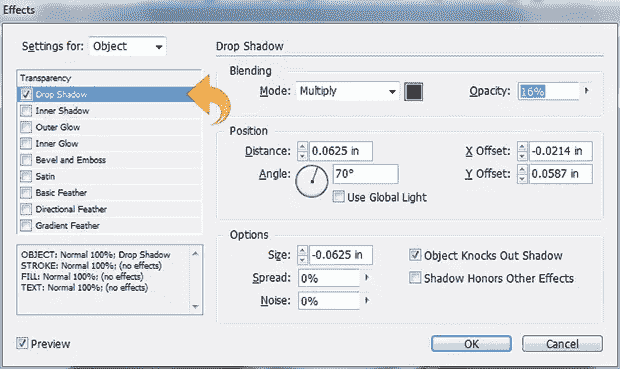](https://www.sitepoint.com/wp-content/uploads/2013/05/Step-171.jpg)

### 步骤 18

现在对于页脚，选择矩形工具，在底部创建一个矩形，并用深蓝色样本填充(C=100 M=100 Y=92 K=0)。然后，用浅灰色样本(C=0 M=0 Y=0 K=2)添加一个 10pt 的“波浪形”描边。

### 步骤 19

现在，使用矩形工具在底部创建一个小长条，并用色样填充(C=18 M=87 Y=0 K=2)。然后，用色样(C=0 M=83 Y=56 K=11)添加一个 7pt 的“虚线”描边。最后，选择条形层，点击“效果”面板添加一些阴影。保持设置与上述条相同。

### 步骤 20

选择文字工具，使用灰色样本和 1 磅黑色样本笔画或文本添加一些细节。我们完了！我们时尚优雅的复古海报完成了。

我希望你们喜欢这个教程，我会带更多回来，在那之前保重！

## 分享这篇文章