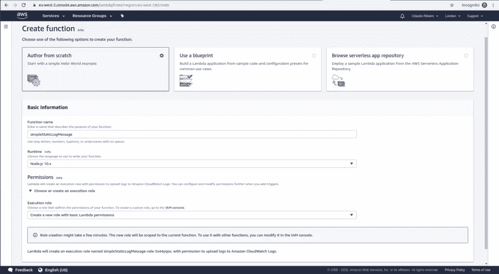
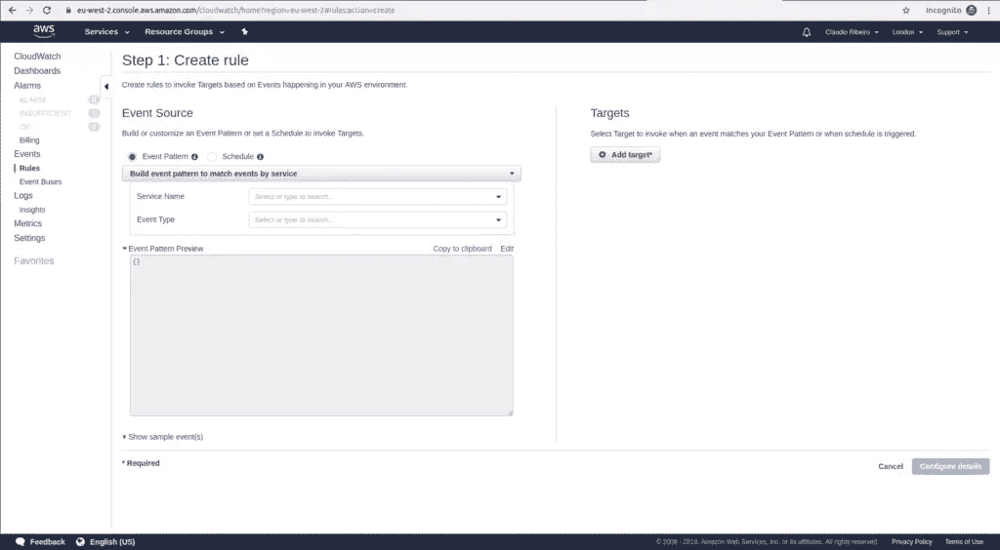
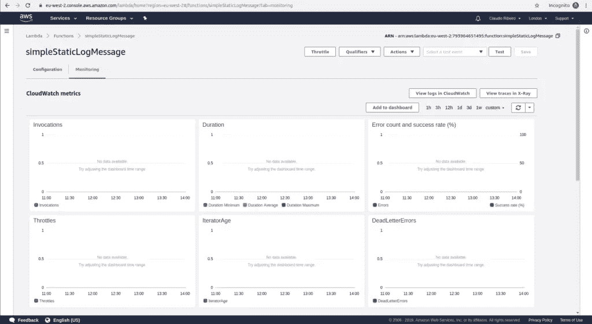

# 在 AWS Lambda 上创建 Cron 作业

> 原文：<https://www.sitepoint.com/create-aws-lambda-cron-job/>

在任何 Linux 或类 Unix 操作系统中，Cron 作业都是非常有用的工具。它们允许我们安排脚本定期执行。它们的灵活性使其成为备份和系统清理等重复性任务的理想选择，同时也是数据获取和数据处理的理想选择。

尽管 cron jobs 提供了很多好处，但它也有一些缺点。最主要的一点是，你需要一台专门的服务器或一台几乎全天候运行的计算机。我们大多数人都没有这种奢侈。对于我们这些没有机会接触到这样一台机器的人来说，AWS Lambda 是一个完美的解决方案。

AWS Lambda 是一个事件驱动的无服务器计算平台，是亚马逊网络服务的一部分。它是一种计算服务，运行代码来响应事件，并自动管理代码所需的计算资源。它不仅可以 24/7 全天候运行我们的作业，还可以自动分配作业所需的资源。

在 AWS 中设置 Lambda 不仅仅是实现几个函数并希望它们定期运行。要启动并运行它们，首先需要配置几个服务，并且需要协同工作。在本教程中，我们将首先浏览我们需要设置的所有服务，然后我们将实现一个 cron 作业来获取一些更新的加密货币价格。

## 了解基础知识

正如我们前面所说的，为了让我们的 Lambda 函数像 cron 作业一样工作，一些 AWS 服务需要协同工作。让我们看一看其中的每一项，并了解它们在基础架构中的作用。

### S3 水桶

> 亚马逊 S3 存储桶是亚马逊网络服务(AWS)简单存储服务(S3)中的公共云存储资源，这是一种对象存储产品。亚马逊 S3 存储桶类似于文件夹，存储由数据及其描述性元数据组成的对象。— [TechTarget](https://searchaws.techtarget.com/definition/AWS-bucket)

每个 Lambda 函数都需要准备成一个“部署包”。部署包是一个`.zip`文件，由代码和代码可能需要的任何依赖项组成。然后，这个`.zip`文件可以通过网络控制台上传，或者放在一个 S3 桶中。

### IAM 角色

> IAM 角色是您可以在拥有特定权限的帐户中创建的 IAM 身份。IAM 角色类似于 IAM 用户，因为它是一个 AWS 身份，权限策略决定该身份在 AWS 中可以做什么和不可以做什么。— [亚马逊](https://docs.aws.amazon.com/IAM/latest/UserGuide/id_roles.html)

我们需要用 IAM 管理 Lambda 函数的权限。至少它应该能够写日志，所以它需要访问 CloudWatch 日志。这是最低要求，我们可能需要 Lambda 函数的其他权限。要了解更多信息， [AWS Lambda 权限页面](https://docs.aws.amazon.com/lambda/latest/dg/lambda-permissions.html)有所有需要的信息。

### 云观察事件规则

CloudWatch 事件支持类似 cron 的表达式，我们可以用它来定义事件的创建频率。我们还需要确保添加 Lambda 函数作为这些事件的目标。

### λ许可

创建事件并以 Lambda 函数为目标是不够的。我们还需要确保事件被允许调用我们的 Lambda 函数。任何想要调用 Lambda 函数的东西都需要有明确的许可才能这样做。

这些是我们 AWS Lambda cron 工作的组成部分。既然我们已经对工作的所有活动部分有了一个概念，让我们看看如何在 AWS 上实现它。

## 在 AWS 上实现 Cron 作业

我们之前描述的很多交互都是由 Amazon 自动处理的。简而言之，我们需要做的就是实现我们的服务(实际的 lambda 函数)并向它添加规则(lambda 将被执行的频率和方式)。权限和角色都由 Amazon 负责；亚马逊提供的默认设置是我们将要使用的。

### λ函数

首先，让我们从实现一个非常简单的 lambda 函数开始。在 AWS 仪表板中，使用*查找服务*功能通过`lambda`进行搜索。在 lambda 控制台中，选择`Create a function`。此时，我们应该在*λ*>*函数* > *reate 函数*。

为了让事情进展顺利，让我们从静态日志消息开始。我们的服务将只是打印功能。为此，我们将使用 Node.js 10x 作为运行时语言。给它一个函数名，并在*上执行角色*让我们继续使用*创建一个具有基本 lambda 权限的新角色*。这是 IAM 上的一组基本权限，允许我们将日志上传到 Amazon CloudWatch 日志。点击*创建功能*。



我们的函数现在是用 IAM 角色创建的。在“代码”框中，用以下代码替换默认代码:

```
exports.handler = async (event) => {
    console.log("Hello Sitepoint Reader!");
    return {};
}; 
```

为了检查代码是否正确执行，我们可以使用*测试*函数。在给我们的测试命名后，它将执行代码，并在代码下方的*执行结果*字段中显示其输出。

如果我们测试上面的代码，我们可以看到没有响应，但是在函数日志中，我们可以看到我们打印了消息。这表明我们的服务运行正常，因此我们可以继续我们的 cron 实现。

### 规则

我们创建 Cron 的下一步是创建循环 CloudWatch 触发器。这些将确保我们的 lambda 函数循环执行。

让我们进入*服务*菜单，选择*管理&治理*下的*云监控*。因为我们需要创建一个新规则，只需在左侧菜单中选择*规则*选项。我们可以在*事件*下找到。在规则控制台上，只需点击*新建规则*按钮。



仔细一看，在*事件源*的正下方，可以看到两个选项:*事件模式*和*日程*。我们想要调度特定目标的调用，所以让我们选择*调度*选项。现在我们可以使用表单输入一个固定的执行率，或者我们可以输入一个 [crontab 规则](https://en.wikipedia.org/wiki/Cron#Overview)。对于这种特殊情况，我们将使用一分钟的固定速率。选择了我们的比率后，我们知道需要选择什么将是我们的调用目标。在右侧的*目标*菜单下，我们点击*添加目标*。在下拉菜单中选择*λ函数*，并在*函数*下拉菜单中选择我们的`simpleStaticLogMessage`λ函数。

然后，我们必须单击 *Configure Details* 为我们新创建的规则添加名称和描述。该状态需要*使能*。最后，点击*创建规则*来创建我们的规则。

创建了 Lambda 函数和调度规则后，让我们最终将它投入使用。让我们回到 Lambda 控制台，选择我们的`simpleStaticLogMessage`功能并点击左上角的*监控*。这个监控仪表板有大量的图形来显示我们服务的使用情况。从调用、持续时间和错误到 DeadLetterErrors，这个仪表板拥有我们分析服务使用情况所需的所有信息。

记住，这个 lambda 函数没有出站流量，所以我们需要检查日志，看看它是否工作。所以选择右侧的*查看 CloudWatch* 中的日志。



只要打开我们函数的日志流，我们应该能够看到我们的“Hello Sitepoint Reader！”每分钟都会弹出消息！

这是一个非常简单的服务，没有实际用途，所以让我们通过返回到 *CloudWatch* 控制台中的 *Rules* 菜单来禁用它，选择规则并在 *Actions* 下点击 delete 选项。

## 我们的加密货币服务

既然我们知道了如何使用 AWS Lambda 创建 cron 作业，我们就可以专注于创建能够带来一些价值的服务。我们将使用 Python 3.7 运行时来创建一个 Lambda 函数，该函数将获取前三种加密货币的当前值(以美元计)。然后，我们将打印它们，就像我们对简单示例所做的那样。这样，每分钟我们都会有比特币、以太坊和莱特币的更新值。

创建一个新的 Lambda 函数，就像我们对静态日志所做的那样，并添加以下代码:

```
import json
from botocore.vendored import requests

def lambda_handler(event, context):

    bitcoin_api_url = 'https://api.coinmarketcap.com/v1/ticker/bitcoin/'
    ethereum_api_url = 'https://api.coinmarketcap.com/v1/ticker/ethereum/'
    litecoin_api_url = 'https://api.coinmarketcap.com/v1/ticker/litecoin/'

    bitcoin_response = requests.get(bitcoin_api_url)
    bitcoin_response_json = bitcoin_response.json()

    ethereum_response = requests.get(ethereum_api_url)
    ethereum_response_json = ethereum_response.json()

    litecoin_response = requests.get(litecoin_api_url)
    litecoin_response_json = litecoin_response.json()

    print("BTC: " + bitcoin_response_json[0]['price_usd'])
    print("ETH: " + ethereum_response_json[0]['price_usd'])
    print("LTC: " + litecoin_response_json[0]['price_usd'])

    return {} 
```

关于上面代码的一些快速注释。默认情况下，`requests`库在 Lambda 上不可用。所以，我们要么安装它，要么使用`from botocore.vendored import requests`线来访问它。然后我们将使用`requests`库从 coinmarketcap API 获取信息。最后，我们只打印每种加密货币的值。

从这里我们需要添加一个规则，然后最终在 CloudWatch 上观察它的工作。在日志中记录这些信息并没有多大用处，但是从这里我们有很多方法可以获取这些信息。我们可以将它存储在 DynamoDB 数据库中，我们可以使用 SQS 和社交网络或我们能想到的任何其他用途将它发送到不同的服务。

## 结论

能够让 cron 作业在云上运行会给企业带来巨大的变化。有了 AWS Lambda，我们不再需要资源有限的专用机器全天候进行昂贵的计算。我们现在可以获得几乎无限的计算能力，而无需降低我们业务的速度和可用性。

## 分享这篇文章