# 在 Photoshop 中创建一个干净的立体派标志

> 原文：<https://www.sitepoint.com/create-clean-cubist-logo-photoshop/>

想想你最喜欢的名牌。首先想到的是 logo。标识在建立一个令人难忘的品牌中起着最重要的作用，但是将一个组织所有令人钦佩的方面浓缩到一个简单的符号中是一项艰巨的任务。问任何一个设计师或品牌经理，他们都会重申正确的标识是多么重要。

从设计师的角度来看，它应该具有美学吸引力，并有效地传达品牌信息。当设计一个标志时，你应该特别注意字体、间距和符号，因为你的标志设计可以创造或破坏品牌印象。

在本教程中，我们将创建一个干净的审美时尚的立体派标志。我们将使用一些有趣的技术和混合选项来实现最终的结果。在我们开始标识之前，让我们先来看看最终的结果。

[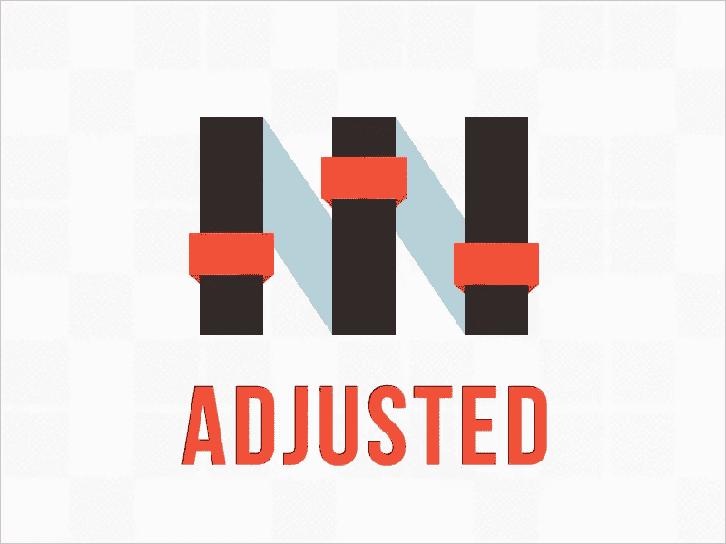](https://www.sitepoint.com/wp-content/uploads/2013/09/Logo-Final.jpg)

([下载完成的，分层的 Photoshop 文件](https://www.dropbox.com/s/mtqvn0zoxe5idtj/Clean%20n%20Cubist%20Logo.zip)。)

### 第一步:

打开 Photoshop，创建一个新文件。对于新文件，我将宽度设置为 800 像素，高度设置为 600 像素。

### 第二步:

我们的标志将具有时尚的立体派风格，同时保持预期的干净和锐利的外观。我们要设计一个非常著名的虚构品牌“Adjusted”的 logo。所以，先从基数说起。由于我们的公司名称是“调整”，我们将设计表盘或控制器形状的标志。因此，首先创建一个新层，点击“层”>“新层”或者你也可以使用“层”面板中的“新层”选项。

现在选择矩形工具，创建一个矩形，填充颜色#362f2d。
[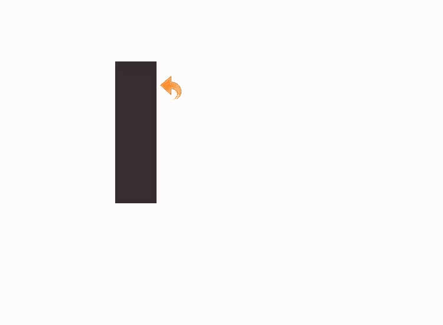](https://www.sitepoint.com/wp-content/uploads/2013/09/Step-2l.jpg)

### 第三步:

我们将重复同样的过程，创建另一个矩形，并填充相同的颜色。向右移动，使两个矩形相距 75px。
[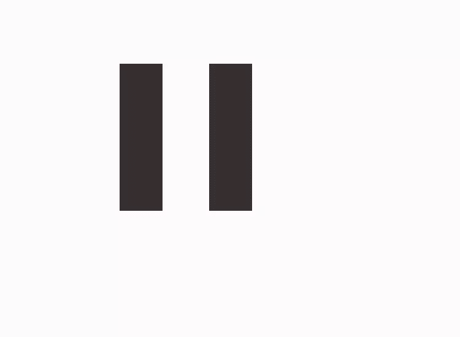](https://www.sitepoint.com/wp-content/uploads/2013/09/Step-3l.jpg)

### 第四步:

再次，重复相同的过程，创建另一个矩形，并填充与前两个相同的颜色。像前面一样向右移动第三个矩形。
[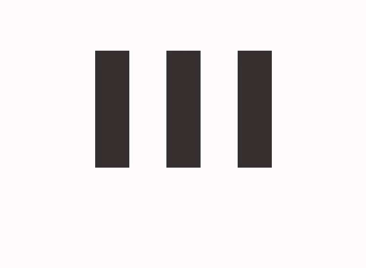](https://www.sitepoint.com/wp-content/uploads/2013/09/Step-4l.jpg)

### 第五步:

创建一个新层。选择钢笔工具创建一个形状，用颜色#b1cfd7 填充，然后将形状层放在矩形层下面。
[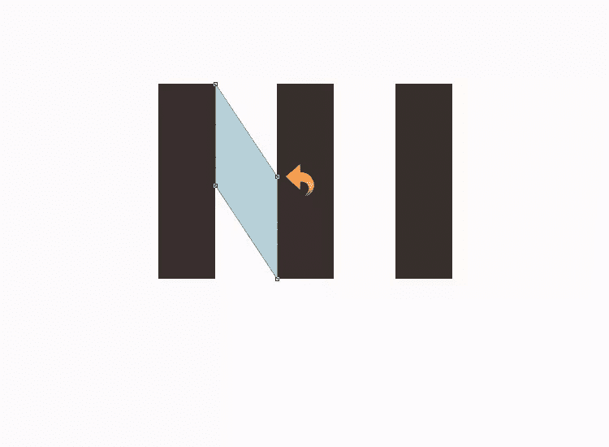](https://www.sitepoint.com/wp-content/uploads/2013/09/Step-5l.jpg)

### 第六步:

重复同样的过程；用钢笔工具创建另一个形状，填充颜色#b1cfd7。把它放在矩形层下面。
[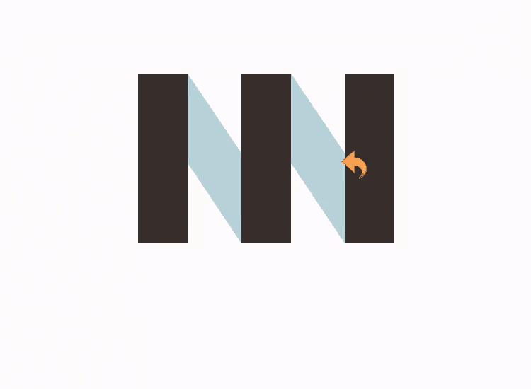](https://www.sitepoint.com/wp-content/uploads/2013/09/Step-6l.jpg)

### 第七步:

现在为手柄，使用矩形工具创建一个小矩形，填充颜色#ff5337。
[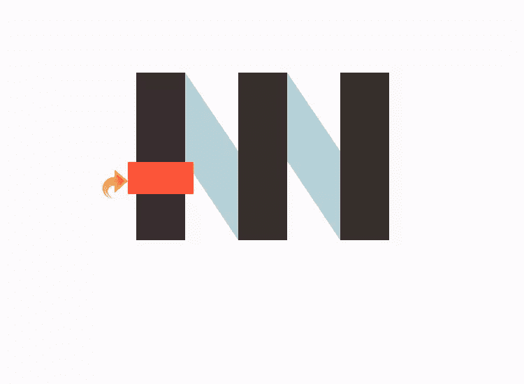](https://www.sitepoint.com/wp-content/uploads/2013/09/Step-7l.jpg)

### 第八步:

对于折叠的边缘，选择钢笔工具在左侧创建一个小三角形。选择颜色#ca402a 填充这个三角形。
[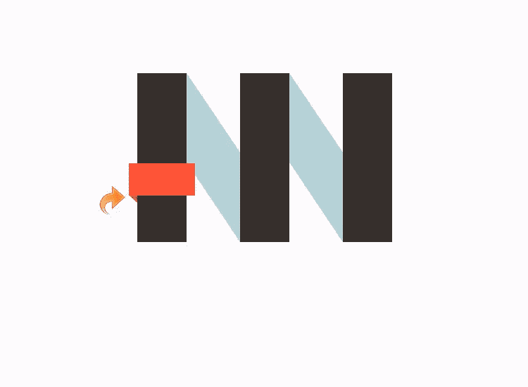](https://www.sitepoint.com/wp-content/uploads/2013/09/Step-8l.jpg)

### 第九步:

再次选择钢笔工具，在右侧创建另一个三角形，填充相同的颜色(#ca402a)。
[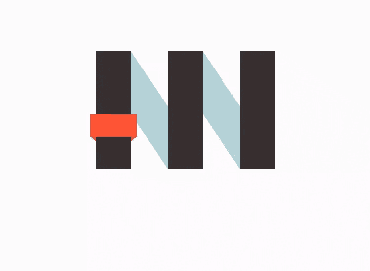](https://www.sitepoint.com/wp-content/uploads/2013/09/Step-9l.jpg)

### 第十步:

重复相同的过程，用相同的颜色和折叠的边创建另外两个手柄。
[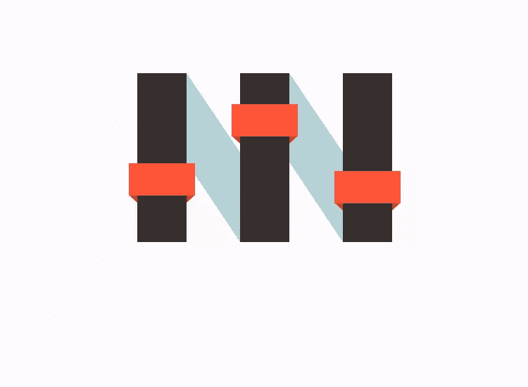](https://www.sitepoint.com/wp-content/uploads/2013/09/Step-10l.jpg)

### 第十一步:

现在，让我们从造型开始。首先，我们将处理主矩形。点击“图层”>“图层样式”>“笔画”。用颜色#1e1a19 添加一个 1px 的描边，使用如下设置。
[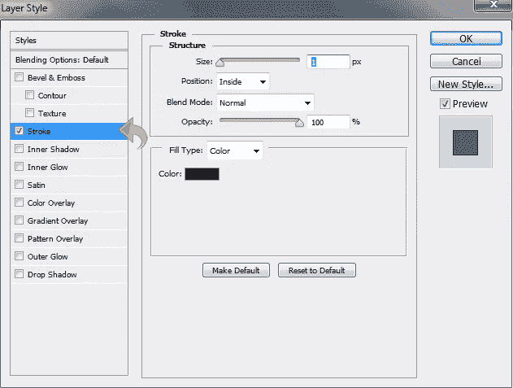](https://www.sitepoint.com/wp-content/uploads/2013/09/Step-11.jpg)

### 第十二步:

现在，我们将添加一些立体派风格到我们的标志上，用许多微妙的几何形状覆盖我们的标志。首先，我们将选择矩形层，并通过按下 Command-Opt(对于 Mac)或 Ctrl-Alt(对于 Win)+“G”来创建一个剪切蒙版。

然后，选择钢笔工具，创建一个三角形。用#362f2d 颜色填充。然后，改变混合模式为“乘”，减少不透明度为 33%。
[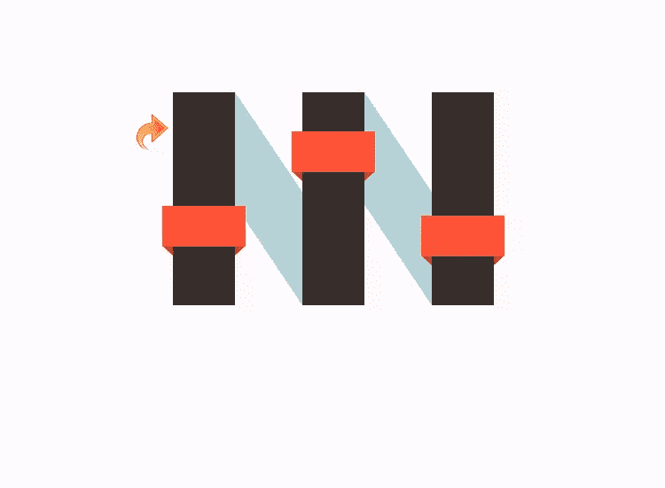](https://www.sitepoint.com/wp-content/uploads/2013/09/Step-12l.jpg)

### 第十三步:

选择钢笔工具，创建另一个三角形，就像以前一样。填充颜色#7d7d7d，不透明度降低到 33%，混合模式改为“正片”。
[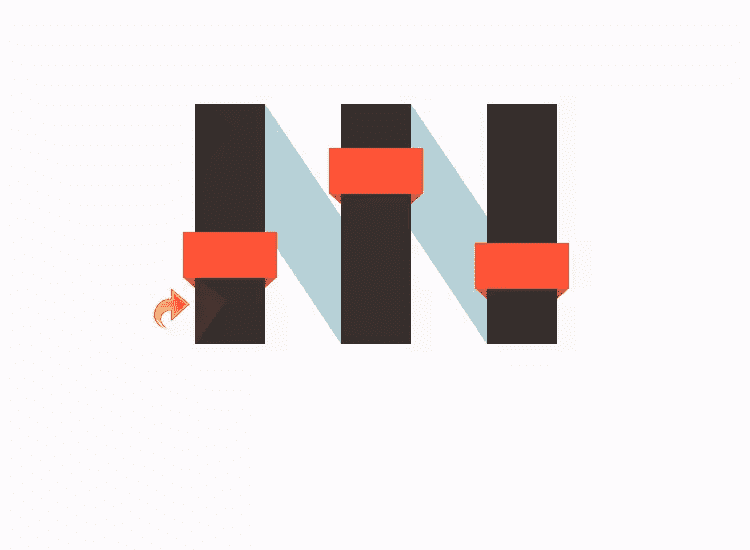](https://www.sitepoint.com/wp-content/uploads/2013/09/Step-13l.jpg)

### 第十四步:

现在，重复同样的过程，用同样的技巧添加其余的三角形；不要忘记改变这些三角形的混合模式为“乘”，不透明度保持在 33%。
[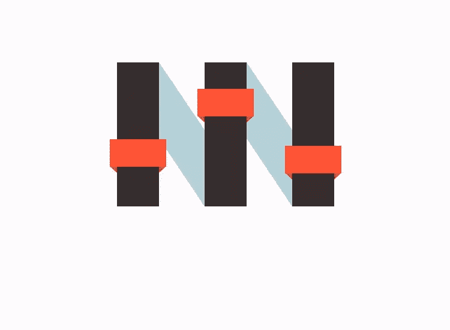](https://www.sitepoint.com/wp-content/uploads/2013/09/Step-14l.jpg)

### 第十五步:

现在我们将使用钢笔工具在剩下的矩形上添加更多的三角形。使用与之前相同的颜色、不透明度和混合模式来保持一致性。
[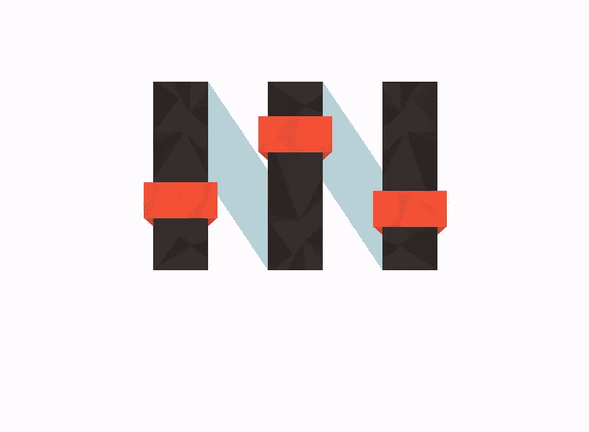](https://www.sitepoint.com/wp-content/uploads/2013/09/Step-15l.jpg)

### 第十六步:

现在，让我们添加品牌名称或标题。选择文字工具，使用颜色#ff5337 添加文字。我将添加一个 1px 的“内部阴影”,并为我们的文本添加一些图案，但这是可选的——如果你愿意，你可以保持原样。我们干净时尚的 logo 完成了。

如果你正在设计一个自己的标志，尝试不同的方法，因为有新的风格和技术不断涌现。你会惊讶于你的客户和顾客可能喜欢什么，除非你走出舒适区，尝试一种未经证实的风格，否则你永远不会知道。

如果你喜欢读这篇文章，你会爱上[可学的](https://learnable.com?utm_source=sitepoint&utm_medium=link&utm_campaign=learnablelink)；向大师们学习新技能和技术的地方。会员可以即时访问 SitePoint 的所有电子书和交互式在线课程，如真实世界的 [HTML5 & CSS3。](https://learnable.com/courses/html5-css3-for-the-real-world-1484?utm_source=sitepoint&utm_medium=link&utm_campaign=learnablelink)

对本文的评论已经关闭。对 logo 设计有疑问？为什么不在我们的[论坛](https://www.sitepoint.com/forums/forumdisplay.php?8-Graphics?utm_source=sitepoint&utm_medium=link&utm_campaign=forumlink)上问呢？

## 分享这篇文章