# 在 InDesign 中创建整洁的竖排名片

> 原文：<https://www.sitepoint.com/create-clean-verticle-card-indesign/>

没有哪个行业不受面对面印象的影响。即使是那些远程完成大部分工作的网页设计师，也经常会在本地市场上与附近的竞争对手竞争。客户很少能完全理解你作品中的微妙之处，这些细微之处将你和你的设计师同事区分开来，不管是好是坏，他们通常会根据清晰度和亲自参与的专业性来区分设计师。如果你的工作涉及定期的、不频繁的(每月)会议，那么在难得的机会中，在客户面前留下好印象就更重要了。

所以今天，我们将在 InDesign 中设计一个简洁的垂直名片。我们将使用几种简单的技术来实现最终的结果。在开始之前，让我们先看看我们的最终结果:
[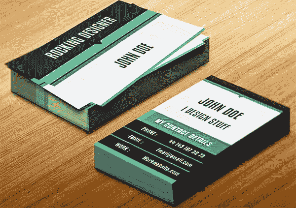](https://www.sitepoint.com/wp-content/uploads/2013/09/feature-card.jpg)

**( [下载完成的、分层的 InDesign 文件](https://www.dropbox.com/s/evcxg1mlbqdtsfr/Clean%20Vertical%20Business%20Card.zip)。)**

### 第一步:

打开 InDesign，单击“文件”>“新建”>“文档”，将页数设置为“2”，取消选中“对开页”请记住，您可以随时根据您的打印机要求调整和微调文档大小；为此，我设置了 2 英寸宽、3.5 英寸高、0.5 英寸边距和 0.125 英寸出血。

### 第二步:

首先创建一个新层；你可以点击图层面板中的“新建图层”选项。现在让我们移到背景。单击矩形工具，使用深灰色样本(C=0 M=0 Y=0 K=8)创建一个矩形。我将屏幕模式改为“预览”,这样你就可以正确地看到设计。
[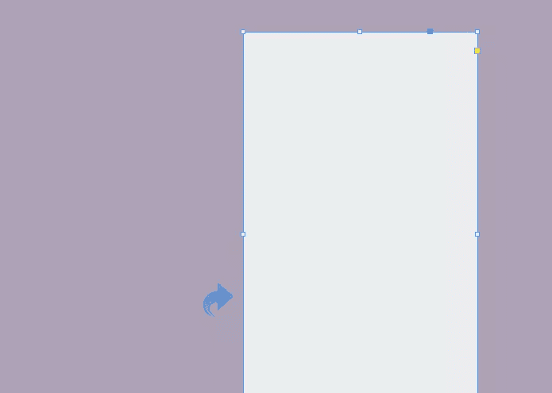](https://www.sitepoint.com/wp-content/uploads/2013/09/Step-2.jpg)

### 第三步:

选择矩形工具，在边上创建一个小矩形。确保使用浅色样本填充(C=0 M=0 Y=0 K=4)。
[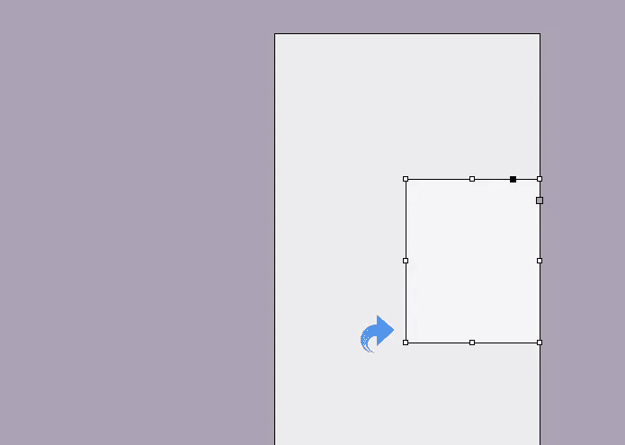](https://www.sitepoint.com/wp-content/uploads/2013/09/Step-3v.jpg)

### 第四步:

再次使用相同的矩形工具，使用相同的颜色样本创建一个小带(C=0 M=0 Y=0 K=4)。
[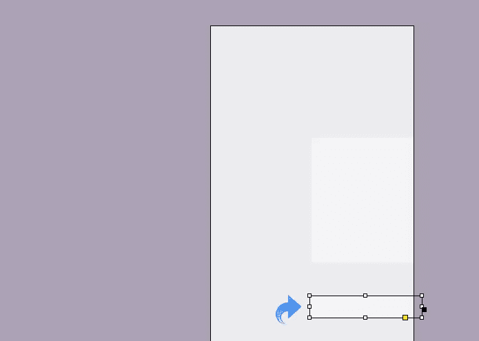](https://www.sitepoint.com/wp-content/uploads/2013/09/Step-4v.jpg)

### 第五步:

重复相同的过程，使用相同的浅色样本(C=0 M=0 Y=0 K=4)再创建 3 个条纹。
[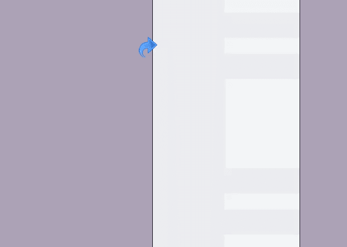](https://www.sitepoint.com/wp-content/uploads/2013/09/Step-5v.jpg)

### 第六步:

再次选择矩形工具，使用浅色样本(C=0 M=0 Y=0 K=4)创建一个垂直条纹。
[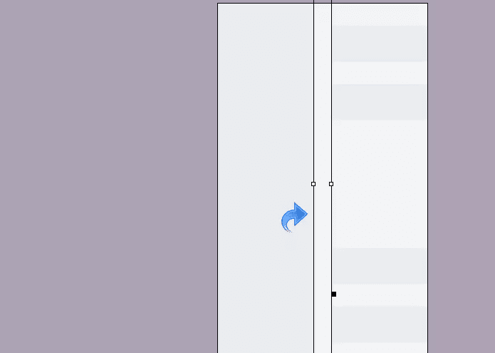](https://www.sitepoint.com/wp-content/uploads/2013/09/Step-6v.jpg)

### 第七步:

在边上创建一个大矩形，确保用色样填充(C=59 M=1 Y=48 K=18)。
[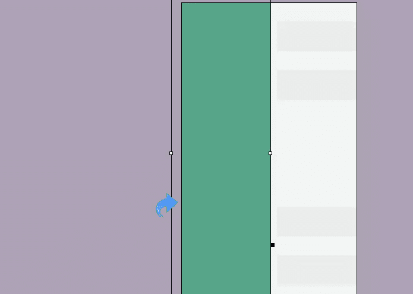](https://www.sitepoint.com/wp-content/uploads/2013/09/Step-7v.jpg)

### 第八步:

再次，重复同样的过程，在边上创建另一个矩形，然后用色样填充(C=54 M=1 Y=48 K=1)。现在，使用色样(C=0 M=0 Y=0 K=91)为矩形添加一个“实心”2pt 描边。
用同样的颜色创建另一个长条，放在右边。用色样(C=0 M=0 Y=0 K=4)给条形添加 5p 纯色描边。
[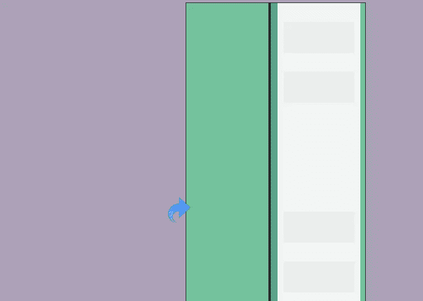](https://www.sitepoint.com/wp-content/uploads/2013/09/Step-8v.jpg)

### 第九步:

现在，点击矩形工具，创建一个矩形。确保使用之前使用的深色色样(C=0 M=0 Y=0 K=91)填充。然后选择钢笔工具，创建一个箭头尖端，使用相同的颜色填充上述矩形尖端。
[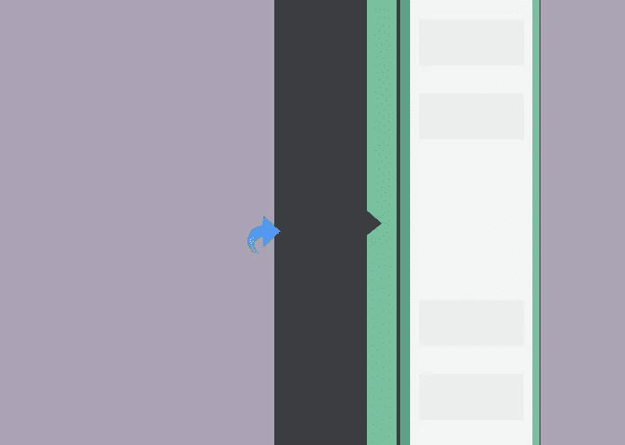](https://www.sitepoint.com/wp-content/uploads/2013/09/Step-9v.jpg)

### 第十步:

我们要给我们的卡片添加一些文字，所以点击文字工具，使用色样添加文字(C=0 M=0 Y=0 K=2)。现在，选择文本层，点击“效果”,使用下面的设置给文本添加一些阴影和内阴影。

[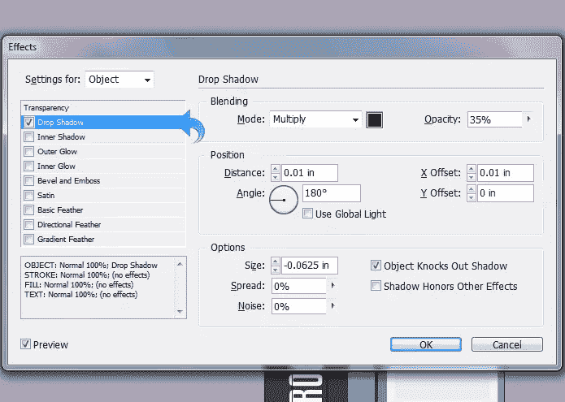](https://www.sitepoint.com/wp-content/uploads/2013/09/Step-10v.jpg)

[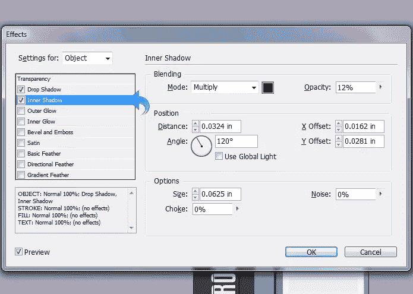](https://www.sitepoint.com/wp-content/uploads/2013/09/Step-10bv.jpg)

### 第十一步:

再次选择文字工具添加标题文本；使用色样(C=0 M=0 Y=0 K=91)作为标题。然后，选择文字层，点击“效果”，使用下面的设置添加阴影。
[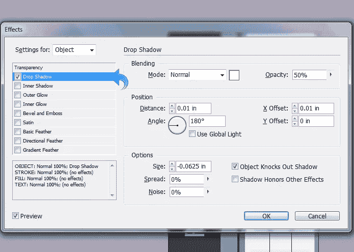](https://www.sitepoint.com/wp-content/uploads/2013/09/Step-11av.jpg)

现在，使用下面的设置应用内部阴影。
[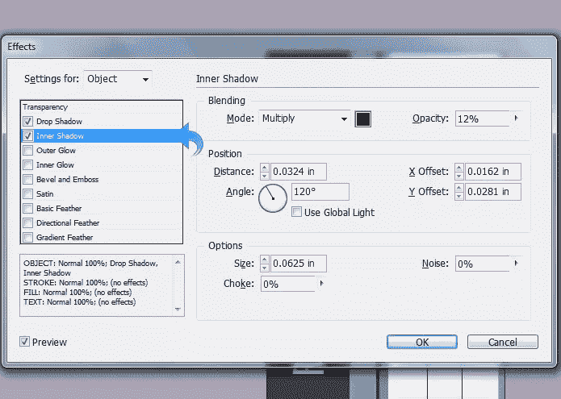](https://www.sitepoint.com/wp-content/uploads/2013/09/Step-11bv.jpg)

### 第十二步:

我们卡的一面准备好了，就从另一面开始吧。开始构建背景，点击矩形工具，创建一个矩形。确保使用色样填充矩形(C=0 M=0 Y=0 K=91)。
[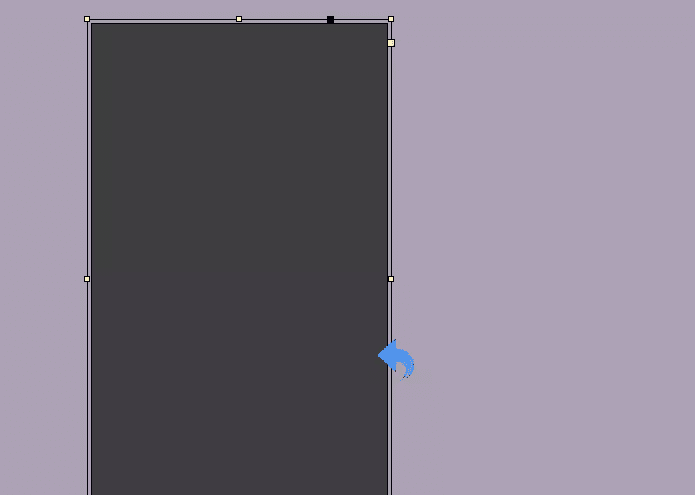](https://www.sitepoint.com/wp-content/uploads/2013/09/Step-12v.jpg)

### 第十三步:

使用矩形工具创建一个盒子，并确保用色样填充它(C=0 M=0 Y=0 K=4)。
[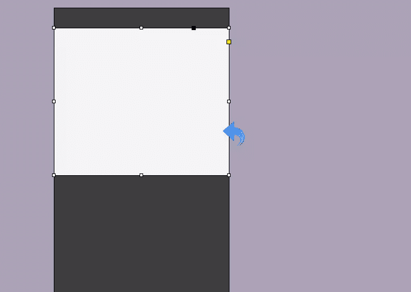](https://www.sitepoint.com/wp-content/uploads/2013/09/Step-13v.jpg)

### 第十四步:

现在，创建一个小的水平条带，并使用色样填充该条带(C=59 M=1 Y=48 K=18)。然后，选择钢笔工具，并创建一个箭头尖端，使用相同的颜色带以上填补尖端。
[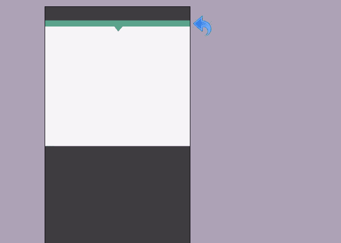](https://www.sitepoint.com/wp-content/uploads/2013/09/Step-14v.jpg)

### 第十五步:

现在，使用矩形工具创建另一个盒子，并使用色样填充该盒子(C=54 M=1 Y=48 K=1)。
[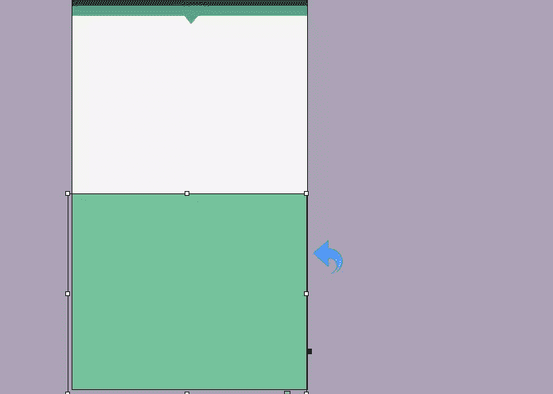](https://www.sitepoint.com/wp-content/uploads/2013/09/Step-15v.jpg)

### 第十六步:

使用矩形工具创建三个条带，并确保使用色样填充它们(C=0 M=0 Y=0 K=4)。
[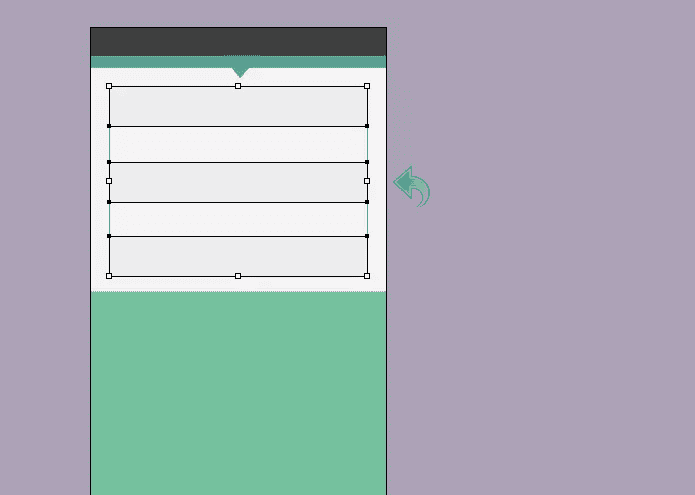](https://www.sitepoint.com/wp-content/uploads/2013/09/Step-16v.jpg)

### 第十七步:

重复相同的过程，并创建三个以上的矩形工具带；确保用色样填充它们(C=0 M=0 Y=0 K=91)。
[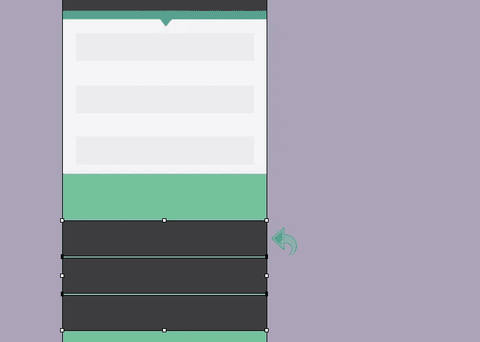](https://www.sitepoint.com/wp-content/uploads/2013/09/Step-17v.jpg)

### 第十八步:

现在，创建另一个水平条带，但这次使用色样填充条带(C=59 M=1 Y=48 K=18)。
[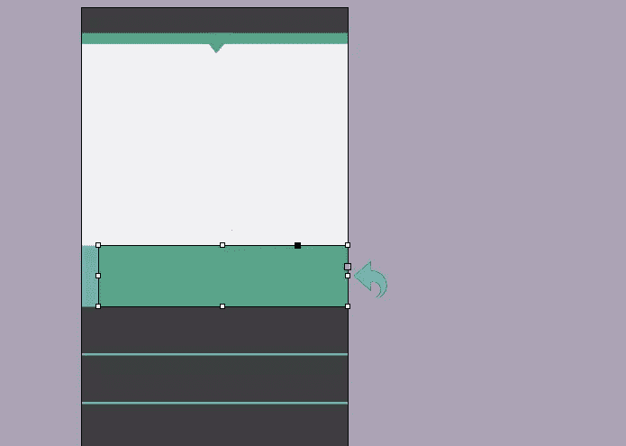](https://www.sitepoint.com/wp-content/uploads/2013/09/Step-18v.jpg)

### 第十九步:

选择矩形工具并在边上创建一个小盒子，现在使用色样填充形状(C=0 M=0 Y=0 K=93)。重复同样的步骤，在边上再创建两个盒子。
[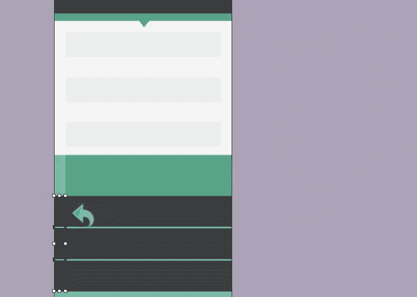](https://www.sitepoint.com/wp-content/uploads/2013/09/Step-19v.jpg)

### 第二十步:

现在选择文字工具添加一些标题文本。使用色样(C=0 M=0 Y=0 K=91)作为名称，使用色样(C=0 M=0 Y=0 K=58)作为文本。然后选择文本层，点击“效果”添加一些阴影和内阴影。确保使用与我们在上面文本中相同的设置。
[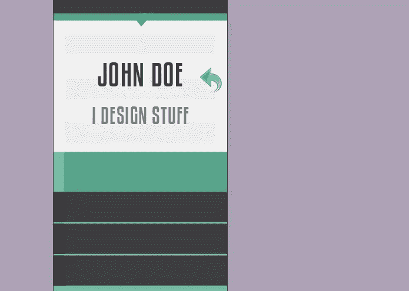](https://www.sitepoint.com/wp-content/uploads/2013/09/Step-20v.jpg)

### 第二十一步:

现在，使用文字工具添加联系信息，然后点击“效果”添加一些阴影。对于投影，保持如下图所示的设置。
[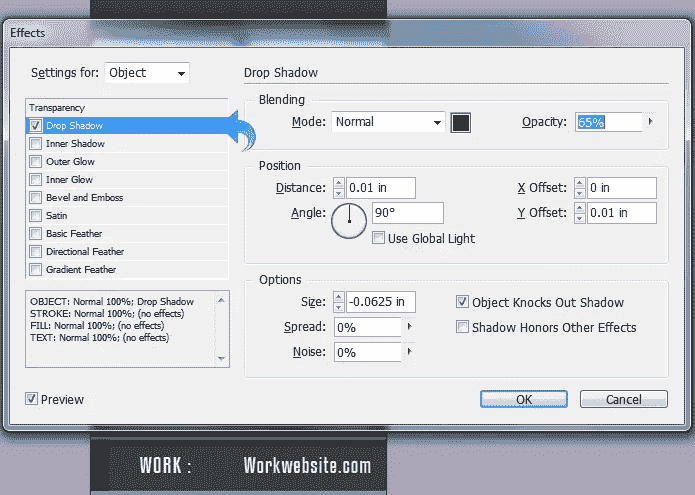](https://www.sitepoint.com/wp-content/uploads/2013/09/Step-21v.jpg) 
让我们看看我们的最终产品。

我们干净的竖名片做好了。我希望你喜欢这个教程和你的新名片设计。

## 分享这篇文章