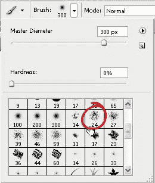
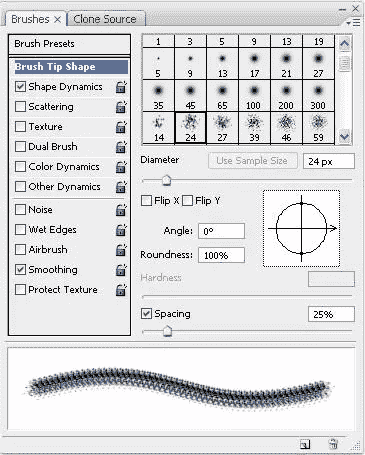
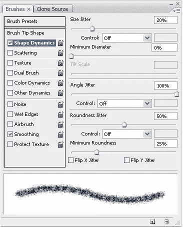
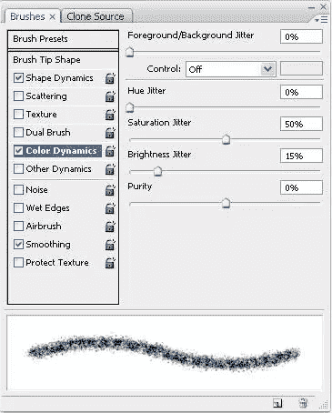
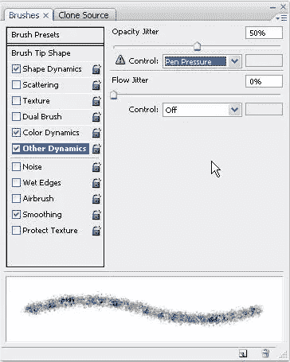
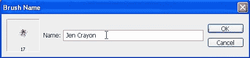
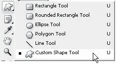
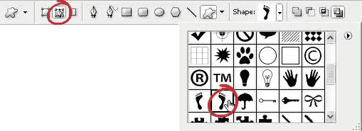
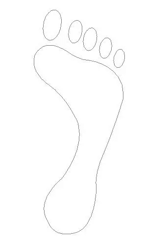
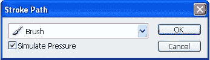

# 在 Photoshop 中创建蜡笔效果图

> 原文：<https://www.sitepoint.com/create-crayon-effect-drawings-in-photoshop/>

Photoshop 的笔刷非常通用。您可以自定义从形状提示到画笔颜色动态的所有内容。在本教程中，我们将看看如何自定义画笔，使它在使用时给人蜡笔画的印象。

1.创建新的空白文档。我把我的设置为 600 x 600 像素。

2.从工具栏中选择笔刷工具(B ),在屏幕顶部的工具选项中，在下拉菜单中找到尺寸为 24 像素的喷溅笔刷。如果你想让它看起来像一个更细的蜡笔，你可以选择一个更小的笔刷直径。

3.选择**窗口>笔刷打开笔刷面板。**

点击左边的单词“画笔笔尖形状”,拖动间距滑块到大约 25%,这样你的画笔在预览区域看起来就像这样。

4.点击单词“形状动态”，设置尺寸抖动为 20%，角度抖动为 100%，圆度抖动为 50%，最小圆度为 25%。

5.点击“颜色动态”字样，设置饱和度抖动为 50%，亮度抖动为 15%。

6.点击“其他动态”字样，将不透明度抖动设置为 50%。如果您使用的是压力感应笔台，请将控件设置为笔压力，以真正获得最佳效果。

现在你的手上应该有蜡笔效果笔刷了。几乎和玩真蜡笔一样好。你可以通过点击画笔笔尖形状并改变其直径来改变画笔的大小。

一旦你做了一个这样的笔刷，你可以点击笔刷面板底部的新建笔刷按钮来保存它，然后给它一个合适的名字。

除了用画笔徒手绘制，它还可以很好地用于绘制路径。这里有一个例子。

1.在工具箱中选择自定义形状工具。

2.在屏幕顶部的工具选项栏上，确保选择了路径。然后在形状下拉框中选择你喜欢的任何形状。我已经选择了正确的脚型。如果你在下拉框中看不到这个，点击下拉框右上角的三角形，从菜单中选择 Objects。将询问您是要替换还是追加。选择追加。这只是将对象形状添加到已有形状的末尾。

3.在文档中拖出脚的形状。按住 Shift 键来限制比例。

4.现在打开路径面板。选择窗口>路径。您应该会看到刚刚绘制的脚型的缩略图。

点击路径面板右上角的上下文菜单，选择描边路径。检查模拟压力按钮，以获得不同的笔刷厚度的路径，然后按下确定。

你的蜡笔脚应该看起来有点像这样:

## 分享这篇文章