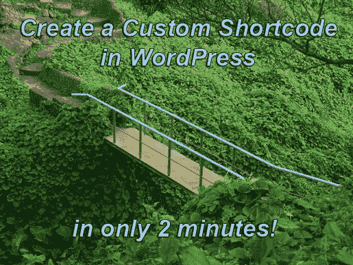
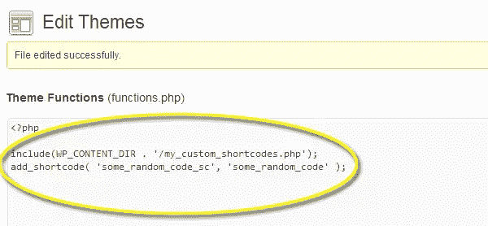
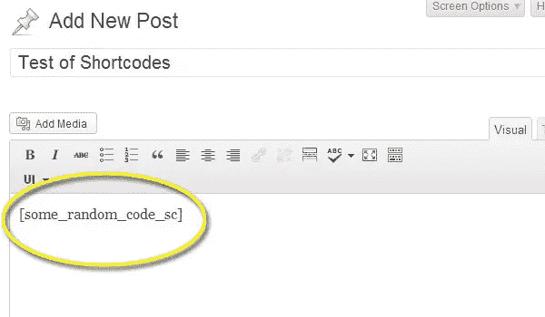
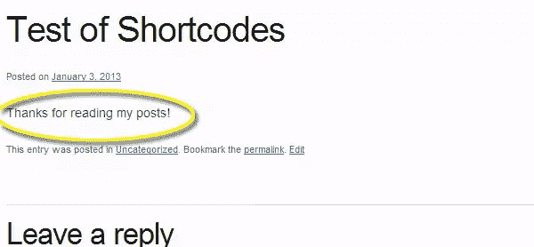

# 两分钟内为 WordPress 创建自定义短代码

> 原文：<https://www.sitepoint.com/create-custom-shortcodes-for-wordpress-in-two-minutes/>

我喜欢短码。如果有时间放下幼稚的俏皮话，“那你为什么不嫁给它？”—现在是时候了。我就是这么喜欢 WordPress 中的短代码的。

WordPress 最大的优点也可以是它最大的缺点。虽然它确实内置了各种强大的工具和安全性，但定制功能和特性可能是一个巨大的痛苦。

但这正是短码的用武之地。一旦你习惯了创建短代码，你就可以在几分钟内创建定制的功能——你的想象力是唯一的限制。

### 供将来参考的摘要

因为我希望你能把这个页面收藏起来，以后参考，这里有一个让短代码正常工作的总结:

1.  创建您想要的代码
2.  保存代码(通常保存在 wp-content 文件夹中)
3.  在 functions.php 文件中包含您保存的新文件
4.  使用 add_shortcode('shortcode '，' function ')引用您的短代码
5.  把你的短码放在你想放的地方

### 为什么所有的短码爱情，确切地说？

如果你曾经不得不做任何类型的 WordPress 开发，你会遇到这样的情况，你需要一些定制的功能或者一个专门的设计元素。出于安全原因，WordPress 从帖子和页面中剥离了大量 HTML 标签和所有 PHP 代码。

这通常是为了我们好，但是当你只是想要一个简单的设计修改时，这就变成了一场噩梦。

短码是权宜之计。它们允许你在你想要的地方注入任何 PHP 或其他代码。一旦你习惯了创建短代码标记，你就再也不会回头了。

因此，让我们开始创建一个定制的短代码，并构建一个流程，当您准备好创建自己的流程时，可以参考这个流程。

### 步骤 1:创建代码

这是您需要创建功能的地方。我不知道你想完成什么，但这里有一个非常简单的短代码示例，它允许我在帖子中插入自定义消息。这只是为了演示，但它应该激发您的想象力:

【source code language = " PHP "】
<？php
函数 some_random_code(){

echo“感谢您阅读我的帖子！”；
}//结束 some_random_code()

？>
[/sourcecode]

所以我们有了一个非常简单的 PHP 函数。您可以在这个函数中放入任何想要在您的站点上执行的内容——自定义表单、特殊的 HTML 标记或对外部数据库的调用。

### 步骤 2:保存代码(但不要保存在 Functions.php 文件中)

虽然您可以将上述代码存储在 functions.php 文件中，但如果我真的建议这么做，我会让您长期失败。我强烈建议您为自己的自定义短代码创建一个单独的文件。随便你怎么称呼它，并把它存储在 wp-content 文件夹中，或者创建一个插件(见[我关于创建 WordPress 插件的文章](https://www.sitepoint.com/design-a-wordpress-plugin-in-five-minutes-or-less/))。

对于本例，创建一个名为“my_custom_shortcodes.php”的文件，并将其保存在 wp-content 文件夹中。这个文件夹通常是安全的，不会受到 WordPress 升级和核心更新的影响，它们会覆盖你现有的 functions.php 文件。如果客户在没有通知你的情况下决定更新到最新的主题或者安装一个新的主题，你会很快失去很多工作。直接进去重现接下来的几个步骤要容易得多。

### 步骤 3:包含您的自定义 PHP 文件

现在我们需要告诉 WordPress 在哪里可以找到你的自定义短代码文件。假设你把它保存在你的 wp-content 文件夹中，下面是你需要添加到你的 functions.php 文件中的内容:

[sourcecode language="php"]

包含(WP_CONTENT_DIR。/my _ custom _ short codes . PHP ')；

[/sourcecode]

现在，WordPress 知道你的内容，并将它集成到它的功能中。此时我们已经完成了 90%!

### 步骤 4:定义你的短代码

在你真正开始在你的网站上使用短代码之前，你需要告诉 WordPress 这是一个真正的短代码。在 functions.php 文件中，在步骤 3 中的代码的正下方，添加以下内容:

[sourcecode language="php"]

add _ short code(' some _ random _ code _ sc '，' some _ random _ code ')；

[/sourcecode]

事情是这样的 add _ shortcode 调用的第一部分是您想要使用的短代码的名称。这是将被放入你的文章和页面的内容。下一个参数是函数的名称。这里有一个更简单的例子:

[sourcecode language="php"]

add_shortcode( 'shortcode_name '，' function _ name ')；

[/sourcecode]

*快速提示:我喜欢为我的短代码使用函数名，但是我在短代码后面加了“_sc”来帮助我跟踪我的代码，如果我以后想编辑它的话。*

添加两行代码后，我的 functions.php 文件如下所示:

### 第五步:添加你的短代码

现在，你需要做的就是把你的短代码添加到任何帖子或页面上！创建一个新的帖子/页面，添加简短代码，发布并查看页面。

您应该会在发布的页面上看到您的代码输出:

你做到了！现在你可以快速创建各种自定义功能，并在几分钟内集成到你的 WordPress 站点中。

你是如何使用短代码的？在评论里炫耀你的作品吧！

## 分享这篇文章