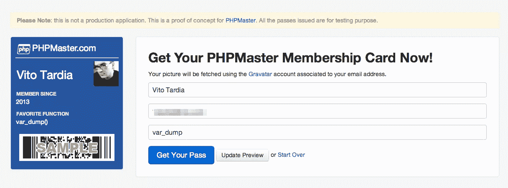
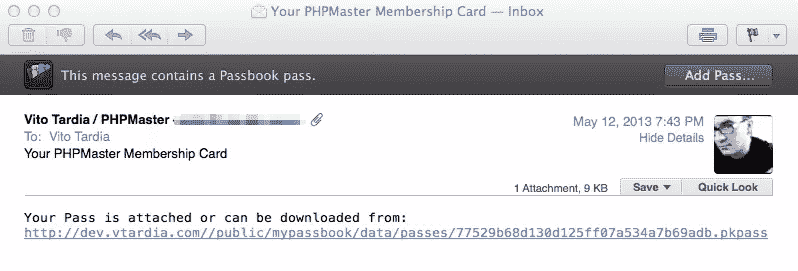
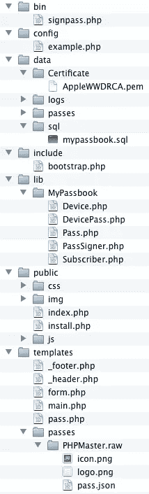

# 使用 PHP 和苹果 Passbook 的数字门票

> 原文：<https://www.sitepoint.com/create-digital-tickets-with-php-and-apple-passbook/>

我们 PHP 战士为什么要关心苹果的 Passbook 呢？首先是因为苹果开放了这项技术(嗯，某种程度上……)，其次是因为它可以在 iOS 设备之外使用，第三是因为它涉及了许多众所周知和受欢迎的技术，如 JSON 和 RESTful APIs。我还要补充一点，这是一项非常有趣的技术，但这是我的个人观点。

在本文中，我将向您展示如何构建一个示例 web 应用程序，该应用程序以“PHPMaster 会员卡”的形式创建和分发通行证。它不是一个全功能的产品，但它是一个很好的基础，可以在此基础上进行更严肃的真实世界的使用。您可以从 GitHub 下载本文的演示代码。

**请注意:**为了运行本文的代码，您(或您的客户)必须注册一个付费的苹果 iOS 开发者计划，该计划允许您创建必要的证书来签署您的通行证。出于这个原因，我还制作了一个虚拟应用程序供你在线使用。

## 什么是通行证，我如何使用通行证？

通行证是经过数字签名的文档，如票、会员卡或优惠券，可以通过电子邮件或网络下载分发。可以用 iOS 上的 Passbook app 打开，也可以用 Android 上的 [PassWallet](https://play.google.com/store/apps/details?id=com.attidomobile.passwallet "PassWallet - Passbook + NFC - Android Apps on Google Play") 之类的 app 打开。在 iOS 上，通行证还可以链接到一个配套的应用程序，例如 [Eventbrite](https://itunes.apple.com/app/eventbrite/id487922291?mt=8 "Eventbrite for iPhone, iPod touch, and iPad on the iTunes App Store") 应用程序，它允许你购买门票并将其添加到你设备的 Passbook 中，但这不是强制性的。

苹果的规格概述了四种主要的通行证类型:

*   登机牌
*   活动门票
*   零售优惠券
*   储值卡

还有一种通用的传球类型，涵盖了其他目的，这就是我在这里使用的传球类型。

每一遍包含不同的数据位。一些信息，如会员姓名和条形码，直观地显示在通行证的“正面”。其他数据位于通行证的“背面”，由“I”图标触发。通行证还可以包含一些隐藏信息，如时间和位置，这些信息可用于显示相关通知。

在苹果的 [Passbook 开发者页面](https://developer.apple.com/passbook/ "Passbook for Developers - Apple Developer")上，你可以找到官方指南和一些样本代码。

## App 概念:PHPMaster 会员卡

示例应用程序有两个主要特性:

*   创建和存储通行证
*   实现注册/注销 web 服务 API



主表单提示用户输入全名、电子邮件地址和可选的收藏夹功能。使用 [Gravatar API](http://en.gravatar.com/site/implement/ "Gravatar - Globally Recognized Avatars") 获取成员图片。后端代码然后将提供的数据保存到数据库，生成通行证，并将副本发送到订户的电子邮件。



通行证包含 web 服务的 URL 和访问代码，因此当订户将通行证添加到他的集合中时，Passbook 应用程序将调用预定义的注册 URL，必须实现该 URL 来检查和存储所提供的数据以供以后使用。

## 应用程序结构

因为这篇文章的核心是理解与 pass 相关的代码，所以我将从 GitHub 上可用的众所周知的开源组件和使用 Composer 开始。

该应用程序是使用 [Slim Framework](http://slimframework.com/ "Slim Framework") 构建的，因为它是轻量级的，非常适合 RESTful 开发和 web-GUI 应用程序。Slim 的默认 PHP 模板引擎和 Slim Extras 包中的`DateTimeLogWriter`一起使用。

数据和模型层由[idiom 和 Paris](http://j4mie.github.io/idiormandparis/ "Idiorm and paris - object relational mapper (ORM), fluent SQL query builder and Active Record Implmenetation for PHP") 覆盖。Idiorm 负责数据库工作，而 Paris 提供了一个简单干净的模型接口。这允许我们使用一个`Pass`和一个`Subscriber`对象，并调用例如`$pass->pack()`来生成 pass 包。

### 传递定义

第一步是定义通行证；它会是什么样子，包含哪些数据？


有了这些信息，我们可以创建一个包含基本资产的通行证模板目录:

```
templates/passes/PHPMaster.raw/
    logo.png
    icon.png
    pass.json
```

每个图像都可以有一个相应的`*ImageName*@2x.png`版本，可以在视网膜设备上使用(如果有的话)。标志显示在通行证的左上方，而图标显示在推送通知框和 iOS 邮件应用中。`pass.json`包含通道的数据。

在`pass.json`里面，`teamIdentifier`是我们订阅开发者计划的时候苹果分配给我们的。`passTypeIdentifier`是我们通行证类型的唯一反向域名 ID，例如*pass . com . PHP master . membership-test*(the "。pass”前缀是必需的)。`serialNumber`字段对于每个通行证必须是唯一的，因此一个好的使用值是存储通行证的数据库表的主键。

`generic`键指示我们正在使用的通行证类型，并包含通行证的特定字段。每种传球类型都有一组`primaryFields`、`secondaryFields`、`auxiliaryFields`显示在正面的不同位置；它也可以在背面显示一些`backFields`。每个字段都有一个标签(公开显示)、一个键(供内部参考)和一个值。

`webServiceURL`和`authenticationToken`字段稍后在应用程序中定义，并填充有设备在我们的服务器上注册时使用的基本 URL 和访问凭证。

### 证书

下一步是获取用于生成通行证的证书。苹果开发者的供应面板用于申请证书，PassKit wiki 上有一个[不错的视频教程](http://code.google.com/p/passkit/wiki/AppleDeveloperVideo "AppleDeveloperVideo - passkit - Enrolling for an Apple Developer Account - Design, create, distribute, manage and analyze Apple Passbook content")。每种通行证类型都需要一个特定的证书；证书的通用名称必须与通行证的`passTypeIdentifier`相匹配。

每张通行证的签名还必须包括公共[苹果 WWDR 中级证书](https://developer.apple.com/certificationauthority/AppleWWDRCA.cer "AppleWWDRCA.cer")。

### 目录和文件布局

应用程序的布局如下所示:



`bin`目录包含命令行实用程序`signpass.php`。这个程序是用 Objective-C 和 Ruby 编写的苹果控制台实用程序的 PHP 端口。它可以用来验证一个通行证或者从一个给定的目录创建一个通行证。它使用 PassSigner 库，我将在后面详述。

`config`目录保存配置文件。复制一份示例，并以您的环境命名(stage、dev、prod 等)。要定义一个定制环境，在根目录下创建一个名为`.mode`的文本文件，其中包含您的环境的名称。Idiorm 使用配置文件中的`$config['db']`数组，并将`$config['app']`数组直接传递给 Slim 应用程序的构造函数。

`data`目录保存日志文件、生成的通行证、SQL 转储文件和`Certificate`目录，后者必须包含 Apple 的公共证书和您的通行证的证书，两者都是 PEM 格式。证书以 CER 或 P12 格式分发，可以使用 openssl 实用程序进行转换，如下所示:

```
openssl pkcs12 -in data/Certificate/PHPMaster.p12 -out data/Certificate/PHPMaster.pem
```

`templates`目录保存前端模板文件。有两个页面，主页(`main.php`)和结果页面(`pass.php`)，它们共享页眉和页脚元素。订阅表单有自己的文件(`form.php`)。

`passes`子目录保存每种刀路类型的模板。每个通道模板被组织到名为`*PassTypeOrName*.raw`的目录中，其中包含必要的文件。

自定义库代码位于`lib/MyPassbook`中。在这个目录中有:

*   PassSigner 库，负责通行证签名和验证
*   建立在核心对象`Subscriber`、`Pass`和`Device`上的模型类

`DevicePass`是巴黎需要的中间类，管理设备和通行证之间的多对多关系；根据存折规范的定义，每个设备可以包含许多通行证，每个通行证的副本可以存储在许多设备中。

应用程序的`public`目录包含控制器文件。`index.php`是主控制器。控制器包括`include/bootstrap.php`，它负责应用程序的启动、加载配置文件、设置一些缺省值、将 ORM 连接到数据库，以及启动日志记录器。特别是，该脚本还为 slim.before 事件挂钩设置了一些代码，用于捕获特殊的身份验证 HTTP 头。

`install.php`文件只是一个快速而肮脏的脚本，用于重置应用程序；可能没有必要说在你设置好一切之后必须删除它！

还应该有一个`.htaccess`文件，将所有非文件 URIs 重定向到`index.php`，并为我们的通行证添加一个自定义 mime 类型:

```
AddType application/vnd.apple.pkpass    pkpass
```

这允许 Safari 使用 PassViewer 实用工具打开通行证。

## 编写应用程序

应用程序最重要的组件是`PassSigner`类和`index.php`前端控制器。Paris 给了我们使用模型类的能力，因此底层数据库逻辑是透明的，并由 Idiorm 管理。创建模型类非常简单:

```
&lt;?php
class Subscriber extends Model { }
```

需要创建三个类:`Pass`、`Device`和`Subscriber`。

基本方法如`create()`、`find_many()`、`delete()`等都是从基类继承的。我们可以修改基本属性(例如链接的数据库表或列 ID)，增强默认方法，并根据需要添加自定义方法。

我向`Subscriber`类添加了三个方法:

*   `pass()`–实现与`Pass`对象的一对一关系，并返回该对象。
*   `create()`–覆盖默认的`create()`方法，允许传递一组数据。
*   `createPass()`–创建一个链接到当前订户的`Pass`对象。

这些是我添加到`Pass`类中的六个方法:

*   `subscriber()`–实现与`Subscriber`对象的一对一关系，并返回该对象。
*   `devices()`–定义与`Device`对象的多对多关系。它在`Device`类上有一个相应的`passes()`方法。
*   `create()`–与`Subscriber`类的`create()`方法相同。
*   `delete()`–覆盖默认方法；删除链接的`Devices`和`Subscriber`对象。
*   `filename()`–计算并返回磁盘上通行证的文件名。
*   `pack()`–使用 PassSigner 库将通行证保存到磁盘。

### PassSigner 库

`PassSigner`提供了两种主要的通行证管理公共方法:

*   `signPass()`–获取一个包含单次通过数据和证书数据的目录，并生成一个压缩的 PKPASS 文件。
*   `verifyPassSignature()`获取一个 PKPASS 文件并验证其结构和签名。

还有两个用于递归复制和删除目录的实用方法`rcopy()`和`rrmdir()`，以及一些内部保护方法。该库广泛使用了异常验证函数，两个重要的方法检查苹果证书，该证书必须由带有证书路径的常量`APPLE_CERTIFICATE`定义。

要签署通行证，必须使用通行证目录的内容生成一个名为`manifest.json`的文件。此文件必须用您的证书签名，并包含 Apple 的公共证书。签名数据保存在名为`signature`的文件中。

假设我们有一个包含通行证数据的目录:

```
data/passes/PassForUser001.raw
    info.png
    logo.png
    thumbnail.png
    pass.json
```

第一步是递归地将所有内容复制到一个临时目录中(例如`/tmp/PassForUser001`)。确保没有不应该包含在内的“垃圾”文件，比如如果你在 OSX，就要确保没有烦人的`.DS_Store`文件。如果这些文件中的任何一个包含在压缩的 pass 中，但没有包含在清单中，则 pass 无效。

然后创建关联数组来存储清单数据。pass 目录中的每个文件都有一个条目，相对路径是条目的键，而值是文件的 SHA1 散列。数组被编码并保存为 pass 目录中的`manifest.json`。

```
&lt;?php
$manifestData = array();
$files = new DirectoryIterator($passPath);
foreach ($files as $file) {
    if ($file-&gt;isDot() || $file-&gt;getFilename() == &quot;.DS_Store&quot;) {
        continue;
    }
    $key = trim(str_replace($passPath, &quot;&quot;, $file-&gt;getPathName()), &quot;/&quot;);
    $manifestData[$key] = sha1_file($file-&gt;getPathName());
}
```

现在是签名…基本上，我们使用我们的证书和密码，包括苹果的 WWDR 证书，来签署`manifest.json`文件。二进制输出被写入`signature`。然而，这里有一个问题:PHP 的`openssl_*`函数的二进制选项似乎有问题，仍然生成文本编码的签名。我通过从 PHP 调用 shell 命令来解决这个问题:

```
&lt;?php
$signCommand = sprintf(
    &quot;openssl smime -binary -sign -certfile %s -signer %s -inkey %s -in %s -out %s -outform DER -passin pass:%s&quot;,
    APPLE_CERTIFICATE,
    $certPath,
    $certPath,
    $manifestPath,
    $signaturePath,
    $certPassword
);

$signResult = false;
$signOut = array(); // needed but unused
exec($signCommand, $signOut, $signResult);
unset($signOut);
```

如果启用了`$zip`选项(默认情况下是),则使用`ZipArchive`类打包通道。

为了验证这个过程，`verifyPassSignature()`将给定的过程提取到一个临时目录，然后调用内部的`validateManifest()`和`validateSignature()`方法。这两个方法都必须返回 true。

```
&lt;?php
foreach ($files as $file) {
    ...

    // Check that each file is present in the manifest
    if (!array_key_exists((string)$file, $manifestData)) {
        throw new Exception(&quot;No entry in manifest for file '{$file}'&quot;), 506);
    }

    // Check SHA1 hash for each file
    $hash = sha1_file($file-&gt;getPathname());
    if ($hash == false || $hash != $manifestData[(string)$file]) {
        throw new Exception(
            sprintf(
                &quot;For file %s, manifest's listed SHA1 hash %s doesn't match computed hash, %s&quot;,
                $file,
                $manifestData[(string)$file],
                $hash
            ),
            507
        );
    }
}
```

如果传递目录只包含清单中声明的文件、清单本身和签名文件，则清单是有效的。如果某个文件丢失或有文件未列出，则通行证无效。此外，每个文件的 SHA1 哈希必须与存储在清单中的哈希相匹配。

签名也通过三个步骤使用`openssl`进行验证。首先，我们用它的签名验证清单的内容。选项`-noverify`告诉 OpenSSL 跳过签名者的证书验证。

```
$verifyCommand = sprintf(
    'openssl smime -verify -binary -inform DER -in %s -content %s -noverify 2&gt; /dev/null',
    $signaturePath,
    $manifestPath
);
```

然后从签名中提取证书:

```
&lt;?php
$exportCommand = sprintf(
    'openssl smime -pk7out -in %s -content %s -inform DER -outform PEM',
    $signaturePath,
    $manifestPath
);
```

命令的输出被传递给内部的`parseCertificates()`方法，我不会在这里讨论。它混合使用 OpenSSL 和 regex 将证书从给定数据提取到一个关联数组中，该数组用于证书检查循环:

```
&lt;?php
$certs = self::parseCertificates($pemData);
$foundWWDRCert = false;
for ($i = 0; $i &lt; count($certs); $i++) {
    $commonName = $certs[$i]['subject']['CN'];

    if ($commonName == APPLE_CERTIFICATE_CN) {
        $foundWWDRCert = true;
    }
}
```

<h>索引控制器</h>

控制器`index.php`负责提供 web-GUI 应用程序和 RESTful API。它由两个 URIs 组成:通过 GET 的主页和通过 POST 的同一个页面。第一页只显示空表单，但是第二页更有趣。

为了确保每个电子邮件地址都是唯一的，它会询问 Paris，Paris 会检查数据库:

```
&lt;?php
$subscriber = Model::factory('MyPassbookSubscriber')
    -&gt;where_equal('email', $memberMail)
    -&gt;find_one();

if ($subscriber !== false) {
    $errors['membermail'] = sprintf(&quot;The email address '%s' is not available&quot;, $memberMail);
}
```

订户缩略图 URL 选自 Gravatar:

```
&lt;?php
if (empty($errors['membermail'])) {
    $memberThumbnail = &quot;https://www.gravatar.com/avatar/&quot; . md5(strtolower(trim($memberMail))) . &quot;?s=60&quot;;
}
```

现在它可以创建一个新订户:

```
&lt;?php
try {
    $subscriber = Model::factory('MyPassbookSubscriber')-&gt;create(
        array(
            'name' =&gt; $memberName,
            'email' =&gt; $memberMail,
            'created' =&gt; date('Y-m-d H:i:s', $memberSubscription),
            'function' =&gt; $memberFavFunction,
            'picture' =&gt; $memberThumbnail
            )
    );
    $subscriber-&gt;save();
}
catch (Exception $e) {
    $errors['subscriber'] = &quot;Error creating subscriber profile&quot;;
}
```

通行证的 JSON 模板文件被加载到`$data`中，所有占位符都被真实用户和应用程序数据填充:

```
&lt;?php
$data['serialNumber'] = $subscriber-&gt;id;
$data['webServiceURL'] = sprintf('https://%s/%s/', $env['SERVER_NAME'], $app-&gt;request()-&gt;getRootUri());
$data['authenticationToken'] = md5($subscriber-&gt;id);
$data['barcode']['message'] = $subscriber-&gt;id;
$data['generic']['primaryFields'][0]['value'] = $subscriber-&gt;name;
$data['generic']['secondaryFields'][0]['value'] = date('Y', $memberSubscription);
$data['generic']['auxiliaryFields'][0]['value'] = $subscriber-&gt;function . '()';
$data['generic']['backFields'][0]['value'] = $subscriber-&gt;id;
$data['generic']['backFields'][1]['value'] = $subscriber-&gt;created;
$data['generic']['backFields'][2]['value'] = $subscriber-&gt;email;
```

使用定制模型方法，新的`$pass`与`$subscriber->createPass()`一起创建，如果一切正常，`$pass`可以自己打包。

```
&lt;?php
if ($pass = $subscriber-&gt;createPass($app-&gt;config('passes.passType'), $data)) {
    $pass-&gt;pack(
        $app-&gt;config('passes.path'),
        $app-&gt;config('passes.store'),
        $app-&gt;config('passes.certfile'),
        $app-&gt;config('passes.certpass')
    );

...

}
else {
    $errors['pass'] = 'Unable to create pass';
}
```

`pack()`方法很简单:它创建模板目录的临时副本，添加特定于通道的文件，并在工作目录上调用`PassSigner::signPass()`。新创建的通行证将通过电子邮件发送，并且`pass.php` 模板文件将通过下载链接呈现给用户。

### 宁静的生活

由于 web 服务 URL 嵌入在 pass 中，Apple 的规范要求我们必须实现至少两个端点来注册和注销设备。URI 始终是*/v1/devices/:device id/registrations/:pass typeid/:serial no*，通过 POST 进行注册调用，通过 DELETE 进行取消注册调用。

从 URI 接收设备 ID、通行证类型 ID 和通行证序列号，同时在授权报头中找到 auth 令牌。为了成功，auth 令牌必须出现在报头中并链接到 pass，并且在发生未授权访问时必须返回 401 响应。

在注册过程中，以 JSON 格式发送一个 Push 令牌作为请求的主体:`{"pushToken": *<pushToken>*}`。注册过程在数据库中创建一个新的`Device`对象，并填充所提供的设备 ID 和推送令牌字段。然后创建一个`DevicePass`对象来存储设备和通行证之间的关系。

如果我们需要更新通行证，我们使用设备 ID 和推送令牌向苹果推送服务器发送推送通知请求(显然也需要实现更新机制)。

除了推送令牌之外，注销 URI 接收所有相同的数据。删除给定过程的所有引用，包括设备和关系。

## 结论

在本文中，我们已经介绍了很多内容，关于通行证管理，还有更多内容需要探讨。可以从 PassSigner 库开始，并在它的基础上进行构建。您可以轻松地为您或您的客户创建各种通行证申请。编码快乐！

图片 via[Fotolia](http://us.fotolia.com/?utm_source=sitepoint&utm_medium=website_link&utm=campaign=sitepoint "Royalty Free Stock Photos at Fotolia.com")

## 分享这篇文章