# 如何创建 Firefox 附加组件

> 原文：<https://www.sitepoint.com/create-firefox-add-on/>

在本教程中，我们将学习如何创建一个 Firefox 插件，允许用户在指定的时间用自定义文本创建提醒。我们将介绍如何创建一个基本的附加组件，添加一个弹出窗口和一个选项页面，添加权限，存储信息，发送通知，以及创建一个发送通知的后台脚本。

本教程不需要任何创建 Firefox 插件或任何浏览器扩展的经验。您只需要知道一些 JavaScript 基础知识。你可以在 [this GitHub Repository](https://github.com/sitepoint-editors/firefox-alarms-addon) 中找到本教程的代码，也可以在这里找到已发布的[创建的附加组件。](https://addons.mozilla.org/en-US/firefox/addon/personalized-alarms/)

## 设置我们的 Firefox 附加组件

创建 Firefox 插件的第一步是创建`manifest.json`文件。这个文件是 Firefox 附加组件唯一需要的文件。`manifest.json`文件的基本格式应包括以下关键字:

*   `name`:slug 格式的插件名称——如`my-extension`。
*   `version`:插件的当前版本。当更新扩展中的任何东西时，你将需要更新这个版本，所以建议从低开始。
*   `manifest_version`:在撰写本文时，Firefox 只支持清单 V2，所以这个值应该是`2`。然而，如果将来增加对 V3 的支持，这个值也可以是`3`。

这些是任何附加组件的必填字段。以下两个选项是可选的，但建议使用:

*   对你的附加组件的简短描述，解释它的用途。
*   `icons`:不同大小的图标列表。这些图标将用于设置、浏览器工具栏以及其他地方。建议添加的尺寸有`16px`、`32px`、`48px`和`128px`。

对于我们的附加组件，让我们首先创建一个名为`firefox-alarms-addon`的文件夹。然后添加一个`manifest.json`，内容如下:

```
{
  "name": "personalized-alarms",
  "version": "0.0.1",
  "description": "Create personalized alarms",
  "manifest_version": 2,
  "icons": {
    "16": "asseimg/icon16.png",
    "32": "asseimg/icon32.png",
    "48": "asseimg/icon48.png",
    "128": "asseimg/icon128.png"
  }
} 
```

如您所见，`icons`键是一个带有文件大小和文件路径的键的对象。该路径相对于附加组件的根目录，也就是`manifest.json`所在的位置。在本教程中，我使用的是由 [Twitter 表情符号](https://iconscout.com/contributors/twitter-inc)从 [iconscout](https://iconscout.com/icon/alarm-clock-time-watch-ringing-ring) 下载的图标，在那里我也可以下载所需的不同尺寸。

如果你跟着做，从[我们的回购](https://github.com/sitepoint-editors/firefox-alarms-addon/tree/master/assets/images)中获取这些文件，并将它们放在适当的目录中(`asseimg/`)。

这就是创建 Firefox 附加组件所需的全部内容！

### 在 Firefox 中加载插件

为了测试我们的 Firefox 插件，并能够在上传到 Mozilla 的开发者中心之前进行调试，请打开 Firefox，然后从右侧菜单中选择插件和主题，或者使用快捷键`ctrl` + `shift` + `A`。然后，点击**管理您的扩展**旁边的“设置”图标，并选择**调试附加组件**。

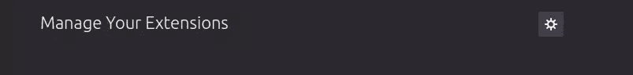

为**临时延期**打开新的一页。

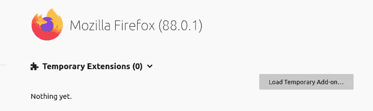

点击**加载临时插件**按钮，选择您刚刚创建的`manifest.json`文件。如果一切都做得正确，您将看到新创建的附加组件及其相关信息和我们在`manifest.json`中指定的图标。

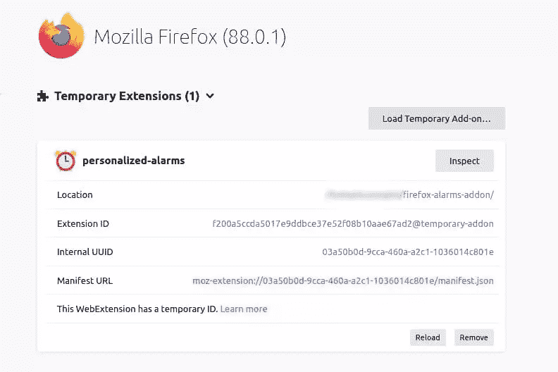

## 添加弹出窗口

可以通过不同的方法访问 Firefox 插件，其中一种方法是添加一个弹出页面。当添加一个弹出页面时，你的扩展图标会出现在工具栏上，一旦用户点击它，你指定的弹出页面就会出现。

我们将使用弹出页面向用户显示即将到来的警报列表，以及添加新警报的链接，该链接将用户带到选项页面(我们将在下一节中讨论)。

在项目根目录下创建一个包含以下内容的`popup.html`文件:

```
<!DOCTYPE html>
<html lang="en">
  <head>
    <meta charset="UTF-8">
    <meta name="viewport" content="width=device-width, initial-scale=1.0">
    <title>Personalized Alarms</title>
    <link href="assets/css/bootstrap.min.css" rel="stylesheet" />
  </head>
  <body class="p-3">
    <h1>Upcoming Alarms</h1>
    <ul class="list-group" id="alarmsList">
    </ul>
    <div class="mt-3">
      <a href="#" class="link-primary" id="optionsLink">Add an Alarm</a>
    </div>
    <script src="assets/js/jquery.min.js"></script>
  </body>
</html> 
```

如你所见，这只是一个 HTML 文档。我们还添加了`bootstrap.min.css`到`assets/css`并链接到这里，以及`assets/js/jquery.min.js`下的`jquery.min.js`并链接到这里。这两个库只是为了让事情变得更简单，但是你并不一定要实际使用它们。你可以从我们的回购[这里](https://github.com/sitepoint-editors/firefox-alarms-addon/tree/master/assets/css)和[这里](https://github.com/sitepoint-editors/firefox-alarms-addon/tree/master/assets/js)中获取。

在页面内容中，我们将显示即将到来的警报列表和一个指向选项页面的链接。

使弹出窗口工作的下一步是在`manifest.json`中添加以下内容:

```
"browser_action": {
  "default_popup": "popup.html",
  "browser_style": true
} 
```

`browser_action`是一个具有[数量的选项](https://developer.mozilla.org/en-US/docs/Mozilla/Add-ons/WebExtensions/manifest.json/browser_action)的对象，但是唯一强制的选项是`default_popup`，它是从附加根目录到弹出菜单的相对路径。`browser_style`不是强制的，但建议设置为`true`。这意味着 Firefox 将注入浏览器的默认样式，以确保插件的弹出样式与浏览器的其他部分相似。

这就是添加弹出窗口所需的全部内容。转到我们之前去过的临时附加组件页面，点击附加组件的**重新加载**按钮。这将使 Firefox 检查`manifest.json`是否有任何改变并应用它们。

一旦你这样做了，你将能够在工具栏菜单中看到你的扩展图标。

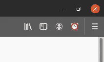

如果你点击它，你可以看到我们刚刚创建的弹出页面。

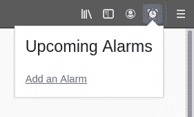

在我们的弹出窗口中仍然保留了两件事情，以使其功能完整:使用存储来获取即将到来的警报，并使“添加警报”链接将用户带到选项页面。

## 使用存储

浏览器扩展中的存储允许我们将与扩展或用户相关的数据存储在本地机器上，或者基于他们的帐户同步。本地存储在浏览器中本地存储信息，这意味着如果用户从另一台机器使用相同的电子邮件登录 Firefox，这些存储的信息将不会出现在那里。[同步存储](https://developer.mozilla.org/en-US/docs/Mozilla/Add-ons/WebExtensions/API/storage/sync)存储当前登录用户的信息，这样无论用户登录到哪里，都可以获得这些信息。

同步存储应该用于用户希望在任何地方都可用的某些设置，而本地存储应该用于仅与当前浏览器安装相关的信息或选项。

在我们的示例中，我们将使警报在用户登录的任何地方都可用，因此我们将它们存储在同步存储中。但是，假设我们想添加一个“临时禁用”选项，让警报静音一段时间。在这种情况下，使用本地存储可能更合适。

可以通过[存储 API](https://developer.mozilla.org/en-US/docs/Mozilla/Add-ons/WebExtensions/API/storage) 通过 [get](https://developer.mozilla.org/en-US/docs/Mozilla/Add-ons/WebExtensions/API/storage/StorageArea/get) 和 [set](https://developer.mozilla.org/en-US/docs/Mozilla/Add-ons/WebExtensions/API/storage/StorageArea/set) 方法轻松访问存储，但是首先，我们需要请求在我们的附加组件中使用`storage`的权限。这可以在`manifest.json`内部完成:

```
"permissions": [
  "storage"
], 
```

当用户安装您的附加组件时，他们将看到您需要什么权限，并需要他们接受安装您的附加组件。

为了能够在本地测试附加组件，我们还需要添加一个东西:一个显式的附加组件 ID [，以便能够使用存储](https://extensionworkshop.com/documentation/develop/extensions-and-the-add-on-id/#when-do-you-need-an-add-on-id)。为此，也将其添加到`manifest.json`中:

```
"browser_specific_settings": {
  "gecko": {
    "id": "addon@example.com",
    "strict_min_version": "42.0"
  }
} 
```

这只是为了能够在本地测试它。一旦我们发布它，我们会从清单中删除它。

我们要做的下一件事是创建一个新的`assets/js/popup.js`文件，它将从存储器中获取警报并显示它们。

要从存储器中获取项目，您可以使用 [browser.storage.sync.get](https://developer.mozilla.org/en-US/docs/Mozilla/Add-ons/WebExtensions/API/storage/StorageArea/get) 或[browser . storage . local . get](https://developer.mozilla.org/en-US/docs/Mozilla/Add-ons/WebExtensions/API/storage/StorageArea/get)。这取决于您是将信息储存在同步存储器还是本地存储器中。在我们的例子中，我们将警报存储在同步存储器中，所以我们将使用`browser.storage.sync.get`。应该注意的是，`browser.storage.sync.*`和`browser.storage.local.*`下的所有方法都有相同的签名，并且接受/返回相同的类型。

接受一个参数:一个字符串数组，它是我们正在检索的数据的键。这些键是在我们设置存储时定义的(我们将在下一节讨论)。该函数返回一个承诺，该承诺解析为一个包含我们在第一个参数中指定的键及其值的`results`对象，如果它们存在的话。

*注意:如果你要让插件与 Chrome 兼容，请务必查看[“让插件与 Chrome 兼容”](#makingaddonscompatiblewithchrome)部分。*

用以下内容创建`assets/js/popup.js`:

```
$(document).ready(() => {
  const listElement = $('#alarmsList');

  browser.storage.sync.get(['alarms'])
    .then((result) => {
      if (result.alarms && result.alarms.length) {
        //loop over the alarms and display them
        result.alarms.forEach((alarm) => {
          appendItem(alarm.content, alarm.time);
        });
      } else {
        //show no items available
        appendItem('No alarms are available');
      }
    });

  function appendItem(content, badgeContent = null) {
    listElement.append(` <li class="list-group-item d-flex justify-content-between align-items-center"> ${content}  ${badgeContent ? `<span class="badge bg-primary rounded-pill">${badgeContent}</span>` : ''} </li> `);
  }
}); 
```

您还需要将该文件包含在`popup.html`中:

```
 ...
  <script src="assets/js/popup.js"></script>
</body>
</html> 
```

当文档准备好时，我们使用`browser.storage.sync.get`来获取用户创建的警报。然后我们会检查是否有任何警报。如果有，我们将循环遍历它们并使用`appendItem`助手函数显示它们，该函数只是将一个 HTML 列表元素`li`附加到`#alarmsList`中。如果没有可用的警报，我们只显示“没有可用的项目”。

如果我们现在重新加载附加组件，您会注意到已经添加了一个新安装的附加组件。这是因为我们在`manifest.json`中明确指定了 ID。可以去掉旧的，避免冲突。

您会注意到我们的弹出窗口没有任何变化，因为我们还没有添加任何警报。我们将在下一节中完成这项工作。

## 添加选项页面

要允许用户自定义或编辑附加组件中的选项或设置，您需要创建一个 HTML 页面来保存选项以及设置或更改选项背后的逻辑。然后在`manifest.json`文件中链接到它。

在我们的附加组件中，我们将使用选项页面来允许用户创建警报。让我们首先创建文件`options.html`。您可以在附加项目目录中的任何位置创建它。我们将在项目的根目录下创建它，内容如下:

```
<!DOCTYPE html>
<html lang="en">
<head>
  <meta charset="UTF-8">
  <meta name="viewport" content="width=device-width, initial-scale=1.0">
  <title>Options</title>
  <link href="assets/css/bootstrap.min.css" rel="stylesheet" />
</head>
<body class="p-3">
  <h1>Add Alarm</h1>
  <form>
    <div class="form-group">
      <label for="name">Alarm Name</label>
      <input type="text" class="form-control" name="name" id="name" placeholder="Wake up" />
    </div>
    <div class="form-group">
      <label for="time">Time</label>
      <input type="time" class="form-control" name="time" id="time" />
    </div>
    <button type="submit" class="btn btn-primary mt-3">
      Add a New Alarm
    </button>
  </form>
  <script src="assets/js/jquery.min.js"></script>
  <script src="assets/js/options.js"></script>
</body>
</html> 
```

这里，我们只是显示一个带有两个输入字段的表单:“闹钟名称”，这是发送通知时闹钟中显示的文本，以及“时间”，这是设置闹钟的时间。

我们需要创建`assets/js/options.js`，它将监听`form`的`submit`事件，并在同步存储中设置`alarms`，向数组添加一个新的警报。

类似于我们使用的`get`方法，为了设置存储，我们可以使用 [browser.storage.sync.set](https://developer.mozilla.org/en-US/docs/Mozilla/Add-ons/WebExtensions/API/storage/StorageArea/set) 或[browser . storage . local . set](https://developer.mozilla.org/en-US/docs/Mozilla/Add-ons/WebExtensions/API/storage/StorageArea/set)，这取决于我们是仅在本地存储数据还是在所有登录的实例之间同步存储数据。由于我们将警报存储在`sync`中，我们将使用`browser.storage.sync.set`。

`set`方法接受一个参数，这个参数是键和值的对象。密钥是我们稍后用来检索值的东西，就像我们之前对`get`所做的那样。

用以下内容创建`assets/js/options.js`:

```
$(document).ready(() => {
  const nameElm = $('#name');
  const timeElm = $('#time');
  const formElm = $('form');
  formElm.on('submit', () => {
    $('.alert').remove(); //remove previous success alerts, if any
    //get existing alarms
    browser.storage.sync.get(['alarms'])
      .then((result) => {
        let alarms = result.alarms;
        const alarmName = nameElm.val().trim() + '_' + (Math.random() * 100);
        if (!alarms) {
          alarms = [];
        }
        alarms.push({
          content: nameElm.val().trim(),
          time: timeElm.val(),
          alarmName
        });

        //set alarms in the storage
        browser.storage.sync.set({alarms})
          .then(() => {
            //TODO schedule notification
            formElm.prepend('<div class="alert alert-success">Alarm added successfully</div>');
            nameElm.val('');
            timeElm.val('');
          });
      });
    return false; //disable default form submit action
  });
}); 
```

在表单提交时，我们首先检索存储的警报，如果有的话。然后，我们将通过表单创建的新警报推送到`alarms`数组。注意我们是如何创建一个`alarmName`变量的。我们将使用这个变量来创建一个独特的警报，然后在用户删除它时取消它。最后，我们使用`browser.storage.sync.set`来设置新的`alarms`数组。

您可能还注意到我们添加了一个`TODO`注释，这是我们在下一节中安排通知的地方。

我们的选项页面现在已经准备好了。为了使其可用，我们首先需要将以下内容添加到`manifest.json`:

```
"options_ui": {
  "page": "options.html",
  "browser_style": false
} 
```

这告诉 Firefox 在哪里可以找到我们的选项页面。我们还将`browser_style`设置为`false`,因为我们不希望 Firefox 的样式覆盖引导样式。

其次，我们现在将弹出窗口中的链接带用户到选项页面。为此，我们在附加到`#optionsLink`的新事件监听器中使用方法[browser . runtime . openoptionspage()](https://developer.mozilla.org/en-US/docs/Mozilla/Add-ons/WebExtensions/API/runtime/openOptionsPage)。我们将在`assets/js/popup.js`中添加以下内容:

```
$(document).ready(() => {
  ...

  // New code here
  $('#optionsLink').on('click', () => {
    browser.runtime.openOptionsPage();
  });

  function appendItem(content, badgeContent = null) { ... }
}); 
```

现在，当用户点击“添加警报”链接时，会将他们带到选项页面。

转到临时加载项页面，然后单击重新加载按钮。现在，我们的选项页面将被注册。

让我们来测试一下。打开弹出窗口，点击“添加警报”。它应该会将您带到附加组件页面中的**首选项**选项卡，内容将是我们在`options.html`页面中添加的内容。

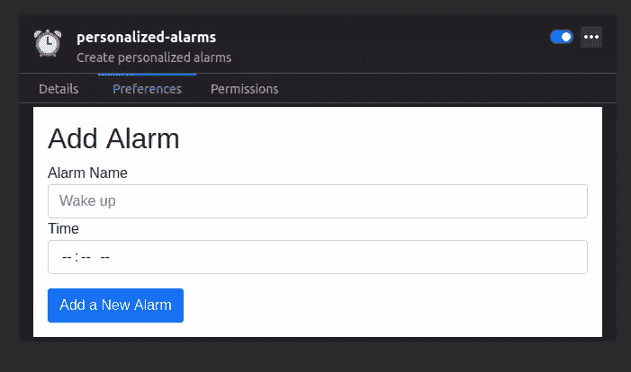

现在，尝试添加一个任意名称和时间的测试闹钟，并点击“添加闹钟”。之后，您应该能够在弹出窗口中看到它。

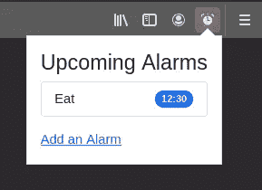

我们仍然需要对`assets/js/popups.js`做一个修改，即显示时间晚于当前时间的警报。将对`browser.storage.sync.get`的调用更改为:

```
browser.storage.sync.get(['alarms'])
  .then((result) => {
    if (result.hasOwnProperty('alarms') && result.alarms) {
      //get current time
      const minutes = (new Date).getMinutes().toString().padStart(2, '0');
      const hours = (new Date).getHours().toString().padStart(2, '0');
      const now = new Date('1970-01-01T' + hours + ':' + minutes + 'Z').getTime();

      //loop over the alarms and display them
      result.alarms.forEach((alarm) => {
        const alarmTime = new Date('1970-01-01T' + alarm.time + 'Z').getTime();
        if (alarmTime > now) {
          appendItem(alarm.content, alarm.time);
        }
      });
    } else {
      //show no items available
      appendItem('No alarms are available');
    }
  }); 
```

这将检查每个警报的时间是否大于当前时间，然后显示它。我们将时间格式化为`'1970-01-01T' + alarm.time + 'Z'`的原因是因为我们创建了独立于日期的闹钟。这只是为了让教程更简单。当计算当前时间时，当`hours`和`minutes`是一位数时，我们也用零填充它们，因为`new Date`所需的格式应该是两位数。

如果你现在检查，你会注意到我们添加的前一个闹钟是否显示取决于它的时间。您也可以在另一个时间测试添加一个新警报，看看它是否出现在弹出窗口中。

## 计划通知

为了发送通知，我们需要使用[通知 API](https://developer.mozilla.org/en-US/docs/Mozilla/Add-ons/WebExtensions/API/notifications) 和[警报 API](https://developer.mozilla.org/en-US/docs/Mozilla/Add-ons/WebExtensions/API/alarms) 。Alarms API 允许我们安排在特定时间触发“警报”。然后我们可以为 [onAlarm](https://developer.mozilla.org/en-US/docs/Mozilla/Add-ons/WebExtensions/API/alarms/onAlarm) 事件添加一个事件监听器，并在那时使用通知 API 发送通知。

要使用通知 API 和警报 API，我们需要在`manifest.json`中为每个 API 添加必要的权限，就像我们之前对存储 API 所做的那样:

```
"permissions": [
  "storage",
  "alarms",
  "notifications"
], 
```

我们要做的下一件事是用在`assets/js/options.js`中创建警报所需的代码替换之前的`TODO`。

为了创建一个警报，我们使用了 [browsers.alarms.create](https://developer.mozilla.org/en-US/docs/Mozilla/Add-ons/WebExtensions/API/alarms/create) 函数，我们向该函数传递两个参数。第一个是警报的名称。这允许我们在附加组件中有不同类型的警报，并根据名称采取不同的行动。第二个是选择的对象:

*   `when`:应该触发报警的时间(以时间戳的形式)
*   `delayInMinutes`:如有必要，警报触发前的几分钟延迟
*   `periodInMinutes`:每次火灾间隔的分钟数

所有这些选项都是可选的。如果您没有通过其中任何一个，警报将在创建后立即触发一次。如果您需要在指定时间触发一次警报，只需通过`when`输入要触发的时间。如果想在指定的分钟数后触发一次闹钟，只需通过`delayInMinutes`即可。如果你想在指定的分钟数重复触发闹钟，那么你可以通过`periodInMinutes`。除非通过`periodInMinutes`，否则警报只会触发一次。

在我们的附加组件中，我们需要闹钟每天在用户创建闹钟时输入的指定时间触发一次。因此，我们将使用`when`和`periodInMinutes`的组合。

用以下内容替换`assets/js/options.js`中的`TODO`注释:

```
//create a new alarm
const currentDate = new Date();
const currentMonth = (currentDate.getMonth() + 1).toString().padStart(2, '0');
const currentDay = currentDate.getDate().toString().padStart(2, '0');
//same as before, add 0 to month and day if they're less than 10
browser.alarms.create(alarmName, {
  when: new Date(
    currentDate.getFullYear() + '-' + currentMonth + '-' + currentDay + 'T' + timeElm.val()
  ).getTime(),
  periodInMinutes: 1440,
}); 
```

作为第一个参数，我们传递我们之前创建的唯一警报名称。附加组件中的警报名称应该是唯一的，因为如果不是，新添加的警报名称将覆盖同名的先前警报名称。在选项对象中，我们传递用户在`when`属性中选择的时间，对于`periodInMinutes`，我们传递`1440`，因为那是一天中的分钟数。

和以前一样，如果月份和日期少于一位数，我们也用`0`填充它们，以确保它们是两位数，因为这是`new Date`所需的格式。

这意味着警报将在用户每天输入的指定时间触发一次。

既然我们已经成功地创建了警报，接下来我们需要做的就是监听这些警报何时触发，当它们触发时，向用户发送通知。为此，我们需要使用一个后台脚本。

### 后台脚本

加载项、弹出窗口、选项页面或任何其他页面只有在我们打开时才是活动的。这意味着，如果我们监听弹出窗口或任何其他页面中的事件，监听器只有在我们打开它们时才会工作。当在一天的不同时间听闹钟时，这不会有帮助。

为此，我们需要一个后台脚本。后台脚本总是在后台运行，即使弹出窗口、选项页面或加载项的任何其他页面没有打开。因此，在后台脚本中，我们可以向任何事件添加侦听器，并确保它们相应地工作。

要添加后台脚本，我们首先需要在`manifest.json`中添加:

```
"background": {
  "scripts": ["assets/js/background.js"]
} 
```

一旦我们创建了`assets/js/background.js`并重新加载了扩展，这个脚本将一直在后台运行。

我们将收听`background.js`警报响起。要做到这一点，我们需要使用[browser . alarms . on alarm . addlistener](https://developer.mozilla.org/en-US/docs/Mozilla/Add-ons/WebExtensions/API/alarms/onAlarm#addlistener_syntax)，它具有一个在每次警报触发时都会执行的功能。该函数有一个`alarmInfo`对象作为参数，它包含关于触发的警报的信息。

用以下内容创建`assets/js/background.js`:

```
browser.alarms.onAlarm.addListener((alarmInfo) => {
  const alarmName = alarmInfo.name.split('_')[0];
  console.log(alarmName);
  //TODO send notification
}); 
```

我们正在从`alarmInfo`中检索警报名称，同时删除我们附加到它上面的随机整数。然后，我们将发送一个内容为`alarmName`的通知。目前，我们只是发表了一条`TODO`评论。出于测试目的，我们还添加了`console.log`。

一旦我们重新加载扩展，这个后台脚本将开始工作并监听警报。我们来测试一下。重新加载扩展，然后转到选项页面，添加一个闹钟，一分钟后响起。接下来，在临时附加组件页面上，点击附加组件的**检查**按钮。这将打开一个新窗口，您可以在其中看到控制台。如果您等到闹钟响起，您将能够在控制台中看到闹钟的名称。这是因为我们目前正在监听警报，只是在控制台中记录它的名称。

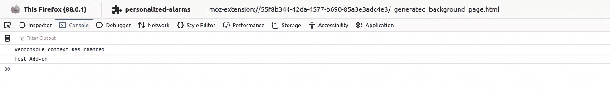

现在我们有了一个工作的后台脚本！下一步是在发出警报时发送通知。

### 发送通知

为了创建和发送通知，我们使用了`browser.notifications.create`方法。这个方法，以及通知 API 中的所有方法，只有在添加了`manifest.json`中的`notifications`权限之后才可以访问，我们之前已经添加了这个权限。

`browser.notifications.create`接受两种说法:

1.  `id`:标识通知的字符串。如果您稍后需要更新或清除通知，这可能会有所帮助。如果另一个通知具有相同的`id`，旧的通知将被新的通知替换。如果省略该参数，将生成一个`id`。
2.  `notificationOptions`:通知的选项对象。这个对象有三个强制属性:`type`、`title`、`message`。基于`type`，将需要一些其他选项。允许的类型有`basic`，只显示扩展图标、标题、消息；`image`，显示通知中的图像；`list`，显示物品列表，虽然这主要只在 macOS 上起作用；以及`progress`，显示进度条。

目前，Firefox 只支持`basic`类型，用属性`type`、`title`、`message`，以及可选的`iconUrl`，指定要显示的图标。

在`assets/background.js`中，我们将用以下内容替换`TODO`注释:

```
browser.alarms.onAlarm.addListener((alarmInfo) => {
  const alarmName = alarmInfo.name.split('_')[0];

  browser.notifications.create({
    type: 'basic',
    title: alarmName,
    message: 'The alarm you created'
  });
}); 
```

对于标题，我们将显示用户在创建警报时在表单中输入的消息，我们只是添加了一个描述性的`message`。

返回临时附加组件页面，重新加载扩展，然后测试它。创建带有关闭时间的提醒，并检查您收到的通知。

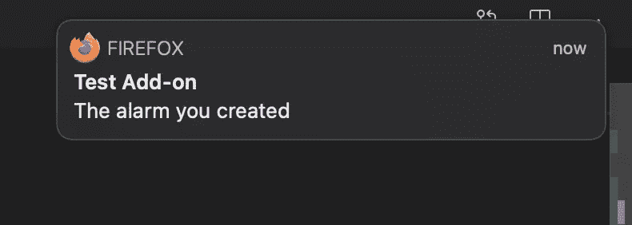

*如果你没有收到任何通知，而你正在使用 macOS，确保通知是允许来自火狐的[。](https://blog.pcrisk.com/mac/13194-how-to-manage-and-disable-web-notifications-on-mac)*

## 删除通知

我们要添加的最后一个功能是删除通知。我们将允许用户删除他们从弹出窗口中看到的通知，并使用警报名称取消已删除通知的警报。

在我们开始之前，我们将使用来自[羽毛](https://feathericons.com/?query=trash)的垃圾图标。可以从那里下载，也可以从本教程的 GitHub 资源库中获取。应该是在`asseimg/trash.svg`里面加的。

我们需要对`assets/js/popup.js`进行修改，在每个闹钟的时间旁边显示一个垃圾桶按钮。我们还将使用存储器中的`alarms`数组中的警报索引作为元素的 ID，以便以后能够方便地访问它。

我们将为`appendItem`添加一个名为`id`的新可选参数，并显示一个新按钮:

```
function appendItem (content, badgeContent = null, id = null) {
  listElement.append(` <li class="list-group-item d-flex justify-content-between align-items-center alarm-item" ${id !== null ? `id="alarm_${id}"` : ''}> ${content}  ${badgeContent ? ` <div>
          <span class="badge bg-primary rounded-pill">${badgeContent}</span>
            <button class="trash-btn p-0"></button>
        </div> ` : ''} </li> `);
} 
```

然后，在`forEach`循环中，我们将把`index`添加到参数列表中:

```
result.alarms.forEach((alarm, index) => {
  const alarmTime = new Date('1970-01-01T' + alarm.time + 'Z').getTime();
  if (alarmTime > now) {
    appendItem(alarm.content, alarm.time, index);
  }
}); 
```

接下来，我们将在`.trash-btn`上添加一个`click`事件监听器，它首先从其父级检索警报的索引:

```
$('body').on('click', '.trash-btn', function () {
  const parent = $(this).parents('.alarm-item');
  const parentId = parent.attr('id');
  const alarmIndex = parentId.split('_')[1];

  //TODO delete alarm from alarms array in storage
}); 
```

之后，我们将从存储器中获取`alarms`数组，然后使用[拼接](https://developer.mozilla.org/en-US/docs/Web/JavaScript/Reference/Global_Objects/Array/splice)移除索引`alarmIndex`处的警报，并在存储器中再次设置`alarms`数组:

```
//get alarms from storage
browser.storage.sync.get(['alarms'])
  .then((result) => {
    let alarms = [];
    let alarmName = '';
    if (result.alarms && result.alarms.length > alarmIndex) {
      alarmName = result.alarms[alarmIndex].alarmName;
      result.alarms.splice(alarmIndex, 1);
    }
    browser.storage.sync.set({alarms})
      .then(() => {
        //TODO cancel the alarm
      });
}); 
```

然后，我们需要取消闹钟，这样它以后就不会响了。为此，我们将使用 [browser.alarms.clear](https://developer.mozilla.org/en-US/docs/Mozilla/Add-ons/WebExtensions/API/alarms/clear) ，它将警报名称作为取消警报的参数。最后，我们将从弹出窗口中删除报警元素:

```
//remove alarm by name
browser.alarms.clear(alarmName);
//remove alarm item from list
parent.remove(); 
```

与此同时，我们增加了删除功能，可以从存储中删除警报，还可以在后台取消警报。

让我们为刚刚添加的按钮添加一些样式。创建包含以下内容的文件`assets/css/popup.css`:

```
.trash-btn {
  background-color: transparent;
  border: none;
}

.trash-btn img {
  width: 15px;
  height: 15px;
} 
```

然后在`popup.html`中添加这个样式表:

```
<link href="assets/css/popup.css" rel="stylesheet" /> 
```

现在检查弹出窗口。它应该是这样的:

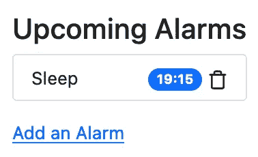

尝试添加一个警报，它将在几分钟后发送通知。然后移除它。在你预定的时间，闹钟不应该响。

就是这样！我们已经创建了一个扩展，在`sync`存储器中为用户存储信息，然后我们学习了如何创建在特定时间间隔触发的警报。然后我们创建了一个监听警报触发的后台脚本，最后我们学习了如何在监听警报触发后向用户发送通知。

创建插件生命周期的下一步是在 Mozilla 的[开发者中心](https://addons.mozilla.org/en-us/developers/)上发布它。

## 发布加载项

现在我们已经准备好发布附加组件了，我们可以删除`manifest.json`中的`browser_specific_settings`键，所以请确保首先这样做。

您需要登录您的帐户，或者创建一个新帐户。你可以在这里做这件事。

登录后，您可以看到“我的加载项”部分。点击右下角的**提交新的附加模块**按钮。

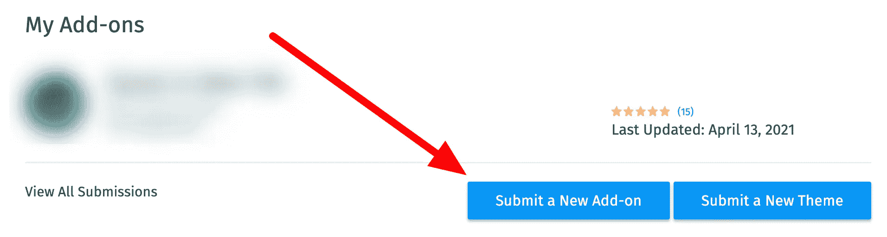

然后将开始提交新附加组件的过程。你首先会被询问是在 Firefox 附加组件管理器上发布附加组件，还是自己发布。选中第一个默认选项，点击**继续**。

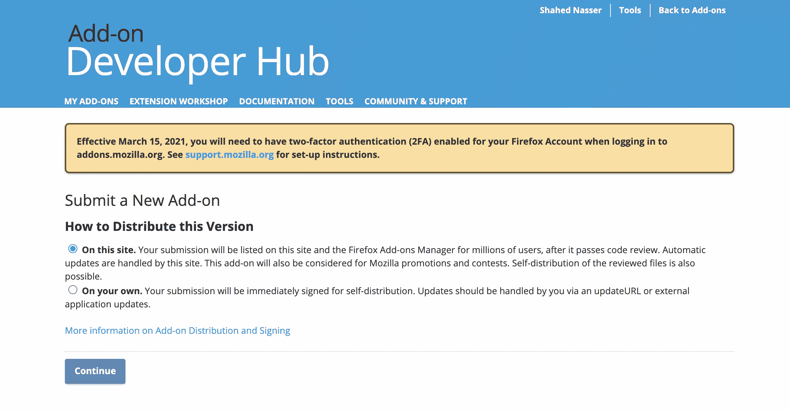

接下来，会要求您上传扩展。为此，转到您在其中创建附加组件的目录，并创建一个包含所有内容的压缩 ZIP 文件。确保附加组件的根是 ZIP 文件的根，这意味着`manifest.json`应该在 ZIP 文件的根中。然后上传 ZIP 文件。你也可以选择让附加组件适用于 Firefox Android。

*注意:如果你得到错误“发现重复的附加 ID”，确保你已经从`manifest.json`中移除了`browser_specific_settings`键。*

文件上传无误后，点击**继续**。

在下一步中，将要求您指定您的附加组件是否使用任何编译器或缩小器或任何工具来处理附加组件的代码。这背后的原因是 Firefox 需要你提交原始代码进行审查。由于我们的插件不使用这些工具，只需检查**否**并点击**继续**。

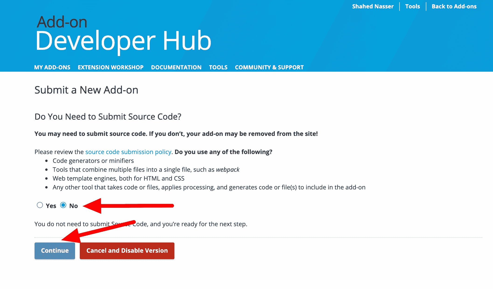

在最后一步，您将被要求输入一些关于附加组件的信息。任何想要安装您的附加组件的用户都会看到此信息，因此请确保尽可能使其清晰明了。输入加载项的名称、描述、类别等。完成后，点击**提交版本**。如果您还没有准备好填写一些信息，不要担心，因为您可以在以后编辑它。

就是这样！一旦您点击**提交版本**，您的附加组件将等待审核，这不会花费很长时间。审查过程可能需要一天时间。一旦获得批准，您将收到一封电子邮件通知，然后您就可以在 Firefox store 上查看该插件。您还可以转到附加组件的信息页面，添加或编辑任何信息，如描述、图像等。

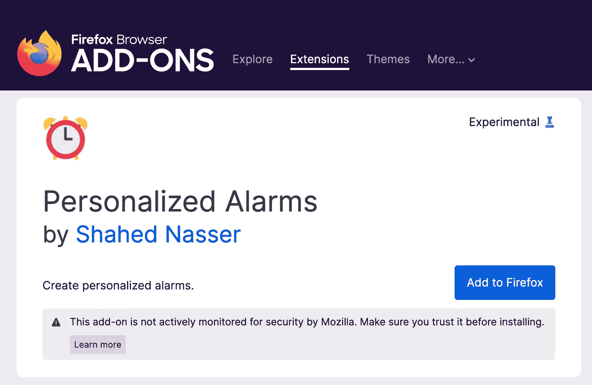

更新附加组件也很容易。您只需上传更新版本，它将立即可用！这使得在 Firefox 上发布插件比大多数其他浏览器更容易也更快。

## 使插件与 Chrome 兼容

为了使我们刚刚创建的扩展与 Chrome 兼容，我们需要做以下修改:

1.  用`chrome.*`替换所有出现的`browser.*`。
2.  在 Chrome 上，它的所有 API 都使用回调，而不是返回承诺。这意味着我们需要传递一个回调函数作为最后一个参数，而不是在代码中使用承诺。

做出这些改变的一个例子是在`assets/js/popups.js`中。我们使用以下代码从`storage`获取警报并显示它们:

```
browser.storage.sync.get(['alarms'])
  .then((result) => {
  //...
}); 
```

我们将用下面的代码替换这段代码:

```
chrome.storage.sync.get(['alarms'], (result) => {
  //...
}); 
```

就是这样。我们只是将剩余的代码移到回调函数中。

## 结论

在本教程中，我们介绍了如何创建一个具有基本和必要功能的附加组件，如使用存储、发送通知、创建后台脚本等。知道如何做所有这些可以帮助您创建具有许多功能的附加组件。开始创造一些了不起的东西吧！

## 分享这篇文章