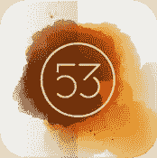
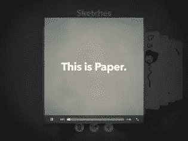
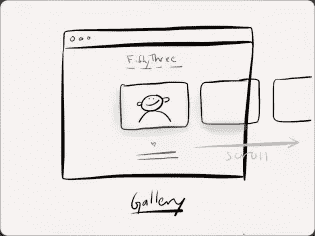
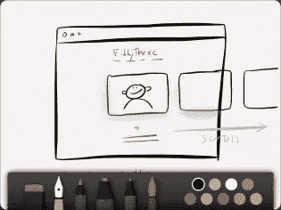
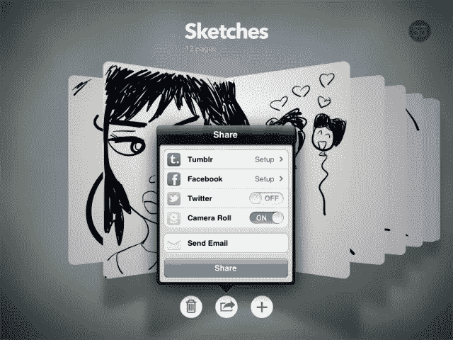

# 用纸创作流畅、华丽的草图

> 原文：<https://www.sitepoint.com/create-fluid-gorgeous-sketches-with-paper/>

iPad 的一个主要优点是，它是一个简单易用的绘图和素描工具。它便于携带，重量轻，你可以很容易地与你的朋友和同事分享你的工作。这样做的缺点是在 iPad 上画画和在纸上画画的感觉不一样。有几个绘图应用程序试图近似这种感觉，但当你在光滑的玻璃屏幕上平稳地滑动手指或手写笔时，很难重现这种效果。

纸(作者[第五十三期](https://www.fiftythree.com/))脱颖而出，成为创作草图和图画最简单、最美丽的方式之一。虽然这款应用刚刚推出，但它已经被评为苹果 2012 年 3 月的“月度应用”，并拥有令人印象深刻的 150 万次下载。让我们仔细看看 Paper，看看为什么它可能是 iPad 上最好的绘图应用之一。

* * *

<iframe width="640" height="480">
 
 <h3>首次运行和主屏幕</h3> 
首次启动 Paper 时，您会看到一个简短的覆盖框，为您提供使用和导航应用程序的基本说明。如果你需要一个简短的复习，上面的视频也可以通过应用程序获得。只需点击右上角的 53 标志，您就可以开始了。
 
 

 
 
正如你所看到的，导航是流畅的，相当直观。熟悉的 iOS 手势，如点击、滑动和挤压，可以轻松打开和关闭笔记本以及翻页。您可以点击加号图标添加更多笔记本，点击垃圾桶图标将删除笔记本。打开笔记本时，您可以使用点击加号图标和垃圾桶图标来添加和删除页面。(在我看来，你可以添加多少页是没有限制的——我轻松地在现有的笔记本上添加了 300 多页，没有任何问题。)共享图标只有在您打开笔记本时才会变为活动状态。
 
笔记本很容易定制。在笔记本之间滑动时，您会注意到每个笔记本的右上角有一个小信息图标。点击它，你就可以选择更改笔记本的名称，或者从相机胶卷中的照片或者从提供的 11 个封面中选择一个来定制封面。
 
 

原谅我臃肿的巴特·辛普森素描。

 
 <h3>绘图界面</h3> 
打开笔记本后，您可以点击任何空白页来访问整页绘图界面。工具托盘将弹出，您可以选择任何可用的工具开始绘制草图。该应用程序附带两个免费工具——橡皮擦和自来水笔(称为绘图工具)。使用绘图工具，您可以用九种可用颜色中的任何一种来创建压敏笔画。还有其他四个工具可用(草图、书写、轮廓和颜色，分别是铅笔、记号笔、钢笔和画笔)，但每个工具的解锁成本为 1.99 美元。你也可以通过应用内购买购买整套工具，作为 7.99 美元捆绑包的一部分。
 
 
 
 
 
除非你在做一些繁重的绘图和着色工作，否则 Draw 工具可以满足你用纸做的大部分事情，比如线框、快速草图或做笔记。如果你犯了一个错误，只需用两个手指逆时针旋转即可取消最后几个草图。经过几次尝试，这将很快成为一个非常容易记住的手势，因为你不需要回到工具托盘来纠正错误。
 <h3>设置</h3> 
 

 
 
当你打开笔记本时，你可以从主屏幕上访问纸张的真正设置。点击“共享”图标，您可以在这里选择将图片共享到 Tumblr、Twitter 或脸书。您还可以选择通过电子邮件或 iPad 的相机胶卷导出照片。点击左上方的 53 图标会弹出一个菜单，您可以在其中查看您的纸质欢迎视频、访问 53 的支持论坛以及访问 53 的网站。
 <h3>缺点</h3> 
虽然纸很容易使用，但它也有缺点。该应用程序仅面向横向视图，因此如果你的手较小，单手导航关闭笔记本可能有点困难。有时，在不在页面上创建额外笔划的情况下打开工具托盘也有点困难。在颜色(只有九种)和纸张(一种颜色，一种纹理)方面，你受到了相当的限制，所以铁杆艺术家可能会认为纸张有点太简单了。我想看到的一个工具是“油漆桶”,这样我就可以给整个页面上色。颜色工具是最接近这一点的工具，但它是一个付费的附加组件，它只能在水彩图层中绘画，而不是纯色。
 
说到价格，这可能是这款应用最大的缺点。免费版本很棒，但即使你想添加两个或更多工具，价格也要 4.98 美元或更高。在这个价位，你可以购买带有更多工具和颜色选项的 Autodesk Sketchbook Pro。
 <h3>结论</h3> 
Paper 简单的界面和方便的工具使在 iPad 上画草图和绘图成为一种流畅优雅的体验。在应用程序内购买额外的工具有点昂贵，但如果你坚持使用默认的绘图工具和你的想象力，你可能会惊喜地发现 Paper 简单而流畅的界面并没有妨碍你的创造力。
 
 

 
Paper 在 iOS App Store 上是免费的，需要 iOS v4.3 或更高版本才能运行。从下面的 App Store 链接或使用提供的 App Store 按钮下载应用程序。
 
<a href="https://itunes.apple.com/us/app/paper-by-fiftythree/id506003812?mt=8&amp;uo=4" target="itunes_store">下载论文</a>
 
<aside class="flex space-x-4"><h2 class="text-lg my-2 mr-2">分享这篇文章</h2><button aria-label="Share Sitepoint on facebook" data-network="facebook" class="social-share-button mr-2 cursor-pointer transform transition duration-200 hover:scale-125 text-primary-700"><svg aria-hidden="true" focusable="false" data-prefix="fab" data-icon="facebook-square" class="svg-inline--fa fa-facebook-square fa-w-14 fa-lg share-icon" role="img" viewbox="0 0 448 512"><path fill="currentColor" d="M400 32H48A48 48 0 0 0 0 80v352a48 48 0 0 0 48 48h137.25V327.69h-63V256h63v-54.64c0-62.15 37-96.48 93.67-96.48 27.14 0 55.52 4.84 55.52 4.84v61h-31.27c-30.81 0-40.42 19.12-40.42 38.73V256h68.78l-11 71.69h-57.78V480H400a48 48 0 0 0 48-48V80a48 48 0 0 0-48-48z"/></svg></button><button aria-label="Share Sitepoint on reddit" data-network="reddit" class="social-share-button mr-2 cursor-pointer transform transition duration-200 hover:scale-125 text-primary-700"><svg aria-hidden="true" focusable="false" data-prefix="fab" data-icon="reddit" class="svg-inline--fa fa-reddit fa-w-16 fa-lg share-icon" role="img" viewbox="0 0 512 512"><path fill="currentColor" d="M201.5 305.5c-13.8 0-24.9-11.1-24.9-24.6 0-13.8 11.1-24.9 24.9-24.9 13.6 0 24.6 11.1 24.6 24.9 0 13.6-11.1 24.6-24.6 24.6zM504 256c0 137-111 248-248 248S8 393 8 256 119 8 256 8s248 111 248 248zm-132.3-41.2c-9.4 0-17.7 3.9-23.8 10-22.4-15.5-52.6-25.5-86.1-26.6l17.4-78.3 55.4 12.5c0 13.6 11.1 24.6 24.6 24.6 13.8 0 24.9-11.3 24.9-24.9s-11.1-24.9-24.9-24.9c-9.7 0-18 5.8-22.1 13.8l-61.2-13.6c-3-.8-6.1 1.4-6.9 4.4l-19.1 86.4c-33.2 1.4-63.1 11.3-85.5 26.8-6.1-6.4-14.7-10.2-24.1-10.2-34.9 0-46.3 46.9-14.4 62.8-1.1 5-1.7 10.2-1.7 15.5 0 52.6 59.2 95.2 132 95.2 73.1 0 132.3-42.6 132.3-95.2 0-5.3-.6-10.8-1.9-15.8 31.3-16 19.8-62.5-14.9-62.5zM302.8 331c-18.2 18.2-76.1 17.9-93.6 0-2.2-2.2-6.1-2.2-8.3 0-2.5 2.5-2.5 6.4 0 8.6 22.8 22.8 87.3 22.8 110.2 0 2.5-2.2 2.5-6.1 0-8.6-2.2-2.2-6.1-2.2-8.3 0zm7.7-75c-13.6 0-24.6 11.1-24.6 24.9 0 13.6 11.1 24.6 24.6 24.6 13.8 0 24.9-11.1 24.9-24.6 0-13.8-11-24.9-24.9-24.9z"/></svg></button><button aria-label="Share Sitepoint on twitter" data-network="twitter" class="social-share-button mr-2 cursor-pointer transform transition duration-200 hover:scale-125 text-primary-700"><svg aria-hidden="true" focusable="false" data-prefix="fab" data-icon="twitter-square" class="svg-inline--fa fa-twitter-square fa-w-14 fa-lg share-icon" role="img" viewbox="0 0 448 512"><path fill="currentColor" d="M400 32H48C21.5 32 0 53.5 0 80v352c0 26.5 21.5 48 48 48h352c26.5 0 48-21.5 48-48V80c0-26.5-21.5-48-48-48zm-48.9 158.8c.2 2.8.2 5.7.2 8.5 0 86.7-66 186.6-186.6 186.6-37.2 0-71.7-10.8-100.7-29.4 5.3.6 10.4.8 15.8.8 30.7 0 58.9-10.4 81.4-28-28.8-.6-53-19.5-61.3-45.5 10.1 1.5 19.2 1.5 29.6-1.2-30-6.1-52.5-32.5-52.5-64.4v-.8c8.7 4.9 18.9 7.9 29.6 8.3a65.447 65.447 0 0 1-29.2-54.6c0-12.2 3.2-23.4 8.9-33.1 32.3 39.8 80.8 65.8 135.2 68.6-9.3-44.5 24-80.6 64-80.6 18.9 0 35.9 7.9 47.9 20.7 14.8-2.8 29-8.3 41.6-15.8-4.9 15.2-15.2 28-28.8 36.1 13.2-1.4 26-5.1 37.8-10.2-8.9 13.1-20.1 24.7-32.9 34z"/></svg></button><button aria-label="Share Sitepoint on linkedin" data-network="linkedin" class="social-share-button mr-2 cursor-pointer transform transition duration-200 hover:scale-125 text-primary-700"><svg aria-hidden="true" focusable="false" data-prefix="fab" data-icon="linkedin" class="svg-inline--fa fa-linkedin fa-w-14 fa-lg share-icon" role="img" viewbox="0 0 448 512"><path fill="currentColor" d="M416 32H31.9C14.3 32 0 46.5 0 64.3v383.4C0 465.5 14.3 480 31.9 480H416c17.6 0 32-14.5 32-32.3V64.3c0-17.8-14.4-32.3-32-32.3zM135.4 416H69V202.2h66.5V416zm-33.2-243c-21.3 0-38.5-17.3-38.5-38.5S80.9 96 102.2 96c21.2 0 38.5 17.3 38.5 38.5 0 21.3-17.2 38.5-38.5 38.5zm282.1 243h-66.4V312c0-24.8-.5-56.7-34.5-56.7-34.6 0-39.9 27-39.9 54.9V416h-66.4V202.2h63.7v29.2h.9c8.9-16.8 30.6-34.5 62.9-34.5 67.2 0 79.7 44.3 79.7 101.9V416z"/></svg></button><button aria-label="Share Sitepoint on email" data-network="email" class="social-share-button mr-2 cursor-pointer transform transition duration-200 hover:scale-125 text-primary-700"><svg aria-hidden="true" focusable="false" data-prefix="fas" data-icon="envelope" class="svg-inline--fa fa-envelope fa-w-16 fa-lg share-icon" role="img" viewbox="0 0 512 512"><path fill="currentColor" d="M502.3 190.8c3.9-3.1 9.7-.2 9.7 4.7V400c0 26.5-21.5 48-48 48H48c-26.5 0-48-21.5-48-48V195.6c0-5 5.7-7.8 9.7-4.7 22.4 17.4 52.1 39.5 154.1 113.6 21.1 15.4 56.7 47.8 92.2 47.6 35.7.3 72-32.8 92.3-47.6 102-74.1 131.6-96.3 154-113.7zM256 320c23.2.4 56.6-29.2 73.4-41.4 132.7-96.3 142.8-104.7 173.4-128.7 5.8-4.5 9.2-11.5 9.2-18.9v-19c0-26.5-21.5-48-48-48H48C21.5 64 0 85.5 0 112v19c0 7.4 3.4 14.3 9.2 18.9 30.6 23.9 40.7 32.4 173.4 128.7 16.8 12.2 50.2 41.8 73.4 41.4z"/></svg></button></aside> </body> </html></iframe>