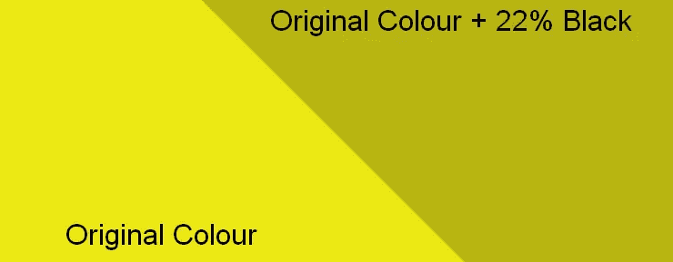
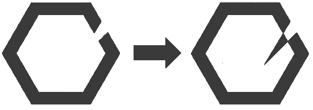
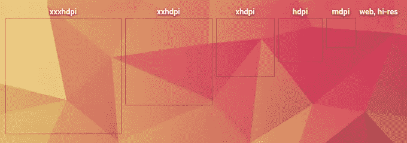

# 如何为你的 Android 应用程序创建图标

> 原文：<https://www.sitepoint.com/create-icons-android-app/>

你已经完成了你的伟大的新应用程序，它运行流畅，你迫不及待地告诉大家。

但是等等，有一些非常重要的东西不见了。如果你不是一个设计师，并且因为盯着太多的像素而做噩梦，你可能会把启动图标的工作留到流程的最后。这完全没问题，如果你的应用程序永远见不到天日，你不会想浪费你的时间，对吗？

我们将看看如何为 Android 应用程序创建自己的启动图标，并准备好使用它们。我们也将看看一些不同的资源，这将有助于在创作过程中。

## 准备

在我们开始之前，你应该看看 Android 开发者网站上的[图标参考指南](http://developer.android.com/design/style/iconography.html)。

> *注意:上面的链接是 Android 4.4 KitKat 的风格指南。如果你想学习材料设计(就像我们将在本教程中做的那样)，你将不得不挖得更深一点，因为 Android L 和材料设计还没有完成。我将指出整个教程中的变化。你可以在这里找到材料设计参考和一般哲学[。](http://www.google.com/design/spec/material-design/introduction.html)*

Android L 的图标风格一般与 KitKat 不同。材料设计更加简化，元素使用对比丰富的颜色。你可能会注意到图标和其他元素中实现的假阴影，这是材料设计特有的，但以前见过(例如去年发布的 Google Admin launch 图标)。

实现这种阴影似乎没有通用的规则，但是你可以自己实验，自己拿主意。阴影是用黑色填充的形状，透明度为 22%，覆盖了主色。例如，在谷歌管理应用程序图标中，你可以看到两种主要颜色，但当添加阴影时，会产生另外两种颜色。阴影通常呈 45 度对角线对齐。

让我们尝试对自定义图标使用相同的概念。

## 创建您的自定义图标

我决定使用一个特殊的图标(稍后你会明白为什么)，特别是阿尔巴尼亚开放实验室的标志。徽标看起来像这样:

我们将不包括文本，只包括实际的符号。然后，我们玩剩下的标志，直到我们得到一些我们喜欢的外观。

许多徽标的问题是，就像这里一样，它们可能不像单色徽标那样好用。对于开放实验室的标志，这主要是因为 3 种颜色在同一个地方碰撞(技术上是 2 种，但缺少第 3 种，它的空白空间也算在内)，所以形状无法识别。

我们可以利用负空间，并使用切割颜色的另一半(可能会让你想起平克·弗洛伊德)。这种单色标志非常适合通知栏图标或其他需要单色图标的场合。

一种不同的方法是给我们无法用单色传达的形状添加笔画。它可以有一个设定的笔画宽度，而不是用一种颜色填充。不过，在我们的例子中，它与开放实验室的标志不太协调。

也就是说，我在 Illustrator 中调整了徽标，并在我认为效果不错的地方添加了阴影。

快速检修后，结果如下:

如您所见，根据您选择的风格，您将需要不同的方法。

在我们的例子中，我做了一个改动很小的版本，只是在框架上添加了一点阴影。第二个和第三个变化是纯材料设计，因为图标分别有一个圆形和一个圆角框作为容器。

这些形状在 KitKat 或更早的 Android 版本中会有 3D 效果或渐变元素，但这些图标在非 Android L 设备上看起来会很棒。

选择最适合你的，并将图标导出为 512×512 PNG(Android 上图标可用的最大分辨率)。

看看由 Roman Nurik 设计的伟大的 [Android Asset studio，在这里你可以导出你完成的图标等等。](http://romannurik.github.io/AndroidAssetStudio/index.html)

您也可以通过启动图标生成器的帮助来完成此操作，它会自动导出各种 dpi 的图标。

## 现实一点？获取材料

诚然，我们仍然需要等待几个月，直到我们可以享受材料设计和 Android L 的全部功能，但做好准备并成为第一批准备好材料设计的应用程序之一并没有什么坏处。

如果你被风格指南的所有规则和指导方针弄得不知所措，从小事做起，像我们一样用材料设计风格创建你的图标。你最终会找到窍门的。让我们知道你的结果！

## 分享这篇文章