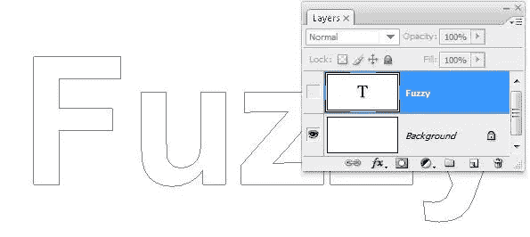
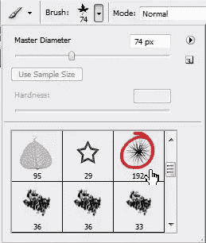
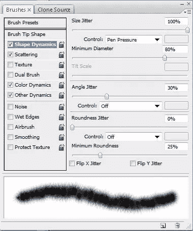
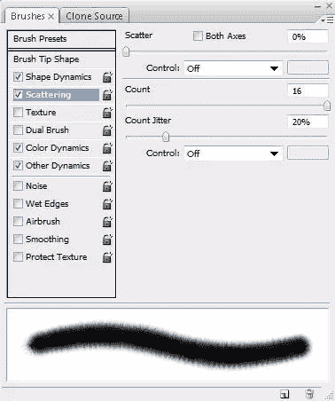
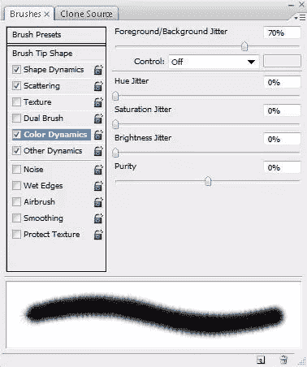
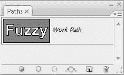
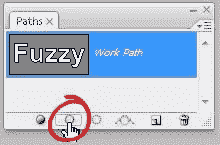

# 通过在 Photoshop 中对矢量路径应用笔刷来创建有趣的效果

> 原文：<https://www.sitepoint.com/create-interesting-effects-by-applying-brush-strokes-to-your-vector-paths-in-photoshop/>

使用矢量的一个很大的优点是，它们能产生漂亮、干净、平滑的线条，你可以缩放到任何尺寸而不损失质量。虽然有时候，干净的线条可能太干净或太光滑，所以在本教程中，我会告诉你如何轻松地应用纹理到一个路径使用纹理画笔笔尖。让我们从一些文本中创建一个矢量路径开始。

1.新建一个 600 x 300 像素的 Photoshop 文档，添加一些文字。我使用 Arial 粗体，大小 200 像素，设置前景色为红色。在这一点上，你选择什么颜色并不重要，因为你可以在以后使用画笔时选择一种颜色。

2.现在我们将从文本中创建一条路径。选择「图层>文字>建立工作路径」。然后关闭你的文字层的可见性，这样你只能看到字母的轮廓形状。

3.从工具栏中选择画笔工具(BE ),从屏幕顶部的画笔选项栏中选择“模糊球”画笔笔尖。将笔刷的直径设置为 70 像素左右。

4.现在，我们将对笔刷做一些额外的修改，然后将它作为一个笔画应用到矢量路径。你可以通过调整笔刷面板中的设置来对笔刷进行戏剧性的改变。有时你可能会改变一两个设置，为了某些效果，你可能会疯狂地做出许多改变。在这个例子中，我想让文字看起来毛茸茸的，所以我对模糊球画笔笔尖进行了修改。

通过选择“窗口”>“画笔”或按 F5 打开画笔调板。点击笔刷面板左侧的“形状动态”字样。将尺寸抖动设置为 100%，最小直径设置为 80%，角度抖动设置为 30%。当你更改设置时，你会在笔刷面板底部的预览面板中看到效果。

5.现在点击“散射”这个词。将散布设置为 0%，将计数设置为 16%。

6.点击颜色动力学这个词。将前景/背景抖动设置为 70%左右。当我们使用笔刷时，这个设置会影响前景色和背景色的混合。

好了，这就是我们的模糊笔刷设置。

7.在工具栏上设置前景色——我用红色`# 990000——背景色——我用橙色#FF6600，但是你当然可以选择任何你喜欢的颜色。

8.我们现在需要做的就是用笔刷给我们的矢量路径添加一个笔画。我们应用的笔画是像素，所以我们需要一个图层来放置像素。在图层面板上，点击新建图层图标，在文本图层上方新建一个图层(应该是不可见的)。

9.通过选择“窗口”>“路径”打开“路径”调板。您应该会看到一个带有单词 Fuzzy 轮廓的缩略图。

10.单击工作路径将其选中。您应该在文档窗口中看到路径轮廓。现在点击路径面板底部的描边路径图标，你的笔刷将被应用到路径上。

如果你仍然可以看到路径轮廓，只需点击路径面板中的灰色区域。

在这个例子中，我们花了一些时间来设置我们的笔刷，但是在某些情况下，你可能只是想使用默认的笔刷来绘制路径。这里有几个使用相同的矢量路径和一些 Photoshop 的笔刷的例子。

画布上的 33 像素粉彩

35 像素水彩脂肪提示

25 像素 Hypno 线条(在特效笔刷中)

5 像素重点画(在湿媒体画笔中)

不要忘记，您可以对任何矢量路径应用描边，无论您是使用钢笔工具、自定义形状还是将选区转换为路径来绘制。

## 分享这篇文章