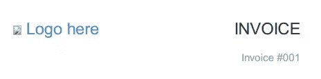
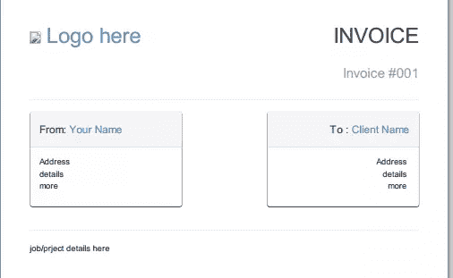
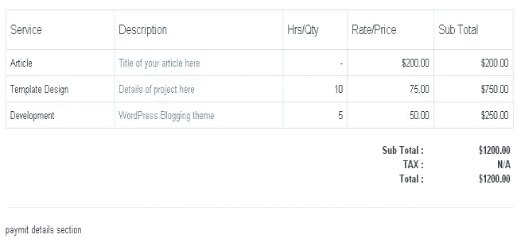
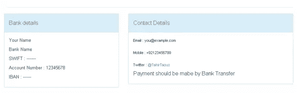
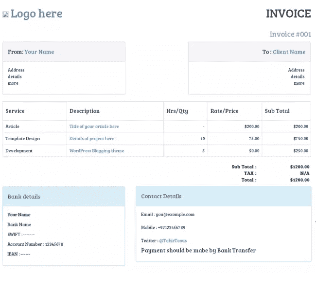

# 如何使用 Twitter Bootstrap 创建发票，第 2 部分

> 原文：<https://www.sitepoint.com/create-invoice-twitter-bootstrap-part-2/>

在本系列的第一部分中，我展示了如何使用 Twitter Bootstrap 创建发票。

现在，我们将创建发票。

## 发票标题

在您喜欢的文本编辑器中打开您的 invoice.html 文件。用下面的代码替换这里的**内容。**

```
<div class="col-xs-6">
  <h1>
    <a href="https://twitter.com/tahirtaous">
      
      Logo here
    </a>
  </h1>
</div>
<div class="col-xs-6 text-right">
  <h1>INVOICE</h1>
  <h1><small>Invoice #001</small></h1>
</div>
<hr>
next section
```

我已经使用`col-xs-6`类创建了两个相等的列。在我们的第一个专栏中，您可以添加您的徽标或姓名。只需在您的发票文件夹中添加一个徽标图像，并将其命名为 logo.png。如果您没有徽标，那么您可以移除图像标签，并将此处的**徽标和**文本替换为您的姓名。

现在在谷歌浏览器中打开 invoice.html 文件，右键点击页面上的任意位置，然后点击打印。您将看到以下结果。



对于第二列，我也使用了`text-right`类将文本(发票标题)对齐右侧。对于发票号，我使用了`small`类。

如果您看到不同的打印预览，请确保您已正确注释掉打印样式。

### 客户详细信息部分

接下来，我们将创建两列。我将使用`panels`类来创建上下文面板。在第一个面板中，您可以添加您的详细信息(姓名、地址)，在第二个面板中，您可以添加客户详细信息。我还将使用`col-xs-offset-2`类在两个面板之间创建一个间隙。如前所述，面板有不同的类。我将使用主面板。

现在用以下代码替换下一节的**文本。**

```
 <div class="row">
        <div class="col-xs-5">
          <div class="panel panel-default">
                  <div class="panel-heading">
                    <h4>From: <a href="#">Your Name</a></h4>
                  </div>
                  <div class="panel-body">
                    <p>
                      Address <br>
                      details <br>
                      more <br>
                    </p>
                  </div>
                </div>
        </div>
        <div class="col-xs-5 col-xs-offset-2 text-right">
          <div class="panel panel-default">
                  <div class="panel-heading">
                    <h4>To : <a href="#">Client Name</a></h4>
                  </div>
                  <div class="panel-body">
                    <p>
                      Address <br>
                      details <br>
                      more <br>
                    </p>
                  </div>
                </div>
        </div>
      </div> <!-- / end client details section -->

       job/project details here
```

在我们的面板中，我为标题使用了`panel-heading`类，为主体部分使用了`panel-body`类，您将在主体部分添加地址。现在，如果你在 chrome 中预览你的页面，你会看到下面的结果。



### 工作/项目详细信息部分

对于这一部分，我将使用带有`table`和`table-bordered`类的**表**。我们将有五个工作细节的标题。服务、描述、小时/数量、费率/价格、小计。现在用下面的代码替换这里的**工作/项目细节**文本。

```
 <table class="table table-bordered">
        <thead>
          <tr>
            <th><h4>Service</h4></th>
            <th><h4>Description</h4></th>
            <th><h4>Hrs/Qty</h4></th>
            <th><h4>Rate/Price</h4></th>
            <th><h4>Sub Total</h4></th>
          </tr>
        </thead>
        <tbody>
          <tr>
            <td>Article</td>
            <td><a href="#">Title of your article here</a></td>
            <td class="text-right">-</td>
             <td class="text-right">$200.00</td>
              <td class="text-right">$200.00</td>
          </tr>
          <tr>
            <td>Template Design</td>
            <td><a href="#">Details of project here</a></td>
            <td class="text-right">10</td>
             <td class="text-right">75.00</td>
              <td class="text-right">$750.00</td>
          </tr>
          <tr>
            <td>Development</td>
            <td><a href="#">WordPress Blogging theme</a></td>
            <td class="text-right">5</td>
             <td class="text-right">50.00</td>
              <td class="text-right">$250.00</td>
          </tr>
        </tbody>
      </table>

      Total amount section
```

现在我们需要添加一个总付款部分。对于这个部分，我用`text-right`类创建了一个新行。这一行有两列，每一列都有`col-xs-2`类。我们的第一列有一个额外的`col-xs-offset-8`类。使用`col-xs-2`类，我们可以向右移动列。每个类将一列的左边距增加一整列。

用以下代码替换**总金额部分**文本。

```
<div class="row text-right">
  <div class="col-xs-2 col-xs-offset-8">
    <p>
      <strong>
        Sub Total : <br>
        TAX : <br>
        Total : <br>
      </strong>
    </p>
  </div>
  <div class="col-xs-2">
    <strong>
      $1200.00 <br>
      N/A <br>
      $1200.00 <br>
    </strong>
  </div>
</div>
payment details section
```

这是一个预览



### 最后一部分:付款详情

现在我们将创建文档的最后一部分。在本节中，我们将创建一个两列布局。第一列有`col-xs-5`类，第二列有`col-xs-7`类。每一列都有与`panel-info`类的 div。第一个面板将用于支付详情(银行详情，贝宝电子邮件或任何其他细节)。在第二个面板中，我们将添加联系信息(电子邮件、twitter、手机号码)和任何其他详细信息。

用以下代码替换**付款详情部分**。

```
<div class="row">
  <div class="col-xs-5">
    banking details
  </div>
  <div class="col-xs-7">
    contact details
  </div>
</div>
```

上面的代码将生成一个两列布局。现在用下面的代码替换**银行详细信息**。

```
<div class="panel panel-info">
  <div class="panel-heading">
    <h4>Bank details</h4>
  </div>
  <div class="panel-body">
    <p>Your Name</p>
    <p>Bank Name</p>
    <p>SWIFT : -------</p>
    <p>Account Number : 12345678</p>
    <p>IBAN : ------</p>
  </div>
</div>
```

在上面的代码中，你可以看到我们有一个带有`panel panel-info`类的父 div，然后我们有两个子 div。第一个子 div 有一个`panel-heading`类，第二个子 div 有一个`panel-body`类。

现在用下面的代码替换**联系人详细信息**。

```
<div class="span7">
  <div class="panel panel-info">
    <div class="panel-heading">
      <h4>Contact Details</h4>
    </div>
    <div class="panel-body">
      <p>
          Email : you@example.com <br><br>
          Mobile : +92123456789 <br> <br>
          Twitter  : <a href="https://twitter.com/tahirtaous">@TahirTaous</a> | SitePoint : <a href="https://www.sitepoint.com/author/ttaous/">https://www.sitepoint.com/author/ttaous/</a>
      </p>
      <h4><small>payment should be mabe by Bank Transfer</h4>
    </div>
  </div>
</div>
```



## 自定义字体

我们已经用 Twitter Bootstrap 创建了一个完整的发票。现在让我们使用谷歌字体中的网络字体来增加我们的发票的味道。我将使用谷歌字体中的布里衬线字体。

添加以下代码

```
<style>
  @import url(http://fonts.googleapis.com/css?family=Bree+Serif);
  body, h1, h2, h3, h4, h5, h6{
    font-family: 'Bree Serif', serif;
  }
  </style>
```

将它添加到标题部分的主样式表下面。

```
<link href="css/bootstrap.css" rel="stylesheet">
```

我已经使用了@import 方法来使用谷歌字体中的 Bree Serif 字体。我在正文和所有标题上都使用了 Bree 衬线。如果你只对正文选择器使用 Bree Serif 字体，那么你的标题将对所有标题使用 Bootstrap 的默认样式。我对所有标题都使用了 Bootstrap 的字体系列。



### 将发票另存为 PDF

我们的发票完整。现在在 Google Chrome 中打开 invoice.html，在网页的任意位置点击右键，点击**打印**，从右侧面板选择**保存**。仅此而已。您可以通过这个 Github 资源库下载这个项目的源代码。

## 分享这篇文章