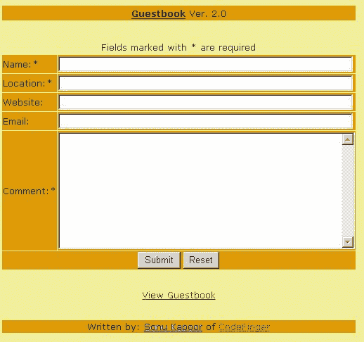
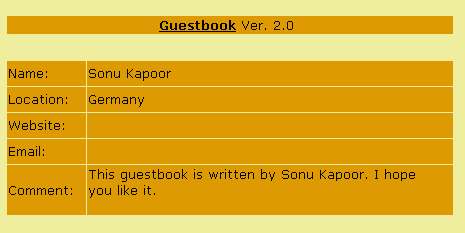

# 在 ASP.NET 创建自己的留言簿

> 原文：<https://www.sitepoint.com/create-own-guestbook-asp-net/>

最近我在做我的网站，并决定实现一个留言簿。我开始在网上搜索，想为我的网站找到最好的留言簿，但当没有出现时，我想“嘿，我是一名开发人员，为什么不创建自己的留言簿呢？”

创建留言簿非常容易——你也可以这样做。在本教程中，我将向您展示如何操作。我假设您已经了解了 ASP.NET 编程的基础知识，了解了代码隐藏中涉及的技术，并且掌握了一些 XML/XSL 技能。

##### 概观

我们需要什么来创建一个留言簿？我们需要两个 Web 表单:一个让用户可以输入他们的姓名、电子邮件地址和评论，另一个用来在他们登录到留言簿时显示这些评论。当然，我们可以将该功能构建到一个 Web 表单中，但是为了获得清晰的代码，我将使用两个 Web 表单和几个代码隐藏文件(稍后我将更详细地讨论这些)。

我们还需要一个数据库来保存通过表单输入的信息。我使用一个简单的 XML 文件(一个数据库)来存储用户输入的信息。对于 XML 的可视化，我们将使用 XSL。

因此，总而言之，我们需要以下内容:

*   两个 Web 表单
*   代码隐藏
*   数据库ˌ资料库
*   可扩展样式表语言（Extensible Stylesheet Language 的缩写）

在留言簿中，通常足以存储用户的姓名、位置、电子邮件地址、网站地址和评论。当然，您可以存储更多的字段，但是对于我们的目的来说，这些已经足够了。我们将把这些数据存储在 XML 文件中，看起来像这样:

```
<?xml version="1.0" encoding="ISO-8859-1"?> 

<guestbook> 

  <guest> 

    <name>Sonu Kapoor</name> 

    <location>Germany</location> 

    <email>sonu@codefinger.de</email> 

    <website>www.codefinger.de</website> 

    <comment>This guestbook is written by Sonu Kapoor.  

    I hope you like it. To learn how to create such a guestbook,  

    read the whole story on my website.</comment> 

  </guest> 

</guestbook>
```

##### 在留言簿上签名

我们将允许用户通过在一个简单的 Web 表单中输入一些信息来“签署”我们的留言簿——在我们的示例中，这是 guestbook.aspx 文件。我在 Web 表单中使用了以下字段:

*   名字
*   位置
*   电子邮件
*   网站(全球资讯网的主机站)
*   评论

代码如下:

```
<% @Page Language="C#" Debug="true" Src="Guestbook.cs"  

Inherits="Guestbook" %> 

<form runat="server"> 

... 

...doing some visualisation stuff 

... 

<ASP:Textbox id="name" size="64" runat="server"/> 

<asp:RequiredFieldValidator id="nameRequired" runat="server"  

ControlToValidate="name"  

ErrorMessage="You must enter a value into textbox1"  

Display="dynamic">Enter name  

</asp:RequiredFieldValidator> 

<ASP:Textbox id="location" size="64" runat="server"/> 

<asp:RequiredFieldValidator id="locationRequired" runat="server"  

ControlToValidate="location" ErrorMessage="You must enter  

a value into textbox1" Display="dynamic"> 

Enter location </asp:RequiredFieldValidator> 

<ASP:Textbox id="website" size="64" runat="server"/> 

<ASP:Textbox id="email" size="64" runat="server"/> 

<ASP:Textbox id="comment" TextMode="Multiline"  

columns="50" rows="10" wrap="true" runat="server"/> 

<asp:RequiredFieldValidator id="commentRequired" runat="server"  

ControlToValidate="comment" ErrorMessage="You must enter  

a value into textbox1" Display="dynamic"> 

Enter comment </asp:RequiredFieldValidator> 

<ASP:Button id="submit" runat="server" Text="Submit"  

OnClick="Save_Comment"/> 

<ASP:Button id="reset" runat="server" Text="Reset"/> 

... 

...doing some visualisation stuff 

... 

</script> 

</form>
```

为了避免不必要的代码让你困惑，我已经移除了可视化标签——包括表格、表格标题等。—来自这个例子(当然，这些都包含在本教程末尾提供的可下载代码中)。因为我们只显示了一个简单的带有几个字段和按钮的表单，所以在这个文件中你看不到任何真正的编程代码。这是因为所有的功能都隐藏在代码背后。

在上面代码的第一行，我设置了 SRC 属性，让 ASP.NET 文件知道我们正在使用代码隐藏文件 Guestbook.cs。我还用相应的类名设置了属性`Inherits`。这个属性让文件知道要继承哪个类。

接下来，我实现了必需的文本字段。请记住，如果您想在代码隐藏中使用相同的变量，它们需要在两个文件中具有相同的 ID，并且必须声明为 public。

在代码的下一部分，我使用了 ASP.NET 验证器控件。这些控件检查用户是否在文本字段中输入了值，而无需往返服务器。代码在客户端执行。

最后，我用一个名为`Save_Comment`的`OnClick` 事件实现了一个提交按钮。该事件用于存储用户输入到 XML 文件中的信息。这个事件的功能在 Guestbook.cs 里有，我还实现了一个重置按钮——就这样！对 Web 表单不需要再做什么了。现在，如果您运行 guestbook.aspx，您应该会看到如下所示的 Web 表单:



现在我们知道了如何显示 Web 表单，但是我们还没有看到处理 guestbooks.cs 中的事件的代码。现在让我们来看一看。

```
using System;  

using System.Web;  

using System.Web.UI;  

using System.Web.UI.WebControls;  

using System.Xml;  

public class Guestbook : Page  

{  

 // Create the required webcontrols with the same name as   

in the guestbook.aspx file  

  public TextBox name;  

  public TextBox location;  

  public TextBox email;  

  public TextBox website;  

  public TextBox comment;  

  public void Save_Comment(object sender, EventArgs e)  

  {  

   // Everything is all right, so let us save the data   

into the XML file   

   SaveXMLData();  

   // Remove the values of the textboxes  

   name.Text="";  

   location.Text="";  

   website.Text="";  

   email.Text="";  

   comment.Text="";  

  }  

}  

private void SaveXMLData()  

{  

  // Load the xml file  

  XmlDocument xmldoc = new XmlDocument();  

  xmldoc.Load( Server.MapPath("guestbook.xml") );  

  //Create a new guest element and add it to the root node  

  XmlElement parentNode = xmldoc.CreateElement("guest");  

  xmldoc.DocumentElement.PrependChild(parentNode);  

  // Create the required nodes  

  XmlElement nameNode = xmldoc.CreateElement("name");  

  XmlElement locationNode = xmldoc.CreateElement("location");  

  XmlElement emailNode = xmldoc.CreateElement("email");  

  XmlElement websiteNode = xmldoc.CreateElement("website");  

  XmlElement commentNode = xmldoc.CreateElement("comment");  

  // retrieve the text   

  XmlText nameText = xmldoc.CreateTextNode(name.Text);  

  XmlText locationText = xmldoc.CreateTextNode(location.Text);  

  XmlText emailText = xmldoc.CreateTextNode(email.Text);  

  XmlText websiteText = xmldoc.CreateTextNode(website.Text);  

  XmlText commentText = xmldoc.CreateTextNode(comment.Text);  

  // append the nodes to the parentNode without the value  

  parentNode.AppendChild(nameNode);  

  parentNode.AppendChild(locationNode);  

  parentNode.AppendChild(emailNode);  

  parentNode.AppendChild(websiteNode);  

  parentNode.AppendChild(commentNode);  

  // save the value of the fields into the nodes  

  nameNode.AppendChild(nameText);  

  locationNode.AppendChild(locationText);  

  emailNode.AppendChild(emailText);  

  websiteNode.AppendChild(websiteText);  

  commentNode.AppendChild(commentText);  

  // Save to the XML file  

  xmldoc.Save( Server.MapPath("guestbook.xml") );  

  // Display the user the signed guestbook  

  Response.Redirect("viewguestbook.aspx");  

  }  

}
```

哇！这是我们的代码隐藏文件…但是这里到底发生了什么呢？你不会相信，但答案是:“不多”！

首先，我们实现了访问几个重要函数所需的最小名称空间。然后我创建了一个名为 Guestbook 的新类:

```
public class Guestbook : Page
```

注意，这个类是由 guestbook.aspx 文件继承的。然后我们声明 textbox 类型的 5 个公共变量。请记住，这里的名称必须与我们在 guestbook.aspx 中创建文本框时使用的名称相同。然后，如您所见，我们使用了`Save_Comment`事件，该事件由包含在 guestbookpx 文件中的 submit 按钮触发。该事件用于保存数据。

##### 储蓄过程

函数`SaveXMLData()` 为我们保存信息。因为我们使用 XML 数据库来存储信息，所以我们使用了`XmlDocument`、`XmlElement` 和 XmlText 类，它们提供了我们需要的所有功能。

接下来，我们创建一个新的`XMLDocument`类对象并加载 guestbook.xml 文件。用函数`CreateElement`创建所需的节点，检索用户输入的信息并存储到对象`XmlText`中。接下来，我们使用函数`AppendChild` 和主`XmlDocument`对象来存储创建的没有任何值的节点。

最后，值存储在我们刚刚创建的节点中，我们保存对 guestbook.xml 文件的所有更改，并将页面重定向到 viewguestbook.aspx，在那里显示存储的注释。

##### 查看留言簿

要查看留言簿，我们必须创建另一个 Web 表单:

```
<% @Page Language="C#" Debug="true" Src="ViewGuestbook.cs"    

Inherits="ViewGuestbook" %>
```

如您所见，这个 Web 表单实际上并没有做那么多事情。它简单地调用了代码隐藏文件 ViewGuestbook.cs。

```
using System;   

using System.Web;   

using System.Web.UI;   

using System.Web.UI.WebControls;   

using System.Xml;   

using System.Xml.Xsl;   

using System.IO;   

public class ViewGuestbook : Page   

{   

  private void Page_Load(object sender, System.EventArgs e)   

  {   

    //Load the XML file   

    XmlDocument doc = new XmlDocument( );   

    doc.Load( Server.MapPath("guestbook.xml") );   

    //Load the XSL file   

    XslTransform xslt = new XslTransform();   

    xslt.Load( Server.MapPath("guestbook.xsl") );   

    string xmlQuery="//guestbook";   

    XmlNodeList nodeList=doc.Document   

Element.SelectNodes(xmlQuery);   

    MemoryStream ms=new MemoryStream();   

    xslt.Transform( doc, null, ms);   

    ms.Seek( 0, SeekOrigin.Begin );   

    StreamReader sr = new StreamReader(ms);   

    //Print out the result   

    Response.Write(sr.ReadToEnd());   

  }   

}
```

我创建了这个类来向我们的用户显示通过留言簿提交的所有评论。同样，我们做的第一件事是实现所需的名称空间，因为我们使用 XSL 进行可视化，所以我们必须确保包含名称空间`System.Xml.Xsl`。

然后我们创建一个名为`ViewGuestbook`的新类，它有一个名为`Page_Load`的私有内置函数。当页面加载时，或者当用户执行刷新时，这个函数总是被调用。在这里，该函数加载 guestbook.xml 文件，然后在我们借助`XslTransform`对象加载 guestbook.xsl 之前，使用 XslTranform 类将 xml 元素转换为 HTML。

接下来，我们创建一个类为`XmlNodeList`的新对象，这将允许我们选择所需的节点。然后，我们使用通过名称空间`System.IO`可用的类`MemoryStream`，创建一个将内存作为后备存储的流，并使用`Transform`函数将 xml 数据分配给这个内存流。`Seek`功能将当前位置设置为零。

然后我们创建一个类`StreamReader`的对象，它读取流，并在函数`ReadToEnd()`的帮助下打印结果。这个函数从当前位置开始读取流，直到结束。如果您运行 viewguestbook.aspx，您应该会看到这样一个 Web 表单:



##### XSL

正如我已经提到的，我们使用 XSL 将数据从 XML 转换成 HTML。我假设您已经对 XSLT 有所了解，所以我在这里只涉及一些重要的方面。我使用了 XSL for-each 循环来遍历书中的所有来宾，如下所示:

```
<xsl:for-each select="//guest">   

  <xsl:apply-templates select="name"/>    

</xsl:for-each>
```

在循环中，我们调用 XSL 模板名，看起来像这样:

```
<xsl:template match="name">   

  <xsl:value-of select='.'/>   

</xsl:template>
```

##### 结论

如你所见，创建一个留言簿并不困难。祝你好运！别忘了[在这里下载示例文件](https://www.sitepoint.com/examples/netguest/ASPNETGuestbook.zip)。

## 分享这篇文章