# 如何为你的作品集网站创造完美的英雄形象

> 原文：<https://www.sitepoint.com/create-perfect-hero-image-portfolio-site/>

*本文是与 [BAWMedia](https://bawmedia.com/) 合作创作的。感谢您对使 SitePoint 成为可能的合作伙伴的支持。*

访问者对一个网站形成印象只需要几秒钟的时间。考虑到主页上的英雄形象是大多数访问者遇到的第一点内容，当他们看到你的网站时，你希望他们得到什么样的印象？

为了充分利用这些最初的遭遇，你的英雄形象需要经过深思熟虑并加以执行。它需要传达你是哪种类型的创作者，提供你的才华的预览，并给访问者一个进一步探索的理由。

要为你的作品集网站创造完美的英雄形象，有 6 个要素需要关注。在本帖中，我们将看看这些元素是什么，以及一些来自 [BeTheme 的预建网站示例，这是世界上最受欢迎和评分最高的 WordPress 主题之一，拥有 264，000+的销量和 4.83 的五星评分](https://muffingroup.com/betheme/?utm_source=sitepoint.com&utm_medium=content&utm_campaign=nov22) ，以及其他品牌，展示了将它们巧妙地结合在一起的各种方式。

## 为你的作品集网站设计完美的英雄形象

总的来说，不管你在建什么类型的网站，每个英雄区都有 6 个元素。当你使用这些关键要素创建你的英雄形象时，要考虑以下一些事情:

### 1.选择最能反映你所做事情的图片

你为你的英雄形象选择的意象应该和你所做的工作类型有直接的联系。

比如[劳伦华尔道夫室内](https://www.laurenwaldorf.com/)是一家精品室内设计工作室。因此，英雄部分包含一个已完成项目的滑动照片库:

[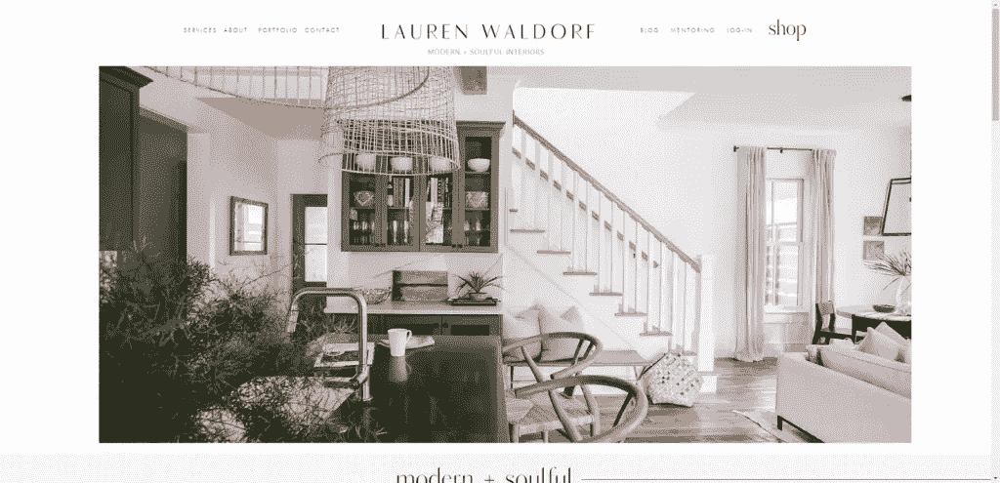](https://www.laurenwaldorf.com/)

对于摄影师、摄像师、网页设计师和其他视觉艺术家来说，你可能有很多图片可以在《英雄》中展示。对于使用其他类型媒体的艺术家来说，可能很难直观地描述你所做的事情。

在后一种情况下，你可能会决定将你的脸作为英雄部分的主要图像，正如我们在 [BeDJ 2 预建网站](https://themes.muffingroup.com/be/dj2/?utm_source=sitepoint.com&utm_medium=content&utm_campaign=nov22)英雄图像中看到的:

[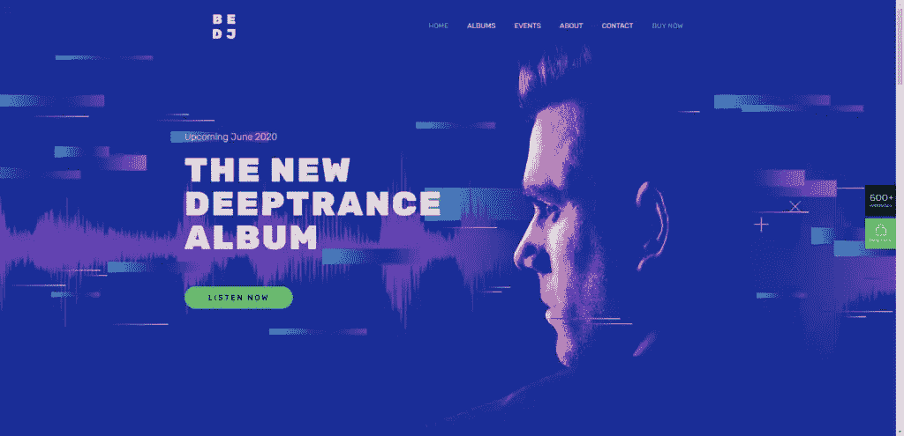](https://themes.muffingroup.com/be/dj2/?utm_source=sitepoint.com&utm_medium=content&utm_campaign=nov22)

DJ 的脸给游客带来了视觉上更有趣的东西，而不仅仅是一堆颜色和音乐相关的图形。它也在作品主体和艺术家之间建立了直接的联系。

当你着手设计你的英雄形象时，请考虑以下几点:

*   这个部分的主题应该是什么或谁？
*   图像属于前景还是融入背景？
*   图像会不会原封不动，或者有没有办法让它看起来更有艺术感？

还有，你真的需要意象吗？例如，如果你是一个字体设计师或文案，那么你可能会决定跳过图像，只让你的文字来说话。

### 2.利用背景来提供更多关于你所做工作的细节

有不同的方法来处理英雄部分的背景。

在某些情况下，你的作品可能会占据背景。例如，一个视频制作人可以把他们的视频幻灯片放在背景中。这不仅会让网站看起来生动活泼，还会让访问者快速预览你的作品。

在其他情况下，你可能想在英雄部分对你的工作做一个小小的梳理，就像这个来自 [BeInterior 6 预建网站](https://themes.muffingroup.com/be/interior6/?utm_source=sitepoint.com&utm_medium=content&utm_campaign=nov22)的例子:

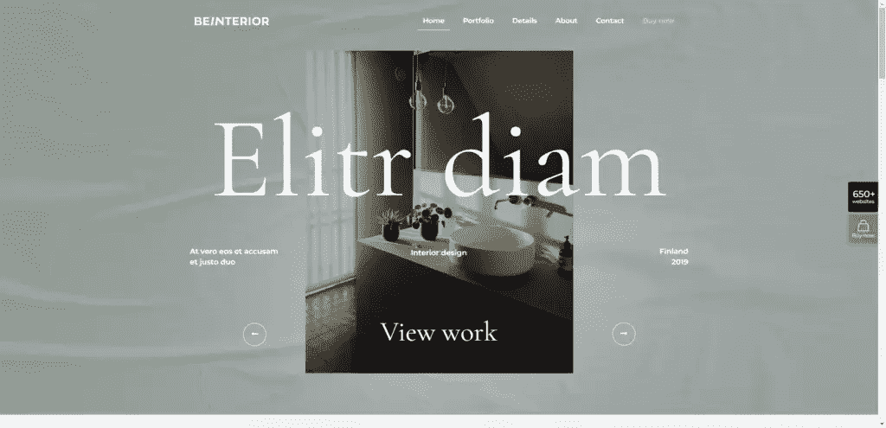

照片库大约占了该部分宽度的四分之一。虽然设计师可以使用彩色背景来装饰作品，但他们选择了添加纹理照片。该表不仅为背景提供了一个舒适的颜色，它是一个创造性的方式来添加室内设计师的工作背景。

你的另一个选择是像 [Mindgrub](https://www.mindgrub.com/) 那样在背景中使用纯色或渐变(以及插图):

[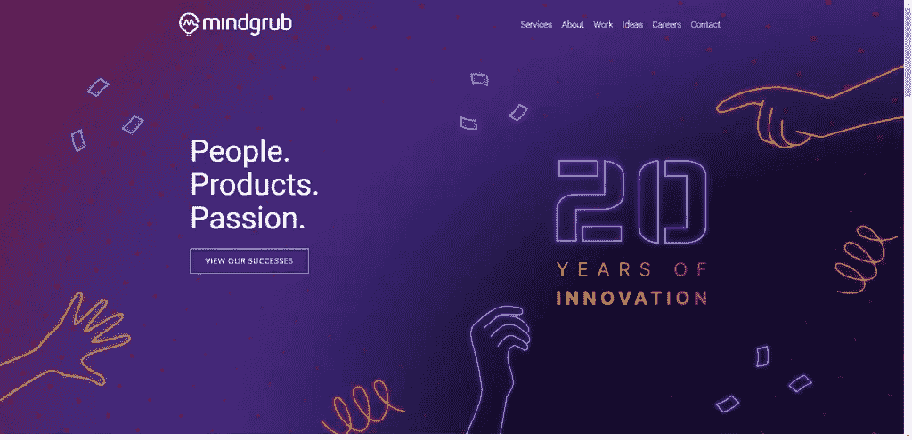](https://www.mindgrub.com/)

对于数字创意人员来说，这可能是你最好的选择。虽然你可以展示你建立的网站或你开发的 UI 工具包的截图，但你也可以利用这个空间来创造你自己的数字杰作。您可以将为客户创建的工作存储到另一个部分或页面。

### 3.设计你的字体，让你的声音变得清晰

即使你不写出现在英雄部分的文字，你做出的审美选择也可以像文字本身一样传达给潜在客户。

有很多方法可以给你的英雄信息添加声音。首先是你使用的字体类型。例如， [BeDetailing 4 预建网站](https://themes.muffingroup.com/be/detailing4/?utm_source=sitepoint.com&utm_medium=content&utm_campaign=nov22)使用谷歌字体 Italiana:

[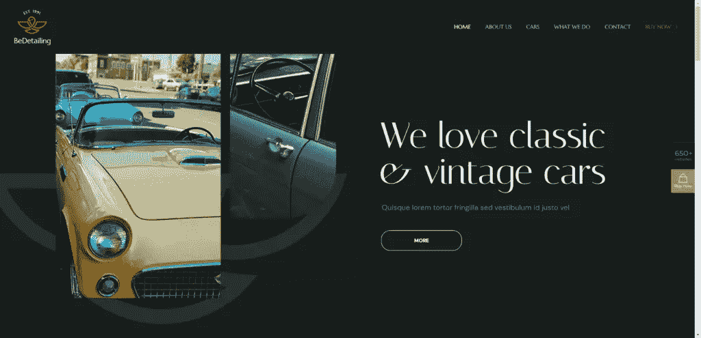](https://themes.muffingroup.com/be/detailing4/?utm_source=sitepoint.com&utm_medium=content&utm_campaign=nov22)

这家汽车设计公司一开始就表达了对经典和老爷车的喜爱。措辞、汽车形象和优雅的书法风格的字体都告诉了我们很多。

另一件要考虑的事情是你的句子风格如何让你的信息听起来不同。例如， [Get Em Tiger](https://getemtiger.com/) 做了许多事情来改变他们的英雄形象文本在读者头脑中的声音:

[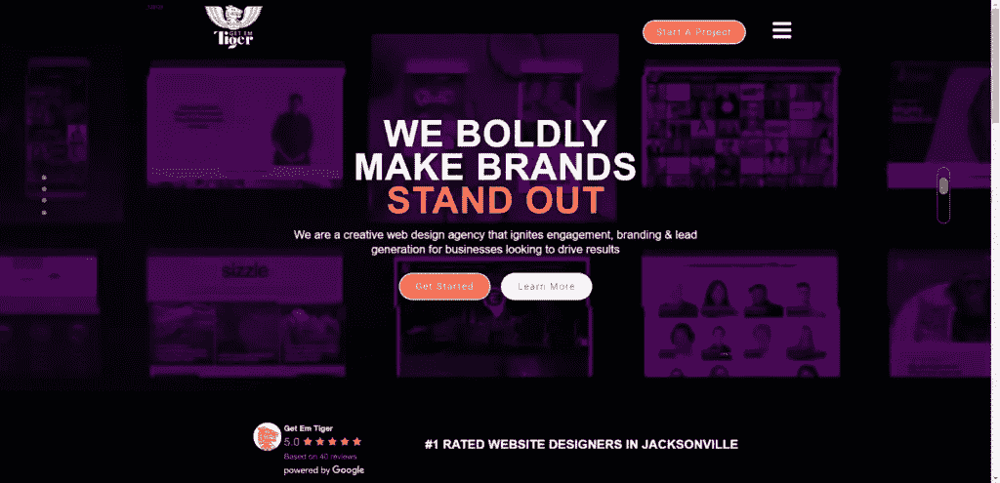](https://getemtiger.com/)

首先，主标题全部大写。以这种方式设计的文本通常被解释为听起来响亮而加粗。

其次，“脱颖而出”四个字用橙色突出显示。这是为了替代通常用于在纯文本中强调的斜体或粗体。

另外，副标题是用句子格写的。当访问者阅读这篇文章时，他们的脑海中可能会出现一种更友好、更亲切的语气。

### 4.找出颜色将扮演的角色

当你准备好为你的作品集网站创建英雄形象时，你可能已经想好了你的品牌颜色。

通常，品牌调色板对于设计按钮以及为网站的关键区域添加特色非常有用。然而，你可能会决定从它那里大量抽取一些来创建你的英雄部分，就像 G Sharp Design 已经做的那样:

[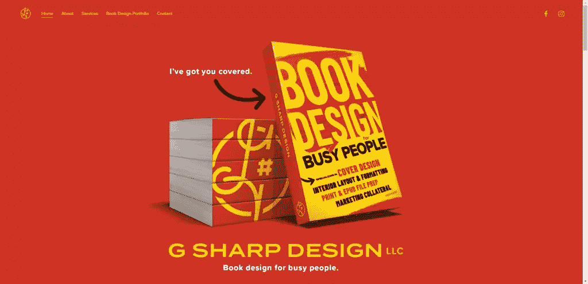](https://www.gsharpmajor.com/)

这个英雄部分的调色板比较简单。然而，设计中充满活力的红色和黄色让人无法将视线从它身上移开。

虽然这种色彩奇观对这家公司很适用，但对其他类型的创意人员来说可能不太合适。例如，[像 BePhoto 2](https://themes.muffingroup.com/be/photo2/?utm_source=sitepoint.com&utm_medium=content&utm_campaign=nov22) 这样的预建摄影网站使用了黑暗主题:

[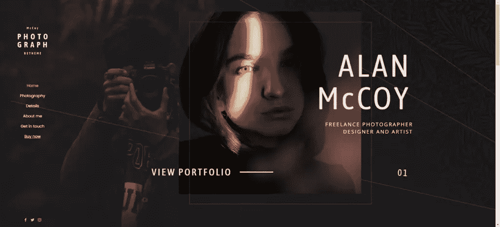](https://themes.muffingroup.com/be/photo2/?utm_source=sitepoint.com&utm_medium=content&utm_campaign=nov22)

英雄图像的中心有一个照片滑块，每张后续照片都会显示明亮的色彩。因为网站的其余部分是柔和的深灰色，配以灰白色的文字，这些照片立刻就吸引了人们的注意。

所以当你决定自己的调色板时，问自己以下问题:

*   你需要多少种颜色？
*   您会使用品牌调色板中的哪些颜色？
*   有没有其他颜色想拉进来的？
*   每种颜色在设置情绪、激励行动等方面将起到什么作用。

色彩不需要为了有效而无所不包。这完全取决于你需要它在这部分为你做什么。

### 5.通过互动让它更加令人印象深刻

没有动画，你的英雄形象只不过是一个静态的广告牌。

现在，广告牌广告没有任何问题——当它的大小超过 200 平方英尺，并且离地面超过 10 英尺时。然而，如果没有广告牌在现实世界中的巨大影响力，网站上的静态设计会让人感觉毫无生气，毫无创意。

就像我们今天看到的其他元素一样，有不同的方法来为你的英雄形象设计添加动作和互动。

例如， [Awesome Inc](https://www.awesomeinc.com/) 是一家动画和设计工作室。如果我们在进入网站后没有看到他们高调的动画作品，那才奇怪:

[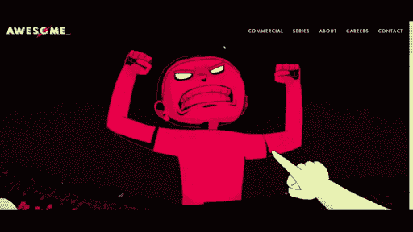](https://www.awesomeinc.com/)

另一方面，如果你是一个不做动画工作的创意者，就没有理由把它做到这种极端。但这并不意味着你的英雄形象应该没有运动。

例如， [BeModel 3 预建网站](https://themes.muffingroup.com/be/model3/?utm_source=sitepoint.com&utm_medium=content&utm_campaign=nov22)有一个动态的英雄形象设计:

[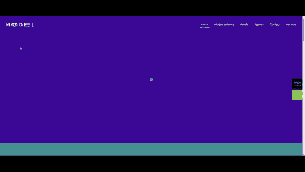](https://themes.muffingroup.com/be/model3/?utm_source=sitepoint.com&utm_medium=content&utm_campaign=nov22)

动画不仅仅是图像滑块。滑块的调色板会随着照片的变化而同步变化。

即使这样，对你来说也是一个很大的动作。如果是这样的话，还有更微妙的方式来使用动画，让你的英雄形象感觉更有吸引力——比如在按钮上添加悬停变换，或者在部分中添加过渡动画。

### 6.选择一个行动号召

最后但并非最不重要的一点，你会想弄清楚访问者的下一个逻辑行为应该是什么。

一种选择是让他们向下滚动页面。如果是这样的话，你甚至可能不想包含一个行动号召按钮。大多数访问者在看完所有他们需要看的内容后会自然地开始滚动。

另一个选择是邀请他们访问你网站上的另一个页面。如果是这样，应该是哪一页？在投资组合网站上，您可能希望访问者访问您的投资组合或服务页面。

例如，BePhotography 2 预建网站将潜在客户导向投资组合页面:

[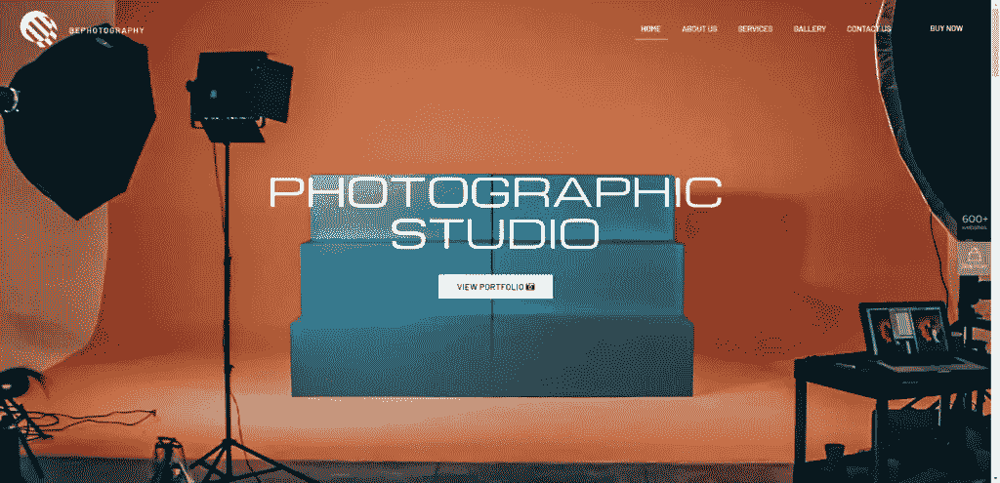](https://themes.muffingroup.com/be/photography2/?utm_source=sitepoint.com&utm_medium=content&utm_campaign=nov22)

然而，还有一个选择是，在给游客选择去其他地方之前，鼓励游客参与英雄形象。如果你的英雄图像提供了你的作品的幻灯片，用户可以参与其中，这将是非常有用的。这就是 [Perky Bros](https://perkybros.com/) 所做的:

[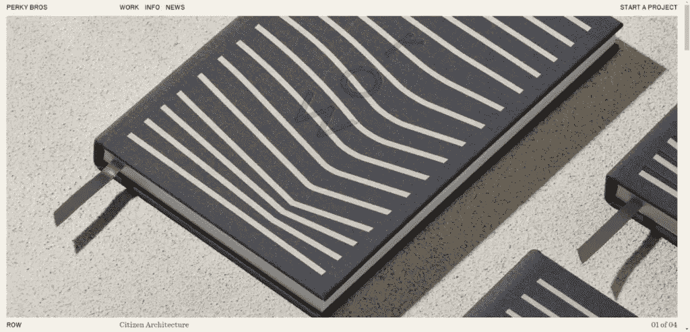](https://perkybros.com/)

访问者的光标会根据他们停留在滑块的哪个部分而改变外观。在屏幕的左侧或右侧，会出现一个蓝色的箭头，让他们知道还有更多工作要探索。在屏幕中央，出现“查看项目”字样。点击后，访问者将被带到该项目的案例研究页面。

## 为你的创造性工作设计一个合适的英雄形象

英雄形象的设计在组合网站上尤其重要，因为它不仅需要反映访问者在你的网站上会发现什么，还需要反映你作为创意者的才能。所以你必须确保你创造了一个英雄形象，为你搭建好舞台。

使用像 [BeTheme 这样的 WordPress 主题的好处是它有 101 个预建的组合网站](https://muffingroup.com/betheme/?utm_source=sitepoint&utm_medium=content&utm_campaign=nov22#websites)。每一个都带有手工制作的英雄形象设计，这将使我们很容易更新上面看到的 6 个关键组件。

## 分享这篇文章