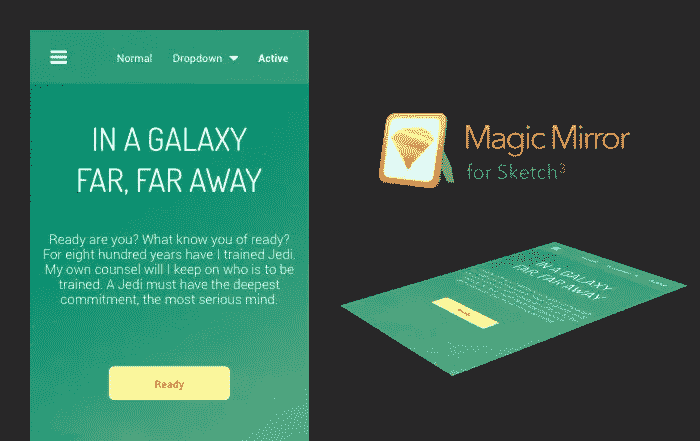
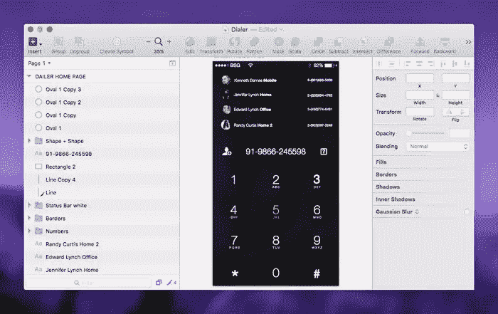
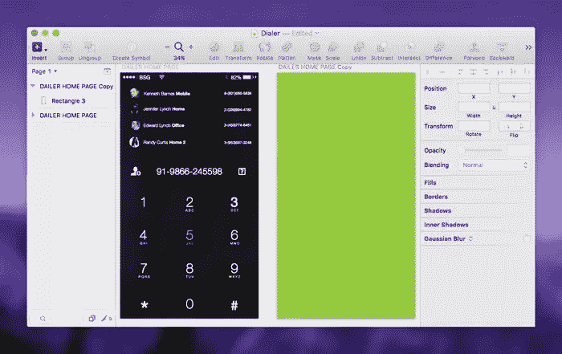
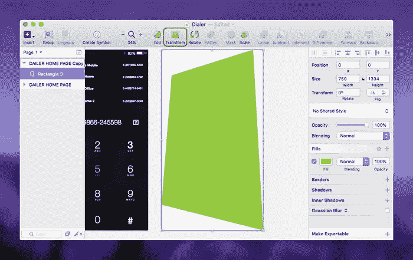
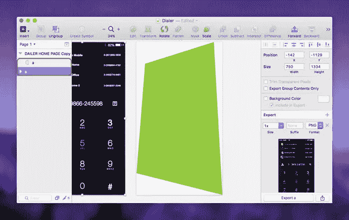
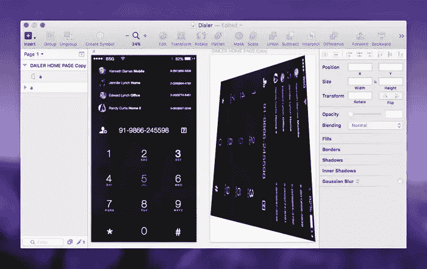
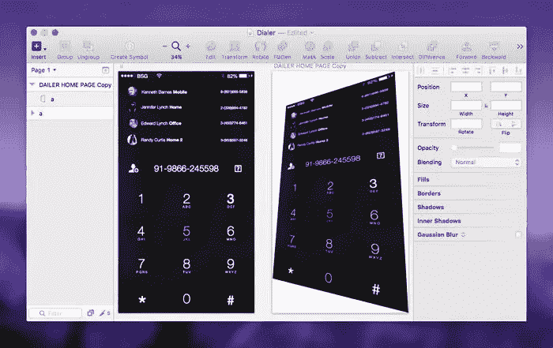

# 使用 MagicMirror 在草图中创建透视模型

> 原文：<https://www.sitepoint.com/create-perspective-mockups-sketch-magicmirror/>

虽然我经常谈论 Sketch 应用程序和 Photoshop，但我对 Sketch 的轻微迷恋意味着我会花更多的时间在它上面。

然而，事实是我有时两者都需要使用。一个这样的例子是，当我在 Sketch 应用程序中为屏幕设计时，我想模拟屏幕，就像在实际设备上观看一样，为此我需要 Photoshop 的“智能对象”功能。但是为什么要努力呢？

有时候，一个设计的视觉美感并没有真正展现出来，直到你把它从平面画布上拿下来，从 3D 视角展示出来；换句话说，你如何用肉眼真实地看到它。

不仅如此，它还有助于将模型放入一个水平框架中(用于 Behance 和 Dribbble 上的共享),许多客户只是喜欢它的外观。

透视模型非常流行，这是毋庸置疑的！

## MagicMirror 插件

MagicMirror 插件的工作原理类似于 Photoshop 的草图操作，并且有一个非常棒的免费版本。你像平常一样在画板中设计你的屏幕，一个键盘快捷键创建了一种你的屏幕的智能对象模型。

让我们去兜一圈吧！

## 入门指南

你可以使用你已经设计好的屏幕或者下载一个免费的. sketch，比如 Bootstrap Guru 的这个 epic [Dark Dialer](http://www.sketchappsources.com/free-source/1521-dialer-view-sketch-freebie-resource.html) 界面。

在打开它之前，下载 MagicMirror 插件并尝试打开。附带的 sketchplugin 文件。就像 Photoshop Actions 一样，这会自动安装它。

*现在*你可以打开你的。素描设计！

## 创造临时的“智能物体”

它不是一个真正的智能物体，但它*是*智能的。按“A”打开检查器中的*画板*对话框，或者简单地*复制* (command+d)该“源”画板并删除其内容。

这里我们想要实现的是两个宽度和高度相同的画板，但其中一个应该是空的，以确保我们的智能对象保留与设计相同的纵横比。

按“R”创建一个*矩形*并将其拉出，以填充新的空白画板中的所有空白区域**，然后将目光转向菜单栏并点击“变换”工具。**

重要的是我们使用*转换*而不是“编辑”；*编辑*将创建一个不规则的形状，而*转换*将确保我们的形状保持我们设计的正确纵横比。

移动形状的角，直到获得所需的角度。如果你使用*变换*，透视是有保证的。

把你最喜欢的照片保存在一张照片里可能会有用。草图文件，这样你以后可以把它们作为模板，或者你可以从网站上下载一些模型:这里有一个很棒的。

## 设置要镜像的设计

我们现在需要把我们的形状和设计连接起来，这样它们就可以被镜像，但这真的很简单。只要确保形状层被重命名以匹配画板。

将屏幕连接到形状

## 学习实现它的键盘快捷键

按下 **control+shift+m** 开始镜像(这也适用于“页面”，比如共享样式和符号)。你可能会得到这样的结果(如下)，但是我们可以使用其他的快捷键来实现我们的目标。

旋转和其他键盘快捷键

在我们的困境中，我们需要选择矩形并使用 **command+control+shift+r** (我知道，这是一个疯狂的快捷键！)来旋转我们设计的*里面的*这个形状；MagicMirror 实际上使用“填充”样式来创建背景图像，但他们如何旋转它，我不知道。一定是魔法！

现在一切都明朗了

这里有另外两个需要记住的快捷键:

*   **Shift+Control+J** :从形状跳到原始画板
*   **Shift+Control+Command+F** :翻转内容(类似旋转)

## 结论

我们今天所完成的是非常基本的。如果你想更进一步，这里有两件事需要考虑。首先，你可以随时导入你自己的[矢量或位图设备](http://www.sketchappsources.com/free-source/1272-samsung-galaxy-s6-sketch-freebie-resource.html)并覆盖你自己的智能对象——你不必让它裸露。就我个人而言，我认为这种方法是愚蠢的，用户界面设计只应该作为一种炫耀的方式来展示。

其次，你完全可以有不止一个模型，并使用各种透视镜头，当你运行键盘快捷键时，它们会自动更新。事实上，没有什么可以阻止你使用 MagicMirror 作为一个通用的智能对象工具，这是许多素描爱好者长期以来一直要求的。

每当我们想要在模型中展示我们的屏幕时，我们许多人都必须处理中断我们的工作流程并切换到 Photoshop 的不切实际的问题，但有了 MagicMirror 插件，我们可以将我们的工作流程包含在一个单一的设计工具中。

希望如此！

## 分享这篇文章