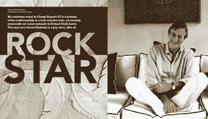
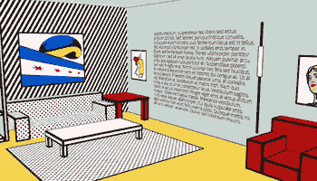
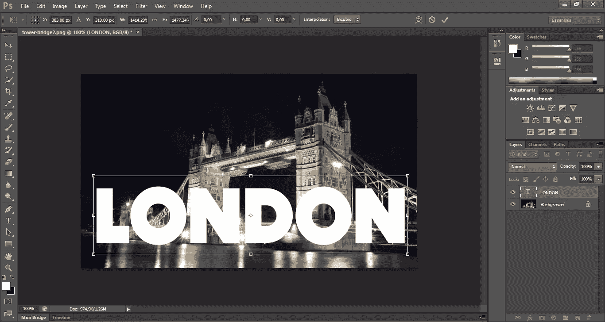
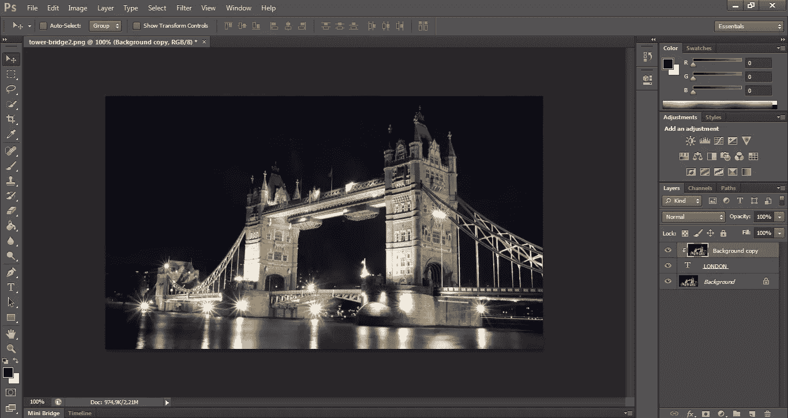
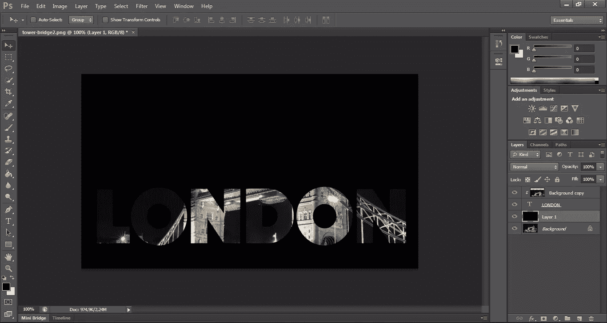

# 如何用 Photoshop 创建充满照片的文本

> 原文：<https://www.sitepoint.com/create-photo-filled-text-with-photoshop/>

摄影:斯里·普特里·胡里奥

网页设计一直是一个快速发展的领域，专业人员必须将视觉信息设计、美学和构图原则与当前最相关的想法和趋势巧妙地结合起来，以满足客户的期望。

一个好的网页设计师对他们创建的网站的主要目标和他们试图传达的特定信息有清晰的认识。

随着 [Bootstrap](http://getbootstrap.com/) 、[基金会](http://foundation.zurb.com/)和类似框架的兴起，很明显，布局有变得比以往更加“千篇一律”的危险。我们都很熟悉那种“靴带造型”，对吧？

在这种背景下，对设计差异化的需求比以往任何时候都更加迫切。我认为对于一个网页设计师来说，最困难的任务之一就是找到一些创造性的角度来创作出与众不同的、独特的作品。

换句话说，在理想状态下，我们都喜欢构建不容易被大众复制的布局和网站体验。

完成第一个任务要遵循的规则是运用想象力，避免最常用的图像、框架技巧、构图或效果。

越来越多的专业人士试图用纯 CSS 创建一些非常酷的图形和动画，开发其所有隐藏的潜力，就像在[这个案例](http://patrickdbakke.com/projects/lichtenstein/)中一样。

好吧，也许这太多了。

让我们试试这个来自罗马科尔特斯的建筑。尽管不是每个人都可以访问它，但它很好地提醒了我们 CSS3 可以让我们做什么。

但是如果我不是 CSS 专家，也不具备如此高级的能力，该怎么办呢？或者我可能没有时间(或兴趣)用 CSS 绘制图像，而是更喜欢利用我所学的 Photoshop 或 Illustrator？

令人欣慰的是，Photoshop 可以帮助我们达到良好的效果，创造出视觉上不那么传统的处理方式。

在本教程中，你将看到如何通过几个简单的步骤创建一个图片填充的文本，你可以用它来装饰你的下一个项目。

## Photoshop 在行动

本教程将帮助我们了解使用 Adobe Photoshop CS6 在文本中插入照片是多么简单。我们将使用程序中很少的几个众所周知的命令，我向你保证，你将获得的结果是令人敬畏的。

我们可以使用我们在网上冲浪时发现的个人照片或图像。没有限制，我们所要做的就是追随我们的梦想。

让我们开始我们的项目，选择一张我们特别喜爱的照片，我们喜欢的照片，或者我们想工作并考虑我们将为此使用的字体。

我选择了伦敦塔桥的美丽景色，这座奇妙的横跨泰晤士河的吊桥结合了开合结构。它靠近伦敦塔，因此得名，并已成为这座城市的标志性符号。

很明显，你也可以随意选择一个主题。

看看怎么走下去吧。

### 1).设置您的文本

打开将作为我们的基础的照片，点击左边工具面板中的“文本”。
此时，在上面的选项中选择字体、大小、颜色和文本对齐。块状无衬线字体通常效果最好，但请随意尝试。我最终选择 Dock11 作为我的字体，因为它简单(在 Sans 类别中可用，你可以在这里下载它[)。](http://www.dafont.com/dock-11.font)

至于颜色，我选择了一个与深色背景形成强烈对比的颜色，左边的文本对齐，然后我设置它的大小(注意，大小将在下面的步骤中再次设置)。

之后，键入您的消息，并在您的文档中进行撰写。因为我选择了一张伦敦的照片，所以对我来说显而易见的文本是城市名称。把你的文字放在你想放的地方。我更喜欢把它放在照片的底部。

### 2).根据空间调整文本大小

接下来，在键盘上按 Ctrl + T 来选择文本的空间，并用光标拖动锚点来拉伸文本，然后增加其大小。

### 3).创建剪辑蒙版

现在将光标放在背景图层上，右键点击*复制图层*。我们将创建一个名为*背景副本*的新关卡。将图层*背景副本*拖到伦敦文字上方。

(注意，经过这一步，我们的文字“会暂时消失”)。

创建剪辑蒙版后，色阶面板中名为“背景副本”的色阶将缩进显示，并带有一个朝下的小箭头，但图像不会改变。

选择文本层，按住 Ctrl 键，点击层面板中向下的*新建层按钮*(左起倒数第二个图标)，创建一个新层，该层必须位于文本层之下。

然后，按“D”重置前景色和第二种颜色。使用前景色(黑色)填充我们之前创建的级别 1。如果你喜欢黑色以外的背景色，请随意更换。

最后点击移动工具，移动下图直到我们想要的效果。

这是我们文本中的背景图片！

你可以考虑使用*斜面*和*浮雕*图层效果来增强你的新标题的外观，使字母突出。

## 结论

我们可以应用于文本的效果几乎是无与伦比的。您可以享受使用各种各样的图像来填充您的信息，并根据您的目的调整效果。

不要抑制你的想象力！

## 分享这篇文章