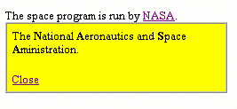
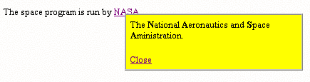

# 用 DHTML 文章创建弹出便笺

> 原文：<https://www.sitepoint.com/create-pop-up-notes-dhtml/>

当我们谈论动态 HTML 时，我们实际上是在谈论使用像 JavaScript 这样的脚本语言来动态地改变级联样式表。DHTML 是 HTML 编码和经典的面向对象编程的融合。

本教程将阐述这个概念，并帮助您理解 JavaScript 对象如何映射到 Web 页面上的 HTML 元素。

在这个过程中，我们将学习如何创建一个有用的 DHTML 脚本:一个弹出提示，就像这里显示的。这个简单的脚本在用户点击链接时创建一个黄色的便利贴。当用户点击单词“NASA”时，提示告诉他们 NASA 是美国国家航空航天局的缩写。

这个脚本可以方便地创建一个脚注，一篇文章的侧边栏，或者定义一个缩略词。

理解我们的弹出注释如何工作的一个好方法是首先单独使用 CSS 创建页面，而不使用 JavaScript 组件。然后，我们可以手动更改 CSS 属性，以了解 JavaScript 在该过程中扮演的角色。

##### CSS 组件

让我们首先创建一个简单的 Web 页面，其中包含我们的弹出注释。

为了充分利用本教程，我鼓励你使用你最喜欢的 HTML 编辑器和我一起工作。您应该能够复制并粘贴本文中显示的示例 HTML 代码。

您还可以使用您的浏览器在每一步检查我们的示例。目前，请使用 Internet Explorer 版本 5 或更高版本来完成此操作。为了便于理解我的例子，我将首先以一种只适用于 Internet Explorer 的方式创建我们的 DHTML 脚本。最后一步，我们将增加与其他浏览器的兼容性。

所以让我们开始吧。使用下面的代码创建我们的简单网页。

`<html>
<head>
</head>
<body>

The space program is run by <a href="#">NASA</a>.
<table bgcolor="yellow" width=250 cellpadding=6 cellspacing=0 border=1 >
<tr>
<td>

The <b>N</b>ational <b>A</b>eronautics and <b>S</b>pace
<b>A</b>ministration.

<a href="#">Close</a>
</td>
</tr>
</table>
</body>
</html>`

这将创建如下所示的静态 Web 页面，黄色表格直接出现在我们的其他页面内容的下方。请注意，弹出式附注始终存在，并且没有放在我们希望它出现的位置。

现在让我们将一个样式表应用到黄色表。这允许我们在页面上定位表格，使其看起来像一个附加到单词“NASA”的弹出窗口下面的粗体文本显示了我们的 HTML 代码的新增内容。

`<html>
<head>
</head>
<body>

The space program is run by <a href="#">NASA</a>.
**
**
<table bgcolor="yellow" width=250 cellpadding=6 cellspacing=0
border=1 >
<tr>
<td>

The <b>N</b>ational <b>A</b>eronautics and <b>S</b>pace
<b>A</b>ministration.

<a href="#">Close</a>
</td>
</tr>
</table>
**
**
</body>
</html>`

我们在这里所做的就是在黄色表格周围包装一个 DIV 元素。`DIV`标签有一个`STYLE`属性，用于在页面上定位表格。我们在 `STYLE`属性中设置了四个 CSS 属性:

*   `Position:absolute` —这告诉浏览器，我们正在相对于浏览器窗口的左上角定位框。
*   `Left:180` —这告诉浏览器将表格放置在距离浏览器窗口左边缘 180 像素的位置。
*   `Top:25` —这将表格放置在距离浏览器窗口顶部 25 像素的位置。
*   `Z-index:1` —最后，这告诉浏览器将表格放在其他页面文本的前面。

在这些 CSS 属性中，`z-index`可能会给不熟悉样式表的设计者带来最大的困惑。它为我们的页面定义了一个深度维度，并决定了哪些元素放在哪些元素的前面。默认情况下，所有页面元素的 `z-index`都为零，因此将黄色表格的`z-index`设置为 1 可以确保它出现在其他文本的前面。

现在保存并查看网页。应该是下图这样的。这正是访问者点击 NASA 链接后弹出提示的显示方式。

接下来，我们将向我们的 `STYLE` 属性添加另一个属性，如下所示。

`
`

这将添加一个新的`visibility`属性，并将其设置为`hidden`。这意味着浏览器将隐藏`DIV`元素中的所有内容，因此黄色的表格将不可见。你自己试试看。

以这种方式查看页面后，再次编辑它，并将“visibility”属性的值更改为“visible”保存页面，然后在浏览器中再次查看。它应该再次看起来像上面的图片，弹出说明是可见的。

所以我们的 DHTML 脚本的操作非常简单:我们使用 CSS 在适当的位置放置一个彩色的表格，然后通过改变 CSS visibility 属性来显示或隐藏该表格。

手动完成这项工作后，下一步是学习如何使用 JavaScript 在用户点击适当的链接时自动更改 visibility 属性。

##### JavaScript 组件

DHTML 中的一个关键概念是页面上的每个 HTML 元素都有一个对应的 JavaScript 对象。正如每个 HTML 元素可以有一个或多个 CSS 属性一样，每个 JavaScript 对象也应该有一个对应于每个 CSS 属性的 object 属性。

至少理论上是这样。实际上，不是所有的浏览器都会为每个 HTML 元素提供一个 JavaScript 对象，即使它们提供了，CSS 属性和 JavaScript 属性之间也不总是一一对应的。对于版本 4 的浏览器来说尤其如此。

幸运的是，所有版本 4 和更高版本的浏览器都将一个 JavaScript 对象与页面上的每个 DIV 元素相关联，并且它们还提供了一个 object 属性，允许您控制 DIV 元素是否可见。困难的部分是弄清楚如何访问这个 JavaScript 对象并设置它的属性。

让我们看看如何在 Internet Explorer 中访问适当的对象。

首先，对应于我们的`DIV`元素的 JavaScript 对象被简单地称为“`n1`”为什么是这个名字？因为我们的`DIV`标签包含一个设置 `ID="n1."`的 ID 属性，通过这样做，我们给元素分配了一个惟一的名称，这个名称成为它对应的 JavaScript 对象的名称。

要访问 `n1`对象，将这个脚本插入网页的`HEAD`部分:

``

这将创建一个名为 `showObject()` 的函数来设置 n1 对象，使其可见。

我们的新函数通过使用 document.all 数组访问 JavaScript 对象。这个数组包含页面上所有 HTML 元素的所有 JavaScript 对象。我们使用我们的`DIV`标签的 ID 来引用这个数组中的正确条目。

一旦您理解了 document.all 数组，其余的`showObject()`函数应该很容易理解。代码与我们之前为 `DIV`标签设置 `STYLE` 属性的方式非常相似。所以这段 JavaScript 代码:

`document.all['n1'].style.visibility = "visible";`

 `...就相当于这段 HTML 代码:` 

`
`

为了实际调用`showObject()`函数，我们需要将 NASA 链接改为调用 JavaScript 函数。如下所示执行此操作。

`
The space program is run by <a
href="javascript:showObject();">NASA</a>.`

如果您仍然在 HTML 编辑器中工作，请对页面进行更改并保存。当您在浏览器中查看页面时，弹出提示最初应该是隐藏的，当您单击 NASA 链接时会出现。如果您的弹出注释在页面首次加载时可见，请确保在样式表中将可见性设置为“隐藏”。

现在让我们通过在脚本中添加一个 `hideObject()`函数来扩展我们的 JavaScript，如下所示。这个函数简单地反转了`showObject()`所做的工作。

`function hideObject() {
document.all['n1'].style.visibility = "hidden";
}`

因为这个函数使我们的弹出提示消失了，我们想把它的执行与用户点击“关闭”链接联系起来。通过更改如下所示的链接来实现这一点。

`<a href="javascript:hideObject();">Close</a>`

现在弹出窗口按照我们想要的方式工作，至少在 Internet Explorer 下是这样。

##### 使用其他浏览器

让我们扩展我们的脚本以适用于更多的浏览器。从在脚本开头添加三行代码开始。新行在下面以粗体显示。

`<html>
<head>
<script language="JavaScript">
<!--
**ns4 = document.layers;**
**ie4 = document.all;**
**nn6 = document.getElementById && !document.all;**`

`function hideObject() {
...`

这个非常有用的代码块让我们感觉到浏览器的功能，并告诉我们使用哪个版本的文档对象模型(DOM)。这有助于我们找出如何为这个特定的浏览器找到`n1` JavaScript 对象。

如果在 Netscape 4(一种支持文档层的浏览器)中查看页面，那么这段代码将设置 ns4 变量。只有 Internet Explorer 支持我们前面使用的 document.all 数组，所以如果浏览器支持它，ie4 变量将被设置。同样，代码应用一个单独的测试来确定浏览器是否真的是 Netscape 6，如果是，就设置 nn6 变量。

接下来重写`hideObject()` 函数，如下所示。

`function hideObject() {
**if (ns4) {**
**document.n1.visibility = "hide";**
**}**
**else if (ie4) {**
document.all['n1'].style.visibility = "hidden";
**}**
**else if (nn6) {**
**document.getElementById('n1').style.visibility = "hidden";**
**}**
}`

这将该功能分为三个不同的部分:当 Netscape 4 是浏览器时使用一个部分，当 Internet Explorer 或更高版本是浏览器时使用另一个部分，当 Netscape 6 是浏览器时使用另一个部分。

每个部分都使用适当的方法来访问特定浏览器的 n1 对象。注意这些方法都是不同的。事实上，对于 Netscape 4，甚至用于设置 visibility 属性的值也是不同的(`"hide"`而不是`"hidden"`)。

这些差异是 DHTML 会导致许多浏览器兼容性问题的主要原因。

最后，让我们修改一下`showObject()`函数，使其同样适用于所有主流浏览器。

`function showObject(id) {
**if (ns4) {**
**document.n1.visibility = "show";**
**}**
**else if (ie4) {**
document.all['n1'].style.visibility = "visible";
**}**
**else if (nn6) {**
**document.getElementById('n1').style.visibility = "visible";**
**}**
}`

同样，这为每个浏览器的 DOM 实现使用了不同的代码块。

##### 通过鼠标点击定位

当前形式的这个脚本有点脆弱。这是因为我们使用绝对坐标来定位“NASA”这个词上的弹出提示如果访问者改变了他们的浏览器设置，使用更大或更小的字体，NASA 这个词将出现在页面的不同位置，而我们的弹出窗口将不会出现在正确的位置。

解决方法是当访问者点击 NASA 链接时检测鼠标坐标，然后在这些坐标上定位弹出提示。

为此，首先修改 NASA 链接，如下所示。

`<A href="**javascript:;**" **onClick="showObject(event);"**>NASA.</A>`

请注意，对`showObject( )`的调用现在被绑定到一个 onClick 事件，该函数现在接收一个事件对象作为参数。这允许我们访问关于鼠标点击事件的数据。

接下来我们需要更新`showObject()`来改变弹出注释的坐标。下面的代码展示了我们更新后的函数。

`function showObject(**e**) {`

`if (ns4) {
document.n1.visibility = "show";
**document.n1.left = e.pageX;**
**document.n1.top = e.pageY;**
}
else if (ie4) {
document.all['n1'].style.visibility = "visible";
**document.all['n1'].style.left = e.clientX;**
**document.all['n1'].style.top = e.clientY;**
}
else if (nn6) {
document.getElementById('n1').style.visibility = "visible";
**document.getElementById('n1').style.left = e.clientX;**
**docume.getElementById('n1').style.top = e.clientY;**
}
}`

这里我们声明了一个局部变量“e ”,它被传递给事件对象。然后，我们使用对象属性`clientX`和`clientY`来获取鼠标点击的顶部和左侧坐标(注意，在 Netscape 4 中它们被称为`pageX` 和 `pageY`——另一个兼容性问题)。

我们使用这些坐标来设置我们的`n1`对象的 top 和 left 属性，我们的弹出注释将出现在正确的位置。

仅此而已。我们现在有了一个按照我们想要的方式工作的 DHTML 脚本。

##### 不要忘记兼容性

我们已经竭尽全力确保我们的 DHTML 脚本能与主流浏览器的最后两个版本兼容。但是旧的浏览器呢？歌剧或者网络电视呢？使用屏幕阅读器的残疾人怎么办？

属于这些类别的人数很少。事实上，他们可能只代表了不到 2%的观众。但这仍然是很多人，在今天的环境下，大多数公司都希望收入增加 2%。

虽然我喜欢 DHTML，但我总是警告它潜在的兼容性问题。就像你的网页上的任何东西一样，如果有人使用不理解你的脚本的浏览器，你应该确保它优雅地降级。

这意味着最好只使用弹出式附注来提供补充信息。千万不要把关键信息放在这些笔记里。

无论何时使用 DHTML，通过在尽可能多的浏览器和浏览器版本中查看来测试您的页面是一个好主意。如果做不到这一点，那么至少在关闭 JavaScript 的情况下查看它们，以确保页面仍然工作。

##### 扩展我们的脚本

请注意，当前形式的这个脚本不能很好地伸缩。因为我们已经硬连接了 JavaScript 代码来引用 n1 对象，所以只有当您将页面上的 DIV 元素命名为“n1”时，我们的弹出窗口才会工作。如果你给它起别的名字，剧本就不行了。

更重要的是，你希望你的页面上有多个弹出提示吗？该脚本的当前形式仅适用于单个弹出窗口。

我这样做是为了简化脚本，以便更容易理解我们的 JavaScript 代码是如何操作样式表的。下个月，我们将扩展这个脚本，使其适用于任意数量的弹出便笺。在这个过程中，我们将学习如何在变量中存储 JavaScript 对象，以及如何在整个代码中引用它们。

## 分享这篇文章