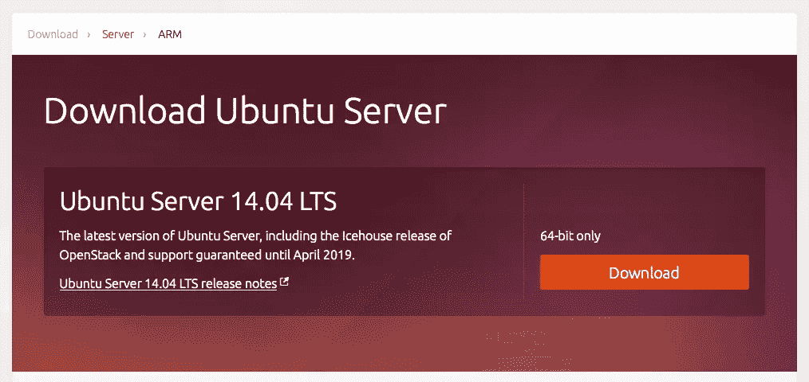
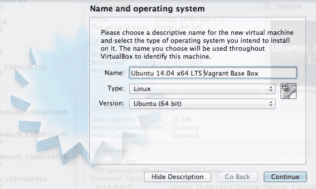
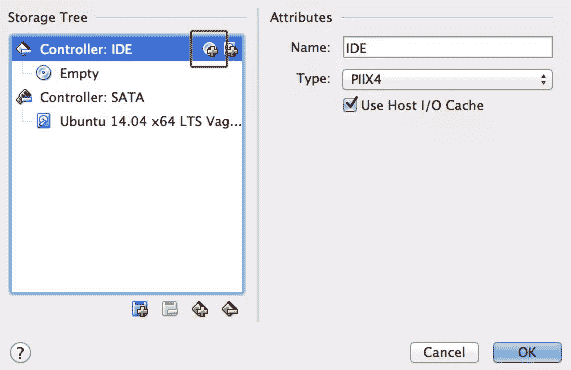
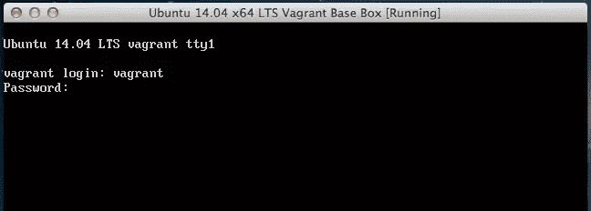
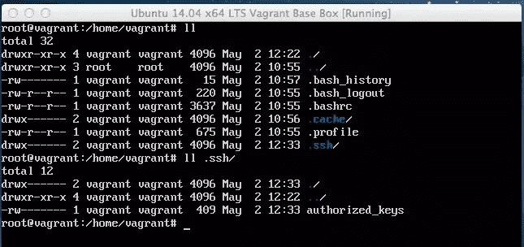
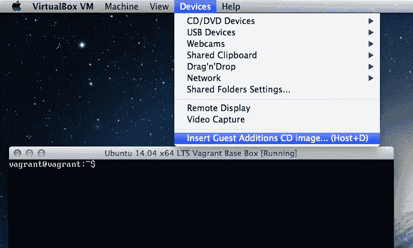
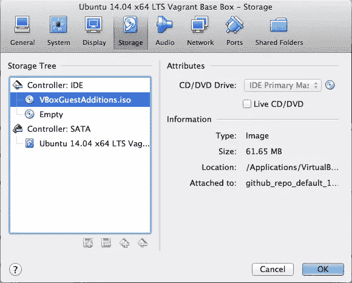
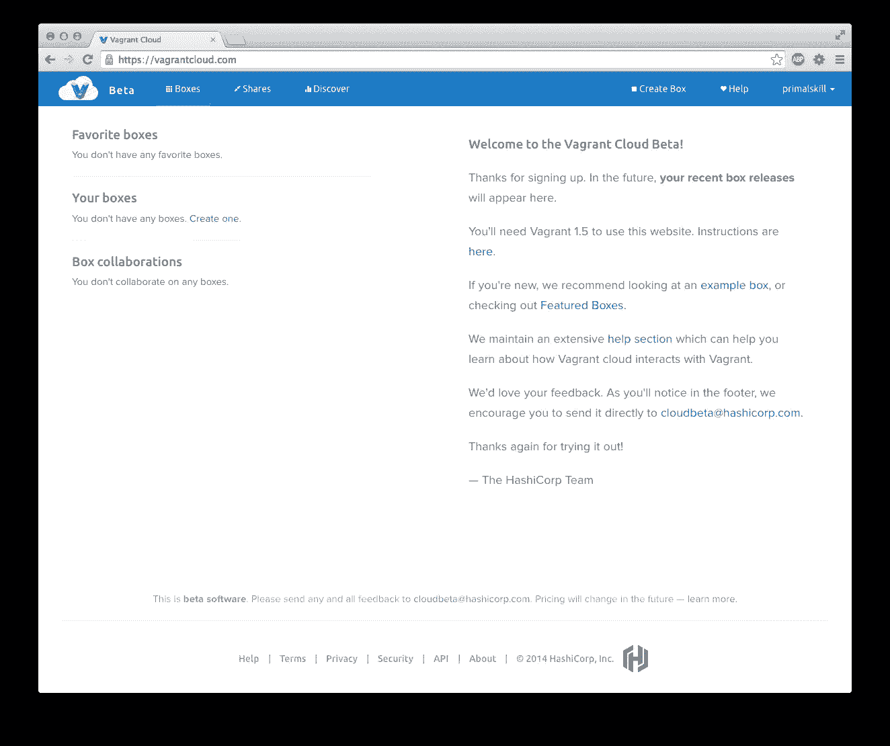
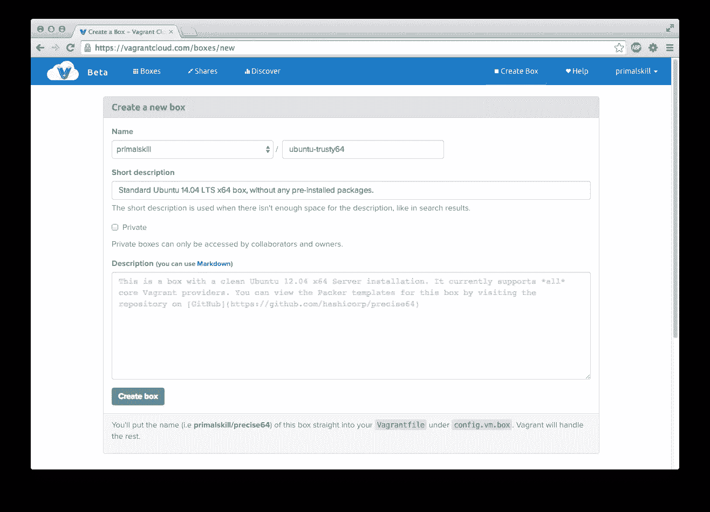
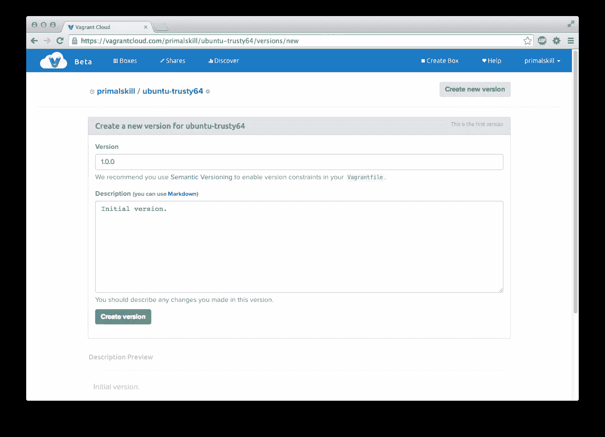

# 如何创建和共享一个流浪基地箱

> 原文：<https://www.sitepoint.com/create-share-vagrant-base-box/>

有趣的工具每天都在涌现，帮助开发人员更快地工作，让他们专注于项目的实际商业价值。

其中一个这样的工具是 vagger，它正在成为开发人员最有力的帮手之一，标准化开发环境是如何创建和管理的。

在这篇文章中，你将学习如何基于 Ubuntu 14.04 LTS 创建你自己的游民基地盒子，为它配备你最喜欢的应用程序，并使用游民云与我们其他人分享。

## 创建虚拟机

*注意:对于下面的例子，你需要在你的本地计算机上安装至少 1.5 版本的流浪者。*

要创建虚拟机，您需要一个虚拟化提供程序。尽管 Vagrant 不区分使用哪个提供者，但在下面的例子中我们将使用 [VirtualBox](https://www.virtualbox.org/) 。

在创建虚拟机之前，需要先安装 [VirtualBox](https://www.virtualbox.org/) 。

接下来，前往 [Ubuntu 下载页面](http://www.ubuntu.com/download/server)获取 Ubuntu 14.04 LTS ISO。



#### 关于 LTS 版本

Ubuntu 的新版本每六个月发布一次，对每个版本的支持都是有限的。

LTS 代表长期支持，它提供给特定的 Ubuntu 版本子集。LTS 时间跨度长达五年。如果您今天安装了 LTS 版本，您将在五年后获得更新。

对于 web 开发，最好使用 LTS 标记的 Ubuntu，好消息是 Ubuntu 14.04 LTS 版于 2014 年 4 月 17 日发布，因此支持将持续到 2019 年。

* * *

#### 安装 Ubuntu

ISO 文件下载完成后，启动 VirtualBox 并点击 New 创建一个新的虚拟机，然后选择 *Linux* 作为类型， *Ubuntu (64 位)*作为版本，并给你的虚拟机命名。



如果您认为您将在虚拟机中运行内存密集型任务，请单击继续，将内存大小设置为 1024 MB 或更高。

在下一个窗格中，选择*立即创建虚拟硬盘*，然后选择 *VMDK(虚拟机磁盘)*。

在物理硬盘上的*存储*窗格中选择*动态分配*并设置最小 8 GB。点击继续，你的虚拟机就快完成了。

您需要将下载的 Ubuntu 14.04 LTS ISO 文件作为虚拟 CD 插入，这样在启动虚拟机时，操作系统就安装好了。这就像你如何将可启动光盘插入光驱一样。

从列表中选择虚拟机，点击*设置*并点击*存储*选项卡。在*控制器:IDE* 上点击小 CD 图标(下图中以红色突出显示)，然后点击*选择磁盘*并选择 Ubuntu ISO 文件。



现在我们准备启动虚拟机并安装 Ubuntu 作为访客操作系统。安装过程中还有几个步骤，如选择语言、国家等。我将在下面谈到一些更重要的问题。

*   当提示输入主机名时，键入*流浪者*
*   对于用户名和密码，也键入*流浪者*
*   *加密你的主目录？*选择*否*
*   在时区面板上，选择 *UTC* 或您自己的首选时区
*   分区方法:*引导–使用整个磁盘并设置 LVM*
*   当提示安装哪个软件时，选择 *OpenSSH 服务器*，其余如 LAMP 或 MySQL 将在以后安装
*   选择在主引导记录上安装 GRUB 引导加载程序

这应该是安装的总结，接下来会提示您登录。使用流浪用户和密码来完成此操作。



接下来，通过键入以下命令切换到 root 用户:

```
sudo su -
```

注意，这不是一个非常安全的设置，保护 Ubuntu 不在本文讨论范围之内。对于一台开发机器来说，安全性无论如何都不是最重要的。

使用 *root* 用户，通过键入以下命令更新到最新的包

```
apt-get update
apt-get upgrade
```

#### 为流浪者配置虚拟机

为了更好地使用虚拟机，vagger 需要设置几个特定的选项。

**无密码命令执行**

由 vacant 执行的所有操作都将使用*vacant*用户，并且所有 sudo 命令都需要在每次运行时不询问密码的情况下执行。

为此，我们需要运行 *visudo* 命令来为用户配置无密码 sudo。只需键入:

```
visudo
```

将下面一行添加到文件的末尾并保存它:

```
vagrant ALL=(ALL) NOPASSWD:ALL
```

**Root 密码**

创建漫游箱的一般原则是将 root 密码设置为众所周知的密码。流浪者使用*流浪者*作为密码。要进行设置，请以 root 用户身份键入以下命令，并在出现提示时键入密码:

```
passwd
```

**SSH 配置**

为了让 vagger 能够通过 SSH 进入虚拟机，它使用了公钥认证。我们需要为我们的*流浪者*用户设置这个。

仍然以 root 用户身份登录，转到*流浪者*用户的主目录:

```
cd /home/vagrant
```

创建以下文件夹:

```
mkdir .ssh
```

流浪者使用一个不安全的密钥对来连接虚拟机，你可以在这里下载:[github.com/mitchellh/vagrant/blob/master/keys/vagrant.pub](https://github.com/mitchellh/vagrant/blob/master/keys/vagrant.pub)

只需运行以下命令就可以直接获得它:

```
wget https://raw.githubusercontent.com/mitchellh/vagrant/master/keys/vagrant.pub -O .ssh/authorized_keys
```

OpenSSH 对这个文件夹和文件权限非常严格，所以我们把它改成正确的:

```
chmod 700 .ssh
chmod 600 .ssh/authorized_keys
chown -R vagrant:vagrant .ssh
```

如果一切都做得正确的话，这就是*/home/流浪者*和*/home/流浪者/的文件夹结构。ssh* 看起来应该包括权限。



*可选步骤:*为了加快到虚拟机的 SSH 连接，我们还需要修改 SSH 服务器配置:

```
cd /etc/ssh
pico sshd_config
```

将这一行添加到文件的末尾并保存它:

```
UseDNS no
```

然后重新启动 SSH 服务器:

```
service ssh restart
```

最后，我们可以通过键入以下命令以 root 用户身份注销:

```
exit
```

## 安装 VirtualBox 来宾附件

为了让 vagger 能够在访客和主机操作系统之间正确共享文件夹，需要安装 *VirtualBox 访客插件*。

在 Linux 系统上安装 guest additions 的先决条件是要有几个包，比如 Linux 头文件和开发工具。让我们先安装它们，键入以下命令:

```
sudo apt-get install linux-headers-generic build-essential dkms -y
```

接下来，我们需要确保 guest additions 映像被插入到虚拟机的虚拟 CD-ROM 中。为此，请关注虚拟机的窗口，选择*设备- >插入来宾附加 CD 映像*。



您可以通过从列表中选择正在运行的虚拟机并点击*设置- >存储*来验证镜像是否插入到 VirtualBox 中。你应该在*控制器:IDE* 下看到*vboxguestaditions . iso*。



接下来，我们需要通过运行以下命令来挂载 CD 并运行实际的安装 shell 脚本:

```
sudo mount /dev/cdrom /media/cdrom
cd /media/cdrom
sudo ./VBoxLinuxAdditions.run
```

完成此操作后，最好重启虚拟机以确保新设置生效:

```
sudo reboot
```

## 创建基本盒包

现在，我们已经创建了基本的虚拟机，我们需要创建实际的流浪者基本箱。只需在您实际的主机终端中键入以下命令(而不是在您的虚拟机命令行中):

```
vagrant package --base <virtualmachine name>
```

*<虚拟机名称>* 是您在 VirtualBox 设置中指定的虚拟机名称。如果您不知道名称是什么，可以键入以下命令来查找:

```
VBoxManage list vms
```

在我们的例子中，它被称为 *Ubuntu 14.04 x64 LTS 流浪汉基础箱*，它也包含空格，所以请确保您将它写在像这样的引号之间:

```
vagrant package --base "Ubuntu 14.04 x64 LTS Vagrant Base Box"
```

该过程将产生一个 *package.box* 文件，该文件是虚拟机和流浪者元数据文件的存档。

## 共享基础盒

流浪者最近创建了一个名为[流浪者云](https://vagrantcloud.com)的服务，任何人都可以创建和分享流浪者盒子供其他人使用。

要在流浪云上分享我们的基础盒子，我们首先需要注册。登录后，您将看到下面的控制面板。点击右上角的*创建框*链接。



我们需要为我们的盒子指定一个名称和简短描述。你可以在这里输入任何东西，我为我们的盒子添加了 *ubuntu-trusty64* 。 *Trusty 是 Ubuntu 14.04 LTS 版的[开发代号](https://wiki.ubuntu.com/DevelopmentCodeNames)。*



接下来，您需要为盒子创建一个版本，让我们为初始版本号添加 1.0.0，然后单击*创建版本*。



在您完成创建盒子和版本之后，我们需要添加一个提供者。点击*创建新的提供者*并键入 *virtualbox* 然后点击 *URL* 按钮并键入你的 *package.box* 文件所在的 URL。

*注:只有付费的 premium 用户才可以将基盒直接上传到流浪云。如需更多信息，请查看[定价页面](https://vagrantcloud.com/pricing)。*

一旦你添加了一个提供商，点击*立即释放*按钮，使该框在流浪云可用。

本文中用作示例的流浪箱在[https://vagrantcloud.com/primalskill/ubuntu-trusty64](https://vagrantcloud.com/primalskill/ubuntu-trusty64)有售。这是一个非常好的基本组件，您可以在您的开发环境中使用，但是请记住，它并不安全，只能在本地使用。

## 结论

您了解了如何创建一个 VirtualBox 虚拟机，如何将 Ubuntu 安装为一个来宾操作系统，以及如何将这个虚拟机打包以便与 vagger 一起使用。

最后，我们向你展示了如何在流浪云上分发你的流浪底盒子，并在互联网上公开分享。

在本文的后续文章中，您将学习如何使用这个浮动的基础框来安装您喜欢的软件，并使用 shell 脚本和其他配置工具的组合来设置开发环境。

## 分享这篇文章