# 在 Photoshop 中创建光滑、时尚的笔记本电脑和显示器模型

> 原文：<https://www.sitepoint.com/create-sleek-stylish-laptop-and-monitor-mockups-in-photoshop/>

在本教程中，我将带你从头开始在 Photoshop 中创建光滑时尚的实体模型。我们将创建笔记本电脑和显示器模型，这是展示您的作品、网站或应用程序的完美选择。在这个过程中，我们将使用不同的形状工具，钢笔工具，图层样式，以及通过一个简单的，一步一步的方法创建一个对象的微妙反映的技术。

**资源:**

苏西·亨特的壁纸

在我们开始之前，看看我们将要创建什么。

### 第一步

在 Photoshop 中创建一个宽度为 600 像素、高度为 800 像素的新文档。

[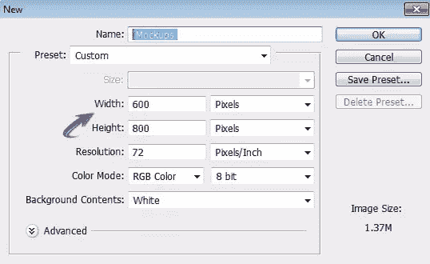](https://www.sitepoint.com/wp-content/uploads/2012/07/110.jpg)

### 第二步

我用的是浅灰色纹理背景；你可以从白色背景或者任何你喜欢的背景开始。我们先做笔记本电脑的屏幕。设置#1c1c1c 为前景色，选择圆角矩形工具绘制半径为 20px 的矩形。

[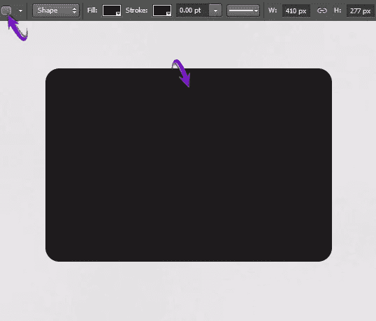](https://www.sitepoint.com/wp-content/uploads/2012/07/21.jpg)

### 第三步

现在按 Ctrl +点击矩形层，使其周围的选择。然后，创建一个新层，并前往“编辑”>“中风。”使用下面提供的值绘制一个笔划。

[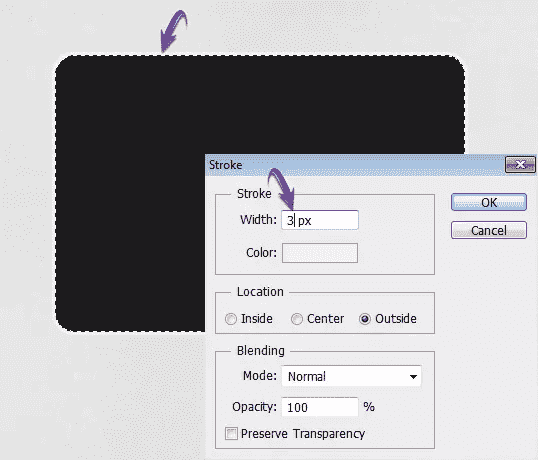](https://www.sitepoint.com/wp-content/uploads/2012/07/31.jpg)

### 第四步

双击描边图层打开图层样式窗口，应用下面提供的“斜面和浮雕”设置

[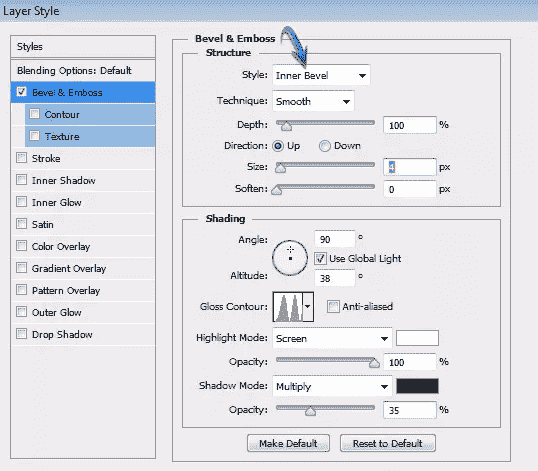](https://www.sitepoint.com/wp-content/uploads/2012/07/41.jpg)

[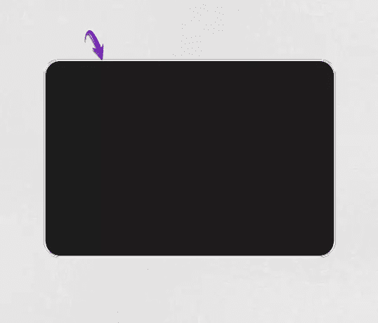](https://www.sitepoint.com/wp-content/uploads/2012/07/4b.jpg)

### 第五步

接下来，要制作显示屏，选择矩形工具在圆角矩形内绘制一个矩形，如下所示。我使用#303030 作为矩形的颜色。

[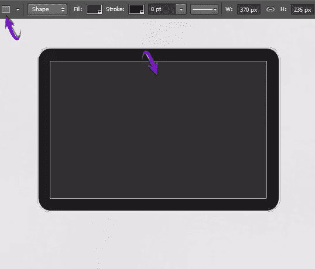](https://www.sitepoint.com/wp-content/uploads/2012/07/51.jpg)

### 第六步

在 Photoshop 中打开壁纸文件，按 Ctrl + "A "选择它，然后按 Ctrl + "C "复制选择。回到你的文档，按 Ctrl + "V "在这里粘贴壁纸。使用自由变换工具(Ctrl + "T ")调整大小和位置。点击壁纸层，然后按 Ctrl + <the smaller="" rectangle="" layer="">选择它的周围。然后，单击图层面板底部的“添加图层蒙版”图标。这样，壁纸将被限制在主屏幕上。</the>

[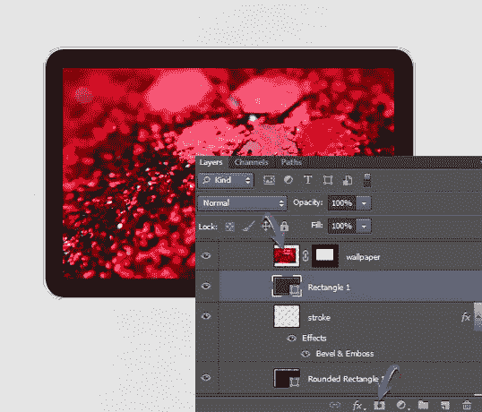](https://www.sitepoint.com/wp-content/uploads/2012/07/61.jpg)

### 第七步

现在，要改变壁纸的颜色，按 Ctrl + <the layer="" mask="" thumbnail="" of="" the="" wallpaper="">选择它。然后，点击“创建新的填充或调整层”图标。选择“色调/饱和度”选项，并使用给定的值给它一个紫色调。</the>

[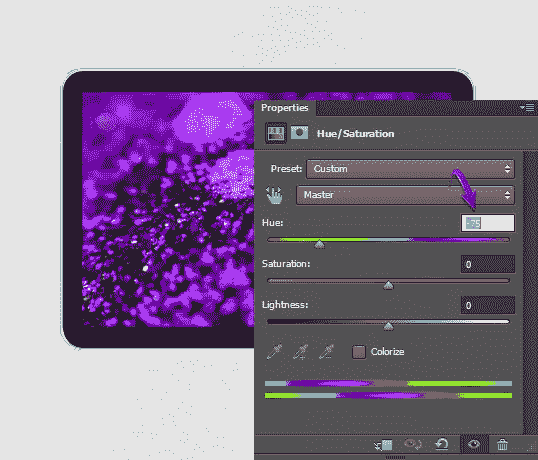](https://www.sitepoint.com/wp-content/uploads/2012/07/71.jpg)

### 第八步

使用椭圆工具画两个圆，如下图所示。较大的圆圈使用颜色#08174e，较小的圆圈使用颜色#000000。

[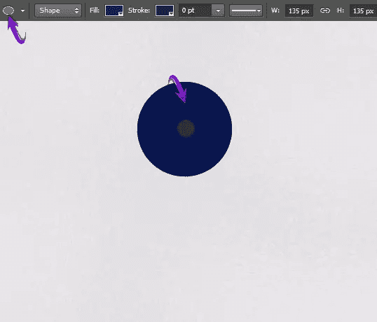](https://www.sitepoint.com/wp-content/uploads/2012/07/81.jpg)

### 第九步

双击蓝色圆形图层，应用以下设置为“斜面和浮雕”

[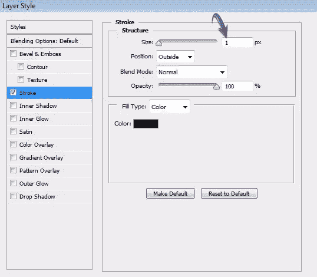](https://www.sitepoint.com/wp-content/uploads/2012/07/91.jpg)

现在，要在蓝色圆圈上创建高光，按 Ctrl + <click on="" blue="" circle="" layer="">在它周围做一个选择。现在，选择不透明度为 40%的软圆形笔刷，在选区内新建一个图层，如下图白色所示。</click>

[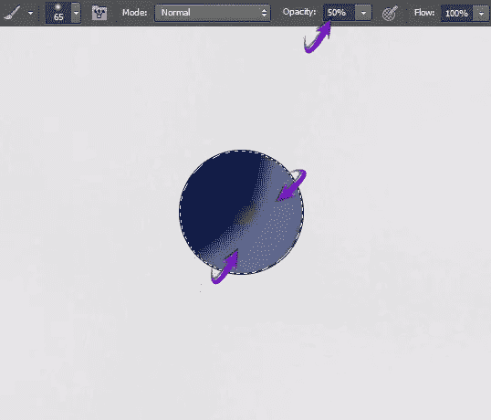](https://www.sitepoint.com/wp-content/uploads/2012/07/9b.jpg)

收集两个圆形图层到一个组中，使用自由变换工具(Ctrl + "T ")调整这个组的大小，并如下图所示放置它。

[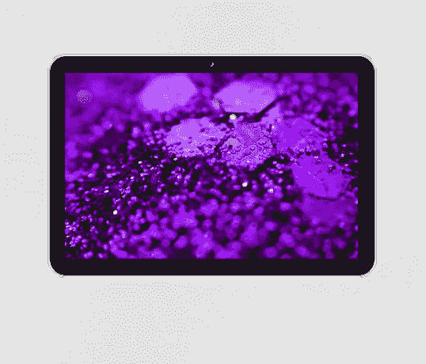](https://www.sitepoint.com/wp-content/uploads/2012/07/9c.jpg)

### 第十步

现在我们将添加文本。选择文字工具、Arial 字体和#777777 颜色来键入文本。

[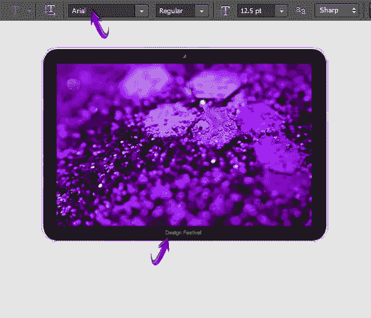](https://www.sitepoint.com/wp-content/uploads/2012/07/101.jpg)

### 步骤 11

接下来，我们将在屏幕上创建光反射。选择钢笔工具，选择“形状”工具模式，如下图绘制形状。你可以使用任何颜色来绘制形状，因为我们稍后将应用渐变。

[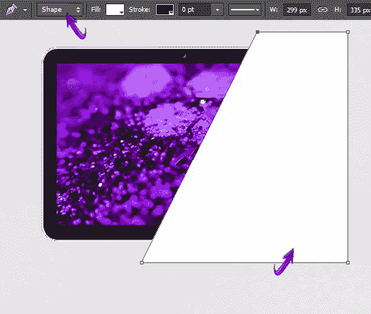](https://www.sitepoint.com/wp-content/uploads/2012/07/111.jpg)

现在，右击反射层，选择“栅格化层”选项使用与步骤 6 中相同的技术，用图层蒙版将反射限制在屏幕上。

[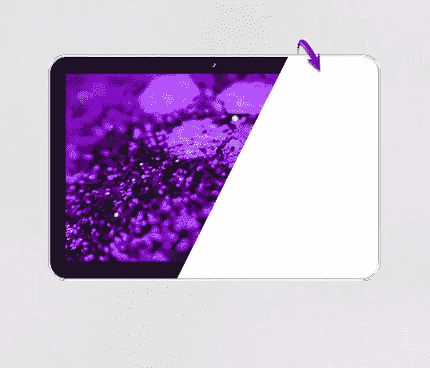](https://www.sitepoint.com/wp-content/uploads/2012/07/11b1.jpg)

### 步骤 12

设置“填充”为反射层的 0%,然后应用如下设置的“渐变叠加”。

[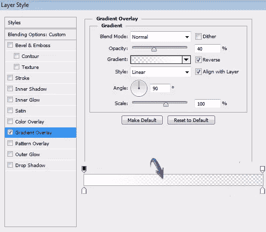](https://www.sitepoint.com/wp-content/uploads/2012/07/121.jpg)

[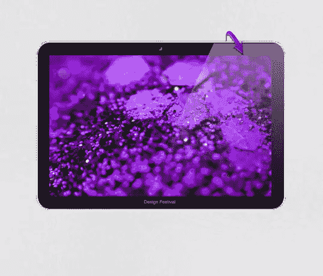](https://www.sitepoint.com/wp-content/uploads/2012/07/12b.jpg)

### 第十三步

我们已经完成了我们的屏幕，所以收集所有的层在一个组中，并将其标记为“屏幕”现在，我们将继续创建笔记本电脑部件。选择矩形工具绘制一个细矩形，如下所示。

[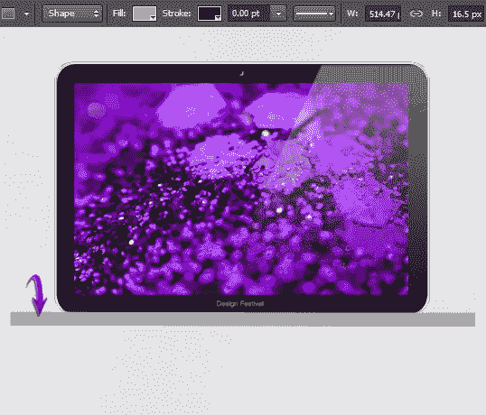](https://www.sitepoint.com/wp-content/uploads/2012/07/131.jpg)

### 步骤 14

在这个矩形上应用下面的渐变。

[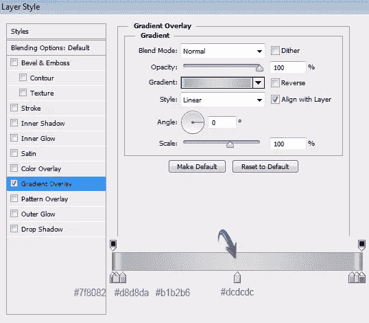](https://www.sitepoint.com/wp-content/uploads/2012/07/141.jpg)

### 第十五步

接下来，我们将添加噪声到矩形。点击矩形图层，进入“滤镜”>“转换为智能滤镜”，将矩形转换为智能对象。然后进入“滤镜”>“杂色”>“添加杂色”使用下面显示的值。

[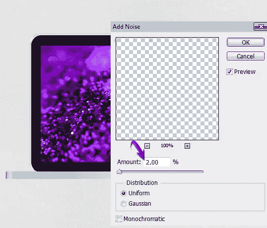](https://www.sitepoint.com/wp-content/uploads/2012/07/151.jpg)

### 第十六步

现在选择圆角矩形工具绘制两个黑色矩形，如下所示。

[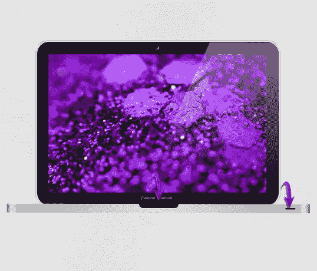](https://www.sitepoint.com/wp-content/uploads/2012/07/161.jpg)

栅格化较大的矩形层，并选择矩形选框工具来选择这个矩形的上半部分。然后，进入“编辑”>“清除”

[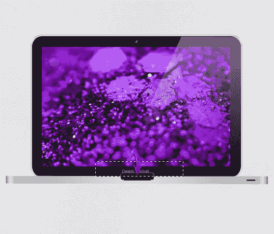](https://www.sitepoint.com/wp-content/uploads/2012/07/16b1.jpg)

[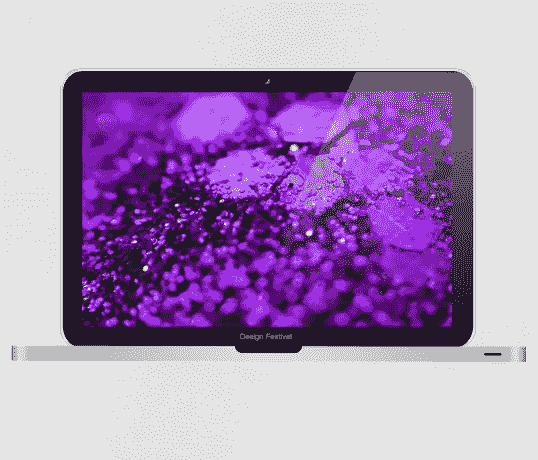](https://www.sitepoint.com/wp-content/uploads/2012/07/16c.jpg)

### 步骤 17

双击这个半矩形层，应用下面的图层样式设置。

[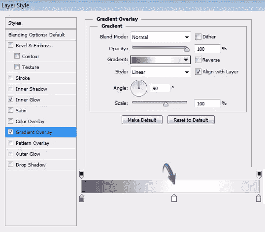](https://www.sitepoint.com/wp-content/uploads/2012/07/171.jpg)

[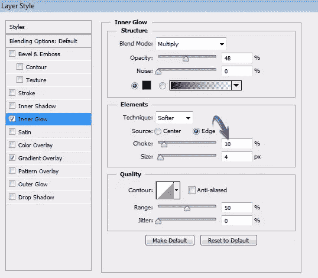](https://www.sitepoint.com/wp-content/uploads/2012/07/17b.jpg)

[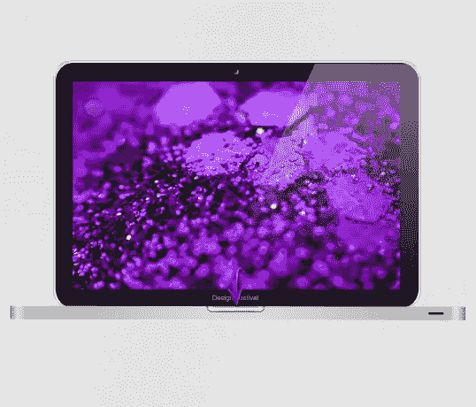](https://www.sitepoint.com/wp-content/uploads/2012/07/17c.jpg)

### 步骤 18

选择钢笔工具绘制如下形状。在这里使用颜色#838688。之后，使用椭圆工具选择#000000，在这个新的形状上画四个椭圆。

### 步骤 19

收集一组笔记本电脑层，复制这个组，并将其合并。现在进入“编辑”>“变换”>“垂直翻转”，排列在原笔记本电脑下方。选择柔软的圆形橡皮擦工具来很好地擦除笔记本电脑的倒影，得到这里显示的效果。

[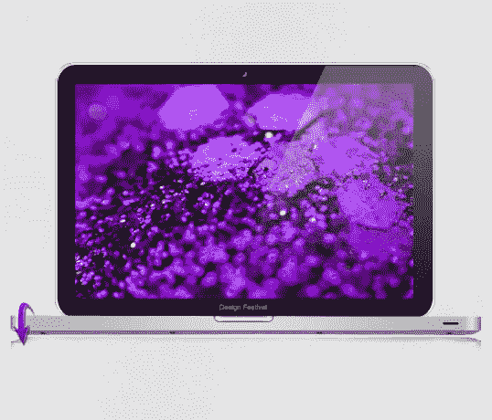](https://www.sitepoint.com/wp-content/uploads/2012/07/191.jpg)

### 步骤 20

现在我们将在笔记本电脑和它的倒影之间制作一个阴影。新建一个图层，用矩形选框工具选择一个薄的区域，填充#000000。

[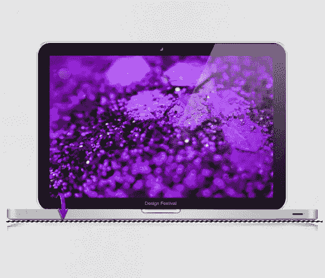](https://www.sitepoint.com/wp-content/uploads/2012/07/201.jpg)

现在，用 1.5 像素的高斯模糊来模糊它，并用软的圆形橡皮擦工具擦除它的边缘。

[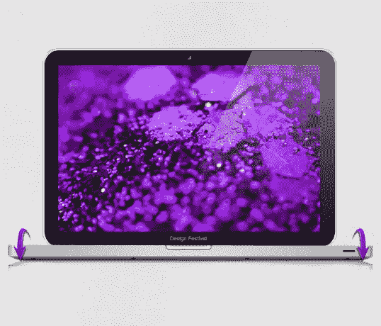](https://www.sitepoint.com/wp-content/uploads/2012/07/20b.jpg)

现在，为了增强阴影效果，应用给定的设置作为投影。

[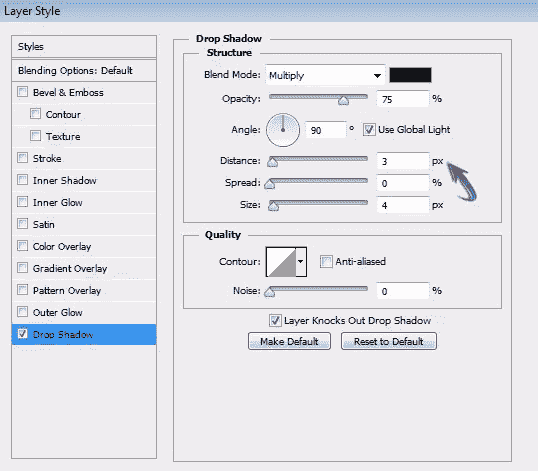](https://www.sitepoint.com/wp-content/uploads/2012/07/20c.jpg)

[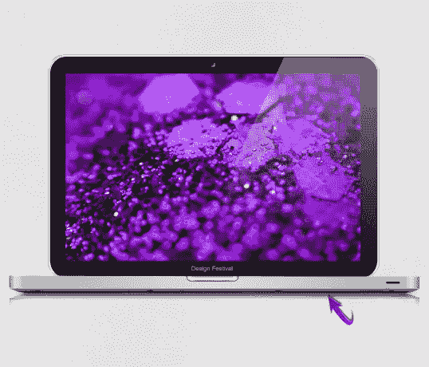](https://www.sitepoint.com/wp-content/uploads/2012/07/20d.jpg)

### 步骤 21

最后，复制屏幕组以保留原始的屏幕比例。现在，在复制的屏幕组中选择描边和黑色矩形图层，垂直增加一点尺寸，因为我们不希望屏幕底部有圆角。

[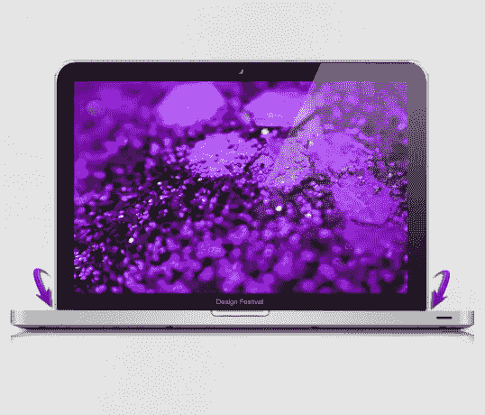](https://www.sitepoint.com/wp-content/uploads/2012/07/211.jpg)

### 步骤 22

我们都完成了我们的笔记本电脑模型。现在，我们将通过几个简单的步骤来创建一个监视器。首先，点击原始屏幕组中的笔画层，将其尺寸缩小一点，并将笔画放置在屏幕顶部可见的位置，如下所示。

[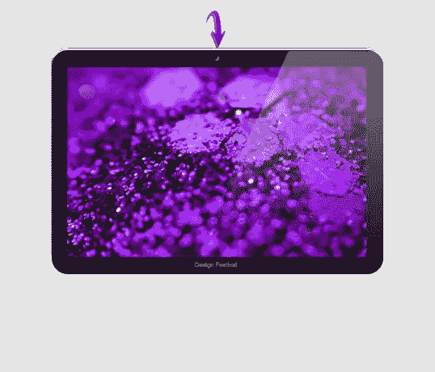](https://www.sitepoint.com/wp-content/uploads/2012/07/22.jpg)

### 步骤 23

使用#f7f7f7 中的钢笔工具绘制如下所示的形状。

[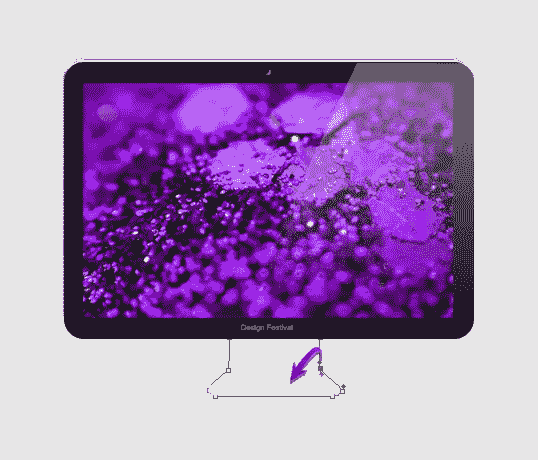](https://www.sitepoint.com/wp-content/uploads/2012/07/23.jpg)

复制这个形状，给它深灰色阴影，以区别于原来的。向下拖动原始形状层一点。

[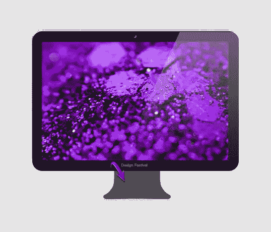](https://www.sitepoint.com/wp-content/uploads/2012/07/23b.jpg)

### 步骤 24

双击较暗的形状层，应用下面的设置作为渐变叠加。

[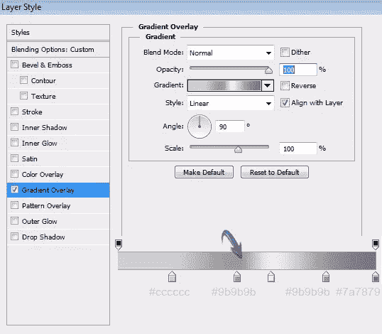](https://www.sitepoint.com/wp-content/uploads/2012/07/24.jpg)

### 步骤 25

现在点击浅灰色图层，应用下面的图层样式设置。

[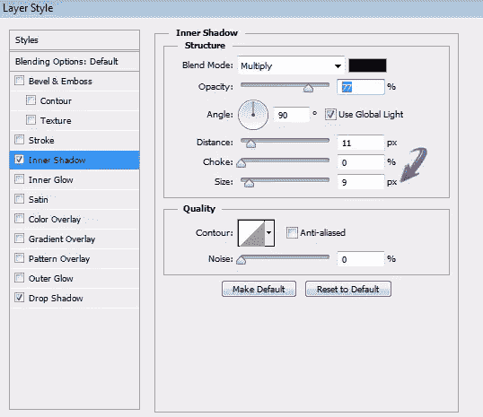](https://www.sitepoint.com/wp-content/uploads/2012/07/25.jpg)

[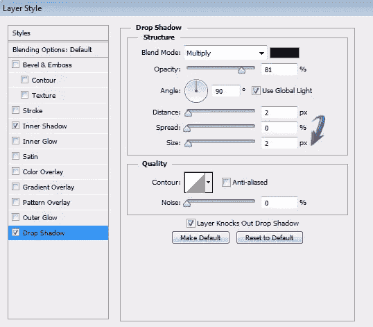](https://www.sitepoint.com/wp-content/uploads/2012/07/25b.jpg)

### 步骤 26

接下来，我们将在展台上创建高光。选择 50%不透明度的软圆形笔刷工具，选择纯白色。现在按 Ctrl + <click on="" the="" stand="" layer="" with="" gradient="">选择它的周围，然后在这个选区的一个新图层上使用笔刷。</click>

最后，使用我们在步骤 19 中为笔记本电脑使用的相同方法为支架创建反射。

就是这样，伙计们。你怎么想呢?

## 分享这篇文章