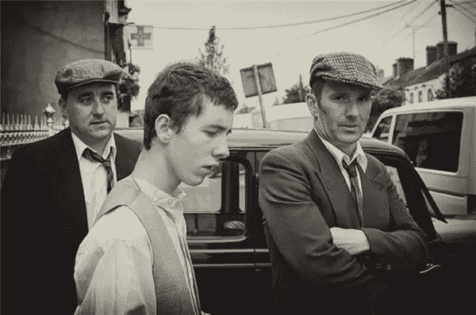
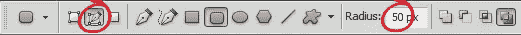
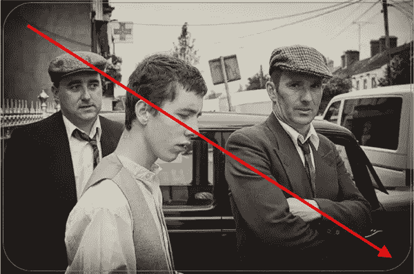
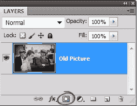
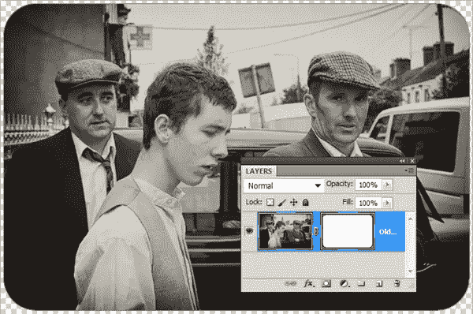

# 使用 Photoshop 形状工具为照片创建平滑的圆角

> 原文：<https://www.sitepoint.com/create-smooth-round-corners-for-your-photographs-with-the-photoshop-shape-tools/>

如果你想在你的网站上的照片或插图上圆角，Photoshop 中的圆角矩形矢量工具是一个非常方便的工具。下面是怎么做的。

1.打开一张照片，双击背景层使其可编辑。我们正在解锁背景层，因为我们稍后将添加一个遮罩。(这是我最近拍摄的一张照片，当时一个电影摄制组正在我住的附近的一个小镇拍摄一部古装剧，我用最细微的棕褐色转换成了黑白)。

2.从“工具”面板中选择圆角矩形工具。圆角矩形可能不可见。单击并按住矩形工具图标，直到弹出菜单出现，然后选择圆角矩形工具。

3.在选项栏中，单击“路径模式”按钮，并将“半径”字段更改为 50 像素。在 Photoshop 中处理矢量时有几种模式可用，但对于这种特殊的技术，请确保圆角矩形工具处于路径模式(按钮看起来像一个正方形，每个角上都有一个小点，中间有一支笔)。

要控制图像的角有多圆，请键入一个较小的数字表示不太圆的角，键入一个较大的数字表示较圆的角。在这种情况下，我使用 50 像素。

4.将鼠标放在图像的一个角上，单击并沿对角线拖动，在图像周围画一个方框。当你释放鼠标按钮时，你会看到一条灰色的线出现在你的图像上——这就是路径。如果您需要移动它，请选择路径选择工具(工具箱中文字工具下面的黑色箭头)并将其拖到您想要放置它的位置。

5。在图层面板中，确保照片层被选中，然后通过 **Ctrl +点击**图层面板底部的添加图层蒙版图标添加一个矢量图层蒙版。

瞧啊。Photoshop 隐藏圆角矩形外的区域，给你留下可爱的光滑边角。

使用矢量的好处是你可以调整矩形的大小(Ctrl + T 来自由变换),而且你不会失去质量和平滑的边缘。

## 分享这篇文章