# 在 Illustrator 中创建时尚的挂钟图标

> 原文：<https://www.sitepoint.com/create-stylish-wall-clock-icon-illustrator/>

图标设计看起来很难。将推销术、直觉和美学诉求融入如此小的画布可能是一个相当大的挑战，尤其是如果你受到技术约束或品牌准则的限制。熟练的设计师必须远远超越让他们的作品“漂亮”；他们需要它来有效和成功地传达它所象征的内容或软件。

今天，我将带你了解在 Illustrator 中创建挂钟矢量的过程。我们将使用各种形状工具，钢笔工具，旋转工具和对象和效果菜单中的各种选项来实现最终的结果。我希望你会学到一些有用的技巧。所以，让我们开始吧！

### 资源:

[美国队长字体](http://www.dafont.com/american-captain.font)

### 最终结果:

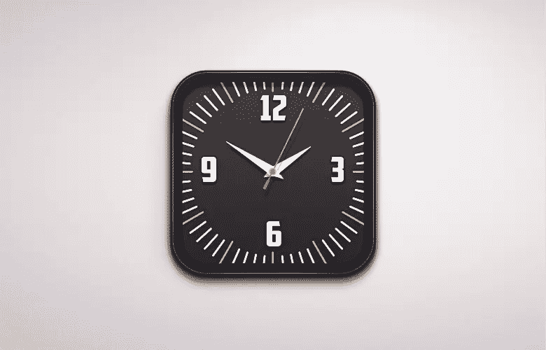

**( [下载完成的设计文件](https://www.dropbox.com/s/7tla4i5tuyeitf2/Clock.zip)。)**

### 第一步

在 Illustrator 中创建新文档，宽度为 600 像素，高度为 500 像素。
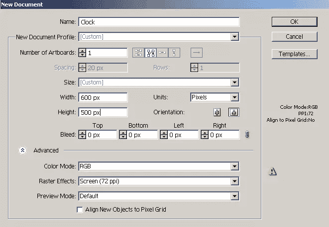

### 第二步

首先，我们将把钟的框架分成两部分:外部和内部。先说外框。选择#2D2B2C 作为你的填充和#231F20 作为你的笔画颜色。现在，选择矩形工具(“M”)并点击画布来查看矩形窗口。输入 290px 作为宽度和高度，然后按“确定”。把这个贴上你的“外框”标签。
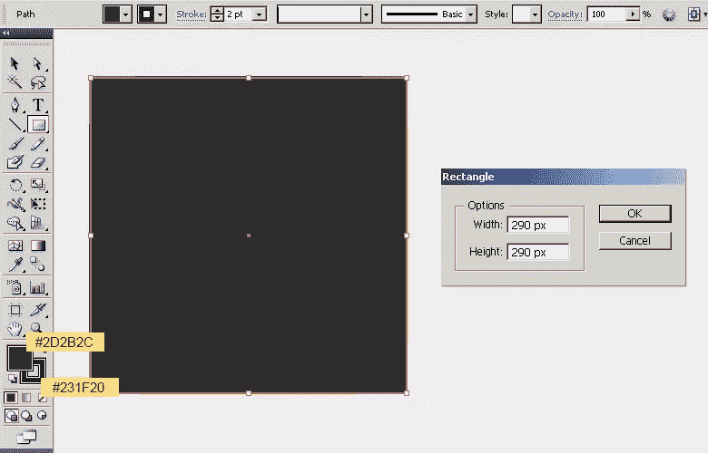

通过点击相应层右侧的环形目标选择矩形，然后进入“效果”>“风格化”>“圆角”。在那里输入 50px 值，将其转换为圆角矩形。现在，转到“对象”>“扩展外观”来修改形状。
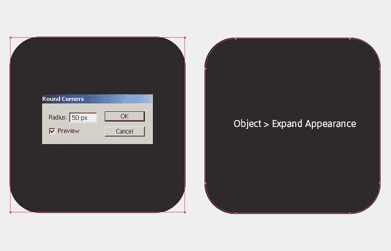

### 第三步

接下来，选择外框，进入“对象”>“路径”>“偏移路径”。将路径偏移“-12px”。现在，选择这个新的形状，改变其填充颜色为#231F20，没有中风，并标记为“内部框架”。
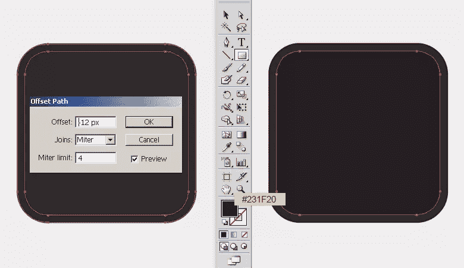

### 第四步

选择内部框架，然后转到“对象”>“路径”>“偏移路径”。将路径偏移“-4px”。现在，选择新的路径，改变其填充颜色为#2D2B2C 没有中风，并标记为“基地”。
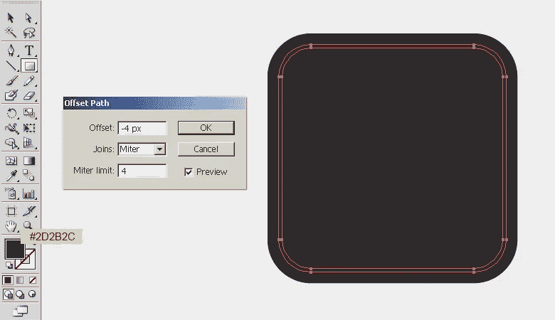

### 第五步

接下来，我们将应用一个粒状纹理的时钟。选择基地，按 Ctrl + "C "复制，它和按 Ctrl + "F "粘贴在前面。现在，转到“效果”>“艺术”>“胶片颗粒”。在这里应用下面的设置，点击“确定”来应用粒状效果。
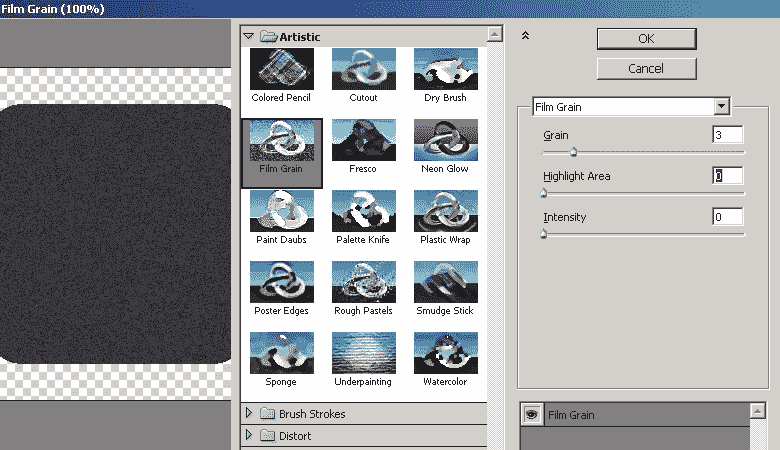

在“透明度”面板中，将纹理不透明度降低到 30%(Shift+Ctrl+F10)。
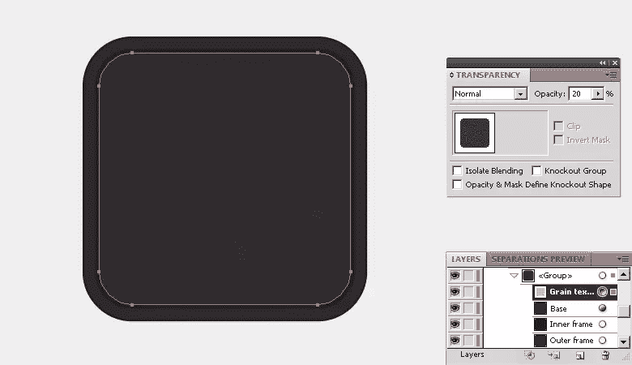

### 第六步

要在框架上加亮，选择你的外框，进入“对象”>“路径”>“偏移路径”。将路径偏移“-2px”。现在，选择这个新路径，设置其填充颜色为“无”，并给它一个白色的中风(1 磅)。在“透明度”面板中，将高光的不透明度调整为 22%(Shift+Ctrl+F10)。
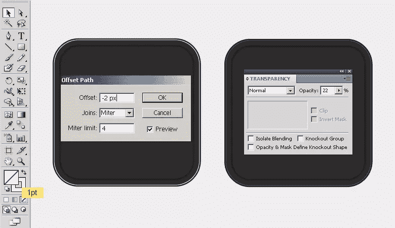

### 第七步

接下来，我们将在时钟上做标记。定位导轨，以便正确对齐。按 Ctrl + "R "查看标尺，拖动垂直和水平参考线在时钟中心相交。现在，用填充颜色#FBB040 和黑色笔画(1 磅)在上边缘画一个细矩形做小时标记。之后，选择它，进入“效果”>“风格化”>“圆角”。输入 2px 作为你的半径，进入“对象”>“扩展外观”修改形状。
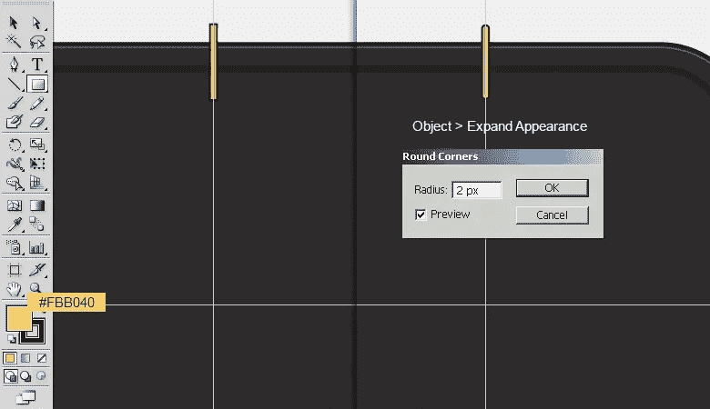

### 第八步

选择圆角矩形，按 Ctrl + "C "复制，按 Ctrl + "F "粘贴在前面。现在，把这个副本放在钟的下边缘。
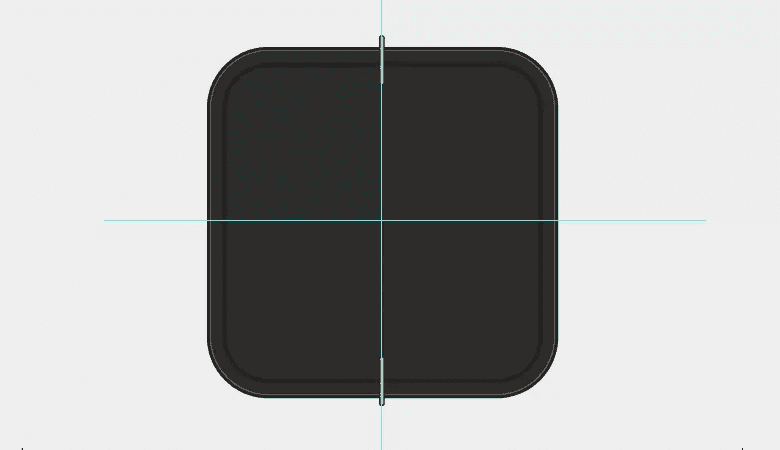

选择两个标记，然后进入“效果”>“扭曲和变换”>“变换”。在这里应用以下设置来制作其余的标记。
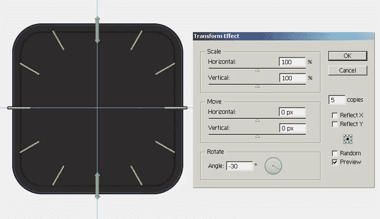

### 第九步

为了将标记限制在基底内，我们将对它们应用剪切蒙版。然而，我们首先需要扩展标记。选择它们，然后进入“对象”>“扩展外观”。现在，制作一个“基础”层的副本，删除其填充和描边，并将其放置在标记层之上。现在，选择基础副本和标记层，然后进入“对象”>“剪贴蒙版”>“制作”。
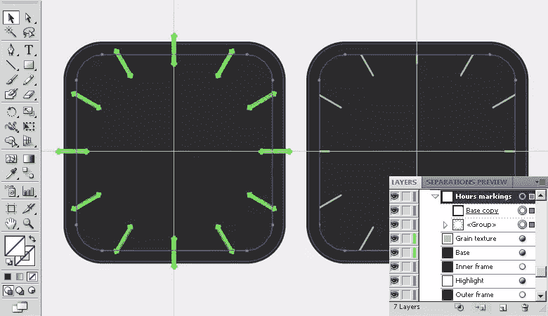

### 第十步

接下来，我们将做微小的标记。用白色填充颜色在时钟的上边缘画一个小矩形。将其转换为半径为 1.2 像素的圆角矩形，并使用步骤 7 中描述的相同路径进行扩展。现在，复制一份，放在下边，如下图所示。
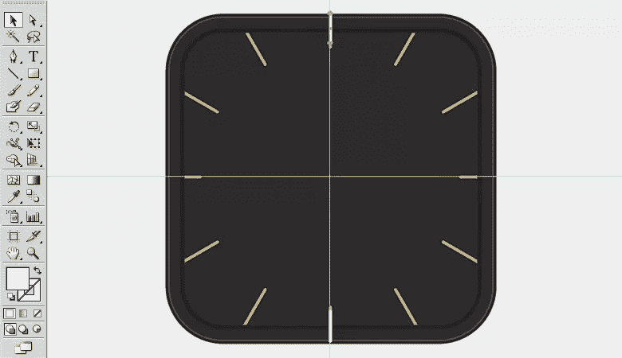

### 步骤 11

选择两个矩形，选择旋转工具(“R”)并单击画布查看选项窗口。输入 6⁰作为你的角度，点击“确定”来移动 6⁰.的矩形再次选择旋转工具(“R”)。这次输入一个 6⁰角度，然后点击“复制”选项。
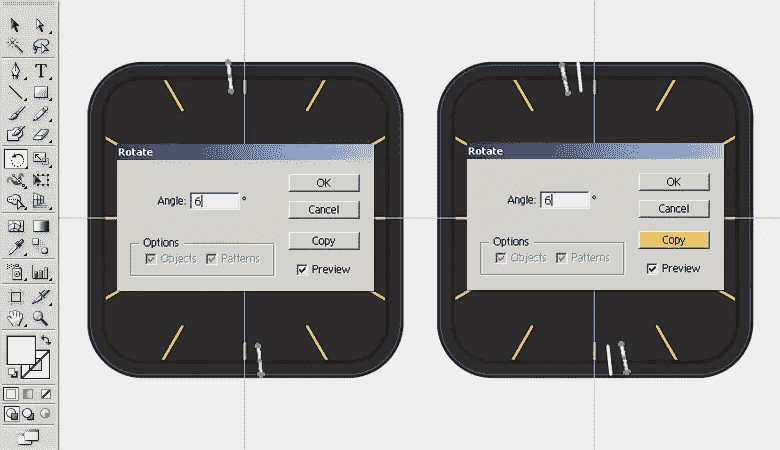

现在，按 Ctrl + "D "两次，再得到两份。
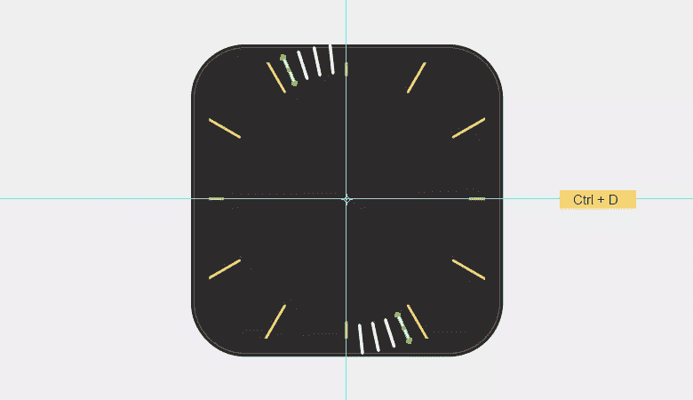

### 步骤 12

选择所有这些矩形，然后进入“效果”>“扭曲和变换”>“变换”。在这里应用以下设置来制作其余的标记。
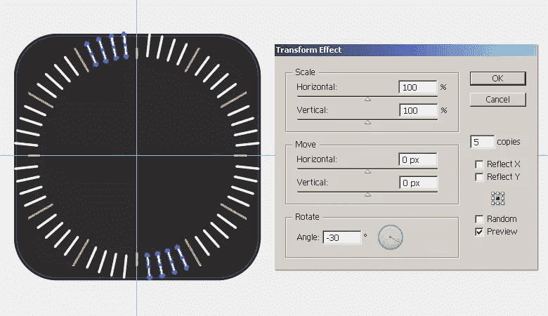

现在，使用步骤 9 中使用的相同技术，通过对分钟标记应用剪切蒙版，将分钟标记限制在时钟基础上。
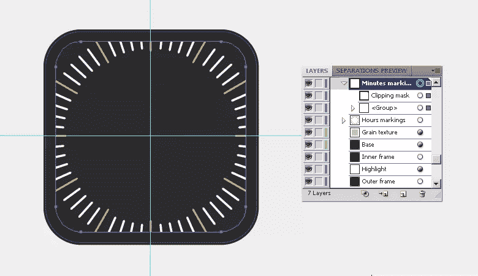

### 第十三步

接下来，我们将添加数字。选择#F6F4F2 作为你的填充颜色，并选择文字工具(“T”)来键入数字“12”沿垂直参考线对齐。我用的是 50 磅大小的“美国队长”字体。
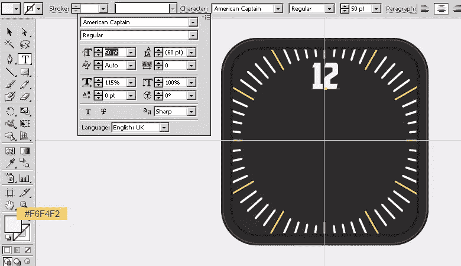

选择新创建的数字，进入“效果”>“风格化”>“阴影”。在此应用以下值:
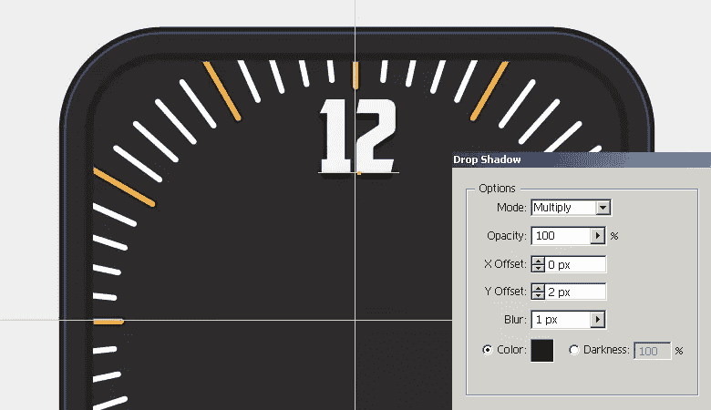

### 步骤 14

使用相同的投影设置键入其余数字，并沿参考线对齐它们。
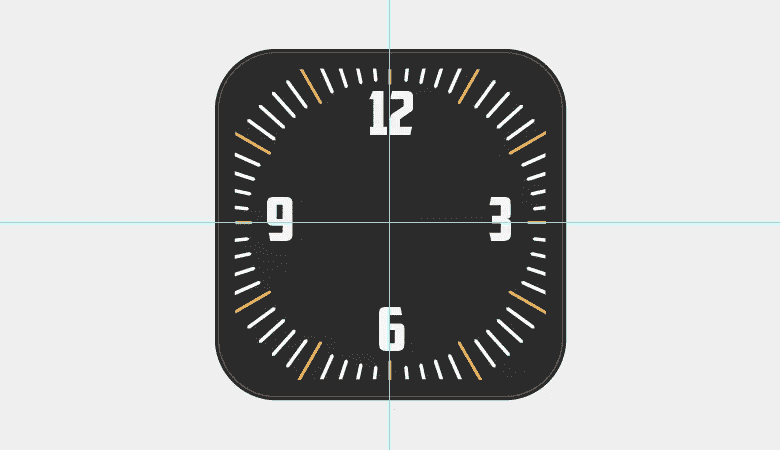

### 第十五步

现在，我们将制作时钟的指针。选择#E6E7E8 作为填充颜色，选择#F6F4F2 作为描边颜色。选择钢笔工具(“P”)绘制如下所示的形状。
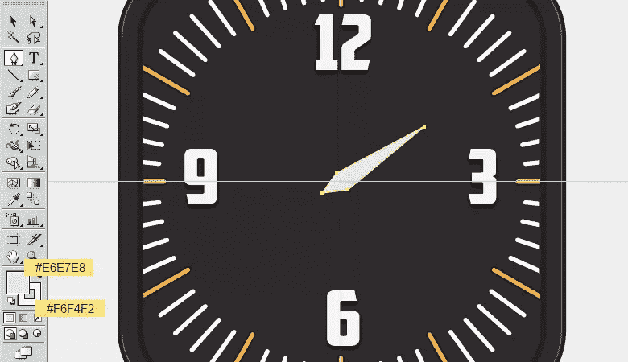

使用钢笔工具(“P”)在新图层上用 1 磅白色笔画一条线。在界面顶部的控制栏中，将描边的宽度轮廓更改为“宽度轮廓 1”。
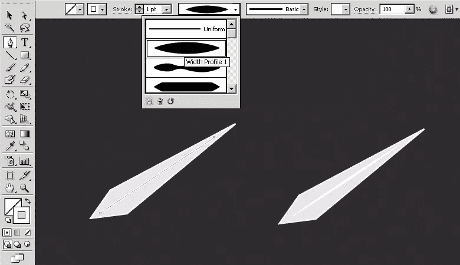

用同样的方法制作分针。
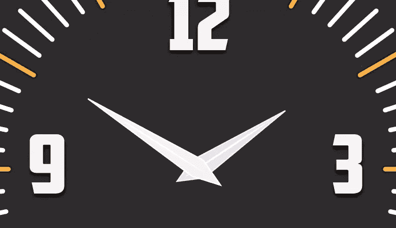

### 第十六步

现在，用填充颜色#F7941E 组合两个矩形来制作秒针，位置随你喜欢。接下来，在手上添加两个圆:一个大椭圆使用颜色#FBB040，一个小椭圆使用颜色#F7941E。之后，在这些椭圆上一个接一个地应用下面的投影设置。

### 步骤 17

接下来，我们将制作手的阴影。选择时针，按 Ctrl+“C”复制，按 Ctrl+“B”粘贴到位。更改这个新副本的填充为黑色，向下拖动 2-3 步，并在透明度面板中将其不透明度降低到 30-35%。用同样的方法制作分针的阴影，但是，向下拖动 4-5 步，因为它比时针离底部更远，需要更远的阴影。同样，秒针的阴影应该更向下，你必须把它放在其余层的下面。然而，它的部分阴影应该在短针上，所以画一个薄矩形，旋转并定位它，如下所示。
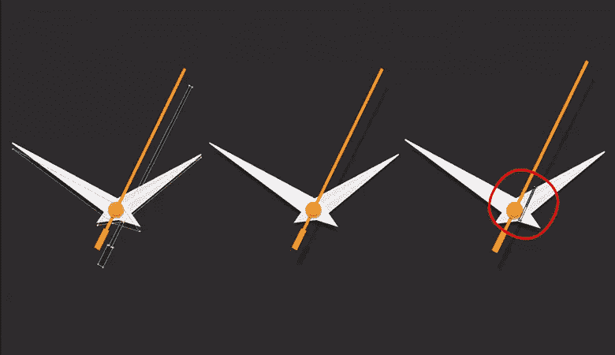

### 步骤 18

我们将在时钟的上边框下制作阴影。要做到这一点，选择“基础”层，按 Ctrl+“C”，然后按 Ctrl+“F”。制作图层的副本。现在，将最上面的副本向下拖动 6-7 步。选择两个副本，并在路径查找器面板中点击“减正面”(Shift + Ctrl + F9)。改变这个新形状的混合模式为 50%不透明度的“乘”。选择它，进入“效果”>“模糊”>“高斯模糊”，应用一个 2px 高斯模糊效果。

### 步骤 19

制作另一个“基础”层的副本，放在其余层的上面。使用渐变工具在上面应用下面的灰到白渐变。改变其混合模式为“柔光”，不透明度为 40%。
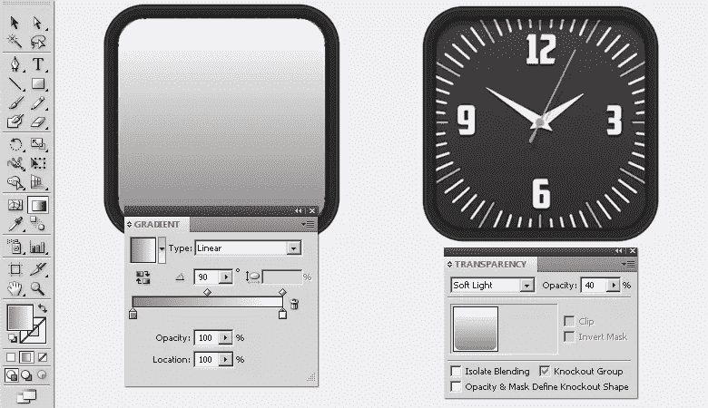

### 步骤 20

接下来，我们将使用钢笔工具(“P”)用白色 1 磅的笔画和宽度轮廓 1 绘制几个高光——与我们在步骤 15 中用于时钟指针的方法相同。
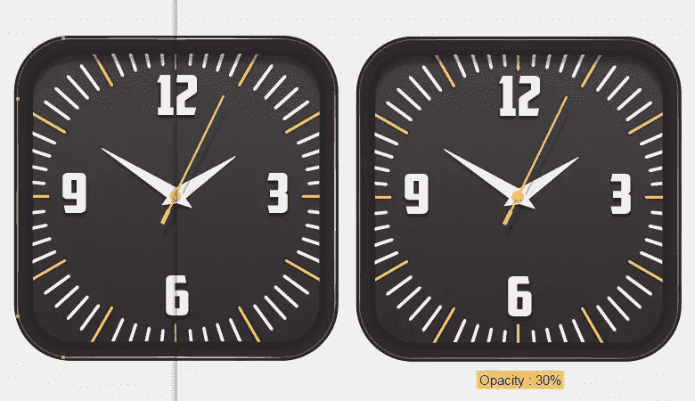

### 步骤 21

创建时钟的阴影，复制外框层，按 Ctrl + "B "粘贴到后面。使用选择工具(“V”)从顶部降低其高度，并应用以下阴影设置:
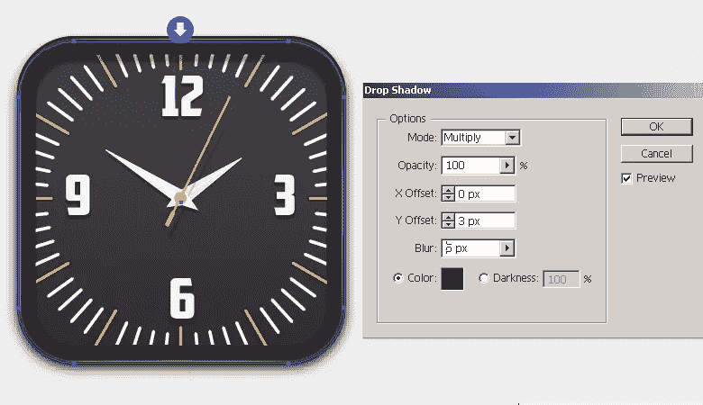

### 步骤 22

为了增强阴影效果，复制步骤 21 中创建的阴影层，然后按“Shift + F6”打开外观面板。双击它的内容，使用下面的向导编辑阴影设置:
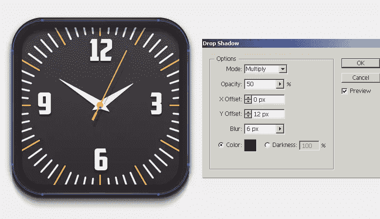

### 最终结果:

就是这样！您的点击图标已完成。我希望你喜欢这个教程，并学到一些有用的东西。请分享你的想法！

## 分享这篇文章