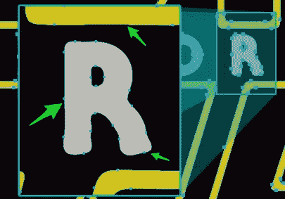
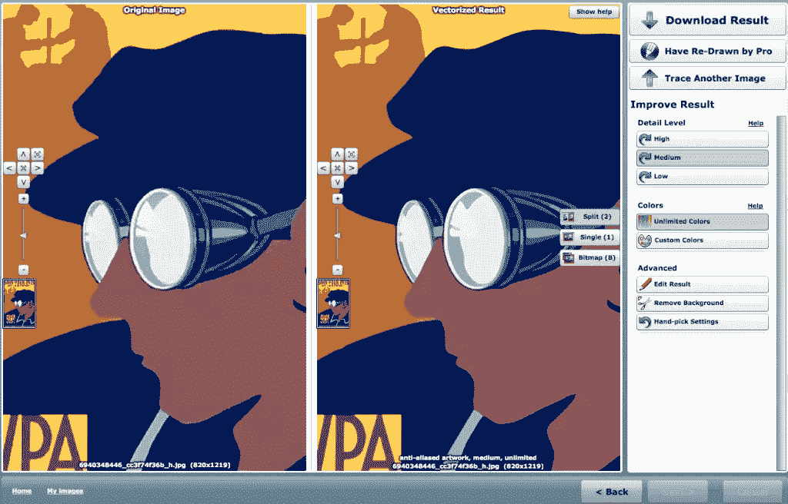
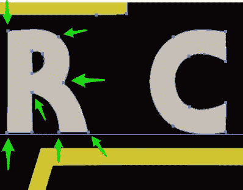

# 从现有作品创建 SVG 的最佳方式

> 原文：<https://www.sitepoint.com/create-svgs-from-existing-artwork/>

我觉得 2016 年 SVG 应该是‘我们的事情’。从纯技术角度来说，我们知道如何让它在大多数现代浏览器中工作。

它也非常适合网络，给了我们微小的文件大小，清晰的边缘和几乎无限的可扩展性。事实上，谷歌从 2010 年就开始索引 SVG。

Illustrator、Sketch 和 Inkscape 等主流图形应用程序越来越擅长输出相对高效的“网络就绪”SVG 图形。有很多喜欢的地方，

### 那么，为什么 SVG 不接手呢？

也许对我们许多人来说，一个主要的刹车是我们拖在身后的像素图形的长期遗产。来自客户和广告商的几十年的 jpg、png 和 gif。将所有这些基于像素的标志、图标、图表、图形、图表和其他谁知道的东西转换成矢量形式的前景足以让我们大多数人头疼，对吗？

## 将像素转换为矢量

向量自动跟踪并不是一个新概念。我记得当 Adobe 在我的第一份 Illustrator 中包含一个名为' [Streamline](https://en.wikipedia.org/wiki/Adobe_Streamline) '的独立自动描摹应用程序时，我真的很兴奋。我现在可以在几秒钟内创作出新的插图！

兴奋逐渐消失了。

很快就清楚了，Streamline 生成的矢量文件充其量只是一个起点。当你清理、修理、整理它们并把它们重新组织成更有用的东西时，你不得不怀疑从头开始是否会更好。

最终，Streamline 的 autotrace 功能被集成到 Illustrator 核心中，但问题依然存在。

*   光滑的字体参差不齐
*   直角是弯曲的，角实际上是曲线
*   成千上万的多余节点被添加到不需要的地方。

正如你在上面这个 Illustrator“live trace”例子中看到的，元素几乎*总是*需要手工修饰。

这对于 SVG 来说变得更加重要，在 SVG 中很难将 CSS 或 JavaScript 行为附加到非常复杂的形状上。

## 矢量魔术

过去我曾提到过 [VectorMagic](http://vectormagic.com/) ，但我发现它对大多数人来说还是相对陌生的。

它已经存在很多年了，事实是，我很想指出一种替代方案，因为 VectorMagic 价格昂贵。

但另一方面，我认为它仍然是像素到矢量转换软件之王。

使用 VectorMagic 有两种方法。桌面版是全功能版，一次性支付 295 美元。

他们还提供基于浏览器的在线版本，作为每月 8 美元的订阅服务，我不认为你会失去任何重要的东西。

VectorMagic 的默认设置非常好，但是——像大多数自动追踪器一样——它们也允许你自定义细节级别和调色板。

然而，你花钱买的是智能算法。看看 VectorMagic 从同一个“星球大战”横幅 JPEG 生成的形状。

当用尽可能少的节点构建时，矢量图形几乎总是看起来和执行得最好。

正如你在上面的例子中看到的，VectorMagic 产生的矢量形状清晰、简单、干净，元素像激光切割的拼图一样组合在一起。几乎没有不必要的点，一个活生生的人类插画师不会添加。

事实是，VectorMagic 正在进行一些令人印象深刻的数学魔术，我认为没有其他人知道如何做得这么好。Adobe 的实验室里挤满了研究图像技术的数学极客，但不管出于什么原因，他们还没有接近这一点。

不得不说:这是一项值得订阅的服务。他们甚至提供了 SVG 下载选项。然而，值得注意的是，当你创建一个新账户时，他们允许 2 次免费转换。

但是要注意:一旦你看到了结果，就很难回头了。

*原载于 [SitePoint 设计简讯](https://www.sitepoint.com/newsletter/)* 。

## 分享这篇文章