# 如何打造难忘的界面文案

> 原文：<https://www.sitepoint.com/create-unforgettable-interface-copy/>

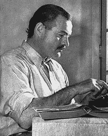

莎士比亚和海明威可能以一种要求我们反思人类状况的方式精心制作了词语，但他们能提高你的转化率吗？答案可能会让你大吃一惊。

在这篇文章中，我们将讨论为您的产品编写用户界面副本的最佳实践，其中包括一些适用于所有界面的方法，以及一些数字副本特有的方法。

## 清晰是你的首要任务

模糊是好设计的敌人。对于界面复制来说尤其如此，因为文字是如此直接的交互，混乱只会被放大。

在这一节中，我们将根据 Google Ventures 的设计合伙人 John Zeratsky 在他关于界面文案撰写的文章中最初列出的建议，提供一些基本的建议。

我们发现它尤其适用于交互设计，所以让我们更深入地了解一下:

### 1.具体点

准确地陈述你的意思，不要含糊其辞。

这很大程度上要追溯到选择正确的词语。例如，*保存*功能与*提交*不同。类似地，一个*过滤器*功能有时会被误认为是一个*搜索。*

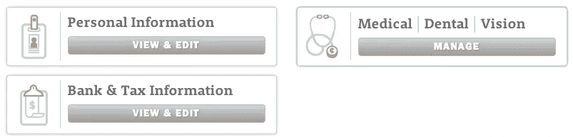

在上面来自 **Zenefits，**的例子中，你可以看到福利按钮是如何被标记为*管理*，而个人和财务信息被标记为*查看&编辑*。

这是一个非常细微的差别，但是基于所需的用户努力，这是有意义的。*管理*按钮更准确，因为菜单提供了添加家属、更改计划和打印机密信息等操作。同时，个人和财务菜单只是简单的数据输入。

另一个关于特异性的提示是正确的标题。假设你的产品为你关注的公司创造了一个活动流。虽然这对您来说是不言自明的，但对于新用户来说，这可能会令人困惑，甚至可以忽略不计。一个具体的标题，像“公司更新”这样简单的东西，可以让用户免于困惑。

在多页向导的情况下,“用户在每页上输入信息的一系列页面，就像在注册帐户时一样”,具体一点有助于使你与众不同。

虽然大多数产品都将下一步按钮标记为*下一步*或*继续*，但准确解释下一步可以创造出更有帮助的互动。这可以通过较小尺寸的副本来完成，即“保存&继续】接下来，我们将询问支付信息。”

### 2.避免行话

交互设计中的一个容易犯的错误是和你的用户使用和你在办公室一样的语言。

除非你是为其他设计师和开发人员设计，否则你的行话要么会让用户不知所云，要么会让他们难以理解。将“站点”称为“网站”，将“邀请”称为邀请，将“回购”称为存储库。

虽然我们在自己面向专业读者的电子书中频繁使用术语*【UX】**IxD*和 *UI* ，但普通人可能不知道我们在说什么。

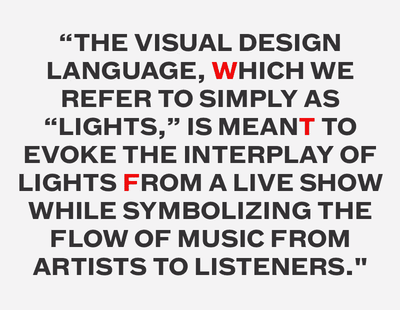

*来源:[设计行话扯淡](http://thefoxisblack.com/blogimages//design-jargon-bullshit.jpg)*

正如在[可用性测试指南](http://www.uxpin.com/guide-to-usability-testing.html?utm_source=Interaction%20Design%20Best%20Practices%20V1&utm_medium=ebook&utm_campaign=Interaction%20Design%20Best%20Practices%20V1)中所讨论的，你应该始终测试对术语的清晰理解。你可以通过[用户测试](http://www.usertesting.com/)设置你的人口统计数据，并在一小时内收到测试结果，或者走一条更便宜的路线，如[机械土耳其人](http://aws.amazon.com/mturk/)(测试界面语言的过程是这里描述的)。

### 3.重要的话先说

重要的词应该总是出现在前面和中心。

例如，在表单域中，标签“名字”比“名字(第一个)”好得多如果你想把注意力吸引到页面底部的附加细节，“下面你会找到附加细节”，不如“下面的附加细节”有效。

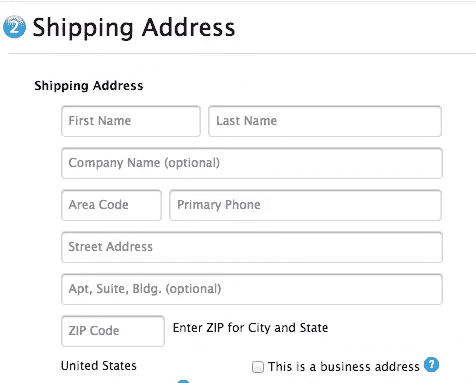

*来源:[苹果专卖店](http://store.apple.com/)*

**Apple Store** 通过使用内嵌表单验证展示了良好的单词放置(这种模式在 [Web UI Patterns 2014](http://www.uxpin.com/web-design-patterns.html?utm_source=Interaction%20Design%20Best%20Practices%20V1&utm_medium=ebook&utm_campaign=Interaction%20Design%20Best%20Practices%20V1) 中有描述)。因为描述位于表单字段中，所以不需要用每个条目的描述来混淆界面。随着字段的完成，描述也消失了，随着用户的进展，创建了更清晰的交互。

### 4.省略不必要的词语

小威廉·斯特伦克在《风格的永恒元素》中提出的永恒建议:省略不必要的词语是所有写作的基础。考虑到尺寸、性格和注意力范围的限制，这个建议对数字设计有额外的影响。

你不能忽视这个建议，考虑到一项对 205，873 个网页的研究表明，用户只需要大约 10-20 秒就可以决定一个网站是否值得。

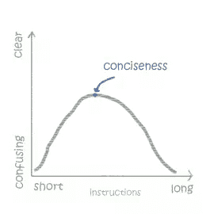

*来源:[创建一个说你用户语言的用户界面](http://sixrevisions.com/user-interface/creating-a-user-interface-that-speaks-your-users-language/)*

作为一个通用的经验法则，尽可能用最少的词来表达所有的事情(同时仍然保留意思)。例如，'*点击继续【T1]'通常可以简称为'*继续【T3 '，'*所有变更已保存【T5]'可以简称为'*变更已保存*'。***

## 不要强求个性

几年前，厚脸皮、咄咄逼人、风度翩翩的措辞可能是一种有效的策略，当时一种随意的语气与使用公司语言的其他产品形成鲜明对比。但是现在，大多数产品都使用一种随意的语气，所以这种策略不再像以前那样独特了。

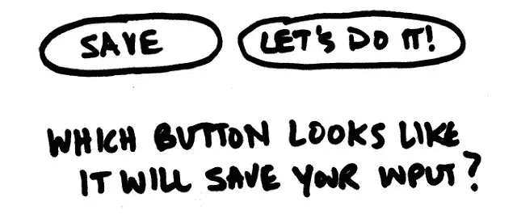

*来源:* [嘿设计师们，别再自作聪明了](http://www.fastcodesign.com/3021554/innovation-by-design/hey-designers-stop-trying-to-be-so-damned-clever)

不要误解我——我们并不是说你的产品应该被剥夺鲜明的个性。不要勉强就好。太多时候，品牌优先考虑的是聪明或突出，而不是清楚地表达他们的意思。当个性妨碍清晰时，是时候把它去掉了。

正如 Etsy 的创意总监兰迪·亨特(Randy Hunt)建议的那样，第一印象的聪明不会在最初的几分钟内消失，但默默无闻的挫败感肯定会。

标题和按钮是你产品的支柱，所以不要冒险用容易被误解的措辞来弱化它们。在关键互动中，清晰比个性更重要，所以'*保存并继续*'将比*更有效。太棒了，我们走吧！*。如果你想展示你的创造力，那就把它留到副标题和支持文字中吧。

*来源:[UXPin](http://www.uxpin.com/?utm_source=Interaction%20Design%20Best%20Practices%20V1&utm_medium=ebook&utm_campaign=Interaction%20Design%20Best%20Practices%20V1)*

在我们的 UXPin 按钮中，[邀请其他人合作](http://www.uxpin.com/application-features.html)，我们通过明确描述动作来平衡个性和功能。这是一个微妙的接触，因为如果第二句话是类似于“和同事一起找乐子”这样的话，行动就会变得混乱

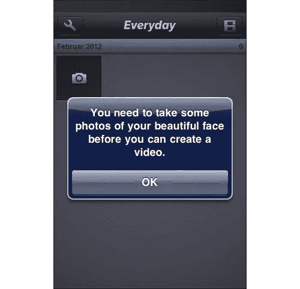

*来源:[人格层](http://www.smashingmagazine.com/2012/07/18/the-personality-layer/)*

**daily**照片应用程序在其入职信息中取得了类似的平衡，将一个恼人的提醒变成了一个令人愉快的互动，可能已经让一些人笑了。同样，这里的关键是用户动作保持清晰。

不管你用什么样的词，你的设计个性都会以这样或那样的方式表现出来。此外，公司个性不是你想强迫或自觉塑造的——它应该自然而真实地出现。人们对被操纵比你想象的更敏感，友好的话语不一定会让你显得更友好。

为了了解更多关于如何给你的设计注入适量的个性，我推荐 Mailchimp UX 总监 Aarron Walter 的这篇优秀的 [A List Apart piece](http://alistapart.com/article/personality-in-design) 。

## 强调情感联系而不是长度

一场传奇的文艺复兴时期的战斗与现代咖啡公司有什么关系？阅读**蓝瓶咖啡**网站的[我们的故事](https://bluebottlecoffee.com/our-story)版块，你就知道了。

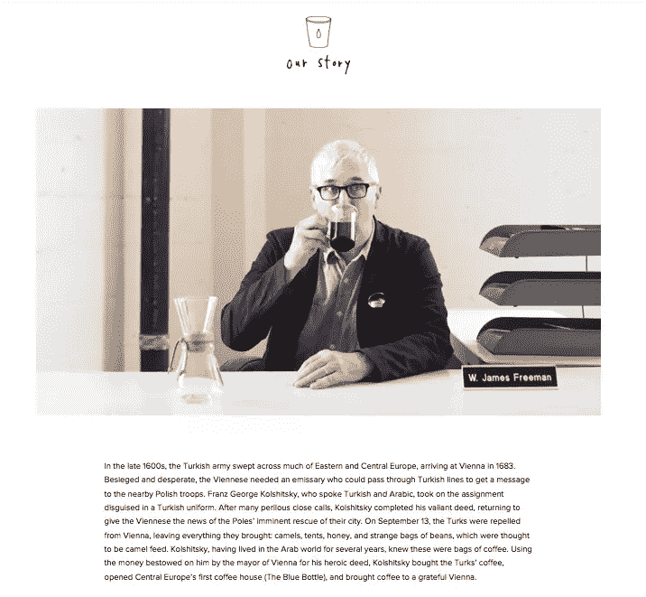

*来源:[蓝瓶咖啡——我们的故事](https://bluebottlecoffee.com/our-story)*

Blue Bottle 关于他们公司的页面是可读性如何胜过长度的完美例子。关于文案的一个常见误解是越短越好——但是不要混淆省略不必要的词和尽可能省略的艺术。

大多数公司都会回避这种拐弯抹角的公司描述。但是如果你向下滚动页面，这个故事有一个更聪明的目的。它描述了创始人如何受到启发，生产新鲜、无 BS、来源可靠的咖啡，将该品牌与其他“百味合一”咖啡店区分开来。

较长的内容是可以的，只要它是高度吸引人的，并且服务于一个目的。在这种情况下，复制创造了一种互动，导致更深的信任和可信度，这是[在设计中注入你的个性](http://alistapart.com/article/personality-in-design)的支柱之一。

### 利用人类的阅读模式

你还需要知道如何编排内容，以便于阅读。正如在[交互设计最佳实践第一卷](http://www.uxpin.com/interaction-design-best-practices-1.html)中所讨论的，长格式的内容大多受到了不好的评价，因为它的呈现方式没有层次和结构。这就是为什么你的布局和排版很重要。

就交互设计而言，根据阅读模式进行设计可以提高你对界面的熟悉程度(正如我们之前所描述的，这提高了[可学性](http://www.uxbooth.com/articles/when-is-learnability-more-important-than-usability/))。我们也可以通过观察 [FDA 如何重新设计他们的营养标签](http://uxmovement.com/content/readability-of-the-new-nutrition-label/)来检验扫描模式的重要性。

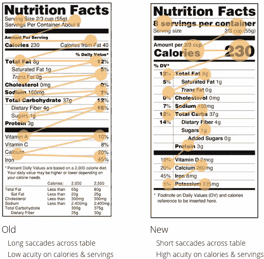

*来源:[新营养标签的可读性](http://uxmovement.com/content/readability-of-the-new-nutrition-label/)*

让我们从交互设计的[目标导向框架](http://johnnyholland.org/2011/11/goal-driven-design-decisions/)来看这个。

阅读营养标签有助于实现保持健康的目标。旧版本中过多的空白造成了阅读时的滞后时间。

从上面的例子可以看出，新的精简版更加精简，让读者更快更有效地处理信息。这种交互现在被简化了，减少了用户和他们的目标之间的障碍。

营养标签的另一个改进是不同的文本大小，这也证明了字体大小在区分重要信息的优先级方面的作用。

### 排印

如果缺乏排版，用户可能会从内容中分心，或者根本无法阅读。相反，一个精心设计的排版可以补充你的内容，并引导你的用户的眼睛到你想要的地方。iOS 人机界面指南列出了一些适用于任何设计的有用的排版技巧。

*   **文字必须始终清晰可辨——**“如果用户无法阅读你的应用程序中的文字，那么字体再漂亮也没用。”
*   **根据文本大小排列内容的优先顺序—**为了将读者的注意力吸引到更重要的文本上，可以将文本变大。请注意，在下面的例子中，邮件中与用户相关的部分(标题、正文)很大，而可选的细节(日期&时间、收件人)很小。电子邮件发件人也是蓝色的，有助于区分重要信息。
*   **测试所有大小的自定义字体–**如果您正在使用自定义字体，请小心。你会想在不同的尺寸下测试它，以确保它在每个尺寸下都清晰可辨。

## 记住显微镜的重要性

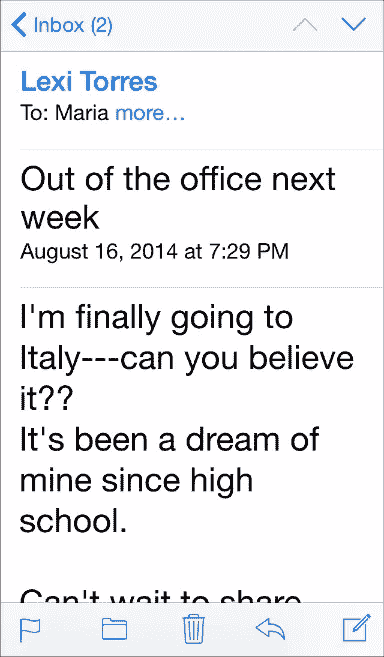

*来源: [iOS 人机界面指南](https://developer.apple.com/library/ios/documentation/UserExperience/Conceptual/MobileHIG/ColorImagesText.html#//apple_ref/doc/uid/TP40006556-CH58-SW1)*

重要的不仅仅是主要内容，次要副本(缩微副本)也不可忽视。作为对其价值的证明，用户界面工程的创始人 Jared M. Spool 讲述了一个微型拷贝调整如何使一个电子商务网站的利润每年增加 3 亿美元的故事。

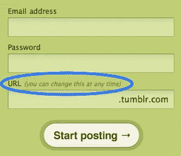

*来源:[文字缩微本](http://bokardo.com/archives/writing-microcopy/)*

简而言之，添加一个位置恰当、措辞恰当、简短的解释修补了结账页面上的一个问题。该页面的设计方式让很多用户感到困惑，因此他们更换了一个按钮，并添加了以下简单的 microcopy:

> 你不需要创建一个帐户在我们的网站上购物。
> 
> 只需点击*继续*即可进行结账。为了让您将来的购物更快捷，您可以在结账时创建一个帐户。

结果呢？采购量增加了 45%,年底获得了 3 亿美元的新利润。

尽管它的名字听起来很小，但 microcopy 可以对人们与你的网站或应用程序的交互方式产生巨大的影响。微拷贝的技巧在于知道说什么，在哪里说。

可用性测试可以帮助你确定哪里需要一些解释性文字或说明——就像 Spool 的例子一样——但你不需要一个 3 亿美元的错误就可以让 microcopy 为你所用。Hubspot 前 UX 总监约书亚·波特在他的博客 Bokardo 上列出了一些常见的缩微拷贝增补和更正:

*   **“低容量时事通讯”——**用户经常害怕他们的电子邮箱被垃圾邮件般的时事通讯淹没，从而阻止他们注册。向他们保证你的简讯数量合理。
*   **反垃圾邮件提醒–**与上面的建议相关，在电子邮件注册过程中添加一个简短的、感同身受的短语，如“我们和你一样讨厌垃圾邮件”,让你的用户放心，你不会用不必要的电子邮件轰炸他们。
*   **“随时取消订阅”**在用户注册之前，向他们解释您的取消政策，消除他们的恐惧。
*   免费试用–如果你提供免费试用，让大家都知道。如果广告做得好，你的免费试用会更好地履行其创造转化的职责，此外，如果付费客户在不知道有免费试用的情况下购买了产品，他们可能会对你不满。

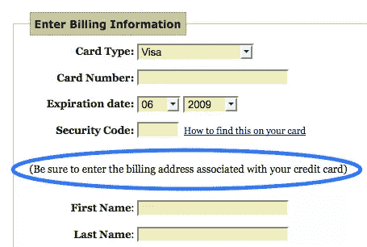

*来源:[文字缩微本](http://bokardo.com/archives/writing-microcopy/)*

microcopy 的好处通常属于给出指示或减轻用户的恐惧和担忧(这改善了他们在注册、签约等关键步骤上的交互)。).在你开始解构你的整个设计来解决一个特定的问题之前，试着添加或改变一些关键词，看看是否有帮助。

## 外卖

我们每个人内心都有一个莎士比亚和海明威，所以是时候开始工作了。你所需要做的就是遵循我们上面列出的指导方针，专注于你想要交流的内容。像一个必须帮助用户实现目标的人一样说话，并优化内容的可读性。

我们将用一句诗人的话来恰如其分地结束这篇文章。正如乔治·赫伯特曾经说过的，“良言价值高，成本低。”

如果你有兴趣深入钻研好的界面文案写作技巧，拿一本我的电子书[交互设计最佳实践:文字、视觉、空间](http://www.uxpin.com/interaction-design-best-practices-1.html)。视觉案例研究来自 30 多家公司，包括谷歌、AirBnB、脸书和雅虎。

## 分享这篇文章