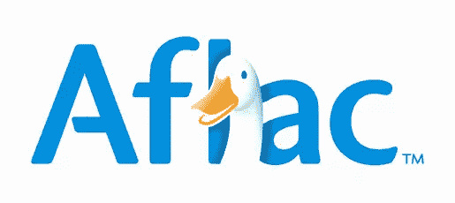
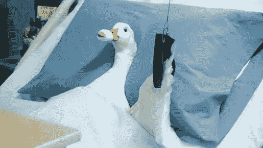
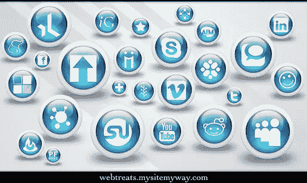
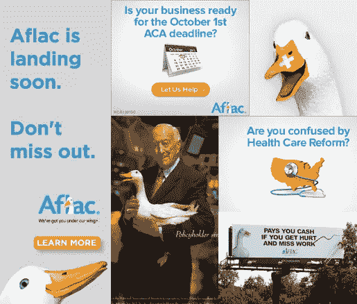

# 作为自由设计师，创建一个统一的跨媒体故事

> 原文：<https://www.sitepoint.com/create-unified-transmedia-story-freelance-designer/>

哦太好了。在广阔的网络世界中，还有一个词需要学习，更不用说另一个营销术语了。像大多数自由设计师一样，你可能只想专注于设计！然而，创造一个统一的跨媒体故事是非常重要的，至少值得花时间阅读这篇文章。

那么什么是“跨媒体”呢？简而言之，这是一条跨越多种媒介的信息——比如你的网站(桌面和移动)、社交媒体、印刷媒体，以及你的自由职业业务出现的任何地方。Aflac duck 是一个很好的例子，让我们先回顾一下作为一名自由平面或网页设计师，你是如何让跨媒体讲故事的:

### 案例研究:受伤的鸭

Aflac 已经花费了数亿美元创造了一个我们都知道的角色，简称为鸭子。在 2013 年 1 月的 BCS 全国冠军赛期间——历史上最受关注的美国橄榄球大学比赛——Aflac 揭示了他们故事中的一个转折:鸭子受伤了。

他们为这条新的故事线创造了一种跨媒体的方式:你可以去 GetWellDuck.com，给鸭子送去你康复的祝福。你可以去脸书看看鸭子。医生们在电视上发布了有关他健康状况的最新报道。

Aflac 的品牌故事是一个保险提供商的故事。当心爱的鸭子受伤时，在整个故事中，无论媒体如何，你都会看到 Aflac 的价值陈述——感谢上帝，鸭子有 Aflac，所以他可以继续支付账单！

Aflac 做得很好，不仅创造了一个可以很好翻译的跨媒体故事，他们还将所有媒体的努力都转移到了这个故事上。这有助于从邮件中删除分散注意力的故事或不一致(不太有效)的旧故事。他们的品牌价值自始至终都很明显，他们实际上讲述了一只鸭子的故事，你希望它能很快康复。

将你的自由设计故事传达给你的目标受众可能是一个严峻的挑战，尤其是在当今混合媒体的世界里。但是跨媒体的概念是为了消除媒体的混杂，为你的信息创造一个统一的战线。以下是一些创建一个清晰、集中的“故事”的技巧，比如 Aflac，通过这个故事，你的目标受众有望吸引并最终选择你，而不是网上成千上万的其他设计师:

### 了解你自己的故事

首先，你必须知道你想讲述的关于你自己或你的企业的“故事”。基本上，你的故事包括什么使你与众不同，与你的竞争对手不同，你为你的客户解决了什么主要的价值或问题。你不需要想出一个像 Aflac 鸭那样复杂的故事。作为一名设计师，你只需要想出围绕你的信息。

但是请记住，你让你的观众参与的越多，他们就越有可能使用你的服务。

你可能想从你的专业开始。你的专长领域是什么？是 logo 设计，网页设计等？然后你可以看看你做的和其他分享你利基专长的设计师有什么不同。你带来了什么别人没有的东西？是独特的插图吗？自定义字体？或者也许你只是有一种通过图形帮助客户理解他们自己的故事的诀窍。

在所有这些方面，也要确保你的客户能够很容易地理解你为他们解决了什么问题。

你还需要决定你是将自己作为，嗯，你自己还是作为一个设计公司来营销。一些设计师选择用他们的名字创建一个自由职业者的生意，并以此进行营销，以显得更加个人化和平易近人。

其他人选择创造一个更正式的企业名称，看起来更强大和合法。无论你走哪条路，从现在开始，这必须是你的品牌，你要在所有的营销活动中坚持下去。

### 定义你的目标受众

在你为你的品牌进入一个跨媒体故事之前，你必须定义你的目标受众。这将帮助你更有效地为他们量身定制故事和媒体选择。

你不必有单一的目标受众。您可以定义多个目标，并相应地定制故事。

请理解，野兽的本质是人们不容易被单一的客户类型分类，因此您可能会将一种定义的客户与另一种定义的客户混合在一起。即使细微差别有所变化，也要确保你的故事前后一致。

帮助定义目标受众的一个方法是创建一个列表。记住你自己的故事——我们在上面讨论过的那个——然后创建一个快速列表，列出你想到的可能有你能解决的那种问题的每个人。

开始宽泛，例如，“没有标识的创业公司”和“需要品牌改造的老企业”。然后获取更多详细信息，开箱即用。你也能帮助个人吗？有没有特定的行业甚至特定的地区是你最能帮助的？你现在可能只能宽泛地定义你的受众，这没关系。随着你赢得越来越多的客户，你将能够回到这一步，如果需要的话，重新聚焦。

### 知道如何吸引你的观众

有了明确的目标受众(至少是广义的)，你现在可以决定他们如何最好地发现和参与你的故事。例如，假设有人通过你在一个小组中创建的 LinkedIn 帖子看到了你的设计服务。你的目标受众中的另一个小众群体可能会对推文或电子邮件做出最好的回应。可能需要做一些实验来找出对你和你的观众最有效的方法。

你可能也想考虑这样一个事实，即许多潜在客户在联系你报价之前会寻找你的工作的评论。一定要鼓励当前的客户给你的网站或者像 Yelp 这样的网站或者你的脸书或者 Google+页面留下评论。如果你在美国或加拿大，在[商业促进局](http://www.bbb.org/)注册。如果你有负面评论，礼貌地回应，私下联系评论者，看看你是否能纠正它。尽管如此，一些负面评价实际上对自由设计师也是有益的，尤其是如果你有很多正面评价的话。

它只是向观众展示你是真实的，有人情味的。

### 通过各种媒体形式定义故事

*图片来源:[webtreats](http://www.flickr.com/photos/44071822@N08/4390635960/)via[Compfight](http://compfight.com)[cc](http://creativecommons.org/licenses/by/2.0/)*

一旦潜在的设计客户参与进来——这可能需要点击一篇文章中的链接，在谷歌上搜索你，或者点击一个广告，等等——你的故事必须继续下去，不管媒体是什么。有时你无法控制媒体。你的广告可能会出现在他们手机或桌面上的电子邮件中。

您的基于文本的广告可能会在脸书的移动设备上显示，或者在他们在家用电脑上网时显示。或者他们可能在访问你的网站之前就看到你在 Google+上的推文或帖子。所以无论涉及哪种媒体，你的故事都必须是一致的。

从印刷品到手机再到电子邮件——你的故事必须清晰明了，对客户有价值。这个价值就是你用你独特的方式为他们解决的问题。虽然你可能用词有点不同，或者你的帖子风格可能在不同的社交媒体上有所不同，但要确保你总是有相同的基本故事。

是的，你与潜在客户互动的地方肯定意味着稍微不同的受众，这反过来意味着稍微不同的方法。但是他们必须能够很快很容易地认出你，不管他们是否有一天在推特上偶然发现你，然后第二天在谷歌上搜索。

如果做得好，正如 Aflac 的例子所示，跨媒体讲故事可以成为一种强有力的方式，促进你与网络甚至公众的互动，并建立强有力的联系。如果你的自由职业者品牌需要更多的东西来引起注意，尝试跨媒体活动。

或者简单地看看你的信息在你的听众可能遇到的每种媒体上的一致性。确保你的故事适用于所有媒体，并让你的观众积极参与，你很可能会超越你已经达到的高原。

## 分享这篇文章