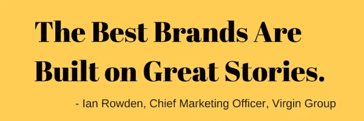
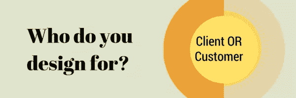
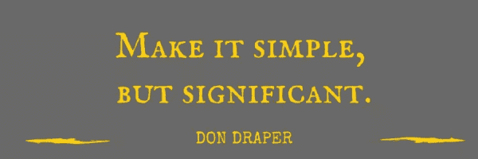

# 创建品牌形象:开始前必须问的问题

> 原文：<https://www.sitepoint.com/creating-a-brand-identity-20-questions/>

弗兰克·汉密尔顿的照片

> “不，这看起来不太对劲”。

当客户这么说的时候你会怎么做？尤其是当它是关于你在一周的辛勤劳动后刚刚寄出的设计时。

对于设计师来说，最糟糕的客户是那些不知道自己想要什么的人。这些人没有给出明确的指示，要求多次修改，并坚持说他们“看到它时就知道它是正确的”。

作为设计师，我们不仅负责提供 pdf、psd 或。svg 也是为了传递与这些视觉效果的无形联系。

当与缺乏清晰度的客户一起工作时，它会变得令人讨厌。帮助客户实现这种清晰是我们工作的一部分。

> 我们工作的一部分是帮助客户明确他们的品牌身份。

你不想陷入设计迭代的多重循环中，希望客户喜欢你的作品。或者尝试不同深浅的蓝色。

为了避免以后胃灼热——提前完成工作。在最终确定项目之前，向潜在客户询问直接而详细的问题。这将让你一窥他们对自己的业务、前景和品牌身份有多清楚。利用这个你可以判断需要握多少手，并做出关键的决定:你愿意投入时间和精力吗？

除了制定[清晰的品牌标识](http://justcreative.com/2010/04/06/branding-identity-logo-design-explained/)之外，您还可以设计问题，以利用一些间接优势，如:

*   激发客户的信心和信任:你是一个彻底的专业人士，并且正在努力理解他们的业务和需求。如果企业主还没有考虑这些问题，他们会感谢它带来的指导和清晰。这也软化了他们一点，以开放的价格，你在你的建议。
*   节省时间和精力:你可以剔除那些不值得你花时间考虑的客户。对于参与进来的客户来说，这有助于避免项目过程中不必要的修改和争议。
*   **交付更好，成长更多**:你可以更好地适应你的客户，打造最符合客户需求的品牌形象。快乐的客户更有可能给你热情的推荐和更多的推荐工作。

为了让你更容易理解，我们总结了设计师在开始实际设计之前，甚至在签约项目之前，应该问潜在客户的最基本的问题。

## 关于生意

设计是一个非常主观的过程。你需要与你的客户密切合作，了解他们的业务以及他们想要的发展方向。

**1。你的企业/产品是做什么的？**请记住，这不是他们的公司“关于”页面。相反，这应该与他们的电梯间推介一致。如果他们只有 30 秒的时间向顾客解释他们的产品，他们会说什么？

**2。你为你的顾客解决什么问题？**他们存在的目的是什么(除了赚钱)？如果一个企业不能解决问题或满足顾客的需求，那么它就不值得存在。

**3。你的 3 个主要竞争对手是谁(直接或间接)？你喜欢他们的哪一点？你不喜欢他们品牌标识的哪些方面？**了解你的竞争对手和行业规范是有好处的。了解他们，向他们学习，但不要模仿他们。做好自己的事。

**4。你的背景、产品或服务的哪些方面让你从竞争对手中脱颖而出？为什么你的潜在客户应该向你购买或与你接洽？**如今的消费者选择太多了。如果你的客户不能用一两句话描述他们的 USP 是什么，引导他们到 Kissmetrics 的[这个解释，并帮助他们定义他们的 USP。](https://blog.kissmetrics.com/unique-selling-proposition/)

**5。你的企业或企业名称或标志背后有没有一个独特的故事？**人们通过故事联系在一起。讲故事是创造和销售品牌形象的有效方式。找出业务、产品和客户背后的故事。[故事创造顾客](http://thestoryoftelling.com/story-creates-customer/)。下面是[如何讲述一个伟大的品牌故事](http://www.quicksprout.com/the-beginners-guide-to-online-marketing-chapter-3/)。

在下面的视频中，Elio Qoshi 教你设计一个出色的标志所需要的重要的经验法则，这个视频可以作为我们素描课程的介绍视频。你可以浏览整个课程，[用这些技巧和窍门提高你的素描效率，这里](https://www.sitepoint.com/premium/courses/design-essentials-with-sketch-2949)。

**6。分享 5 个最能描述贵公司的形容词或单词。**我喜欢这种简单。他们选择的词语传达了很多关于他们如何看待自己，或者他们想要如何看待自己的意思。

## 关于项目

下一部分与手头的项目有关。深入了解他们真正需要什么，以及为什么需要。这有助于从一开始就设定明确的预期，并避免后来的范围蔓延或激烈的争论。

**7。品牌形象的可交付成果是什么？最好清楚地记录下你的交付成果是什么。[品牌标识非常广泛](http://www.carboncreative.net/services/branding/visual-identity/)，可以包括文具、标识、网站、产品包装、营销宣传材料等。**

**8。您当前的任何材料需要更新以匹配新的品牌标识吗？**这些在初始阶段经常被忽视。为了避免最后一分钟的范围蔓延，确保要求客户清楚地说明任何和所有必须更新的现有材料。

**9。谁是这个项目的决策者？做决定的周转时间是多少？**在一份详尽的调查问卷和详细的提案之后，你不想发现你在和一个必须做出决定的人的助理的助理谈话，并且必须再次重复整个过程！

10。你对这个项目的时间表有什么看法？你的预算是多少？考虑到您的其他承诺和这个项目的范围，您能在要求的时间框架内交付这个项目吗？如果他们的预算太低，或者时间太短，你可以礼貌地提前拒绝，不要花时间和精力去写提案。

## 关于他们的顾客

> 你到底应该为谁设计？你的客户还是他们的顾客？

虽然你的客户必须批准你的设计并为此付费，但他们的收入反过来来自他们的顾客。设计师经常试图打动和取悦他们的客户——调整设计以适应他们的颜色偏好、品味等。然而，客户不是设计必须影响和左右的人。你的设计必须吸引最终客户。

**11。描述一下你的理想客户？**向其他企业销售不同于向消费者销售。品牌形象应该考虑到这一点。如果他们已经有了一个理想的客户档案，你可以要求他们分享。如果没有，询问人口统计的细节以及心理分析或故事。这里有一个来自 Bidsketch 的[练习，你可以指导他们创建自己的 ICP。](https://blog.bidsketch.com/clients/customer-profile-template/)

**12。你想向顾客传达的主要信息是什么？**这不必是[只是一个口头信息](http://www.brandingstrategyinsider.com/2014/11/focus-your-brand-on-cause-not-effect.html#.VSzaGvmUdzo)。这是关于他们希望客户每次与企业互动时的感受。每次你提到 iPhone，人们会有什么感觉？

13。分享 5 个最能描述你理想客户的形容词或单词。他们是否足够了解自己的客户，能够用几句简短的话来描述他们？如果没有，你将不得不做一些手把手，以帮助他们更好地了解他们的客户。

**14。你有什么关于你的理想客户或你的产品/业务的市场调查可以和我们分享吗？**市场调查通常很敏感。在他们分享任何此类信息之前，主动签署一份保密协议，这将有助于传达你对此是认真的，是可以信任的。

## 关于身份

上述问题构成了本节的基础。只有当你理解了你的客户和他们的顾客，开始谈论品牌形象才有意义。

15。这个练习背后的目的是什么？为什么是现在？没有人醒来后会说‘哦，我今天必须为公司创造一个新的品牌形象’。这是经过深思熟虑和努力的结果。询问你的客户想从这个练习中获得什么，他们的最终目标是什么。

16。如果你有一个现有的品牌/身份，为什么它没有为你工作？这将有助于您了解哪些地方不工作，他们的痛点是什么，以及您需要在新设计中修正/改进哪些地方。这里有一些[你需要避免的常见品牌错误](http://www.entrepreneur.com/article/231966)。

**17。关于颜色和品牌标识的其他元素，你有具体的指导方针吗？**如果你需要坚持一些预定义的品牌标识公司准则，最好提前知道，而不是在你花了几个小时为你的新设计设计出颜色组合之后。

18。请分享三个品牌的链接，这些链接的品牌标识对您有启发。你最喜欢他们什么？这可能会变得棘手。客户通常无法用语言表达为什么某个品牌或标志吸引他们。例如，以[的旅程为例，SitePoint logo](https://www.sitepoint.com/sitepoints-new-logo-and-the-story-behind-it/) 。设计的简洁是大量辛勤工作和协作的结果。不是所有的客户都能够理解和表达这些细微差别。你可能需要帮助他们度过难关。

**19。请分享 3 个您认为薄弱的品牌/标志，以及是什么让您有这种感觉。**同样，这将是一件主观的事情。如果你需要一些例子来展示它们，[到这里](http://www.businessinsider.in/The-15-Worst-Corporate-Logo-Fails/articleshow/28692170.cms)。

20。用 5 个形容词或短语描述你的品牌期望的外观和感觉。话语承载着巨大的力量。当客户描述他们想要的东西时，要透过表面去了解他们真正的意思。他们想在顾客身上唤起的隐藏的欲望和感觉是什么。

## 摘要

这可能看起来是一个很长的问题列表，但是通过让客户预先回答这些问题，你可以节省自己很多时间和精力。这会帮助你剔除不合适的客户。那些寻找快速、廉价工作的人不会费心去填写。那些给出简短、粗略答案的人仍在试水，不确定他们是谁，代表什么。你必须手把手地帮助他们，帮助他们首先规划出一个商业身份和战略。那些做了功课，知道他们想要什么，他们的客户是谁，他们的客户的核心愿望和感受是什么的人，将能够轻松地填写问卷。与一个对他们的业务和目标有清晰认识的客户一起工作会让你的任务变得容易得多。

在签约一个项目之前，你的流程是什么？您是否使用类似的调查问卷来鉴定客户和项目？

### 下载品牌识别问卷

显然，在第一次会见客户时就准备好这些问题是很重要的。我们将问题放入可打印、可重复使用的 PDF 中，让您的工作变得更加轻松。

下载[品牌认同问卷(PDF)](https://uploads.sitepoint.com/wp-content/uploads/2015/04/1430367048BrandIdentityQuestionnaire.pdf) 。

## 分享这篇文章