# 使用 Firebase 为您的 iOS 应用程序创建后端

> 原文：<https://www.sitepoint.com/creating-a-firebase-backend-for-ios-app/>

[Firebase](https://firebase.google.com/) 是一个后端即服务平台，可以帮助您快速开发和部署应用。它提供了大量的功能，包括实时数据库、认证(使用电子邮件和密码、脸书、Twitter、GitHub 和谷歌)、云消息、存储、托管、远程配置、测试实验室、崩溃报告、通知、应用程序索引、动态链接、邀请、AdWords 和 AdMob。

在本文中，我们将创建一个简单的应用程序，展示如何从 Firebase 保存和检索数据，如何验证用户，设置数据的读/写权限，以及在服务器上验证数据。

## 入门指南

要开始，首先[下载](https://github.com/sitepoint-editors/firebase-with-ios)包含我们将在教程中使用的 starter 项目的库，然后前往 [Firebase](https://firebase.google.com/) 并创建一个帐户(如果你还没有)。

当您运行下载的项目时，您将看到一个登录视图。


登录视图有一个注册按钮，点击它可以进入注册视图；在这个视图中，有一个注册表单和一个登录按钮，您可以返回到登录视图。

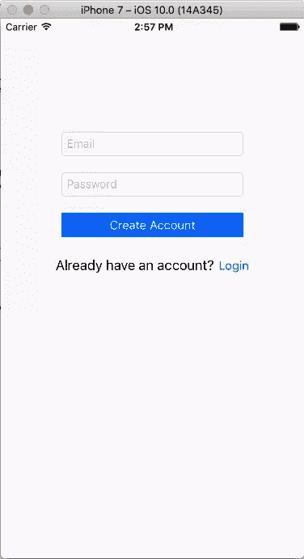

要将 Firebase 库添加到项目中，我们将使用 CocoaPods。首先确保你的电脑上已经安装了 CocoaPods。

打开终端，用 *cd Path/To/ToDo\ App* 导航到下载项目的根目录(`\`转义目录名中的空格)。

使用以下命令创建一个 Podfile。

```
pod init
```

然后使用以下命令打开 Podfile:

```
open -a Xcode Podfile
```

修改文件的内容，如下所示。

```
platform :ios, '10.0'

target 'ToDo App' do
  use_frameworks!

  pod 'Firebase/Auth'
  pod 'Firebase/Database'

end
```

Firebase 库由不同的[子物种](https://firebase.google.com/docs/ios/setup#available_pods)组成。在上面，我们包括了用于认证的`/Auth`子空间和用于 Firebase 实时数据库的`/Database`子空间。您的应用程序需要使用`/Core`子空间才能使用 Firebase，但是我们不必将它包含在 Podfile 中，因为我们添加的子空间依赖于它。因此，当我们运行`pod install`来获取项目的依赖项时，也会获取`/Core`库。

运行`pod install`来获取项目的依赖项。安装完成后，关闭 Xcode 项目，打开 *ToDo App.xcworkspace* 。

接下来，前往 [Firebase 控制台](https://console.firebase.google.com/)并点击*创建新项目*按钮。将弹出一个对话框，让您输入项目的详细信息。输入项目的名称和国家/地区。

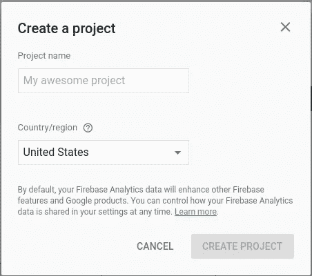

国家/地区代表您的组织/公司所在的国家/地区。您的选择也为您的收入报告设置了适当的货币。在为项目设置名称(我用 ToDoApp)和区域后，点击*创建项目*按钮。将创建一个项目，并打开其控制台。从项目的控制台，点击*添加 Firebase 到你的 iOS 应用*选项。然后在弹出的窗口中输入你的 iOS 项目数据。

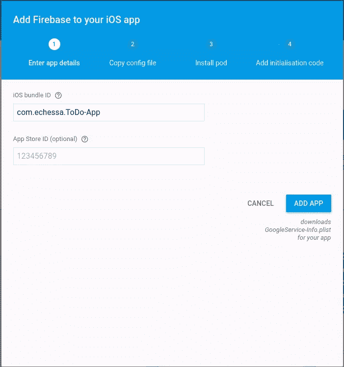

我们将把 *App Store ID* 字段留空，但是如果你正在将 Firebase 集成到 App Store 上的一个应用中，你可以在你的应用的 URL 中找到 ID。在下面的例子中，`123456789`是应用商店 ID。`https://itunes.apple.com/gb/app/yourapp/id123456789`

点击*添加应用*按钮，一个 *GoogleService-Info.plist* 文件将被下载到你的机器上。将文件移动到 Xcode 项目的根目录，并将其添加到所有目标。

plist 文件包含 iOS 应用程序与 Firebase 服务器通信所需的配置设置。它包含 Firebase 项目的 URL、API 密钥等内容。在 Firebase 的早期版本中，您必须手动将这些内容存储在您的应用程序代码中，但现在这个过程已经简化，只需使用一个包含所需数据的文件。

如果您正在使用版本控制并将您的代码存储在公共存储库中，您应该考虑不要将 *GoogleService-Info.plist* 公开。如果使用超过极限，它将停止工作，如果你是一个付费计划，你不会希望任何人滥用它，并运行你的成本。

在 Firebase 控制台上，按*继续*在项目设置中前进。

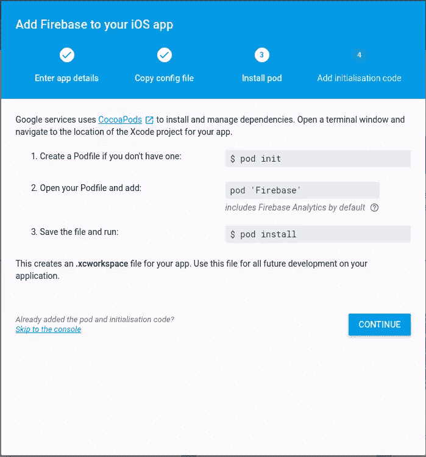

我们已经完成了上述步骤，所以点击*继续*。

按照对话框最后一页的说明，将 Firebase 初始化代码添加到您的 *AppDelegate* 类中。当应用程序启动时，它会连接到 Firebase。

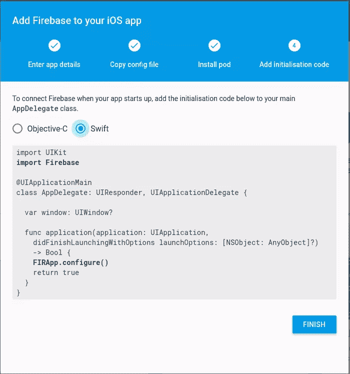

将以下导入添加到 *AppDelegate.swift*

```
import Firebase
```

然后将以下内容添加到`application(_: didFinishLaunchingWithOptions:)`中，在`return`语句之前。

```
FIRApp.configure()
```

在 Firebase 控制台上，单击 *Finish* 完成项目设置。

## 安全性和规则

在从 Firebase 服务器检索和保存数据之前，我们将设置身份验证并添加规则来限制对数据的访问，并在保存之前验证用户输入。

### 证明

Firebase API 允许您设置电子邮件/密码、脸书、Twitter、GitHub、Google 和匿名认证。在我们的应用中，我们将使用电子邮件/密码认证。

要启用电子邮件/密码验证，请从 Firebase 控制台的左侧面板中选择*验证*，并导航到*登录方法*选项卡。启用*电子邮件/密码*认证提供者，点击*保存*。

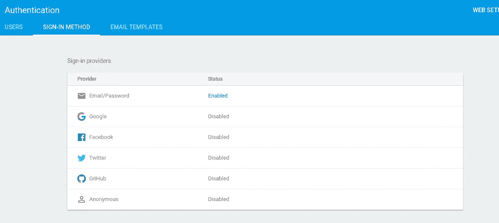

回到 Xcode，修改*loginview controller . swift*，如图所示。

```
import UIKit
import FirebaseAuth

class LoginViewController: UIViewController {

    @IBOutlet weak var emailField: UITextField!
    @IBOutlet weak var passwordField: UITextField!

    override func viewDidAppear(_ animated: Bool) {
        super.viewDidAppear(animated)

        if let _ = FIRAuth.auth()?.currentUser {
            self.signIn()
        }
    }

    @IBAction func didTapSignIn(_ sender: UIButton) {
        let email = emailField.text
        let password = passwordField.text
        FIRAuth.auth()?.signIn(withEmail: email!, password: password!, completion: { (user, error) in
            guard let _ = user else {
                if let error = error {
                    if let errCode = FIRAuthErrorCode(rawValue: error._code) {
                        switch errCode {
                        case .errorCodeUserNotFound:
                            self.showAlert("User account not found. Try registering")
                        case .errorCodeWrongPassword:
                            self.showAlert("Incorrect username/password combination")
                        default:
                            self.showAlert("Error: \(error.localizedDescription)")
                        }
                    }
                    return
                }
                assertionFailure("user and error are nil")
            }

            self.signIn()
        })
    }

    @IBAction func didRequestPasswordReset(_ sender: UIButton) {
        let prompt = UIAlertController(title: "To Do App", message: "Email:", preferredStyle: .alert)
        let okAction = UIAlertAction(title: "OK", style: .default) { (action) in
            let userInput = prompt.textFields![0].text
            if (userInput!.isEmpty) {
                return
            }
            FIRAuth.auth()?.sendPasswordReset(withEmail: userInput!, completion: { (error) in
                if let error = error {
                    if let errCode = FIRAuthErrorCode(rawValue: error._code) {
                        switch errCode {
                        case .errorCodeUserNotFound:
                            DispatchQueue.main.async {
                                self.showAlert("User account not found. Try registering")
                            }
                        default:
                            DispatchQueue.main.async {
                                self.showAlert("Error: \(error.localizedDescription)")
                            }
                        }
                    }
                    return
                } else {
                    DispatchQueue.main.async {
                        self.showAlert("You'll receive an email shortly to reset your password.")
                    }
                }
            })
        }
        prompt.addTextField(configurationHandler: nil)
        prompt.addAction(okAction)
        present(prompt, animated: true, completion: nil)
    }

    func showAlert(_ message: String) {
        let alertController = UIAlertController(title: "To Do App", message: message, preferredStyle: UIAlertControllerStyle.alert)
        alertController.addAction(UIAlertAction(title: "Dismiss", style: UIAlertActionStyle.default,handler: nil))
        self.present(alertController, animated: true, completion: nil)
    }

    func signIn() {
        performSegue(withIdentifier: "SignInFromLogin", sender: nil)
    }

}
```

在上面的代码中，我们首先检查用户是否在`viewDidAppear()`中登录。`FIRAuth.auth()?.currentUser`给出认证用户(如果有的话)。用户由一个`FIRUser`对象表示。如果他们登录了，我们调用`signIn()`，它执行一个已经在故事板文件中创建的序列。这个片段导航到 *ItemsTableViewController* ，这是我们的项目列表将被显示的地方。

`didTapSignIn()`将用户的输入发送到 Firebase 进行认证。`FIRAuth.auth()?.signIn(withEmail: password: completion:)`用于登录使用电子邮件和密码组合的用户。每个认证提供者(如谷歌、脸书、Twitter、Github 等)使用不同的方法调用。

当用户成功认证后，调用`signIn()`，否则将向用户显示一条错误消息。如果认证失败，从服务器返回一个`NSError`对象。它带有一个[错误代码](https://firebase.google.com/docs/storage/ios/handle-errors)，您可以用它来确定错误的原因，并给用户一个适当的错误消息。在上面的代码中，当用户输入一个不存在的帐户或输入错误的密码时，我们给出不同的错误消息。对于其他错误，我们用`error.localizedDescription`向用户显示错误描述。在一个真正的应用程序中，你可能不想向用户展示这个。`error.localizedDescription`返回的消息最适合开发人员在调试时使用，但是对于您的用户，您应该使用更好的全面错误消息。

点击*忘记密码*按钮，调用`didRequestPasswordReset()`。这里，我们创建了一个警告框，用户可以使用它来输入一个电子邮件地址，密码重置电子邮件将发送到该地址。这是 Firebase 提供的众多优势之一。已经设置了密码重置功能；你不必自己编写代码。

如果查看*认证>邮件模板*下的 Firebase 控件，可以修改发送给用户的*邮件地址验证*、*密码重置*和*邮件地址更改*的邮件消息。

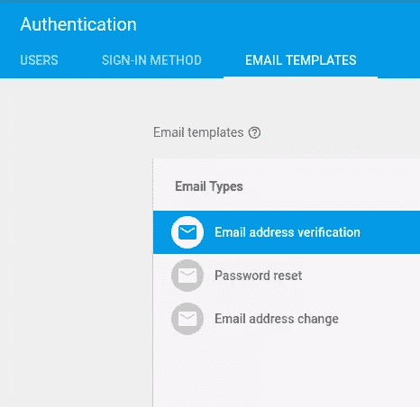

注意，在上面的代码中，通过使用`DispatchQueue.main.async`在主线程中调用警报，而不是在处理回调函数的后台线程中。任何更新应用程序 UI 的代码都应该在主队列中运行。

为了测试密码重置功能，您可以在 Firebase 控制台上的*身份验证>用户>添加用户*下创建一个用户。输入用户的电子邮件和密码(如果您想要接收密码重置电子邮件，请使用真实的电子邮件)。

回到 Xcode，运行项目。您应该能够输入一个电子邮件，并有密码重置电子邮件发送给它。


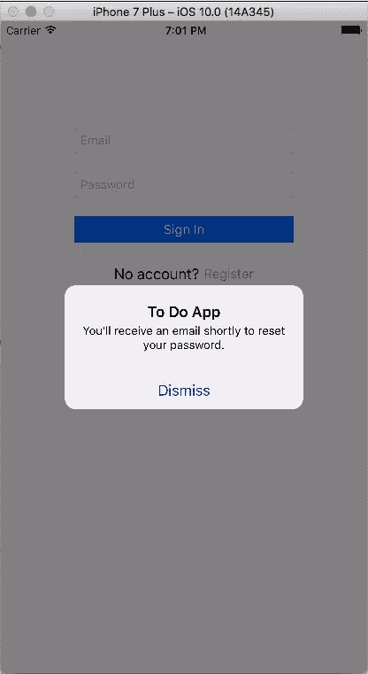

登录功能完成后，现在让我们添加注册功能。修改 *SignUpViewController* 如图所示。

```
import UIKit
import FirebaseAuth

class SignUpViewController: UIViewController {

    @IBOutlet weak var emailField: UITextField!
    @IBOutlet weak var passwordField: UITextField!

    @IBAction func didTapSignUp(_ sender: UIButton) {
        let email = emailField.text
        let password = passwordField.text
        FIRAuth.auth()?.createUser(withEmail: email!, password: password!, completion: { (user, error) in
            if let error = error {
                if let errCode = FIRAuthErrorCode(rawValue: error._code) {
                    switch errCode {
                    case .errorCodeInvalidEmail:
                        self.showAlert("Enter a valid email.")
                    case .errorCodeEmailAlreadyInUse:
                        self.showAlert("Email already in use.")
                    default:
                        self.showAlert("Error: \(error.localizedDescription)")
                    }
                }
                return
            }
            self.signIn()
        })
    }

    @IBAction func didTapBackToLogin(_ sender: UIButton) {
        self.dismiss(animated: true, completion: {})
    }

    func showAlert(_ message: String) {
        let alertController = UIAlertController(title: "To Do App", message: message, preferredStyle: UIAlertControllerStyle.alert)
        alertController.addAction(UIAlertAction(title: "Dismiss", style: UIAlertActionStyle.default,handler: nil))
        self.present(alertController, animated: true, completion: nil)
    }

    func signIn() {
        performSegue(withIdentifier: "SignInFromSignUp", sender: nil)
    }

}
```

在上面的代码中，当用户点击*创建账户时*按钮`didTapSignUp()`被调用。这里，我们接受用户的输入并调用`FIRAuth.auth()?.createUser(withEmail: password: completion:)`来尝试用输入的详细信息创建一个帐户。如果注册失败，显示错误消息，否则调用`signIn()`执行到 *ItemsTableViewController* 的程序。这个片段已经在 starter 项目的 storyboard 文件中创建。

运行应用程序。您应该能够在 Firebase 控制台上创建一个帐户并确认它的创建。如果您之前已经登录，因此无法进入登录视图，您可以使用*模拟器>重置内容和设置*来重置模拟器。

默认情况下，Firebase 对密码的可接受长度设置了一个规则——密码长度必须至少为 6 个字符。你可以在 Firebase 控制台上设置更多的规则。很快，我们将看到如何建立规则。更多信息请点击。

### 授权和数据验证

Firebase 实时数据库提供了一种基于表达式的规则语言，具有类似 JavaScript 的语法，可以轻松定义数据的结构、索引方式以及数据的读写时间。结合我们的身份认证服务，您可以定义谁有权访问哪些数据，并保护您用户的个人信息免受未经授权的访问。

我们已经为我们的项目设置了身份验证，但是我们可以通过为它定义一些规则来使用户数据更加安全。

默认情况下，通过在控制台上导航到*数据库>规则*，Firebase 具有以下可查看的规则。

```
{
  "rules": {
    ".read": "auth != null",
    ".write": "auth != null" } }
```

上述安全规则要求用户通过身份验证才能在数据库中读取或写入任何数据。如图所示修改规则并点击*发布*。

```
{
  "rules": {
    "users": {
      "$uid": {
        ".read": "auth != null && auth.uid == $uid",
        ".write": "auth != null && auth.uid == $uid",
        "items": {
          "$item_id": {
            "title": {
              ".validate": "newData.isString() && newData.val().length > 0" } } } } } } }
```

在上图中，`auth != null && auth.uid == $uid`已经被设置了读写权限。根据这个规则，用户不仅需要通过身份验证才能在数据库中读取或写入任何数据，而且只能访问自己的数据。

Firebase 以 JSON 格式存储数据。在我们的数据库中，每个用户都有一个名为`items`的待办事项数组。每个`item`都会有一个`title`。在上面的代码中，我们添加了一些验证来确保标题为空的项目不会被保存。

## 保存数据

完成身份验证和授权后，我们现在将了解如何在 Firebase 中保存和检索数据。

首先创建一个名为`Item.swift`的新文件，如图所示修改它。这将是`Item`模型类，每个`Item`将有一个`title`和`ref`，它们将持有一个`FIRDatabaseReference`对象。一个`FIRDatabaseReference`表示 Firebase 数据库中的一个特定位置，可以用来读取或写入数据到 Firebase 数据库位置。

```
import Foundation
import FirebaseDatabase

class Item {

    var ref: FIRDatabaseReference?
    var title: String?

    init (snapshot: FIRDataSnapshot) {
        ref = snapshot.ref

        let data = snapshot.value as! Dictionary<String, String>
        title = data["title"]! as String
    }

}
```

然后修改 *ItemsTableViewController* 如图所示。

```
import UIKit
import Firebase

class ItemsTableViewController: UITableViewController {

    var user: FIRUser!
    var items = [Item]()
    var ref: FIRDatabaseReference!
    private var databaseHandle: FIRDatabaseHandle!

    override func viewDidLoad() {
        super.viewDidLoad()

        user = FIRAuth.auth()?.currentUser
        ref = FIRDatabase.database().reference()
        startObservingDatabase()
    }

    // MARK: - Table view data source

    override func numberOfSections(in tableView: UITableView) -> Int {
        return 1
    }

    override func tableView(_ tableView: UITableView, numberOfRowsInSection section: Int) -> Int {
        return items.count
    }

    override func tableView(_ tableView: UITableView, cellForRowAt indexPath: IndexPath) -> UITableViewCell {
        let cell = tableView.dequeueReusableCell(withIdentifier: "Cell", for: indexPath)
        let item = items[indexPath.row]
        cell.textLabel?.text = item.title
        return cell
    }

    override func tableView(_ tableView: UITableView, commit editingStyle: UITableViewCellEditingStyle, forRowAt indexPath: IndexPath) {
        if editingStyle == .delete {
            let item = items[indexPath.row]
            item.ref?.removeValue()
        }
    }

    @IBAction func didTapSignOut(_ sender: UIBarButtonItem) {
        do {
            try FIRAuth.auth()?.signOut()
            performSegue(withIdentifier: "SignOut", sender: nil)
        } catch let error {
            assertionFailure("Error signing out: \(error)")
        }
    }

    @IBAction func didTapAddItem(_ sender: UIBarButtonItem) {
        let prompt = UIAlertController(title: "To Do App", message: "To Do Item", preferredStyle: .alert)
        let okAction = UIAlertAction(title: "OK", style: .default) { (action) in
            let userInput = prompt.textFields![0].text
            if (userInput!.isEmpty) {
                return
            }
            self.ref.child("users").child(self.user.uid).child("items").childByAutoId().child("title").setValue(userInput)
        }
        prompt.addTextField(configurationHandler: nil)
        prompt.addAction(okAction)
        present(prompt, animated: true, completion: nil);

    }

    func startObservingDatabase () {
        databaseHandle = ref.child("users/\(self.user.uid)/items").observe(.value, with: { (snapshot) in
            var newItems = [Item]()

            for itemSnapShot in snapshot.children {
                let item = Item(snapshot: itemSnapShot as! FIRDataSnapshot)
                newItems.append(item)
            }

            self.items = newItems
            self.tableView.reloadData()

        })
    }

    deinit {
        ref.child("users/\(self.user.uid)/items").removeObserver(withHandle: databaseHandle)
    }
}
```

在上面，我们从实例化`viewDidLoad()`中的一些变量开始。我们用登录用户的值设置`user`，然后用一个`FIRDatabaseReference`对象设置`ref`。`FIRDatabase.database().reference()`得到一个`FIRDatabaseReference`作为你的 Firebase 数据库的根。我们接着称之为`startObservingDatabase()`。

在`startObservingDatabase()`中，我们为数据库的任何变化设置了一个监听器。通过将一个异步监听器附加到一个`FIRDatabase`引用来检索 Firebase 数据。侦听器在数据的初始状态下被触发一次，在数据发生变化时再次被触发。为了添加事件监听器，我们使用`observeEventType()`方法来指定事件类型和回调块。您可以监听以下类型的事件:

*   **FIRDataEventTypeValue**–读取并监听路径中所有内容的变化。
*   **FIRDataEventTypeChildAdded**–检索项目列表或监听项目列表的添加内容。建议与`FIRDataEventTypeChildChanged`和`FIRDataEventTypeChildRemoved`一起使用，以监控列表的更改。
*   **firdataeventypechildchanged**–监听列表中项目的变化。与`FIRDataEventTypeChildAdded`和`FIRDataEventTypeChildRemoved`一起使用，监控列表的更改。
*   **firdataeventypechildremoved**–监听从列表中删除的项目。与`FIRDataEventTypeChildAdded`和`FIRDataEventTypeChildChanged`一起使用，监控列表的更改。
*   **FIRDataEventTypeChildMoved**–监听有序列表中项目顺序的变化。`FIRDataEventTypeChildMoved`事件总是跟随导致项目顺序改变的`FIRDataEventTypeChildChanged`事件(基于您当前的排序方式)。

我们监听`FIRDataEventTypeValue`事件。使用`FIRDataEventTypeValue`事件读取给定路径上的数据，因为它在事件发生时就存在。当侦听器被附加时，此方法被触发一次，并且每当数据(包括任何子数据)发生更改时，此方法被触发一次。向事件回调传递一个包含该位置所有数据的`snapshot`，包括子数据。如果没有数据，返回的快照值为`nil`。

请注意，每次在指定的数据库引用中更改数据时，都会触发`FIRDataEventTypeValue`事件，包括对子项的更改。为了限制快照的大小，您应该仅在观察更改所需的最高级别上连接。例如，不建议将侦听器附加到数据库的根目录。在我们的代码中，我们将监听器附加到`/users/{user id}/items`，这是保存用户项目的路径。

监听器接收到一个`FIRDataSnapshot`，它的 value 属性包含事件发生时数据库中指定位置的数据。如果该位置不存在数据，则值为`nil`。

从快照中，我们创建了`Item`对象，并将它们设置为用于填充表格视图的`items`数组。然后，我们重新加载表视图以反映数据变化。

`numberOfSectionsInTableView()`、`tableView(_: numberOfRowsInSection:)`、`tableView(_: cellForRowAtIndexPath)`是常用的表格视图函数，用于设置表格视图的数据。

该应用在其导航栏中包含一个添加按钮，轻触该按钮即可调用`didTapAddItem()`。这里，我们向用户显示一个警告框，用户可以使用它向表视图添加一个项目。我们将用户添加的值保存到`/users/{user id}/items/{item id}/title/`。

有四种方法可以将数据写入 Firebase 实时数据库:

*   **setValue**–将数据写入或替换到定义的路径，如`users/<user-id>/<username>`。
*   **childByAutoId**–添加到数据列表中。每次调用`childByAutoId`，Firebase 都会生成一个惟一的键，这个键也可以作为惟一的标识符，比如`user-posts/<user-id>/<unique-post-id>`。
*   **Update child values**–更新已定义路径的一些关键字，而不替换所有数据。
*   **runTransactionBlock**–更新可能被并发更新破坏的复杂数据。

`child()`函数获取特定节点的引用(如果它存在),或者创建它(如果它不存在)。我们使用`childByAutoId()`为将要创建的每个`item`设置一个惟一的 ID。然后我们使用`setValue()`来添加用户的输入，作为项目的`title`的值。

`tableView(_: commitEditingStyle: forRowAtIndexPath:)`使表格视图可编辑。这样，用户就可以在一个项目上滑动来删除它。我们调用`removeValue()`来引用滑动的项目。这将删除数据库中该位置的数据。删除项目后，我们不必对表格视图进行任何更改。记住，我们为数据库上的`../items/`路径上的任何更改设置了一个监听器，因此我们为此设置的回调将负责更新表。

点击应用程序导航栏上的注销按钮时会调用`didTapSignOut()`。在这里，我们注销用户，然后返回登录屏幕。

运行应用程序，你应该能够添加一个项目。

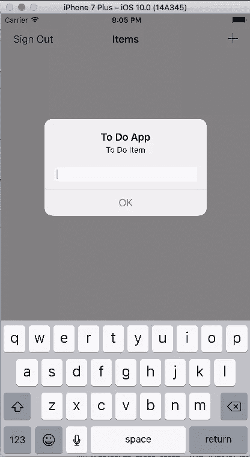

您添加的任何项目都将被添加到表格视图中。

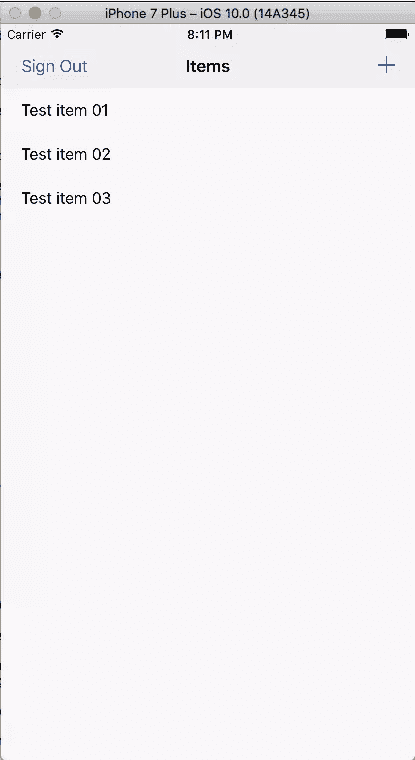

检查 Firebase 控制台，您将看到添加的数据。

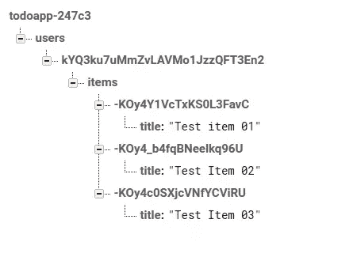

若要删除项目，请在项目上滑动以显示删除按钮。

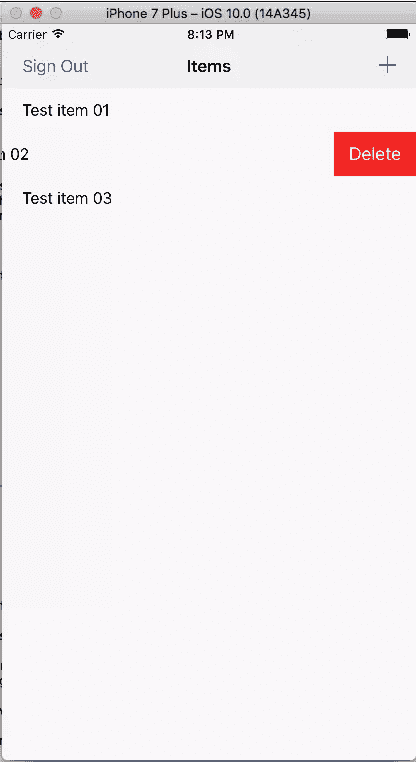

这就把我们带到了教程的结尾。我们已经了解了如何在 Firebase 实时数据库中保存和检索数据，以及如何设置身份验证和数据授权。我们看到的数据保存对于简单的数据类型非常理想，比如`NSString`、`NSNumber`、`NSArray`和`NSDictionary`。如果你想把图像或文档之类的文件保存到 Firebase，那就去看看 [Firebase 存储器](https://firebase.google.com/docs/storage/)。

本教程是对使用 Firebase 的一个快速介绍，并不是对 Firebase 所有功能的详尽研究。为此，请务必通读[文档](https://firebase.google.com/docs/ios/setup)。你可以在这里下载完成的项目[。记得将 Firebase 生成的 *GoogleService-Info.plist* 文件添加到项目中。](https://github.com/sitepoint-editors/firebase-with-ios)

> *注*
> 
> 您可能已经注意到，在添加 Firebase 库之后，或者在运行已完成的项目(如果您下载了它)时，项目中会出现一些警告。警告错误信息显示`Conflicting nullability specifier on return types, 'nullable' conflicts with existing specifier 'nonnull'`。这个小 bug 是在 Firebase 更新到 Swift 3 时出现的，并且[问题已经提交](https://github.com/firebase/FirebaseUI-iOS/issues/166)。如果您查看最后一个链接中的消息线程，这个问题已经得到了解决，但是在 Firebase 中直到下一个版本才会看到变化。尽管如此，该应用程序仍然工作。

## 分享这篇文章