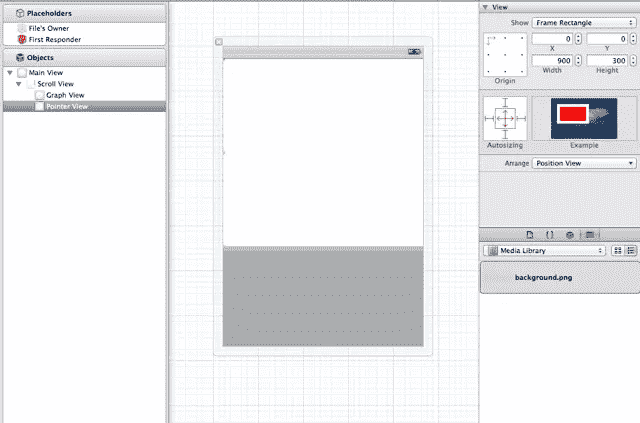
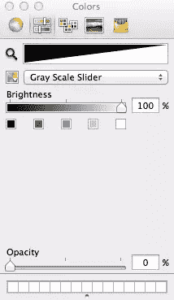
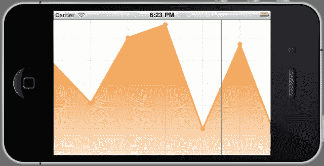

# 用石英 2D 制作图表:第 4 部分

> 原文：<https://www.sitepoint.com/creating-a-graph-with-quartz-2d-part-4/>

在这一系列文章中，我讨论的是使用石英 2D 创建图表和图形，这是苹果公司创建的图形渲染 API，是核心图形的一部分。你可能希望跟上[第一部](https://www.sitepoint.com/creating-a-graph-with-quartz-2d/)、[第二部](https://www.sitepoint.com/creating-a-graph-with-quartz-2d-part-2/)和[第三部](https://www.sitepoint.com/creating-a-graph-with-quartz-2d-part-3/)的进度。

我们的图表看起来很棒，但是缺少了一些东西。首先，通常会有显示数值范围、给数据点编号、提供一些注释等的标签。第二，有了 iPhone 神奇的触摸屏，用户可能会希望能够与图形进行交互，例如，如果他们点击它，图形可能会以适当的附加信息进行响应。

在本系列的这一部分中，让我们看看如何实现这种交互性。我们将在系列的最后一部分在图上留下绘图文本。

### 实现交互性

首先，让我们稍微重构一下现有的代码。我们将在条形图和折线图之间切换。为两个不同的图创建两个不同的项目似乎很方便，我猜一些读者已经这样做了。对我来说，将所有代码放在一个项目中更方便。我将简单地把绘制条形图的代码移到一个单独的方法中，放在`drawRect`的正上方:

```
- (void)drawBarGraphWithContext:(CGContextRef)ctx 
{
    // Draw the bars
    float maxBarHeight = kGraphHeight - kBarTop - kOffsetY;

    for (int i = 0; i < sizeof(data); i++)
    {
        float barX = kOffsetX + kStepX + i * kStepX - kBarWidth / 2;
        float barY = kBarTop + maxBarHeight - maxBarHeight * data[i];
        float barHeight = maxBarHeight * data[i];

        CGRect barRect = CGRectMake(barX, barY, kBarWidth, barHeight);
        [self drawBar:barRect context:ctx];
    }
} 
```

现在用一行代码替换所有进入新方法的代码。它应该就在调用绘制线图的方法的那一行的旁边。通过注释掉其中一行，我们将能够在不同类型的图形之间轻松切换。

```
[self drawBarGraphWithContext:context]; 
```

我们将首先处理条形图。这个想法是，每当点击一个条形，就会出现一条消息，指示该条形的值，但是如果用户点击任何条形之外的部分，什么都不会发生。

### 检测被敲击的条

方法很简单。在绘制线条时，我们创建矩形并用渐变填充它们。如果我们设法保存这些矩形并保存它们，我们应该能够测试触摸的坐标是否恰好在其中一个矩形内。

为了简单起见，让我们假设我们知道条形的数目，并能把它变成一个常数。将以下定义添加到现有定义中:

```
#define kNumberOfBars 12 
```

将下面一行代码添加到方法之外的`GraphView.m`:

```
CGRect touchAreas[kNumberOfBars]; 
```

同时修改`drawBarGraphWithContext`中`for`回路的条件:

```
for (int i = 0; i < kNumberOfBars; i++) 
```

最后，在这个循环的最后，将条形的矩形保存到新数组中:

```
touchAreas[i] = barRect; 
```

现在，在图形绘制完成后，我们将拥有一个用于绘制条形的矩形数组。下一步是拦截用户的触摸并定义它们的位置。为此，我们需要添加以下方法:

```
- (void)touchesBegan:(NSSet *)touches withEvent:(UIEvent *)event 
{   
    UITouch *touch = [touches anyObject];
    CGPoint point = [touch locationInView:self];
    NSLog(@"Touch x:%f, y:%f", point.x, point.y);
} 
```

运行应用程序，点击图表中的某个位置，您应该会在日志中看到被点击点的坐标。

最后，我们需要确定被点击的点是否属于任何条。在新方法的末尾添加以下代码片段:

```
for (int i = 0; i < kNumberOfBars; i++) 
{
    if (CGRectContainsPoint(touchAreas[i], point)) 
    {
        NSLog(@"Tapped a bar with index %d, value %f", i, data[i]);
        break;
    }
} 
```

现在，如果您在其中一个条内点击，您应该会看到如下所示的日志记录，另一方面，如果您点击条外的某处，您应该只会看到触摸消息:

```
MyGraph[1265:b303] Touch x:212.000000, y:126.000000
MyGraph[1265:b303] Tapped a bar with index 2, value 0.900000 
```

显然，您可以显示一个带有标签的视图，并将该标签的文本设置为条的值，或者执行适合您的应用程序的其他操作，而不是记录条被触摸的消息。因为这不是石英 2D 特有的，所以我把详细的实现留给你。

那么线图呢，它应该如何对触摸做出反应呢？一种可能的解决方案是通过最接近触摸位置的数据点画一条垂直线。我不认为我真的需要展示如何做，你知道如何画线，你可以计算出在哪里画指针。然而，在处理这样的指针线时，我发现了一个有趣的解决方案，让我给你展示一下。

### 画一条指针线

我尝试的第一种方法是简单地添加代码，在`drawRect`方法的末尾画一条垂直线，并在接触图形后运行它。为了使这条线可见，我必须在每次触摸后请求重画整个图形。这是我注意到图形变得有点迟缓的地方，一次又一次地重画线条、渐变和标签。显然，这不是一个可接受的解决方案。

另一种方法是不重新绘制整个图形，而只重新绘制图形的有限区域。但是，我觉得自己懒得这么做，最后找到了一个我认为简单又好看的解决方案。这个想法是把另一个透明的视图放在`GraphView`的上面，让我们称之为`PointerView`，并且只在那个视图中处理触摸和绘制指针，让`GraphView`保持原样。让我们深入了解一下我是如何做到的。

选择`MyGraphViewController.xib`，然后从库中拖出一个`View`，放在`GraphView`上面。您可能需要在这里做一些调整。首先，确保新的`View`和`GraphView`在对象层次的同一层。为此，将新视图拖放到对象树右侧的`Scroll View`上。其次，将视图的`x`和`y`坐标设置为`0`。下面的截图展示了你操作的最终结果。

[](https://www.sitepoint.com/wp-content/uploads/2011/10/Graph20.png)

图 1

接下来，向您的项目添加一个新的 Objective-C 类，并使其成为`UIView`的子类。我把它命名为`PointerView`。回到`MyGraphViewController.xib`，选择新添加的`View`，将其等级改为`PointerView`。您可能还想在对象树中将它的名称改为`Pointer View`。

在这里，让我们将`PointerView`的背景颜色改为透明。为此，在指针视图的属性中点击选择背景颜色的控件，并将`Opacity`滑块尽可能向左拖动:

[](https://www.sitepoint.com/wp-content/uploads/2011/10/Graph21.png)

图 2

如果您现在运行应用程序，并且不要忘记通过注释/取消注释适当的代码行来切换到线图模式，它应该和以前一样工作和看起来完全一样。在`PointerView.m`中，取消对`drawRect`方法的注释，并添加处理触摸的方法:

```
- (void)touchesBegan:(NSSet *)touches withEvent:(UIEvent *)event
{
    UITouch *touch = [touches anyObject];
    CGPoint point = [touch locationInView:self];
} 
```

你的家庭作业，是计算出最近的数据点并通过它画出指针线的逻辑。这里，我们将简单地在接触图形的点上画一条垂直线。在`PointerView.h`中声明几个变量:

```
#import <UIKit/UIKit.h>

@interface PointerView : UIView
{
    float pointerX;
    BOOL drawPointer;
}

@end 
```

第一个将存储最近一次触摸的`x`坐标，而第二个是一个标志，告诉它可以绘制指针线。我们现在可以通过添加下面几行来完成`touchesBegan`方法:

```
pointerX = point.x;
drawPointer = YES;
[self setNeedsDisplay]; 
```

最后一行标记`PointerView`用于重画。我们现在已经有了绘制指针所需的所有信息，下面是绘制代码:

```
- (void)drawRect:(CGRect)rect
{
    if (drawPointer) 
    {
        CGContextRef context = UIGraphicsGetCurrentContext();
        CGRect frame = self.frame;

        CGContextSetLineWidth(context, 2.0);
        CGContextSetStrokeColorWithColor(context, [[UIColor colorWithRed:0.4 green:0.8 blue:0.4 alpha:1.0] CGColor]);
        CGContextMoveToPoint(context, pointerX, 0);
        CGContextAddLineToPoint(context, pointerX, frame.size.height);
        CGContextStrokePath(context);
    }
} 
```

触摸后的图形应该是这样的:

[](https://www.sitepoint.com/wp-content/uploads/2011/10/Graph221.png)

图 3

请注意，性能不会受到影响，因为在触摸后，我们只会重画指针线。现在我们的图表中唯一缺少的重要元素是一些文本信息。我们将学习如何使用石英 2D 绘制文本，这是本系列的下一部分，也是最后一部分。敬请关注。

### 石英 2D 指数

亚历山大·科列斯尼科夫关于使用石英 2D 制作图表的系列文章分为 5 个部分。您可以使用[石英 2D 标签](https://www.sitepoint.com/creating-a-graph-with-quartz-2d/)参考该系列，并使用以下链接访问单篇文章。

*   [用石英 2D 制作图表:第一部分](https://www.sitepoint.com/creating-a-graph-with-quartz-2d/)
*   [用石英 2D 制作图表:第二部分](https://www.sitepoint.com/creating-a-graph-with-quartz-2d-part-2/)
*   [用石英 2D 制作图表:第三部分](https://www.sitepoint.com/creating-a-graph-with-quartz-2d-part-3/)
*   用石英 2D 制作图表:第 4 部分
*   [用石英 2D 制作图表:第五部分](https://www.sitepoint.com/creating-a-graph-with-quartz-2d-part-5/)

## 分享这篇文章