# 用石英 2D 制作图表

> 原文：<https://www.sitepoint.com/creating-a-graph-with-quartz-2d/>

当我最近加入我一直在工作的团队时，他们正试图使用 Core Plot 创建一个图表，Core Plot 是一个流行的第三方库。虽然进展不顺利，但有两个大问题。首先，他们不能像设计者要求的那样，为图形背景使用自定义图像。其次，滚动的质量是不可接受的。

到那时，我已经有了一些图表，所以我建议了一种替代方法:只使用石英 2D——一种由苹果公司创建的图形渲染 API，核心图形的一部分，从头开始绘制图表。

起初，这个解决方案似乎不是最佳的。毕竟，许多第三方库的创建是为了保护开发者不使用低级 API，以节省我们的时间和精力。然而，使用石英 2D 并不困难。你只需要知道如何做某些事情，一旦你学会了，你就可以很快前进。我只花了几周的时间创建了一个复杂的解决方案，实现了设计师的每一个小愿望。

在这一系列文章中，我将与你分享我用来绘制图表的方法。让我们总结一下未来解决方案的一些要求。

*   它应该滚动顺利，并容易为不同的数据集调整大小。
*   它应该通过显示适当的信息来响应触摸。
*   它应该看起来很好，足够灵活，让我们的设计师高兴。

### 创建项目

我们需要创建一个 Xcode 项目来托管我们逐渐出现的图形。基于视图的应用程序模板可以很好地工作，你可以给这个项目取任何你认为合适的名字。我把它命名为 MyGraph。

[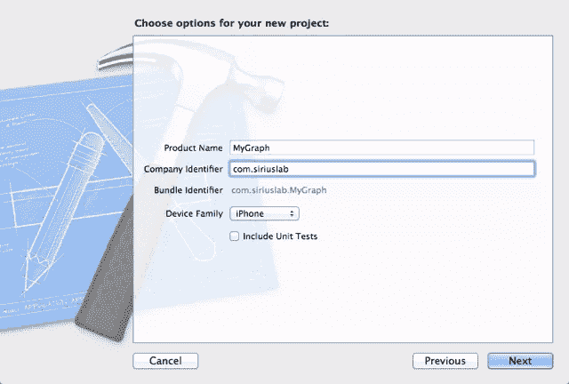](https://www.sitepoint.com/wp-content/uploads/2011/09/Graph01.png)

创建项目

在模板项目生成并保存到您选择的位置之后，我们的第一个任务是创建一个简单的用户界面。让我们创建一个图形，它在横向方向上占据整个视图，但在纵向方向上只占据视图的上部。

我们可以稍后决定使用纵向视图的下半部分进行一些控制，或者将数据显示为表格。**重要的**要求是无论给它多少空间，图形都应该滚动。

在 Xcode 中，选择`MyGraphViewController.xib file`。在**库**中，找到*滚动视图*，并将它的一个实例拖放到主视图中。如果运气好的话，它应该会卡到位，查看下图来检查您的进度。

[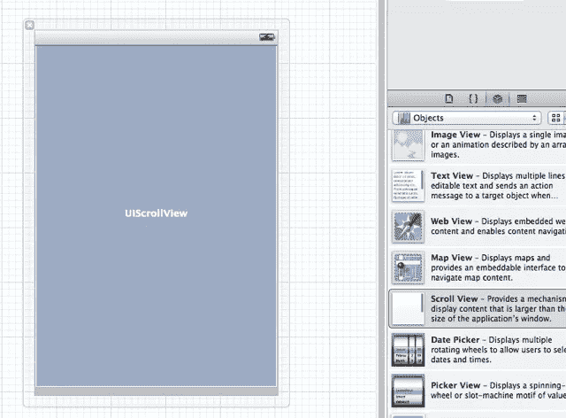](https://www.sitepoint.com/wp-content/uploads/2011/09/Graph02.png)

添加滚动视图

调整`UIScrollView`的大小，使其占据纵向视图的顶部，并使其高度为 300 像素。这是横向视图的高度(320 像素)减去状态栏。此外，禁用几个自动调整大小的手柄，以便滚动视图随着方向的改变而适当地调整大小:

[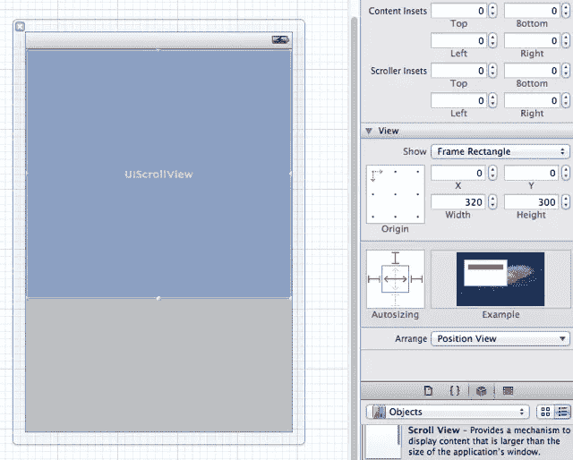](https://www.sitepoint.com/wp-content/uploads/2011/09/Graph03.png)

调整滚动视图的大小

对于绘图，我们将使用一个简单的视图，或者准确地说，是一个`UIView`类的子类。在**库**中，找到*视图*，然后在`UIScrollView`上拖拽一个。展开`MyGraphViewController.xib`文件中对象的层次，确保新添加的视图成为*滚动视图*的子视图。

还要注意，我已经适当地标记了两个视图*主视图*和*图形视图*。这很容易做到——只需在视图在层次结构中被选中时按 Enter 键，并给它一个新名称——但随着图中视图数量的增加，这变得非常方便。

[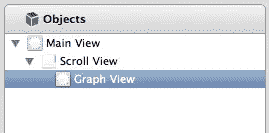](https://www.sitepoint.com/wp-content/uploads/2011/09/Graph04.png)

视图层次结构

我们希望我们的图形视图足够宽，这样它可以在滚动视图中滚动，所以我们给它一个 900 像素的初始宽度，如下图所示。这就完成了初始设置，我们可以开始绘图了。

[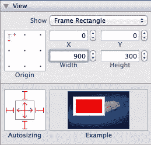](https://www.sitepoint.com/wp-content/uploads/2011/09/Graph05.png)

设置初始大小

### 绘制网格线

我们希望从简单的事情开始，一些能让我们确信一切都是正确的事情。直线大概是人们能画出的最简单的东西，大多数图表都有某种网格线作为视觉辅助。从画一堆网格线开始是合理的。

但是我们到底要画哪里呢？到目前为止，我们的图形视图只是一只没有绘制任何内容的股票。我们需要的是扩展`UIView`，并在新的类中覆盖`drawRect`方法:这就是我们的绘图代码要去的地方。

向项目添加一个新的 Objective-C 类，使它成为`UIView`的子类，并给它一个描述性的名字，比如说`GraphView`。接下来，在`MyGraphViewController.xib`文件的层次结构中选择我们标记为图形视图的视图，并将其类更改为新的视图，`GraphView`:

[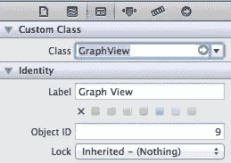](https://www.sitepoint.com/wp-content/uploads/2011/09/Graph06.png)

更改图表视图类

在`GraphView.m`中，你会看到`- (void)drawRect:(CGRect)rect`方法被注释掉了。删除注释，让方法体为空。在我们能够绘制任何东西之前，我们需要获得一个对图形上下文的引用，所以让我们添加第一行代码，该方法将如下所示:

```
- (void)drawRect:(CGRect)rect
{
    CGContextRef context = UIGraphicsGetCurrentContext();
} 
```

我们的绘图代码将使用大量的数字——例如，它需要知道图形的宽度和高度。在头文件`GraphView.h`中将所有这些数字定义为常量是一个好主意。这样，无论何时你想改变一个值，你都可以很容易地找到它。切换到`GraphView.h`并在导入语句后添加以下定义:

```
#define kGraphHeight 300
#define kDefaultGraphWidth 900
#define kOffsetX 10
#define kStepX 50
#define kGraphBottom 300
#define kGraphTop 0 
```

首先，我们为图形的宽度和高度定义了两个常数，它们对应于 XIB 文件中图形视图的尺寸。我们将动态地改变图形的宽度，但是最好有一个默认值。

至于`kStepX`和`kOffsetX`，它们分别定义了垂直网格线之间的水平距离和第一条线的偏移量。

最后，我们定义图形顶部和底部的坐标。目前，它们与视图的顶部和底部相同，但我们可能希望随着时间的推移而改变。(请注意，垂直坐标从视图的顶部开始，并随着向下移动而增加。)

我们现在可以开始画画了。在石英 2D 中，绘图分三步完成:

1.  准备。这是我们定义将要使用的资源和尺寸的地方:颜色、字体、尺寸等等。
2.  实际绘图:我们的代码绘制直线、曲线等。
3.  提交。我们需要告诉石英 2D，我们已经完成了这一步的绘画，它可以使我们的艺术可见。如果我们忽略这一步，视图中将不会显示任何内容。

通常，为了完成绘图，我们需要多次重复这三个步骤。第一步，让我们定义网格线的粗细和颜色。将下面两行添加到`drawRect`方法中:

```
CGContextSetLineWidth(context, 0.6);
CGContextSetStrokeColorWithColor(context, [[UIColor lightGrayColor] CGColor]); 
```

接下来，我们将在视图中绘制尽可能多的垂直线:

```
// How many lines?
int howMany = (kDefaultGraphWidth - kOffsetX) / kStepX;

// Here the lines go
for (int i = 0; i < howMany; i++)
{
    CGContextMoveToPoint(context, kOffsetX + i * kStepX, kGraphTop);
    CGContextAddLineToPoint(context, kOffsetX + i * kStepX, kGraphBottom);
} 
```

由于核心图形函数和我们的常数的描述性名称，我认为没有必要解释这段代码是做什么的。最后，我们提交绘图，这是必需的第三步:

```
CGContextStrokePath(context); 
```

以下是此时 drawRect 方法的完整代码:

```
- (void)drawRect:(CGRect)rect
{
    CGContextRef context = UIGraphicsGetCurrentContext();

    CGContextSetLineWidth(context, 0.6);
    CGContextSetStrokeColorWithColor(context, [[UIColor lightGrayColor] CGColor]);

    // How many lines?
    int howMany = (kDefaultGraphWidth - kOffsetX) / kStepX;

    // Here the lines go
    for (int i = 0; i < howMany; i++)
    {
        CGContextMoveToPoint(context, kOffsetX + i * kStepX, kGraphTop);
        CGContextAddLineToPoint(context, kOffsetX + i * kStepX, kGraphBottom);
    }

    CGContextStrokePath(context);
} 
```

此外，我不会再展示完整的代码，因为它会越来越长。基本上，无论我们将在此之后添加什么，都将位于方法的底部，除非另有说明。如果你想看完整的版本，欢迎查看 Github BuildMobile Quartz 2D 图库。

运行应用程序，您应该在图形视图中看到垂直的灰色线条。

[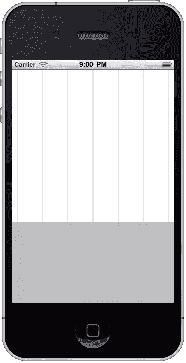](https://www.sitepoint.com/wp-content/uploads/2011/09/Graph07.png)

网格线纵向视图

然而，当我们将设备转向横向时，图形不会跟随旋转。我们应该明确声明我们支持改变方向。在`MyGraphViewController.m`中，更改`shouldAutorotateToInterfaceOrientation`方法，使其看起来像这样。

```
- (BOOL)shouldAutorotateToInterfaceOrientation:(UIInterfaceOrientation)interfaceOrientation
{
    return YES;
} 
```

再次尝试运行该应用程序，这一次，未来图形将跟随设备的旋转。

[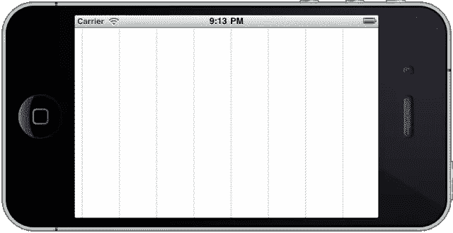](https://www.sitepoint.com/wp-content/uploads/2011/09/Graph08.png)

网格线景观视图

不幸的是，图表还没有滚动。这是因为我们需要明确地告诉`UIScrollView`它的内容有多大。为了做到这一点，我们需要一个指向`UIScrollView`的指针。

### 启用滚动

在 Xcode 中，选择`MyGraphViewController.xib`文件，确保视图层次可见，并按下工具栏**编辑器**部分的*显示助理编辑器*按钮。`MyGraphViewController.h`头文件的内容应该出现在分割视图的右半部分。按住 Ctrl 键从层次结构中的滚动视图拖动到右侧的源代码，以便插入点位于类声明内，如下面的屏幕截图所示:

[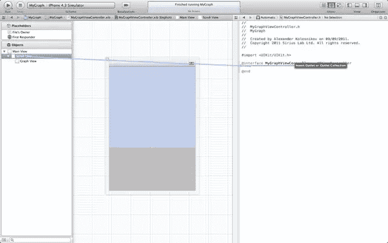](https://www.sitepoint.com/wp-content/uploads/2011/09/Graph09.png)

滚动视图的出口

释放鼠标按钮，给新的出口起一个名字，比如说， *scroller* ，Xcode 会自动编写所有需要的代码，以正确地获得一个指向滚动视图的指针并维护它。下面是在`MyGraphViewController.h`中产生的代码应该是什么样子。几行代码也将被添加到`MyGraphViewController.m`中。

```
#import <UIKit/UIKit.h>

@interface MyGraphViewController : UIViewController {
    UIScrollView *scroller;
}

@property (nonatomic, retain) IBOutlet UIScrollView *scroller;

@end 
```

现在，一旦应用程序准备好显示，我们需要告诉滚动视图它的子图形视图的大小。最好的地方是在`MyGraphViewController`类的`viewDidLoad`方法中。这个方法可能已经出现在`MyGraphViewController.m`了，但是它可能会被注释掉。删除注释并添加以下代码行:

```
- (void)viewDidLoad
{
    [super viewDidLoad];

    scroller.contentSize = CGSizeMake(kDefaultGraphWidth, kGraphHeight);
} 
```

现在你可以运行应用程序，图形视图将会很好地滚动，无论是纵向还是横向。

### 调整网格线

老实说，我决定在启用滚动之前绘制网格线，这样您可以很容易地注意到图形是否需要滚动。现在网格线已经存在，我们可能需要稍微调整一下。

一个明显的补充是水平网格线。那很简单。首先给`GraphView.h`添加几个新的常量定义

```
#define kStepY 50
#define kOffsetY 10 
```

然后，在绘制垂直网格线之后，在提交绘图的行之前，添加以下代码行。

```
int howManyHorizontal = (kGraphBottom - kGraphTop - kOffsetY) / kStepY;
for (int i = 0; i <= howManyHorizontal; i++)
{
    CGContextMoveToPoint(context, kOffsetX, kGraphBottom - kOffsetY - i * kStepY);
    CGContextAddLineToPoint(context, kDefaultGraphWidth, kGraphBottom - kOffsetY - i * kStepY);
} 
```

如果您运行该应用程序，您将看到垂直和水平网格线。

[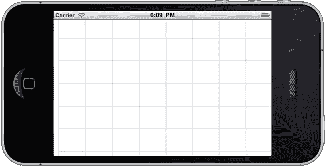](https://www.sitepoint.com/wp-content/uploads/2011/09/Graph10.png)

垂直和水平网格线

在许多情况下，这种网格线已经足够好了，但是你的设计师可能不会高兴，直到你把线弄成虚线。幸运的是，我们可以通过简单地在准备步骤中添加几行代码来轻松实现。在设置笔画颜色的行的正下方，添加以下代码。

```
CGFloat dash[] = {2.0, 2.0};
CGContextSetLineDash(context, 0.0, dash, 2); 
```

`dash`数组指定模式中有两个元素:破折号和其后的空格。`CGContextSetLineDash`函数的最后一个参数`2`是破折号数组中元素的数量。了解这一点后，您可以尝试不同类型的破折号模式，以创建适合您的目的的东西。如果您照原样运行这段代码，您应该会在下面的屏幕截图中看到网格线。

[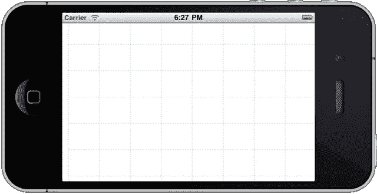](https://www.sitepoint.com/wp-content/uploads/2011/09/Graph11.png)

网格虚线

我们稍后要绘制的任何其他线都不会被虚线覆盖，因此我们需要禁用我们之前设置的虚线。为此，请在提交绘图的代码行之后插入以下代码行。

```
CGContextSetLineDash(context, 0, NULL, 0); // Remove the dash 
```

现在，在实际绘制图表之前，我们已经准备好了可能需要的一切。我们可能想要添加的唯一其他增强是图形的图形背景，可能是由我们的设计师制作的。

### 添加图形背景

我不是设计师，所以我创建的背景非常简单。这个文件被命名为`background.png`，你会在 GitHub 上的代码中找到它。或者，你可以创建一个你自己的图形，它应该是 300 像素高，900 像素宽。

将背景文件添加到项目中。我创建了一个名为 Artwork 的新组，并将文件放入这个组中。接下来，我们需要在完成网格线绘制之前插入三行代码。将它们放在该方法的第一行之后，在该行中，我们获得了对图形上下文的引用:

```
CGContextRef context = UIGraphicsGetCurrentContext();

// Draw the background image
UIImage *image = [UIImage imageNamed:@"background.png"];    
CGRect imageRect = CGRectMake(0, 0, image.size.width, image.size.height);
CGContextDrawImage(context, imageRect, image.CGImage);
... 
```

运行项目，您将看到背景和网格线:

[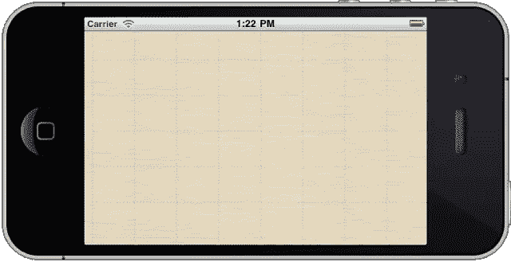](https://www.sitepoint.com/wp-content/uploads/2011/09/Graph12.png)

背景完成

不可否认，在这种特殊情况下同时使用图形背景和网格线看起来有点矫枉过正。你可能决定留下背景或者网格线，但是至少你知道如何把它们都画出来。

注意:在这个特殊的例子中，背景非常简单。如果是一幅更复杂的画，你会注意到它是上下颠倒的。我们将在本文的后面学习如何处理这个问题，现在我们就让它保持原样吧。

现在所有的背景工作都完成了，我们可以开始画实际的图了，这正是我们在文章的下一部分要做的。从 GitHub Repo 获取石英 2D 图形代码，并在评论中给我们留下您的想法和问题。回头见。

### 石英 2D 指数

亚历山大·科列斯尼科夫关于使用石英 2D 制作图表的系列文章分为 5 个部分。您可以使用[石英 2D 标签](https://www.sitepoint.com/creating-a-graph-with-quartz-2d/)参考该系列，并使用以下链接访问单篇文章。

*   用石英 2D 制作图表:第 1 部分
*   [用石英 2D 制作图表:第二部分](https://www.sitepoint.com/creating-a-graph-with-quartz-2d-part-2/)
*   [用石英 2D 制作图表:第三部分](https://www.sitepoint.com/creating-a-graph-with-quartz-2d-part-3/)
*   [用石英 2D 制作图表:第四部分](https://www.sitepoint.com/creating-a-graph-with-quartz-2d-part-4/)
*   [用石英 2D 制作图表:第五部分](https://www.sitepoint.com/creating-a-graph-with-quartz-2d-part-5/)

## 分享这篇文章