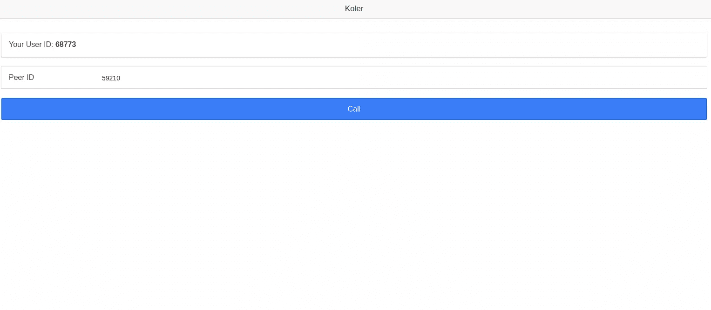
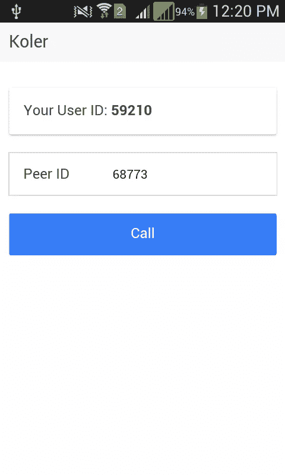
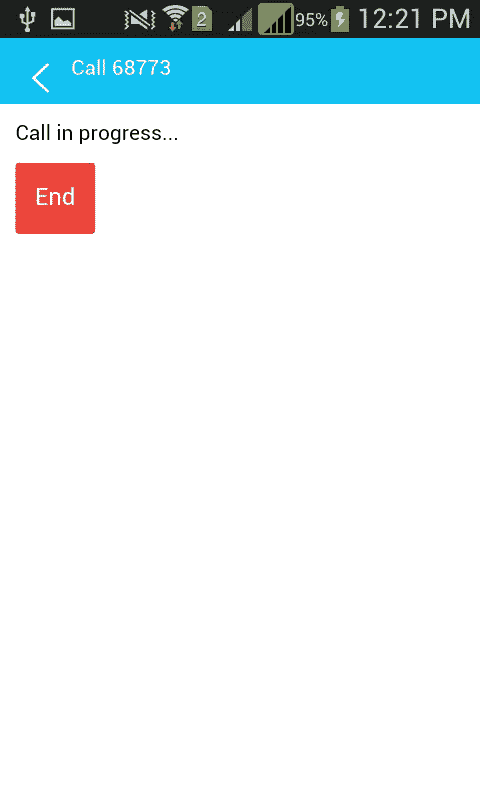

# 创建语音通话应用程序-服务器端

> 原文：<https://www.sitepoint.com/creating-a-phonertc-calling-app-server-side/>

在本系列的第一部分中，我们创建了 PhoneRTC 应用程序的客户端，在本文中，我们创建了协调客户端的服务器端。

## 信令服务器

该应用的服务器端组件被称为“信令服务器”，因为它用于在对等体之间交换信息。

首先在 *www* 目录之外创建一个新的 *koler-server* 目录。在构建应用程序时， *www* 目录中的所有内容都被打包，我们不希望包含服务器组件。在新目录中，打开您的终端并安装 express、lodash 和 Socket.io 作为依赖项。

```
npm install express lodash socket.io
```

创建一个名为 *koler.js* 的新 JavaScript 文件，并要求安装依赖项。

```
var express = require('express');
var app = express();
var _ = require('lodash');
var sock = require('socket.io');
```

创建一个将在端口 4000 上运行的新服务器实例。

```
var server = app.listen(4000, function(){

  var host = server.address().address
  var port = server.address().port

  console.log('Example app listening at http://%s:%s', host, port)

});
```

为 Socket.io 使用新的服务器实例。

```
var io = sock.listen(server);
```

创建一个用于存储用户的数组。当用户登录时，推送一个包含分配给用户的 ID 和套接字 ID 的对象。这允许我们以后在发送消息或从`users`数组中删除用户时引用该用户。

```
var users = [];

io.on('connection', function(socket){

  socket.on('login', function(data){
    users.push({'id': data.id, 'socket': socket.id});
  });

});
```

早些时候，我们使用`SocketService.emit('sendMessage')`发送消息，并传递包含我们想要传递的数据的对象。下面是用于处理该消息的服务器端代码。

您在前端发送的消息的名称应该与服务器上的事件名称相匹配。在这种情况下，消息的名称是`sendMessage`。一旦收到消息，传递的对等 ID 就被转换成一个数字，这样它就可以和 lodash 中的`find`方法一起使用来查找具有该 ID 的用户。套接字 ID 存储为一个数字，这就是为什么如果数据类型不同，lodash 条件就不匹配。

然后将消息发送给该用户。因此，当我们从前端发送消息时，我们实际上是在向服务器发送消息。然后，服务器将该消息发送到其目的地。这是通过使用 Socket.io 中的`to`方法来完成的。该方法接受您想要向其发送消息的用户的套接字 ID。

```
socket.on('sendMessage', function(message){

  var peer_id = Number(message.peer_id);
  var contact = _.find(users, { 'id': peer_id });

  io.to(contact.socket).emit('messageReceived', message);
});
```

为了避免用已经断开连接的用户填充`users`数组，我们添加了以下代码。当用户断开连接时，它会将用户从`users`数组中删除。Socket.io 内置了一个`disconnect`事件，所以我们所要做的就是通过使用当前的 socket ID 作为基础来确定需要删除哪些用户。

lodash 中的`remove`函数接受数组作为第一个参数，并接受包含要为每个用户检查的条件的函数。它遍历每个用户，检查`socket`属性的当前值是否与当前套接字连接的套接字 ID 相同。

```
socket.on('disconnect', function(){

  _.remove(users, function(user){
    return user.socket == socket.id;
  });

});
```

现在我们可以通过在终端中执行`node koler.js`来启动服务器。

## 部署

回到前端，我们现在可以安装 PhoneRTC 了。如前所述，我将只提及 Android 中的部署，因为我无法访问 iOS 的 Mac 平台。如果你在 Mac 上，并计划在 iOS 上部署，你可以遵循 PhoneRTC 项目的[官方维基上的安装说明。](https://github.com/alongubkin/phonertc/wiki/Installation)

当我第一次部署使用 phoneRTC 的应用程序时，我对[原始项目](https://github.com/alongubkin/phonertc)没有任何运气。即使是 [phoneRTC 演示应用](https://github.com/alongubkin/phonertc/tree/master/demo/client)在我的手机上测试时也不起作用(手机发出的音频堪比窒息的人)。对我有用的是来自[塞斯特利兹](https://github.com/cesterlizi/phonertc)的叉子。

然而，我鼓励你先安装原始项目，因为它最活跃，我的手机可能是一个特例。下面是从原始项目安装 phoneRTC 的命令:

```
cordova plugin add https://github.com/alongubkin/phonertc.git
```

请注意，安装插件可能需要一些时间，这取决于您的互联网连接。

如果你决定安装 cesterlizi fork，你需要更新*PhoneRTCPlugin.java*文件。在*plugins/com . dooble . phonertc*目录中搜索该文件。应该在*plugins/com . dooble . phonertc/src/Android/com/dooble/phonertc*目录里面。打开文件，寻找`createVideoView`函数:

```
private void createVideoView() {
  Point size = new Point();
  size.set(_videoConfig.getContainer().getWidth() * _videoConfig.getDevicePixelRatio(),
  _videoConfig.getContainer().getHeight() * _videoConfig.getDevicePixelRatio());

  _videoView = new VideoGLView(cordova.getActivity(), size);
  VideoRendererGui.setView(_videoView);

  webView.addView(_videoView, _videoParams);
}
```

将函数的最后一行替换为:

```
//webView.addView(_videoView, _videoParams); //remove this line
((WebView) webView.getView()).addView(_videoView, _videoParams);
```

在`refreshVideoView`函数中，替换:

```
if (_videoView != null) {
  webView.removeView(_videoView); //remove this line
  _videoView = null;
}
```

使用:

```
if (_videoView != null) {
  ((WebView) webView.getView()).removeView(_videoView); //replacement
  _videoView = null;
}
```

在`onSessionDisconnect`功能中，替换:

```
if (_videoView != null) {
  _videoView.setVisibility(View.GONE);
  webView.removeView(_videoView); //remove this line
}
```

使用:

```
if (_videoView != null) {
  _videoView.setVisibility(View.GONE);
  ((WebView) webView.getView()).removeView(_videoView); //replacement
}
```

所做的更改与 Cordova 中的可插入 webviews 相关。如果你坚持使用旧代码，当你把应用程序编译成 Android 时，你会看到一个错误

完成这些更改后，编译应用程序。通过在终端中执行`cordova build`来实现。如果构建成功完成，连接您的设备并将 apk 文件复制到其中。你可以在*平台/android/build/outputs/apk* 目录下找到 apk 文件。如果您使用了原始项目并且构建返回了一个错误，那么使用以下命令卸载插件:

```
cordova plugin rm com.dooble.phonertc
```

并安装叉子。

```
cordova plugin add https://github.com/cesterlizi/phonertc.git
```

一旦你在手机上安装了应用程序，你就可以通过安装浏览器平台来测试应用程序，这样你就可以用你的手机和浏览器进行测试了。为此，执行以下命令。

```
cordova platform add browser
```

这应该会在*平台*目录中添加一个*浏览器*文件夹。打开*平台/浏览器/Cordova/运行*文件。如果您在 linux 上，您可以在`switch`语句中添加以下任一项，让浏览器运行。

```
case 'linux': spawn('google-chrome', ['--test-type', '--disable-web-security', '--user-data-dir=/tmp/temp_chrome_user_data_dir_for_cordova_browser', project]);
```

```
case 'linux': spawn('chromium-browser', ['--test-type', '--disable-web-security', '--user-data-dir=/tmp/temp_chromium_user_data_dir_for_cordova_browser', project]);
```

添加后，您可以运行一个浏览器实例，它具有运行 Cordova 应用程序的所有功能。

```
cordova run browser
```

这是该应用在浏览器中的外观:



你可以在 Chrome 上使用设备模拟器，让它看起来更像一个实际的移动应用程序。

这是它在手机上的样子:



当用户发起呼叫时:


当通话正在进行时:



## 结论

就是这样！在本教程中，您已经学习了如何使用 Ionic、Cordova、PhoneRTC 和 Socket.io 构建音频通话应用程序。您可以在 [Github](https://github.com/sitepoint-editors/koler) 上找到我在本教程中使用的完整代码。

我很想听听你的经历和对你所学到的东西的想法。

## 分享这篇文章