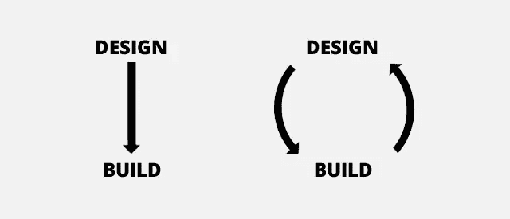
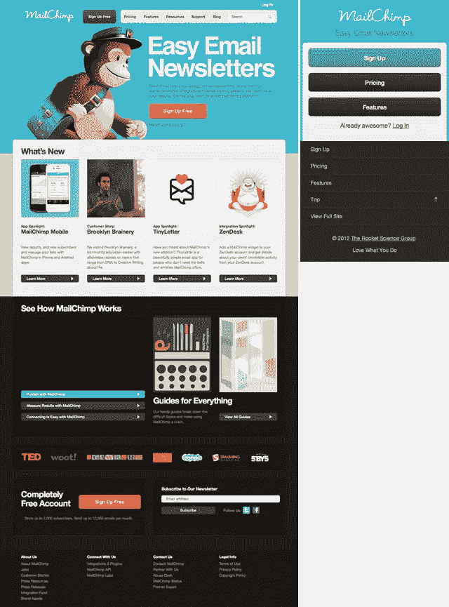

# 太大，太小，还是刚刚好:创建一个多屏幕的网站

> 原文：<https://www.sitepoint.com/creating-a-website-for-multiple-screens/>

对许多人来说，规划多屏网络体验不再是事后的想法；这是起点。越来越多的人开始在传统的桌面屏幕之外浏览网站。从平板电脑和手机到上网本、笔记本电脑，甚至电视，针对更广泛的受众(以及他们更宽的屏幕)进行优化是关键。然而，在编写一行代码之前，还有许多需要考虑的事项。

### 响应式网页设计

当 Ethan Marcotte 介绍了创建一个针对多个屏幕的网站的概念时,“响应式网页设计”一词成为了任何在数字空间工作的人的词汇的一部分。

随着 CSS3 媒体查询的加入，网站不仅仅是增加或减少流畅布局中元素的宽度。通过移动、调整大小、隐藏甚至删除不同的元素，页面的元素现在可以在不同的分辨率之间优雅地调整。这种技术使网站能够对浏览者的上下文做出反应。除了只维护一个代码库和更新单个站点的内容之外，使用自适应网格设计还可以在每个屏幕的体验之间建立连续性。

乍一看，响应式网页设计似乎是任何移动网站的正确解决方案。虽然这是创建一个单独的移动网站的一个很好的替代方案，但是仍然有一些挑战需要考虑。

一个响应式网站的最终结果将是一个单一的平台，适应不同的分辨率和设备。这几乎肯定比只为一种观看设备设计的网站更好，但它也需要更多的决定和更广泛的规划:需要额外的设计模型来规划每个布局，测试将需要大量的观看设备，内容策略师将需要经历一个艰难的筛选过程，他们将决定哪些内容将从较小的屏幕上被边缘化(或完全删除)。

在做出这些艰难的决定时，手机设计师应该记住，使用台式机的人与使用手机的人有着不同的浏览习惯。内容和元素的重要性取决于观看者的设备。例如，与同等的桌面布局相比，你的手机布局应该更加突出电话号码。类似地，基于触摸的设备的布局应该有交互菜单，这些菜单是为指尖而不是光标设计的。这些触摸友好的设备可以采用大按钮、易于滑动的设计以及没有悬停效果的形式(你不能像光标一样真正地“悬停”你的指尖)。一般来说，您的移动住宿决策应该源于对与每种设备相关的常见交互行为的仔细研究。

为了决定如何重新分配这些元素，设计师和开发者之间需要更多的合作。与设计师先设计，然后将 PSD 交给开发商的传统流程不同，随着网站从概念到完成，需要更多的设计迭代和开发。

### 移动网站

对于内容丰富的网站，尽管需要维护独立的代码库和内容，但创建一个独立的移动网站可能仍然是一个更好的选择。移动站点和桌面站点的不同需求有时需要对结构和内容放置进行完全不同的更改。除了调整元素大小、移动列和将侧栏推到底部之外，整个部分可能需要重新设计。

MailChimp 是一个很好的例子，说明了不同的移动和桌面网站如何反映出布局和内容是如何改变的，以适应用于查看它的设备。

这两个版本在内容和页面布局上有很大不同。桌面版包括各种资源和产品信息，而移动网站的主页已经过简化，主要关注注册、产品特性、定价和登录。然而，移动版本仍然提供了一个选项来查看完整的网站，以访问所有可用的信息。

要开发如此独特的桌面和移动网站，响应式 web 技术不是正确的方法。

### 移动、本地和混合应用

在移动网络应用和本地应用之间做出选择有其自身的复杂性。正如在前面的例子中看到的，移动网站可以被设计成类似于本地应用的样式。由于它是从设备的浏览器(通常在一个子域下)运行的，所以它可以在所有设备上访问，并且不需要任何下载或更新，从而导致更广泛的覆盖范围。您还可以使用 jQuery Mobile 等库轻松添加触摸手势，如点击事件和滑动动作。

另一方面，本地应用程序是用特定设备的编程语言为该设备构建的(例如，iOS 的 Objective-C，Android 的 Java)。由于本机应用程序从设备上运行，因此它可以访问设备的资源，并且可以离线使用。本机应用程序也通过设备的市场进行分发，这可以使其货币化并获得可见性。

混合应用是两者的结合。像 web 应用程序一样，它可以用标准的 HTML、CSS 和 JavaScript 编写，但这种编程是嵌入到应用程序中的。它是本机的，因为它需要从应用商店下载，并从设备上运行。

### 最后决定

建立和维护移动网站有很多选择；一个人如何决定？没有两个项目是完全相同的，所以考虑哪些选项适合特定的项目、需求是什么以及有哪些资源可用是很重要的。然而，随着快速的技术进步引入了更多浏览网页的方式，规划多屏体验应该是起点，而不是事后的想法。

*你有什么跨屏的项目，框架，或者经验可以分享吗？你认为“响应式网页设计”是所有移动项目的通用解决方案吗，或者你发现单独的移动网站和原生移动应用程序有显著的优势吗？* 

## 分享这篇文章