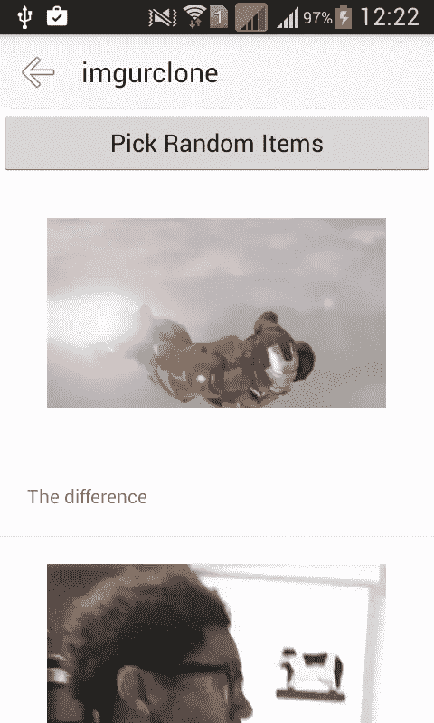

# 使用 NativeScript 创建 Imgur 应用程序

> 原文：<https://www.sitepoint.com/creating-an-imgur-app-with-nativescript/>

在本教程中，您将使用 NativeScript 为图片共享服务 [Imgur](https://imgur.com/) 创建一个移动应用程序。我假设这是您的第一个 NativeScript 应用程序，所以将从基础开始。

以下是最终应用程序的外观:



## 先决条件

NativeScript 的文档中涵盖了所有主要的操作系统，因此请访问相关链接进行设置:

*   [Linux 设置](http://docs.nativescript.org/start/ns-setup-linux)
*   [Windows 设置](http://docs.nativescript.org/start/ns-setup-win)
*   [OS X 设置](http://docs.nativescript.org/start/ns-setup-os-x)

**注意**:在 Linux 和 Windows 上你只能部署到 Android。

## 创建新项目

本教程的最终代码可以在 [GitHub](https://github.com/sitepoint-editors/ns-imgurclone) 上找到。

安装完成后，使用`tns create`命令创建一个新项目:

```
tns create imgurclone --appid "com.yourname.imgurclone"
```

`tns create`命令至少接受一个参数和一个选项。参数是应用程序的名称(`imgurclone`)，选项是应用程序 ID ( `com.yourname.imgurclone`)。

接下来，添加要部署到的平台。在这种情况下，Android。

```
cd imgurclone
tns platform add android
```

如果您使用的是 OS X，您可以添加 iOS 作为平台:

```
tns platform add ios
```

运行`tns platform add`命令会在*平台*目录下创建一个 *android* 或 *ios* 文件夹。这些目录包含为特定平台构建应用程序的文件。

## 构建应用程序

现在您已经准备好构建应用程序了。在 NativeScript 中，你主要在 *app* 目录中工作。这包含由 NativeScript 翻译成平台本地语言的所有应用程序代码。

默认情况下， *app* 目录包含一些文件。这些是 NativeScript 演示应用程序的源文件。如果你是一个完全的初学者，我建议你尝试在你的设备或 [Genymotion 模拟器](https://www.sitepoint.com/improved-android-emulation-genymotion/)上运行演示应用程序，感受一下用 NativeScript 创建的应用程序。为此，请执行以下命令:

```
tns run android
```

一旦你完成了演示应用，移除除了 *App_Resources* 文件夹之外的 *app* 目录下的所有文件。该文件夹存储应用程序图标、闪屏、声音文件和其他资源。

### 入口点文件

*app.js* 文件是 NativeScript 使用的入口点文件。这是 NativeScript 在编译应用程序时查看的位置。添加以下内容:

```
var application = require("application");
application.mainModule = "views/main/main";
application.cssFile = "./app.css";
application.start();
```

破解这个密码。首先需要**应用**模块。这是 NativeScript 提供的核心模块之一。这些模块提供了平台特定实现的抽象。可以把这个模块看作是把所有东西粘在一起的胶水。

```
var application = require("application");
```

现在附上应用程序使用的主要 css 和 JavaScript 文件并启动它。

```
application.mainModule = "views/main/main"; //main javascript
application.cssFile = "./app.css"; //main css
application.start(); //start the app
```

*views/main/main* 是应用程序的主 JavaScript 文件，存储在 *views/main* 目录下，完整路径为 *views/main/main.js* 。*。js* 文件扩展名被省略，因为 NativeScript 假设它将始终是一个 JavaScript 文件。

*。/app.css* 是应用程序的主样式表。此处包含的任何样式都会影响应用程序中的所有页面。可以把它想象成一个全局样式表。这个文件与主 JavaScript 文件在同一个目录中，所以可以使用`./`。

**注意** : *app.css* 对于这个应用程序是空的，因为没有我想要添加的任何常见样式。你当然可以加上你自己的。

### 主页

创建一个*视图/主*目录，并在该目录下创建以下文件:

*   *main.xml* :页面的 UI
*   *main.js* :页面的 JavaScript 文件
*   *main.css* :页面的 css 文件。

这是应用程序的每个页面的外观。如果您创建了一个新页面，您将在 *views* 目录下创建另一个文件夹，然后在该目录下创建 xml、JavaScript 和 css 文件。

**注意**:每个文件必须与文件夹同名。

#### 主页 XML

NativeScript 使用 xml 文件作为应用程序的 UI，因此与使用 HTML 构建 UI 的 Cordova 相比，需要更多的学习曲线。要了解关于所提供的 UI 元素的更多信息，请阅读 [NativeScript 的用户界面小部件页面](http://docs.nativescript.org/ui/ui-views)。

将以下内容添加到 *main.xml* 文件中:

```
<Page loaded="pageLoaded">
  <StackLayout>
    <ActivityIndicator id="spinner" visibility="{{ busy ? 'visible' : 'collapse' }}" />

    <ListView items="{{ topics }}" itemTap="openTopic">
      <ListView.itemTemplate>
        <StackLayout class="topic">
          <Label text="{{ name }}" class="topic-title" />
          <Label text="{{ description }}" />
        </StackLayout>
      </ListView.itemTemplate>
    </ListView>

  </StackLayout>
</Page>
```

分解这个。`<Page>`是根元素，告诉 NativeScript 创建一个新页面。

```
<Page loaded="pageLoaded">
    ...
</Page>
```

当页面完全加载时，`loaded`属性运行一个函数。在本例中，`pageLoaded`函数通过 *main.js* 文件进行绑定。稍后我会解释`pageLoaded`功能。

接下来是您想要使用的布局类型，在本例中是`StackLayout`。这只是你可以使用的众多布局中的一种。这种布局将所有组件堆叠在一起，第一个子组件在顶部，下一个子组件在下面，依此类推。

```
<StackLayout>
    ...
</StackLayout>
```

`ActivityIndicator`显示一个微调器，表明应用程序正在后台从 Imgur API 加载数据。`id`属性将作为后面设置其他属性的参考。`busy`属性接受一个布尔值，表明应用程序是否从 API 获取数据，以及一个`visibility`属性，它接受`visible`或`collapse`作为其值。如果`busy`属性是`true`，那么值是`visible`，如果是`false`，那么`collapse`(隐藏)。

```
<ActivityIndicator id="spinner" visibility="{{ busy ? 'visible' : 'collapse' }}" />
```

`ListView`组件，顾名思义，创建一个列表。您传递一个`items`属性，其值是包含通过 *main.js* 文件绑定的数据的变量的名称。`itemTap`属性值是点击`ListView`中的一个项目时要执行的功能的名称。这个函数也是通过 *main.js* 文件绑定的。

```
<ListView items="{{ topics }}" itemTap="openTopic">
  ...
</ListView>
```

你可能已经注意到，当绑定数据时，你用双花括号把变量的名字括起来，而当绑定函数时，你只包括函数的名字。

在`ListView`中有一个`ListView.itemTemplate`，它代表了`ListView`中的每一项。这个特定的组件根据传入`ListView`的项目数量进行重复。在组件内部，再次使用`StackLayout`来堆叠两个标签——主题的名称和描述。

**注意**双花括号再次被使用，但是它们不是绑定数据，而是输出数据。

```
<ListView.itemTemplate>
    <StackLayout class="topic">
      <Label text="{{ name }}" class="topic-title" />
      <Label text="{{ description }}" />
    </StackLayout>
</ListView.itemTemplate>
```

在 NativeScript 中，使用`Label`组件输出文本。

#### 主页 JavaScript

接下来是应用程序启动时运行的 *main.js* 或默认 JavaScript 文件。添加以下代码:

```
var api = require('../../lib/api');
var frame = require('ui/frame');

var topics = [];

function pageLoaded(args){
    var page = args.object;

    var spinner = page.getViewById('spinner');
    spinner.busy = true;

    api.get('https://api.imgur.com/3/topics/defaults').then(function(json){
        spinner.busy = false;
        topics = json.data;

        page.bindingContext = {
            topics: topics
        }

    });

}

function openTopic(args){

    var id = topics[args.index].id;
    var topmost = frame.topmost();

    topmost.navigate({
        moduleName: 'views/topic/topic',
        context: {
            id: id
        }
    });

}

exports.pageLoaded = pageLoaded;
exports.openTopic = openTopic;
```

破解这个密码。首先包括所有依赖项:

```
var api = require('../../lib/api');
var frame = require('ui/frame');
```

`api`是用于向 Imgur API 发出 http 请求的定制库。`frame`是 NativeScript 提供的 UI 模块的子模块。这允许在应用程序的不同页面之间导航。

接下来，创建一个存储当前主题的变量。

```
var topics = [];
```

创建页面加载时执行的`pageLoaded`函数。在前面的 *main.xml* 文件中，您将这个函数指定为`Page`组件的`loaded`属性的值。

```
function pageLoaded(args){
    var page = args.object;

    var spinner = page.getViewById('spinner');
    spinner.busy = true;

    api.get('https://api.imgur.com/3/topics/defaults').then(function(json){
        spinner.busy = false;
        topics = json.data;

        page.bindingContext = {
            topics: topics
        }

    });

}
```

分解功能。首先通过从传递给函数的参数中提取`object`属性来访问当前页面。

```
var page = args.object;
```

这包含了用于从页面中选择组件的`getViewId`方法。在这种情况下，选择微调器并将其`busy`属性设置为`true`，这样它在页面加载时可见并旋转。

```
var spinner = page.getViewById('spinner');
spinner.busy = true;
```

接下来，使用之前导入的`api`库从 Imgur API 请求所有默认主题。这公开了一个`get`方法，允许您提供一个 URL 来发出请求。然后它返回一个承诺，所以通过提供一个在承诺返回后执行的函数来获取响应数据。

```
api.get('https://api.imgur.com/3/topics/defaults').then(function(json){
    ...
});
```

在函数内部，将微调器设置为 stop，将响应数据分配给`topics`数组，然后将其绑定到当前页面。此时，`ListView`组件应该已经有了数据。

```
spinner.busy = false; //stop the spinner and hide it
topics = json.data;

//bind the topics to the current page
page.bindingContext = {
    topics: topics
}
```

`openTopic`功能导航到主题页面。这个值之前被指定为`ListView`的`itemTap`属性的值，所以当用户点击列表中的一个项目时，这个值就会被执行。

```
function openTopic(args){

    var id = topics[args.index].id; //get the topic ID
    var topmost = frame.topmost(); //get the current page

    //navigate to the topic page and pass along the ID of the topic
    topmost.navigate({
        moduleName: 'views/topic/topic',
        context: {
            id: id
        }
    });

}
```

传递给该函数的参数包含当前项目的索引，因此使用索引值来访问主题 ID。

```
var id = topics[args.index].id; //get the topic ID
```

接下来获取当前页面，然后通过调用`navigate`方法导航到主题页面。它接受包含`moduleName`和`context`的对象。`moduleName`是主题页面的路径，即 *views/topic/topic.js* 。

**注意**:路径不是相对于当前文件的，所以你应该总是从 *app* 目录的根目录开始。`context`是包含要传递到下一页的数据的对象。在这种情况下，只传递主题 ID。

```
var topmost = frame.topmost(); //get the current page

//navigate to the topic page and pass along the ID of the topic
topmost.navigate({
    moduleName: 'views/topic/topic',
    context: {
        id: id
    }
});
```

最后通过导出使`pageLoaded`函数和`openTopic`函数对 *main.xml* 文件可用。

```
exports.pageLoaded = pageLoaded;
exports.openTopic = openTopic;
```

#### 主页样式表

*main.css* 文件包含以下内容:

```
.topic {
    padding: 10;
}

.topic-title {
    font-size: 20;
    font-weight: bold;
}
```

这是普通的 css，但是注意 NativeScript 只支持 CSS 的一个子集。这意味着并非所有的 css 功能都可以使用。例如，你不能使用浮动或定位。找到更多关于[样式页面](https://docs.nativescript.org/ui/styling)中支持的特定属性的信息。

### 主题页面

主题页面在当前选择的主题下随机显示照片。

现在您应该知道这些步骤了，但是如果还不知道，下面是您需要创建的文件:

*   *topic/topic.xml*
*   *topic/topic.js*
*   *topic/topic.css*

#### 主题页面 XML

将以下内容添加到 *topic.xml* 文件中:

```
<Page loaded="pageLoaded">
  <Page.actionBar>
    <ActionBar title="imgurclone">
      <NavigationButton text="Back" android.systemIcon="ic_menu_back" tap="backToTopics"/>
    </ActionBar>
  </Page.actionBar>

  <StackLayout>
    <Button text="Pick Random Items" tap="pickRandomItems" />

    <ActivityIndicator id="spinner" visibility="{{ busy ? 'visible' : 'collapse' }}" />

    <ListView items="{{ photos }}" itemTap="viewImage">
      <ListView.itemTemplate>
        <StackLayout class="photo-container">
          <Image src="{{ 'https://i.imgur.com/' + id + 'm.jpg' }}" class="photo" stretch="aspectFit"/>
          <Label text="{{ title }}" textWrap="true" />
        </StackLayout>
      </ListView.itemTemplate>
    </ListView>

  </StackLayout>
</Page>
```

破解这个密码。首先，您分配一个在页面加载时执行的函数。到目前为止，您应该知道这是加载页面所需数据的好地方。

```
<Page loaded="pageLoaded">
    ...
</Page>
```

在`Page`里面是一个`ActionBar`组件。这允许您添加一个按钮，用于导航回主页( *main/main.xml* )。

```
<Page.actionBar>
    <ActionBar title="imgurclone">
      <NavigationButton text="Back" android.systemIcon="ic_menu_back" tap="backToTopics"/>
    </ActionBar>
</Page.actionBar>
```

在讨论导航按钮的细节之前，请注意`ActionBar`的`title`属性。我指定了`imgurclone`，这是应用程序的名称。这在主页的早期是不必要的，因为 NativeScript 会自动添加一个包含应用程序标题的标题。这意味着`ActionBar`替换了默认的标题，所以您需要自己指定标题。

做完这些，接下来就是`NavigationButton`了，这是一个普通的没有边框的按钮。指定了`text`属性，但是`android.systemIcon`实际上用于显示默认的 android 系统后退按钮。接下来是当用户点击按钮时执行的`tap`功能。

```
<NavigationButton text="Back" android.systemIcon="ic_menu_back" tap="backToTopics"/>
```

接下来是一个`StackLayout`按钮，包含选择应用程序存储的随机项目的按钮，再次是`ActivityIndicator`和一个`ListView`，列出所选主题下的照片。

```
<StackLayout>
    <Button text="Pick Random Items" tap="pickRandomItems" />

    <ActivityIndicator id="spinner" visibility="{{ busy ? 'visible' : 'collapse' }}" />

    <ListView items="{{ photos }}" itemTap="viewImage">
        ...
    </ListView>
</StackLayout>
```

在`ListView`内显示照片和标题。

```
<StackLayout class="photo-container">
      <Image src="{{ 'https://i.imgur.com/' + id + 'm.jpg' }}" class="photo" stretch="aspectFit"/>
      <Label text="{{ title }}" textWrap="true" />
</StackLayout>
```

在 NativeScript 中，您使用接受使用 ID 构造的`src`属性的`Image`组件显示图像。

**注意**:用*m.jpg*代替*。jpg* 。 *m* 允许您指定图像的大小，在本例中为中等大小。这是需要做的，因为默认的网址链接到全尺寸的图像，这对于手机来说太大了。`stretch`属性允许您指定如何根据为目标(`Image`组件)指定的高度和宽度来调整图像的大小。`aspectFit`表示图像将被调整大小以适合目标，同时保持纵横比。

```
<Image src="{{ 'https://i.imgur.com/' + id + 'm.jpg' }}" class="photo" stretch="aspectFit"/>
```

组件`Label`有一个新的`textWrap`属性被设置为`true`。这是必需的，因为该属性默认设置为`false`。这意味着如果文本超过一行，它将被截断。将它设置为`true`可以让你避免截断，无论消耗多少行，都只显示全文。

```
<Label text="{{ title }}" textWrap="true" />
```

#### 主题页面 JavaScript

将以下内容添加到主题页面 JavaScript 文件中， *topic/topc.js* :

```
var _ = require('lodash');
var api = require('../../lib/api');
var frame = require('ui/frame');

var topmost = frame.topmost();

var unfiltered_photos = [];
var page;
var photos = [];

function pageLoaded(args){
    page = args.object;

    var topic_id = page.navigationContext.id;

    var spinner = page.getViewById('spinner');
    spinner.busy = true;

    api.get('https://api.imgur.com/3/topics/' + topic_id + '/viral/1').then(function(json){

        unfiltered_photos = json.data;
        photos = getPhotos(unfiltered_photos);

        page.bindingContext = {
            photos: photos
        }

        spinner.busy = false;

    });

}

function backToTopics(){
    topmost.goBack();
}

function pickRandomItems(){
    photos = getPhotos(unfiltered_photos);

    page.bindingContext = {
        photos: photos
    }
}

function getPhotos(unfiltered_photos){

    var photos_to_show = 5;

    var filtered_photos = _.reject(unfiltered_photos, function(photo){
        return photo.is_album;
    });

    var random = _.random(0, filtered_photos.length - photos_to_show - 1);

    var photos = _.slice(filtered_photos, random, random + photos_to_show);
    return photos;

}

function viewImage(args){

    var link = photos[args.index].link;

    topmost.navigate({
        moduleName: 'views/image/image',
        context: {
            url: link
        }
    });
}

exports.pageLoaded = pageLoaded;
exports.backToTopics = backToTopics;
exports.pickRandomItems = pickRandomItems;
exports.viewImage = viewImage;
```

破解密码。首先包括所需的模块:

```
var _ = require('lodash');
var api = require('../../lib/api');
var frame = require('ui/frame');
```

除了 [lodash](https://lodash.com/) 之外，这里没有什么新的东西，这是一个 JavaScript 的实用程序库。使用 npm 安装它:

```
npm install lodash --save
```

存储对当前页面的引用，这将在以后用于导航回主题页面和导航到图像页面。

```
var topmost = frame.topmost();
```

创建用于存储来自 Imgur api 的照片数据、当前页面和当前显示的照片的变量。

```
var unfiltered_photos = []; //photo data from imgur api
var page; //the current page
var photos = []; //the photos that are currently displayed
```

接下来是`pageLoaded`功能。

```
function pageLoaded(args){
    page = args.object;

    var topic_id = page.navigationContext.id; //get the ID that was passed by the main page.

    var spinner = page.getViewById('spinner');
    spinner.busy = true;

    //fetch the photo data from the imgur api based on the selected topic
    api.get('https://api.imgur.com/3/topics/' + topic_id + '/viral/1').then(function(json){

        unfiltered_photos = json.data;
        photos = getPhotos(unfiltered_photos);

        page.bindingContext = {
            photos: photos
        }

        spinner.busy = false;

    });

}
```

同样，除了获得由主页传递的 ID 之外，这里没有什么新东西:

```
var topic_id = page.navigationContext.id;
```

`id`被用作发出请求的 url 的一部分。在函数内部，将包含照片数据数组的响应分配给`unfiltered_photos`。然后把它传递给`getPhotos`函数，它的主要目的是过滤照片。稍后您将更详细地了解这是如何工作的。最后，将它绑定到当前页面。

```
api.get('https://api.imgur.com/3/topics/' + topic_id + '/viral/1').then(function(json){

    unfiltered_photos = json.data;
    photos = getPhotos(unfiltered_photos);

    page.bindingContext = {
        photos: photos
    }

    spinner.busy = false;
});
```

`backToTopics`功能用于返回上一页(主页面)。

```
function backToTopics(){
    topmost.goBack();
}
```

`pickRandomItems`在用户每次点击按钮从当前照片数据中选择随机项目时被调用。它调用`getPhotos`函数获取从当前结果集中选择的随机照片数据，并将其设置为当前页面。

```
function pickRandomItems(){
    photos = getPhotos(unfiltered_photos);

    page.bindingContext = {
        photos: photos
    }
}
```

`getPhotos`函数接受从 Imgur API 接收的原始照片数据，然后拒绝所有“相册”类型的项目。如果你以前浏览过 Imgur 网站，你可能会看到有一个叫做相册的照片集合。你只想要单独的照片，所以排除那些在 lodash 中使用`reject`功能的照片。然后选择一个随机数，作为选择要显示的项目的起始索引。

```
function getPhotos(unfiltered_photos){

    //the number of photos to show in the list at a time
    var photos_to_show = 5;

    //reject all albums
    var filtered_photos = _.reject(unfiltered_photos, function(photo){
        return photo.is_album;
    });

    //pick random number
    var random = _.random(0, filtered_photos.length - photos_to_show - 1);

    //use the random number as a starting index for extracting the items to show
    var photos = _.slice(filtered_photos, random, random + photos_to_show);
    return photos;

}
```

`viewImage`功能导航到显示用户选择的照片的页面。NativeScript 不支持使用`Image`组件显示动画(gif)图像。关于这个限制，Github 上有一个[未解决的问题。如果你正在阅读这篇文章，它可能会被解决。目前，当前的解决方案是使用 web 视图来显示图像。](https://github.com/NativeScript/NativeScript/issues/1099)

导航到使用 web 视图的页面，只将图像的 url 传递到下一个页面。

```
function viewImage(args){

    var link = photos[args.index].link;

    topmost.navigate({
        moduleName: 'views/image/image',
        context: {
            url: link
        }
    });
}
```

公开所有函数:

```
exports.pageLoaded = pageLoaded;
exports.backToTopics = backToTopics;
exports.pickRandomItems = pickRandomItems;
exports.viewImage = viewImage;
```

#### 主题页面样式表

之前你给了`Image`组件一个`photo`类，这个样式设置了照片的宽度和高度。这些是我之前提到的目的地维度。您需要指定尺寸，因为如果不指定，会破坏布局。

```
.photo-container {
    padding: 20;
}

.photo {
    width: 250;
    height: 250;
}
```

### 图像页面

图像页面在 web 视图中显示图像，现在您应该知道该操作了(**提示**:查看前面的两个应用程序页面)。唯一的区别是你不需要创建一个 *image.css* 文件，因为这个页面不需要任何样式。

#### 图像页面 XML

将以下内容添加到 *image.xml* 文件中:

```
<Page loaded="pageLoaded">

  <Page.actionBar>
    <ActionBar title="imgurclone">
      <NavigationButton text="Back" android.systemIcon="ic_menu_back" tap="backToTopic"/>
    </ActionBar>
  </Page.actionBar>

  <StackLayout>
    <WebView src="{{ imageUrl }}" />
  </StackLayout>
</Page>
```

破解密码。包括含有允许用户返回主题页面的按钮的标题。

```
<Page.actionBar>
    <ActionBar title="imgurclone">
      <NavigationButton text="Back" android.systemIcon="ic_menu_back" tap="backToTopic"/>
    </ActionBar>
</Page.actionBar>
```

接下来添加`WebView`组件，并将`src`指定为图像的 url。

```
<StackLayout>
    <WebView src="{{ imageUrl }}" />
</StackLayout>
```

#### 图像页面 JavaScript

图像页面的 JavaScript 文件包含获取图像 url 和返回主题页面的代码。

```
var frame = require('ui/frame');
var topmost = frame.topmost();

function pageLoaded(args){
    //get image url passed from the previous page
    var page = args.object;
    var url = page.navigationContext.url;
    page.bindingContext = {
        imageUrl: url
    }
}

//go back to the topic page
function backToTopic(){
    topmost.goBack();
}

//expose the functions
exports.pageLoaded = pageLoaded;
exports.backToTopic = backToTopic;
```

## 应用程序接口

创建 *lib/api.js* ，这是向 Imgur API 发出请求的定制库。这使用了 NativeScript 内置的`fetch`函数。它接受您要发出请求的 URL 作为其第一个参数，并接受一个包含要传递到请求中的选项的对象作为其第二个参数。标题、请求正文和请求方法等选项。向 [Imgur API](https://api.imgur.com/) 发出请求并不需要你在 Imgur 上创建一个应用程序，我展示它是为了演示。

`fetch`方法返回一个承诺，因此链接`then`方法并传入一个函数，该函数将调用响应中的`json`方法来获取 JavaScript 对象。这又返回了一个承诺，因此挂接到另一个`then`方法来捕获响应数据。

**注意**:`fetch`方法的结果是一个承诺，这就是为什么之前的`api.get`调用连接到另一个`then`方法来获取实际数据。

```
exports.get = function(url){
    return fetch(
        url,
        {
            'headers': {'Authorization': 'Client-ID xxxxxxxxxxx'}
        }
    ).then(function(response){
        return response.json();
    }).then(function(json){
        return json;
    });
}
```

## 运行项目

要在设备上运行应用程序，请使用`tns run`命令，后跟平台名称:

```
tns run android
```

如果你想测试变化，你可以使用`tns livesync`命令。这将在您每次点击保存时刷新设备中的应用程序。

```
tns livesync android --watch
```

## 结论

就是这样！在本教程中，您学习了如何使用 NativeScript，创建一个与 imgur API 对话以获取照片数据的应用程序。您使用了 image 和 webview 等组件，以及如何在设备上运行应用程序。

## 分享这篇文章