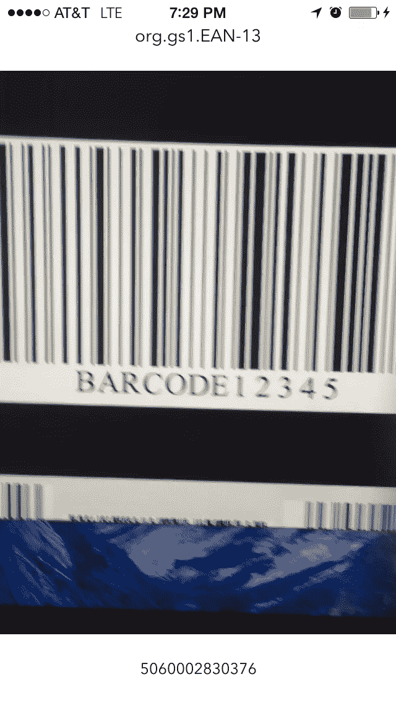
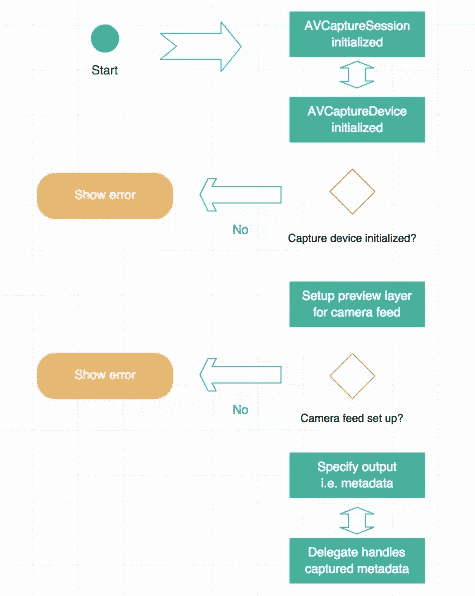
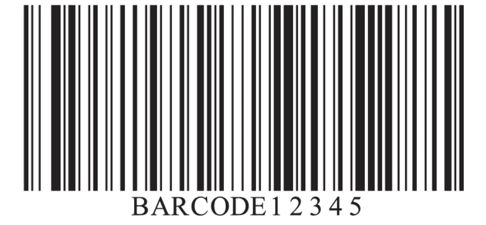

# 在 iOS 中创建条形码和元数据读取器

> 原文：<https://www.sitepoint.com/creating-barcode-metadata-reader-ios/>

用户比以往任何时候都更希望 iOS 应用能够联网。数据以极快的速度在 iOS 应用中流动。它可以通过 API、消息传递或与服务器的通信来实现。扫描多种类型的可用条形码是应用程序可以受益的另一种数据形式。

从 iOS 7 开始，Cocoa Touch 支持从条形码和其他类型的元数据中读取数据。在本教程中，我将展示如何通过可用的内置框架在 iOS 应用程序中设置条形码扫描。

让我们快速浏览一下我们将要构建的应用程序。点击从 github [下载 starter 项目。我有意保持用户界面和架构最小化，这样我们就可以专注于如何编码条形码扫描。](https://github.com/sitepoint-editors/BarcodeScanning/tree/StartProject)

完成后，该应用程序将自动显示 iPhone 后置摄像头的实时画面。它将主动寻找条形码元数据。当它找到一些时，它会在实时订阅源顶部和底部的标签上显示相关信息:



先说一下涉及到的框架。

## AVFoundation

`AVFoundation`是一个成熟的框架，成为 Cocoa Touch 的一部分已经有一段时间了。虽然由于其广泛的用途，实现起来可能会令人生畏，但设置它来捕获元数据却非常容易。

以下是一些用于实施条形码扫描的关键对象:

### AVCaptureSession

协调来自音频或视频输入设备的数据流，并将其转换为输出。简而言之，这推动了整个过程。

### AVCaptureDevice

这个类表示一个物理设备，用于捕获输入并反馈到初始化的`AVCaptureSession`实例中。在本教程中，这个类将代表 iPhone 上的后置摄像头。

### avcapturevideopreviewplayer

`CALayer`的一个子类，显示输入设备捕获的视频。在本教程中，这是`AVCaptureDevice`实例。

### AVCaptureMetaDataOutput

从捕获连接中截获元数据对象，并将它们转发给委托进行处理。该类还可以指定要捕获的元数据的类型。它旨在作为一个`AVCaptureSession`的输出添加。

它可以截取的元数据类型如下:

*   UPC-A
*   刚果爱国者联盟
*   代码 39
*   代码 39 mod 43
*   代码 93
*   代码 128
*   ean8
*   ean13
*   阿兹特克人
*   PDF417
*   四分之一
*   脸

现在涉及的对象都清楚了，让我们从高层次上来看这个过程。使用`AVFoundation`捕获条形码或任何元数据的工作流程如下所示:



太好了，现在让我们进入代码！

## 设置会话

打开 *ViewController.swift* ，看看我包含的样板代码。我已经添加了几个属性，`IBOutlets`，并删除了一些函数。如果一个开发者现在构建并运行，它不会做太多。让我们改变这一点。

第一步是确保会话已创建。这和初始化属性一样简单，我已经完成了:

```
let captureSession = AVCaptureSession()
```

稍后，我们将调用`startRunning()`函数来实际开始从`captureSession`及其输入进行 I/O。

## 准备输入设备

在`viewDidAppear:`中添加一个对名为`setupCaptureSession`的存根函数的调用。

`viewDidAppear:`方法体应该是这样的:

```
override func viewDidAppear(animated: Bool)
{
        super.viewDidAppear(animated)
        self.setupCaptureSession()
}
```

现在，添加该函数的代码:

```
private func setupCaptureSession()
    {
        self.captureDevice = AVCaptureDevice.defaultDeviceWithMediaType(AVMediaTypeVideo)
        var setupError:NSError?

        if let deviceInput = AVCaptureDeviceInput.deviceInputWithDevice(self.captureDevice, error: &setupError) as? AVCaptureDeviceInput
        {
            //Add the input feed to the session and start it
            self.captureSession.addInput(deviceInput)
            self.setupPreviewLayer({
                self.captureSession.startRunning()
                self.addMetaDataCaptureOutToSession()
            })
        }
        else
        {
            self.showError(setupError!.localizedDescription)
        }

    }
```

首先设置捕获设备，然后检查它是否适合产生输入。如果不能，它初始化指向错误变量的指针并显示给用户。请注意，如果在模拟器上尝试这样做，该检查将会失败，因为模拟器显然无法产生任何输入。

如果设备可以产生输入，将输入添加到会话中，并开始设置`captureLayer`属性来显示摄像机的实时反馈。

### 显示输入

要配置输入层，调用`setupPreviewLayer`功能。现在将以下代码添加到该函数中:

```
private func setupPreviewLayer(completion:() -> ())
    {
        self.captureLayer = AVCaptureVideoPreviewLayer.layerWithSession(self.captureSession) as? AVCaptureVideoPreviewLayer

    if let capLayer = self.captureLayer
    {
        capLayer.videoGravity = AVLayerVideoGravityResizeAspectFill
        capLayer.frame = self.cameraView.frame
        self.view.layer.addSublayer(capLayer)
        completion()
    }
    else
    {
        self.showError("An error occured beginning video capture."")
    }
}
```

在这个阶段，显示输入源(本教程中的后置摄像头)的预览是没有意义的。除了添加图层、设置框架和选择合适的长宽比之外，程序员在这个过程的这一部分没有太多事情要做。

假设这是成功的，将执行一个完成闭包。这是在前面的代码片段中添加到`setupCaptureSession`中的。闭包要做的两件事是识别要捕获的数据，并将视图控制器设置为处理该数据的委托。

## 指定输出

至此，会话已经开始，选择了设备来捕获输入，添加了会话的输入，然后向用户显示了实时输入。剩下的就是告诉`AVFoundation`要捕获什么，并配置代表。

转到`addMetaDataCaptureOutToSession`函数并添加以下代码:

```
private func addMetaDataCaptureOutToSession()
{
    let metadata = AVCaptureMetadataOutput()
    self.captureSession.addOutput(metadata)
    metadata.metadataObjectTypes = metadata.availableMetadataObjectTypes
    metadata.setMetadataObjectsDelegate(self, queue: dispatch_get_main_queue())
}
```

这个函数首先创建一个`AVCaptureMetadataOutput`的实例，然后将它添加到会话中。从那里，它的`metadataObjectTypes`属性被设置为所有要捕获的东西。这里的顺序很重要，因为如果在将添加到会话之前*查找元数据类型，它们将不可用。*

请注意，虽然这将通过扫描条形码进行测试，但它将查找所有类型的元数据。为了获得更高程度的特异性，只需将要查找的元数据类型传递给`metadataObjectTypes`属性。

最后，将这个视图控制器设置为处理元数据的代理。由于`AVFoundation`被设计为支持线程化操作，所以告诉它哪个线程在委托中被调用也是必要的。

## AVCaptureMetadataOutputObjectsDelegate

尽管这个视图控制器被定义为捕获委托，但是仍然需要符合协议。现在在视图控制器文件的顶部这样做，在创建字符串的末尾添加`AVCaptureMetadataOutputObjectsDelegate`:

```
class ViewController: UIViewController, AVCaptureMetadataOutputObjectsDelegate
```

最后要做的事情是处理来自委托方法的数据。将此代码添加到视图控制器中的任意位置:

```
func captureOutput(captureOutput: AVCaptureOutput!, didOutputMetadataObjects metadataObjects: [AnyObject]!, fromConnection connection: AVCaptureConnection!)
    {
        for metaData in metadataObjects
        {
            let decodedData:AVMetadataMachineReadableCodeObject = metaData as! AVMetadataMachineReadableCodeObject
            self.lblDataInfo.text = decodedData.stringValue
            self.lblDataType.text = decodedData.type
        }
    }
```

这段代码通过查找捕获的元数据对象并解析它们来工作。因为它使用了 for 循环，并且不寻找特定类型的元数据，所以它只在用户界面中显示最后捕获的项目。

现在，构建并运行应用程序，将它指向以下条形码:



它应该能够识别条形码，并在用户界面的顶部显示元数据类型，在底部显示其解析的信息。

## 包扎

希望这篇教程证明了使用`AVFoundation`并不像它的名声让你相信的那样糟糕。启动和运行解析元数据只需要几个函数和一个协议。如果这太难了，不要担心，完成的项目可以在这里下载[。](https://github.com/sitepoint-editors/BarcodeScanning/tree/master)

有大量的数据自由地存在，表现为这里讨论的元数据类型之一。现在，您可以在自己的应用程序中使用它们！

## 分享这篇文章