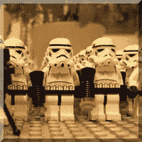
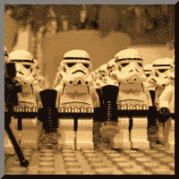

# 使用 CSS 创建斜面图像

> 原文：<https://www.sitepoint.com/creating-beveled-images-with-css/>

最近，我想要一个简单的 <abbr title="Cascading Style Sheets">CSS</abbr> 方法来给图片添加斜角效果。用正常的开始边界(左下方的*)来创建深度感是很容易的，但是我想要的是一种效果，这种效果会让**看起来像图像的一部分**，就好像它是图像本身的一个斜面(右下方的*)。**

**

最后，我找到了四种不同的方法，每一种都有不同的支持级别:从只在一种浏览器中工作的最干净的方法，到可以在所有浏览器中工作的最健壮的方法，再到 T2 IE6 T3。

它们都基于相同的核心原则；黑色边框用于阴影，白色边框用于高亮显示，覆盖在图像上，然后与某种形式的不透明度混合。在每种情况下，不支持该技术的浏览器将简单地正常显示图像。

## 技术 1:在图像上使用生成的内容([演示](https://www.sitepoint.com/examples/rgbaborders/technique1.html "View a working demo of “Technique 1: Using generated content on the image”"))

*   **优点:**超净技术不需要额外的加价
*   缺点:只在歌剧中起作用

使用第一种技术，我们使用`:after`创建一个伪元素，然后将它的样式设置为**完美地覆盖在图像顶部的**。然后我们给叠加的元素添加边框，用 <abbr title="Red Green Blue Aplha">RGBA</abbr> 定义每个边框颜色:上边框和左边框是`rgba(255,255,255,0.4),`白色，40%不透明度；底部和右边框是 40%不透明度的`rgba(0,0,0,0.4),`黑色:

```
img.beveled{    position:relative;}img.beveled:after{    position:absolute;    left:0;    top:0;    display:block;    content:"
```** 

## **分享这篇文章**